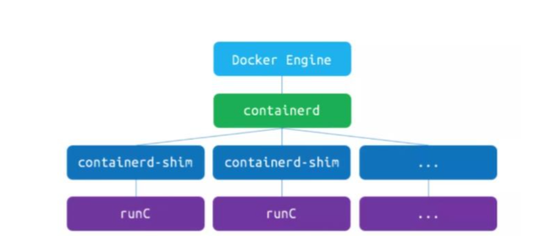
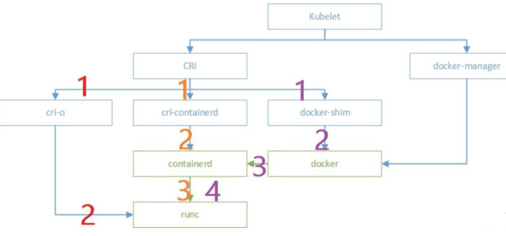

## k8s-容器协调器-解决docker问题
尽管Docker为容器化的应用程序提供了开放标准，但随着容器越来越多出现了一系列新问题：

1. 如何协调和调度这些容器？

2. 如何在升级应用程序时不会中断服务？

3. 如何监视应用程序的运行状况？

4. 如何批量重新启动容器里的程序？

解决这些问题需要容器编排技术，可以将众多机器抽象，对外呈现出一台超大机器。现在业界比较流行的有：k8s、Mesos、Docker Swarm。
* 负载均衡
* 高可用
* 高并发（多实例）
* 集群管理

在业务发展初期只有几个微服务，这时用 Docker 就足够了，但随着业务规模逐渐扩大，容器越来越多，运维人员的工作越来越复杂，这个时候就需要编排系统解救opers。

## 在微服务架构的趋势下，服务拆分成了微服务模式
为了保障高可用，核心微服务按照分布式进行部署。以淘宝系统来说，包含上千个微服务，一个节点部署一个容器，再按照分布式集群部署，整个淘宝系统估计得上万个节点，逢年过节，节点数还在不断的增加，那就需要管理了呀，不然怎么保障节点之间的正常通信，问题快速解决呢？于是Kubernetes产生了，它提供应用级的集群抽象，把每个微服务抽象成service，以Pod运行，Pod底层是Docker，对外提供能力

问题出现了，Kubernetes本身是不提供容器运行环境的，而是使用CRI（ContainerRuntimeInterface容器运行接口）在工作节点创建和删除容器,因为Docker不符合Kubernetes的容器运行时接口标准（CRI），所以官方必须要维护一个名为Dockershim的中间件才能够把Docker当作Kubernetes的容器运行时来使用。此外Kubernetes使用的是Docker容器中的Cgroup能力，其它的模块如网络、存储卷都不需要使用，然而它们却随Docker一起在Kubernetes中运行，这就容易产生安全隐患了。综上所述，这就是为什么Kubernetes要废弃Docker了


k8s 经常与 Docker 进行搭配使用，但是也可以使用其他容器，如RunC、Containerted 等。

作为Kubernetes与Docker容器的用户，不必要惊慌，使用CRI运行时替代方案即可。

### CRI的实现方案有两种
* Containerd
Containerd是CNCF云原生计算基金会开源项目，在GitHub（https://github.com/containerd/containerd/）可直接下载使用，它是容器虚拟化技术，从Docker中剥离出来，形成开放容器接口（OCI）的一部分，容器引擎使用它可以进行整个容器生命周期管理（创建）、拉取/推送容器镜像、存储管理镜像、管理容器网络接口及网络。它生于Docker，可以完成所有的运行时工作，使用它是很好的选择。
* CRI-O
与Containerd相比，CRI-O就不那么友好了，它是由红帽开发的纯CRI运行时，对于RedHatOpenshit支持的比较好，不支持Docker，因此从Docker迁移到CRI-O是比较麻烦的。

Kubernetes官方表示Docker作为一个完整的容器技术栈，在创建之初就不是为了Kubernetes而设计的。

Kubernetes只是在v1.20版本后不推荐将Docker作为容器运行时使用，用户今后依然可以使用Docker来构建容器镜像，而Docker生成的镜像实际上也是一个OCI（OpenContainer Initiative）镜像。

可以说无论使用什么工具来构建镜像，任何符合OCI标准的镜像在Kubernetes看来都是一样的。Containerd和CRI-O则可以提取这些镜像并运行它们。技术的升级一般来说都是好事，它始终是为了更好的服务才做改动。无论是开发人员、运维人员，我们都需要拥抱变化。

### containerd
从软件模块的角度，图中的 docker Engine、cri-containd、containd-shim、runC 都属于 Docker 体系的软件。

Docker 并非一个单层软件，Kubernetes 1.20 弃用 dockershim 并不代表弃用了 Docker 的全部，仍有 containerd 可以对接 docker。



作为 Kubernetes 的底层运行时的话，选择分离自 Docker 的 containerd 会更合适。

用的containerd做的运行时大部分功能都能支持吧 但是打包镜像还是用的docker 毕竟生态确实好 而且dockerfile写的也顺手

## 不同方式使用图例
下图中的紫、橙、红三种颜色，代表了 dockershim、cri-containerd、cri-o 三种 CRI 的典型方式——流程在逐渐缩短，这也是 CRI 实现的一个演进过程。



### 如果是 kubelet 的 dockershim 模式（紫色），流程是这样的：
1. kubelet从CRI的gRPC调用dockershim，二者在同一个进程
2. dockershim调用docker守护进程
3. docker守护进程调用containerd；containerd调用containerd-shim（有时名为docker-containerd-shim守护进程）完成创建容器等操作
4. containerd-shim访问OCI的实现runC（命令行可执行程序）

### 如果是 kubelet 的 cri-containerd 模式（橙色），流程是这样的：
1. kubelet从CRI的gRPC调用cri-containerd；
2. cri-containerd调用containerd；containerd调用containerd-shim（同上）
3. containerd-shim调用RucnC （同上）；

在很多人的印象中，如果不用 docker 守护进程，就相当于“弃用 docker“，这其实也就是从 dockershim 到 containerd 的变化。从另一个角度来说，containerd 这个守护进程，也是 docker 组织做的。

### 如果是 kubelet 的 cri-o 模式（红色），则更加简练：
1. kubelet从CRI的gRPC调用cri-o；
2. cri-o调用OCI的实现runC


如果以 kubelet 调用 CRI 为起点，OCI 的 runC 调用为终点，三种模式经历的可执行程序分别是：
1. dockershim模式：
```
dockershim(*)->dockd->containerd->containerd-shim
```
2. cri-containerd模式：
```
cri-containerd(*)-> containerd->containerd-shim
```
3. cri-o模式：cri-o

dockershim 模式有 3 个可执行程序，dockershim 一般与 kubelet 同进程；cri-containerd 模式有 2-3 个可执行程序，cri-containerd 可与 containerd 同进程；cri-o 模式只有 1 个可执行程序。

显然在这种 Red Hat 推崇的 cri-o 模式下，Docker 体系的 containerd 也用不着了，只剩 runC 这个命令行的程序。runC 也是用 go 写成的，里面有调用 libcontainer。

当 Docker 萎缩到这个地步，其实也只剩 Linux 内核里面 cgroup、namespace 功能的封装了。


