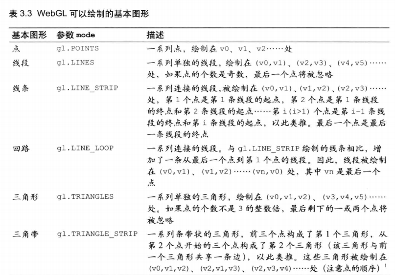
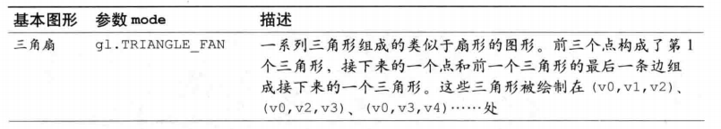

## webgl绘图入门 着色器
```
webGl 依赖着色器 shader绘图机制，着色器提供绘制二维和三维图形的方法。
```

webgl两种着色器
1.顶点着色器
```
描述顶点特性：描述位置，颜色等的程序
顶点：指的是二维或则三维的一个点，比如二维或则三维图形的端点或交点
```
2.片元着色器
```
进行逐片元处理过程如光照的程序。
片元是术语，可以理解为像素
```

### 坐标系统
宽度
高度
长度
```

```

# 绘制和变换图形
### 绘制多个点
绘制多个点的二维图形和绘制多个点的三维图形是相同的。
```
对于多个顶点的图形，比如三角形，需要一次性将图形的顶点全部传入顶点 着色器，然后才能画出来。

webgl 提供了一种机制，缓冲区对象，它可以一次性向着色器传入多个顶点数据。
缓冲区对象 是webgl系统中的一块内存区域，可以一次性向缓冲区对象填充大量的顶点数据，供顶点着色器使用。
```
实例：
MultiPoint.html
```
增加新步骤：设置点的 坐标信息。
```
### 使用缓冲区对象
步骤
```
1.创建缓冲区对象
2.绑定缓冲区对象
3.将数据写入缓冲区对象
4.将缓冲区对象 分配给一个 attribute变量
5.开启 att 变量
```
1.创建缓冲区对象
```js
  // Create a buffer object 创建缓冲区对象
  var vertexBuffer = gl.createBuffer();
```
2.绑定缓冲区对象
将缓冲区对象绑定到webgl系统中已经存在的 目标中，这个目标表示缓冲区对象的用途（在这里就是向顶点着色器提供attribute变量的数据）,这样webgl才能正确处理其中的内容
```js
  // Bind the buffer object to target 将缓冲区对象绑定到目标
  gl.bindBuffer(gl.ARRAY_BUFFER, vertexBuffer);
```
3.将数据写入缓冲区对象
开辟空间并向缓冲区中写入数据
```js
  gl.bufferData(gl.ARRAY_BUFFER, vertices, gl.STATIC_DRAW);

效果是将vertices中的数据写入了绑定到第一个参数 gl.ARRAY_BUFFER 上的缓冲区对象
```
4.将缓冲区对象 分配给一个 attribute变量
不同于gl.vertexAttri 只能向 attribute 变量分配一个值，
gl.vertexAttribPointer 将整个缓冲区对象分配给 attribute变量。
```js
  // Assign the buffer object to a_Position variable 将缓冲区对象分配给a_
  gl.vertexAttribPointer(a_Position, 2, gl.FLOAT, false, 0, 0);

```

5.开启 att 变量
为了使顶点着色器能够访问缓冲区内的数据，需要使用 gl.enableVertexAttribArray()方法开启 attribute变量。
```js
  // Enable the assignment to a_Position variable 连接a_变量与分配给它的缓冲区对象
  gl.enableVertexAttribArray(a_Position);
```

### 画三角形
```js
var VSHADER_SOURCE =
  'attribute vec4 a_Position;\n' +
  'void main() {\n' +
  '  gl_Position = a_Position;\n' +
  '  gl_PointSize = 10.0;\n' +
  '}\n';

画三角形中 gl_PointSize = 10.0; 将被去掉，只有在画单个点有用

2.gl.drawArrays(gl.POINTS, 0, n);  ----> gl.drawArrays(gl.TRIANGLES, 0, n);

TRIANGLES 表示从缓冲区第一个点开始，使顶点着色器执行3次，用这三个点绘制出一个三角形
```
webgl 只能绘制
```
点
线
三角形
```



### 移动，旋转和缩放