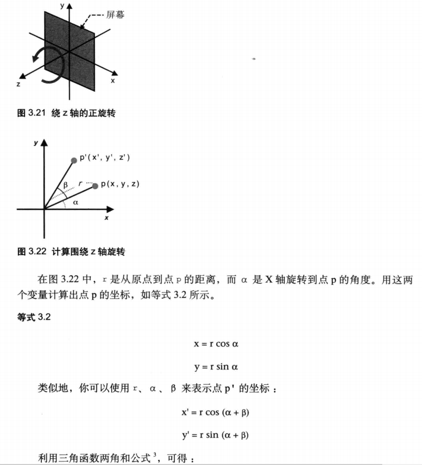
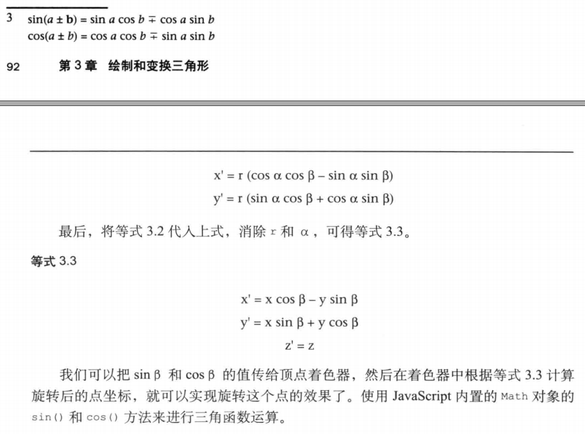

###### 1.平移
```
平移对顶点坐标的每个分量（x,y）,加上对应轴平移的距离
将(x,y,z) --> (_x,_y,_z)  在X轴，Y轴，Z轴三个方向平移的距离分别为 Tx,Ty,Tz.
```
```
见实例：
TranslatedTriangle.html
```
顶点着色器
```js
var VSHADER_SOURCE =
  'attribute vec4 a_Position;\n' +
  'uniform vec4 u_Translation;\n' +
  'void main() {\n' +
  '  gl_Position = a_Position + u_Translation;\n' +
  '}\n';
```
将平移距离传输给顶点着手器
```js
  // Pass the translation distance to the vertex shader
  var u_Translation = gl.getUniformLocation(gl.program, 'u_Translation');
```

###### 2.旋转
1.旋转轴
2.旋转方向
3.旋转角度
```
假如p(x,y,z) 旋转a角度后--> _p(_x,_y,_z),这里规则是绕Z轴进行，所以z坐标不会变，可以忽略，当时Y和X坐标比较复杂。
```



实例：
RotatedTriangle.html
```js
var VSHADER_SOURCE =
  // x' = x cosβ - y sinβ
  // y' = x sinβ + y cosβ　Equation 3.3
  // z' = z
  'attribute vec4 a_Position;\n' +
  'uniform float u_CosB, u_SinB;\n' +
  'void main() {\n' +
  '  gl_Position.x = a_Position.x * u_CosB - a_Position.y * u_SinB;\n' +
  '  gl_Position.y = a_Position.x * u_SinB + a_Position.y * u_CosB;\n' +
  '  gl_Position.z = a_Position.z;\n' +
  '  gl_Position.w = 1.0;\n' +
  '}\n';
```
###### 3.变换矩阵：旋转
```
当变换变得复杂时候,利用表达式很繁琐。

比如先旋转后平移：需要重新求取一个新的等式，然后实现一个新的着色器。很不科学
此时需要 变换矩阵。
```

### 线性变换
```
从几何意义上，线性变换表示的是直线的特性，符合两个性质：变换前后零点不变，变换前后直线还是直线。 线性变换意味着可以将空间中的向量围绕零点进行旋转伸缩，但不能将其弯曲，否则则是非线性变化。 非线性变换将空间进行了扭曲，比如把SVM中的核函数看做描述低维空间到高维空间的映射，把原始低维空间中线性不可分的数据变成高维空间中线性可分的数据，优雅解决了问题。
```

### 变换矩阵
```
在线性代数中，线性变换能够用矩阵表示。

如果T是一个把Rn映射到Rm的线性变换，且x是一个具有n个元素的列向量 ，那么我们把m×n的矩阵A，称为T的变换矩阵。
```

```
最为常用的几何变换都是线性变换，这包括旋转、缩放、切变、反射以及正投影。在二维空间中，线性变换可以用 2×2 的变换矩阵表示。
```