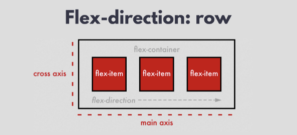
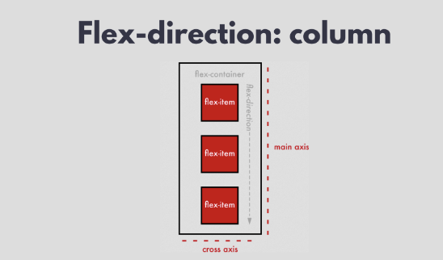
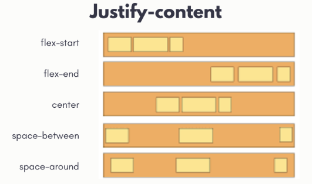
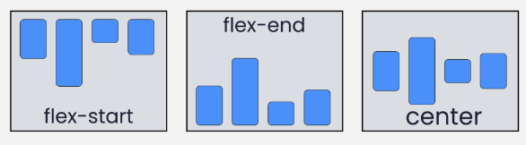

## 布局原理的不同
* Flexbox（弹性盒子模型）：是一种一维布局模型，用于在一个维度（行或列）上排列元素。Flexbox使得在主轴（水平或垂直）上的元素对齐、空间分配变得简单。

* Grid（网格布局）：提供了二维布局的能力，允许同时控制行和列。Grid布局能够创建复杂的布局结构，如网格和矩阵。

## flex-direction 
* 包括 row(默认值),主轴是水平的，交叉轴是垂直的

```
由于 row 是默认值，如果将容器设置为 flex，但未指定 flex-direction，则弹性子元素将自动排列为一行。
```
* row-reverse

* column: 当 flex-direction 属性的值为 column 时，主轴是垂直的，交叉轴是水平的，如图所示。这意味着弹性项目将垂直排列。


* column-reverse。

## 主轴上:justify-content
为了实现响应式布局，justify-content 属性有助于分配剩余的多余空间，即在 flex 子元素排列完成后剩下的空间。



## 控制交叉轴：align-items
* ex-start
* flex-end
* center


