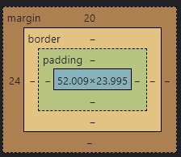

## 1.CSS 盒模型

```
Content(内容) - 盒子的内容，显示文本和图像。
Padding(内边距) - 清除内容周围的区域，内边距是透明的。
Border(边框) - 围绕在内边距和内容外的边框。
Margin(外边距) - 清除边框外的区域，外边距是透明的。
```

### 1-1.margin和padding区别
1. margin 用于控制元素与其周围元素之间的距离，影响元素的外部空白区域。
2. padding 用于控制元素内容与元素边界之间的距离，影响元素的内部空白区域。

>padding 不能是负数，因为它不会减小元素的尺寸，只会增加元素内容区域的大小

### 1-2.dom元素的高度
1. offsetHeight:border + padding + 元素内部
    * offsetHeight 衡量了一个元素在网页布局中的完整高度，包括其高度、边框（border）和内边距（padding），但不包括外边距（margin）。
    * 如果元素有水平滚动条，它的 offsetHeight 包括水平滚动条的高度。
    > 对于包含外边距的总高度，你应该考虑使用 offsetHeight 额外加上外边距的高度。

2. clientHeight: 只包括padding和元素的内容
    * clientHeight 衡量了一个元素的可见区域的高度，不包括边框（border）和外边距（margin），只包括内边距（padding）和元素的内容。
    * 对于带有滚动条的容器元素，它表示可见区域的高度，而 scrollHeight 表示所有内容的高度。
    * clientHeight 可用于确定元素内部内容的高度，以帮助在滚动时计算滚动位置。

3. scrollHeight: 溢出内容的高度 + padding + 元素内部
    * scrollHeight 衡量了一个元素内容在不可见区域的高度，包括被隐藏的内容（例如，溢出内容）的高度。
    * 如果元素的内容没有溢出并且在可见区域内，scrollHeight 等于元素的 clientHeight。
    * scrollHeight 对于滚动元素（例如，带有滚动条的容器）非常有用，因为它可以告诉你隐藏内容的总高度。

>offsetHeight 和 scrollHeight 可以看做是元素实际高度的两个方面，分别考虑了内容和溢出的情况。clientHeight 只考虑了元素内部的高度。


> 一般来说，如果元素内部的内容溢出了可见区域，scrollHeight 会比 offsetHeight 或 clientHeight 大

```html
<!DOCTYPE html>
<html lang="en">

<head>
  <meta charset="UTF-8">
  <title>index</title>
  <style>
    #app {
      width: 50px;
      height: 100px;
      background: yellow;
      margin: 20px;
      padding: 10px;
      border: 2px solid green;
    }
  </style>
</head>

<body>
  <div id="app">hello world</div>
  <script type="text/javascript">
    var dom = document.getElementById('app');
    console.log(dom.offsetHeight); // 124
    console.log(dom.clientHeight); // 120
  </script>
</body>

</html>
```

## 2.box-sizing
### 2-1.W3C的标准Box Model
```
width(宽度) + padding(内边距) + border(边框) = 元素实际宽度
height(高度) + padding(内边距) + border(边框) = 元素实际高度
```

语法: box-sizing: content-box|border-box|inherit:
```
默认值:	box-sizing: content-box;
```

### 2-2.box-sizing:border-box设置border和padding不会影响元素width与height
box-sizing:border-box;指定盒模型为IE模型,即 border 与 padding 由元素已设空间转变。

```html
<style type="text/css">
.box {
  width: 200px;
  height: 200px;
  text-align: center;
  border: 10px solid black;
  padding: 15px;
  box-sizing: border-box;
}
</style>
```

>此时的行高：`line-height = height - border*2 - padding*2 = 200px - 10px*2 - 15px*2 = 150px;`

因为此时，内容的其余空间被边框和填充占用，所以是元素的高减去边框和填充的空间，剩余即为内容空间

## 3.块级元素
### 3-1.常见的块级元素有：
```
<h1>~<h6>,<p>,<div>,<ul>,<ol>,<li>

div/p/<h1>~<h6>/form/table/hr/ul/ol/li
address/blockquote/center/dir/dl/menu/pre
```

常见的行内元素有：
```
span/a/img/input/em/strong/font/br/select/textarea/i/label/
abbr/acronym/b/big/cite/code/kbd/q/s/small/strike/sub/sup/tt/u
```

### 3-2.元素互相转化
1. 行内标签：块级标签转换为行内标签：display:inline;
  - 2.宽高:
  行内元素不可以设置宽高,宽度高度随文本内容的变化而变化,但是可以设置行高;
    块级可设置高度
  - 2.行内元素的display属性默认为inline 
2. 块级元素：行内标签转换为块级标签：display:block;
   - 1.排列:
    行内元素和其他行内元素都会在一条水平线上排列,都是在同一行的;
    块级元素却总是会在新的一行.
   - 是否包含：
     块级元素可以包含行内元素和块级元素,还可以容纳内联元素和其他元素;
    行内元素不能包含块级
3. 转换为行内块标签：display：inline-block;
当元素浮动时，无论是行内元素还是块元素，状态都类似于display:inline-block，既宽高可设置，内外边距可设置，不会独占一行。默认状态下宽高由元素内容决定。
```
inline-block元素的宽度始终等于其内容宽度.
它具有块级元素的特点，也有行内元素的行为.

从块级元素角度来说，可以为他设定外边距和内边距，也可以通过它简便而有效的包围其他块级元素.

从行内元素角度看，他会收缩包裹自己的内容，而不是扩展填充父元素.

解决方案就是为要居中元素的父元素应用text-align:center，为要居中的元素设定display:inline-block.这样设定就可以得到我们想要的结果:没有宽度的元素也能在其父元素内居中.

.title img{
    display: inline-block;
    vertical-align: middle;
}
```

## 4.css优先级
比较规则

1. 1000 > 0100，从左向右逐个比较，前一级相等才能往后比较
2. 无论是行内样式、内部样式还是外部样式，都是按照以上提到的权重方式进行比较，面试的时候遇到优先级比较，答案往往是：行内>id>class>元素(标签)，我们以为给了能令面试官满意的答案，其实不然，比如对同一个元素操作，在权重相等的情况下，后面的样式会覆盖前面的，这样我们给出来的答案就不成立了
3. 权重相同的情况下，位于后面的样式会覆盖前面的样式
4. 通配符、子选择器、兄弟选择器，虽然权重为0000，但是优先于继承的样式

- 第一优先级：!important
- 1.内联样式，如style="color: green"，权值为1000
- 2.ID选择器，如#app，权值为0100
- 3.类、伪类、属性选择器，如.foo, :first-child, div[class="foo"]，权值为0010
- 4.标签、伪元素选择器，如div::first-line，权值为0001
- 5.通配符、子类选择器、兄弟选择器，如*, >, +，权值为0000
- 6.继承的样式没有权值
```css
#index{}  id
.date-post{} 类
#nav > li{} 子选择符
p{} 标签
```

通配符
```css
*[lang^=en]{color:green;}
*.warning {color:red;}
*#maincontent {border: 1px solid blue;}

<p class="warning">
  <span lang="en-us">A green span</span> in a red paragraph.
</p>
<p id="maincontent" lang="en-gb">
  <span class="warning">A red span</span> in a green paragraph.
</p>
```

<br />

## 5.em和rem
rem与em都是相对单位，我们使用它们的目的就是为了适应各种不同的移动端和pc端的屏幕。
简单概括就是：
* em相对于父元素，em是根据父级元素的字体计算的。 
* rem相对于根元素。 rem是根据html根节点来计算的，

## 6.position定位与脱离文档流
static: 默认值，元素按照正常文档流进行布局，不受其他定位属性的影响

### 6-1.absolute  --->脱离文档流
生成绝对定位的元素，相对于 static 定位以外的第一个父元素进行定位。
元素的位置通过 "left", "top", "right" 以及 "bottom" 属性进行规定。
当父级 position 为 static 时，absolute元素将以body坐标原点进行定位，可以通过z-index进行层次分级。

### 6-2.relative -->未脱离文档流
生成相对定位的元素，相对于其正常位置进行定位。
因此，"left:20" 会向元素的 LEFT 位置添加 20 像素。
```
该元素仍然会在原来的地方为参考:top
right
bottom
left

决定平移一定距离
```
- static:默认值。没有定位，元素出现在正常的流中（忽略 top, bottom, left, right 或者 z-index 声明）。

- inherit:规定应该从父元素继承 position 属性的值。

- fixed:生成绝对定位的元素，相对于浏览器窗口进行定位。
元素的位置通过 "left", "top", "right" 以及 "bottom" 属性进行规定。

### 二者区别,relative 不脱离文档流,参照自己本身
>relative定位参考自身静态位置通过 top,bottom,left,right 定位，并且可以通过z-index进行层次分级。

absolute 脱离了文档流，其在文档流中的位置也不存在

absolute元素:
>规则：根据display:static 之外任意值的父级元素。如果没有这么一个定位祖先。那么就相对于文档的根元素定位。

## 响应式
```css
@media (max-width: 1366px) {
  .room-item {
    width: calc((100% - 56px) / 4);
  }
}
```

## 隐藏元素的多少种方式
### 总结：差异性-动画属性:
* display:none;的元素会直接从页面消失，因此定义transition效果完全无效。
* visibility:hidden;的元素会在transition设置的时间内消失，但是没有动画效果。
* opacity:0;的元素可以和正常元素一样，从页面以动画效果消失。
### display:none
设置为display:none;的元素将不会再占用页面空间，其占用的空间会被其他元素所占有，从而会引起浏览器的重排和重绘。

事件绑定：该素会直接从页面上消失，因此在该元素上绑定的事件不会生效

### visibility:hidden
[ˌvɪzəˈbɪləti]

这种做法虽然能够隐藏元素，但是该元素仍会占用页面空间，因此只会导致浏览器的重绘而不会引起重排。
事件绑定：

与 opacity 唯一不同的是它不会响应任何用户交互。
### opacity:0
[əʊˈpæsəti]

和visibility:hidden一样，设置后该元素仍会占用页面空间，因此只会导致浏览器的重绘而不会引起重排。
事件绑定：
元素会触发绑定的事件，例如点击会触发click函数。

## `@media`
```js
/* 默认样式 */
body {
  background-color: white;
  color: black;
  font-size: 16px;
}

/* 在小屏幕上应用不同样式 */
@media screen and (max-width: 768px) {
  body {
    background-color: lightgray;
    color: black;
    font-size: 14px;
  }
}

/* 在大屏幕上应用不同样式 */
@media screen and (min-width: 1200px) {
  body {
    background-color: blue;
    color: white;
    font-size: 20px;
  }
}
```