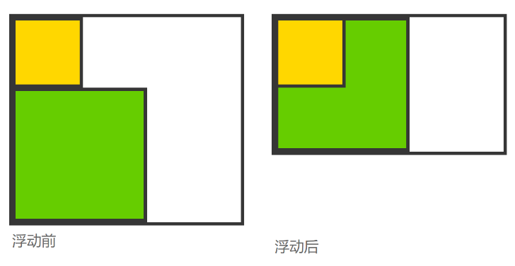
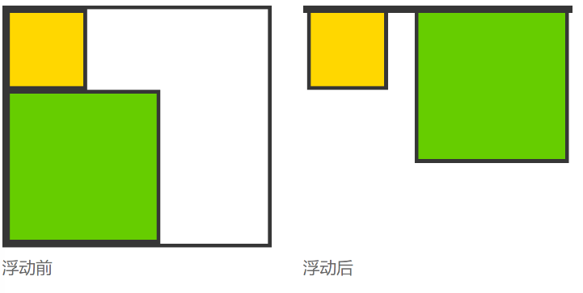

## 清除浮动的本质: 主要为了解决父级元素因为子级浮动引起内部高度为0的问题。
准确地说，并不是清除浮动，而是清除浮动后造成的影响

再解释下就是在标准流下面一个父p没有设置高度属性,那么它的高度就会被子元素的高度撑开。但是如果这个父p中的子元素是浮动的话，如果父p下面再有一个兄弟p，那么这个兄弟p就会遮挡这个父元素。这个现象也叫浮动溢出。

浮动带来的副作用 浮动会让元素脱离文档流，不再影响不浮动的元素（这里不影响是指在文档流里头不占位置，后边的元素忽视浮动元素的存在）。

实则不然，浮动不再占据文档流的位置，也使浮动元素周围的元素表现的如同浮动元素不存在一样，给布局带来了一些副作用。

如果我们不希望要这些效果，就需要清除浮动来解决后患，使后面的元素表现的跟浮动前一样

### 1-1. 块状元素，会钻进浮动元素的下面，被浮动元素所覆盖，像这样


### 1-2. 行内元素，例如文字， 则会环绕在浮动元素的周围，为浮动元素留出空间，像这样：


### 1-3. 浮动元素的父元素坍缩, 像这样：



```css
.clearfix:after{ 
   display: block;
   content:'';
   clear: both;
}

.content:after {
  display: table;
  content: "";
  clear: both;
}
```

### 清除浮动的方式
父级 div 定义 height，原理：父级 div 手动定义 height，就解决了父级 div 无法自动获取到高度的问题。 

结尾处加空 div 标签 clear: both，原理：添加一个空 div，利用 css 提高的 clear: both 清除浮动，让父级 div 能自动获取到高度。

父级 div 定义 overflow: hidden，  原理：必须定义 width 或 zoom: 1，同时不能定义 height，使用 overflow: hidden 时，浏览器会自动检查浮动区域的高度。 


父级 div 定义 display: table 。

父级 div 定义 伪类 :after 和 zoom 。

结尾处加 br 标签 clear: both， 原理：父级 div 定义 zoom: 1 来解决 IE 浮动问题，结尾处加 br 标签 clear: both。
