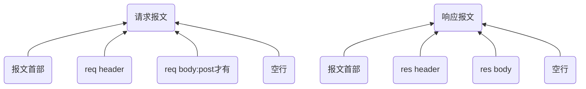

## http定义和特点
定义： HTTP是一种基于请求和响应的协议，即客户端向服务器发送一个请求，服务器接收该请求并返回一个响应。

HTTP协议通常承载于TCP协议之上，有时也承载于TLS或SSL协议层之上-->HTTPS

为了传输数据，HTTP使用了一种叫做“报文”的数据结构。

浏览器会向Web服务器发送一个请求报文，该报文包括一个(报文首部)请求行、多个header和一个空行。 

### HTTP协议使用TCP/IP协议进行通信
在TCP/IP的模型图中 , HTTP协议位于最上层的应用层，依靠tcp能实现：
1. 无差错的数据传输
2. 按序传输:数据总是会按照发送的顺序到达
3. 未分段的数据流:任意时刻以任意尺寸发送数据

HTTP是比TCP更上一层的应用层协议，只有低层协议建立之后才能，才能进行更高层协议的连接，因此，首先要建立TCP连接，一般TCP连接的端口号是80

一个TCP连接可发送多个HTTP请求，可保持TCP连接，一个 TCP 连接中 HTTP 请求依次发送。

一个域名下系统会同时建立多个TCP请求（最多支持6个）

### http 持久链接
无状态：HTTP协议是无状态协议。<br/>
connection: keep-alive
从HTTP/1.1起，默认都开启了Keep-Alive，保持连接特性，简单地说，当一个网页打开完成后，客户端和服务器之间用于传输HTTP数据的TCP连接不会关闭，如果客户端再次访问这个服务器上的网页，会继续使用这一条已经建立的连接。
Keep-Alive不会永久保持连接，它有一个保持时间，可以在不同的服务器软件（如Apache）中设定这个时间。

如果每个请求响应对，都是经一个单独的TCP连接发送，该应用程序被称为使用非持久连接；如果所有的请求及相应的响应都经相同的TCP连接发送，则该应用程序被称为 使用持久连接。 

  HTTP既可以使用非持久连接，也可以使用持久连接，默认方式下，HTTP使用持久连接。
  HTTP1.1，服务端和客户端都默认开启持久化连接，即使你在头部没看到connection:keep-alive，如果你有看到，那是为了兼容HTTP1.0

#### tcp连接何时关闭？
* 如果连接是keep-alive的，那么tcp连接不会主动断开，除非客户端或服务端至少有一端声明了
```
connection:close
```

* 服务端可以为keep-alive设定tcp最长保持时间，返回头部类似这样：
```
Connection: Keep-Alive
Keep-Alive: max=5, timeout=120
```

* 如果没有设置，则使用默认值，nginx为75s

## 报文三个部分:报文首部(请求行) + header + body + 空行
如果http是快递员，报文就是包裹

A:请求报文由以下元素组成：

* 1. 报文首部:请求行+状态行
```
1.请求行
请求行由请求方法和URL和HTTP协议版本构成。
GET / HTTP/1.1

方法
url
端口号:Remote Address: 124.237.176.160:443
HTTP 协议版本号。

2.状态行
Status Code: 200 OK
```

* 2.headers

* 3.对于一些像 POST 这样的方法，报文的 body 就包含了发送的资源，这与响应报文的 body 类似。
```
空行之后就是可选的报文主体了，其中包含了所有类型的数据。

请求主体中包括了要发送给Web 服务器的数据；

响应主体中装载了要返回给客户端的数据。起始行和首部都是文本形式且都是结构化的，而主体则不同，主体中可以包含任意的二进制数据（比如图片、视频、音轨、软件程序）。当然，主体中也可以包含文本。
```

B:响应报文包含了下面的元素：
* 1.报文首部：状态行
```
一个状态码（status code），来告知对应请求执行成功或失败，以及失败的原因。
一个状态信息，这个信息是非权威的状态码描述信息，可以由服务端自行设定。
```
* 2.headers，与请求头部类似
* 3.资源 body。


## 请求报文


### 请求报文之-报文首部
报文首部由方法字段、URL 字段 和HTTP 协议版本字段 3 个部分组成，他们之间使用空格隔开。
```
例如：GET /index.html HTTP/1.1
  get方法将数据拼接在url后面，传递参数受限
请求方法：
  GET、POST、HEAD、PUT、DELETE、OPTIONS、TRACE、CONNECT
```
### 请求报文之-req header
详细见:
03-状态码-请求报文之req header-响应报文res header.md

### 请求报文之-res body：res body不在 GET 方法中使用，而是在POST 方法中使用
post方法中，会把数据以key value形式发送请求
```
GET方式的请求一般不包含”请求内容”部分，请求数据以地址的形式表现在请求行。

GET /search?hl=zh-CN&source=hp&q=domety&aq=f&oq= HTTP/1.1  
Accept: image/gif, image/x-xbitmap, image/jpeg, image/pjpeg, application/vnd.ms-excel, application/vnd.ms-powerpoint, 
application/msword, application/x-silverlight, application/x-shockwave-flash, */*  
Referer: <a href="http://www.google.cn/">http://www.google.cn/</a>  
Accept-Language: zh-cn  
Accept-Encoding: gzip, deflate  
User-Agent: Mozilla/4.0 (compatible; MSIE 6.0; Windows NT 5.1; SV1; .NET CLR 2.0.50727; TheWorld)  
Host: <a href="http://www.google.cn">www.google.cn</a>  
Connection: Keep-Alive  
Cookie: PREF=ID=80a06da87be9ae3c:U=f7167333e2c3b714:NW=1:TM=1261551909:LM=1261551917:S=ybYcq2wpfefs4V9g; 
NID=31=ojj8d-IygaEtSxLgaJmqSjVhCspkviJrB6omjamNrSm8lZhKy_yMfO2M4QMRKcH1g0iQv9u-2hfBW7bUFwVh7pGaRUb0RnHcJU37y-
FxlRugatx63JLv7CWMD6UB_O_r 
```
### 请求报文之-空行:发送回车符和换行符，通知服务器以下不再有请求头

## 响应报文
### 响应报文之-状态行
由3部分组成：协议版本，状态码，状态码描述，之间由空格分隔
### 响应报文之-res header
详细见:
03-状态码-请求报文之req header-响应报文res header.md

### 响应报文之-req body
### 响应报文之-空行表示结束

## http和其他协议

### UDP协议
```
UDP（User Datagram Protocol）：用户报文协议
没有任何特点
和TCP对比：不可靠、无连接、面向报文
1. 网络的基本情况就是不可靠的
```

场景
```
UDP协议的最适用场景
对实时性要求较高，对可靠性要求较低的场景
实时聊天（语音、视频聊天)
UDP支持广播。如果有广播需求，也可以考虑用UDP。
```

UDP有点像街头的邮筒，应用程序的数据包扔进邮筒就好了，就耐心地等待数据包到达目的地。但扔进邮筒之前，需要写好以下信息：
1. 收件人的地址（目的IP）
2. 收件人的姓名（目的端口号）
3. 寄件人地址（源IP）
4. 寄件人姓名（源端口号）

IP司机会瞬间地将邮筒里的信件，运往世界各个角落。

比较奢侈的是，一个IP司机运一件信件。

我们使用浏览器、邮件客户端却一直和UDP协议直接打交道。要下载文件，首先要域名解析获得服务器的IP地址，而完成域名解析任务的是DNS协议。

### DNS协议
DNS协议将自己的域名解析请求报文扔到UDP邮筒里，被IP司机运输到域名服务器家中，服务器返回域名解析应答，同样通过UDP邮筒邮寄服务。


### HTTP与FTP的异同点
- 同:
  - 是应用层协议；运行在TCP上，即都使用TCP（而不是UDP）作为其支撑的运输层协议。 
- 异：
  - HTTP是超文本传输协议，是面向网页的；FTP是文件传输协议，是面向文件的。 
  - HTTP协议默认端口：80号端口。FTP协议默认端口：21号端口
  - FTP的控制信息是带外（out-of-band）传送的，而HTTP的控制信息是带内（in-band）传送的
  - FTP服务器必须在整个会话期间保留用户的状态（state）信息，而HTTP是无状态的。
  - FTP的控制连接是持久连接，数据连接是非持久连接；而HTTP既可以使用非持久连接，也可以使用持久连接，默认方式下，HTTP使用持久连接。 


### 通信数据转发程序：代理，网关，隧道
http通信时候，除客户端和服务器以外，还有一些用于通信数据转发的应用程序，例如代理，网关，隧道。

代理:中间人
网关：可以由http转化为其他通信
隧道：确保安全通信，不会解析http请求，隧道在双方断开连接中断