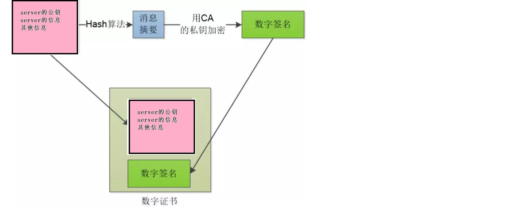
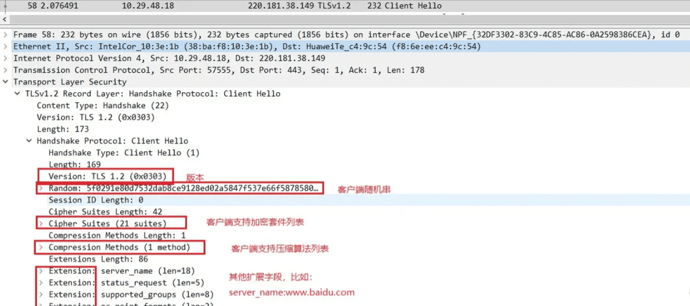
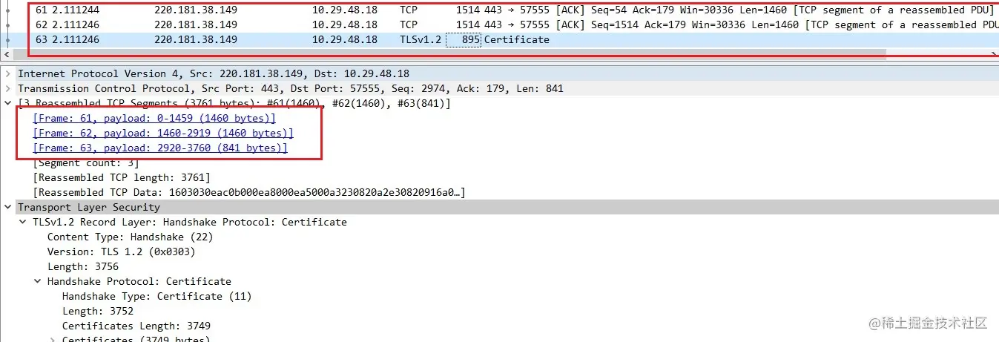
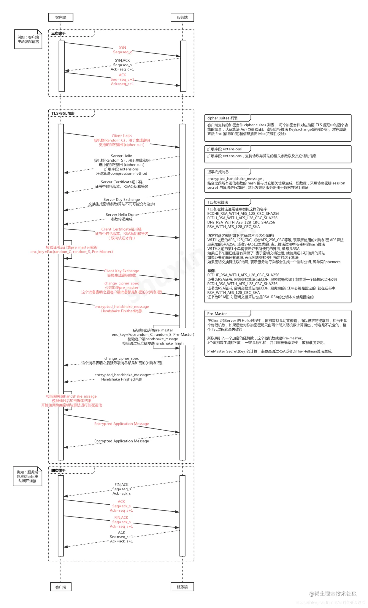

## 基础加密方法:非对称加密
>非对称加密涉及一对不同的密钥，即公钥和私钥，其中公钥用于加密数据，私钥用于解密数据。
非对称加密算法需要两个密钥：
- 公开密钥（publicKey:简称公钥）,公钥用于对数据加密
- 私有密钥（privateKey:简称私钥）,私钥用于对数据解密,如果用公钥对数据进行加密，只有用对应的私钥才能解密

* 就算公钥被劫持，但客户端使用公钥加密的数据只能用私钥解密。因为加密和解密使用的是两个不同的密钥，所以这种算法叫作非对称加密算法。

### 实现方式
```js
const crypto = require('crypto');

// 生成密钥对
function generateRSAKeyPair() {
  return crypto.generateKeyPairSync('rsa', {
    modulusLength: 2048, // 密钥长度
    publicKeyEncoding: {
      type: 'spki',
      format: 'pem'
    },
    privateKeyEncoding: {
      type: 'pkcs8',
      format: 'pem'
    }
  });
}

// 使用公钥加密数据
function encryptWithPublicKey(publicKey, plainText) {
  const encryptedBuffer = crypto.publicEncrypt(publicKey, Buffer.from(plainText));
  return encryptedBuffer.toString('base64');
}

// 使用私钥解密数据
function decryptWithPrivateKey(privateKey, encryptedText) {
  const encryptedBuffer = Buffer.from(encryptedText, 'base64');
  const decryptedBuffer = crypto.privateDecrypt(privateKey, encryptedBuffer);
  return decryptedBuffer.toString();
}

// 例子：
const { publicKey, privateKey } = generateRSAKeyPair();
const plainText = 'Hello, World!';
const encryptedText = encryptWithPublicKey(publicKey, plainText);
const decryptedText = decryptWithPrivateKey(privateKey, encryptedText);

console.log('Original Text: ', plainText);
console.log('Encrypted Text: ', encryptedText);
console.log('Decrypted Text: ', decryptedText);
```

## 1.HTTPS加密
### 1-1.证书验证阶段：
1. 浏览器发起 HTTPS 请求；
2. 服务端返回 HTTPS 证书；
3. 客户端验证证书是否合法，如果不合法则提示告警。

### 1-2.数据传输阶段:
服务器生成一对公钥和私钥；将公钥传给客户端,客户端用公钥加密随机数生成密文，(注意：在https是不会把私钥给浏览器的,这并不安全)
1. 当证书验证合法后，在本地生成随机数；客户端通过公钥加密随机数，并生成密匙用来后续加密传输数据,并把加密后的随机数传输到服务端
2. 服务端通过私钥对随机数进行解密；服务端通过客户端传入的随机数构造对称加密算法，对返回结果内容进行解密后。同样也可以用对称密匙加密数据给客户端。

### 1-2-1.https中单纯使用非对称加密造成的问题
问题所在：服务端给客户端发数据时就不能进行加密,只能加密：客户端-->服务端

客户端可以使用公钥进行加密服务端使用私钥解密，但是服务端给客户端发数据时就不能进行加密了，因为客户端只有公钥，服务端只有私钥，如果要加密，服务端只能把私钥也传给客户端，客户端才能解密，这样肯定不安全。

解决办法是采用随机数，客户端用公钥加密随机数-->把对称加密的密匙存在本地

服务端接收加密的随机数，用私钥解密后构建对称的密匙，然后解密

### 为什么数据传输是用对称加密？效率
在 HTTPS 的场景中只有服务端保存了私钥，一对公私钥只能实现单向的加解密，所以HTTPS中内容传输加密采取的是对称加密，而不是非对称加密。

首先：非对称加密的加解密效率是非常低的，而http的应用场景中通常端与端之间存在大量的交互，非对称加密的效率是无法接受的。


基础加密方法:对称加密
加密和解密使用的密钥是一样的,具体实现:
> 在每次发送真实数据之前，客户端先生成一把密钥，然后先把密钥传输给服务端。之后客户端给服务端发送真实数据的时候，会用这把密钥对数据进行加密，服务端收到加密数据之后，用刚才收到的密钥进行解密。

这种加密方式运用在客户端与服务器数据传输安全吗，显然是不安全的，因为密钥也需要被传输，而且是明文传输。
优点
- 加密算法与解密算法想同。
- 加密算法的优点：加密解密的效率很高；
- 加密算法的缺点：容易被劫持，使用时间稍长就会被中间劫持，根据数据规率找破解出加密算法。
- 解决方案：可以每次通信都动态协商一个加密算法，但还是有可能被劫持掉。


### 但是，非对称加密的方式也并非万无一失，在此举个例子：

服务器以明文的方式给客户端传输公钥的时候，中间人截取了这把属于服务器的公钥，并且把中间人自己的公钥冒充服务器的公钥传输给了客户端。

之后客户端就会用中间人的公钥来加密自己生成的密钥。然后把被加密的密钥传输给服务器，这个时候中间人又把密钥给截取了，中间人用自己的私钥对这把被加密的密钥进行解密，解密后中间人就可以获得这把密钥了。

最后中间人再对这把密钥用刚才服务器的公钥进行加密，再发给服务器。

毫无疑问，在这个过程中，中间人获取了对称加密中的密钥，在之后服务器和客户端的对称加密传输中，这些加密的数据对中间人来说，和明文没啥区别。

### 所以引入了，数字证书认证中心
非对称性加密之所以不安全，是应为客户端不知道，这把公钥是不是服务器的。
如上所说，为了解决公钥来源的不安全性，引入第三方 数字证书认证中心（CA）

- 签名证书：进行身份验证；并且传送公钥信息，公司生成一对密钥之后，拿到权威机构处生成一个签名证书，证书包含：公钥信息，权威机构信息，公司机构信息，有效时间等。
- SSl加密过程：在通信的时候，连接建立之后，服务器先向客户端传送证书，客户端通过证书的信息进行验证：①若身份验证不通过，则可以直接断开连接，若身份验证通过，然后用证书中的公钥加密对称算法的协商过程，最终利用协商好的对称加密算法对数据通信进行加密。

服务器可以向CA来申请数字证书
```
因此，我们需要找到一种策略来证明这把公钥就是服务器的，而不是别人冒充的,就像身份证一样，唯一标识我们服务器的公钥，解决这个问题的方式就是使用数字证书，具体是这样的.

互联网世界中充当公理的机构来签发这个证书，它就是CA机构，它是如今互联网世界正常运作的前提，而CA机构颁发的“身份证”就是数字证书：

网站在使用HTTPS前，需要向CA机构申领一份数字证书，数字证书里含有证书持有者信息、公钥信息等。服务器把证书传输给浏览器，浏览器从证书里获取公钥就行了，证书就如身份证，证明“该公钥对应该网站”。而这里又有一个显而易见的问题，“证书本身的传输过程中，如何防止被篡改”？即如何证明证书本身的真实性？身份证运用了一些防伪技术，而数字证书怎么防伪呢？

我们把证书原本的内容生成一份“签名”，比对证书内容和签名是否一致就能判别是否被篡改。这就是数字证书的“防伪技术”，这里的“签名”就叫数字签名：
数字签名的制作过程：
CA机构拥有非对称加密的私钥和公钥。

CA机构对证书明文数据T进行hash。

对hash后的值用私钥加密，得到数字签名S。

明文和数字签名共同组成了数字证书，这样一份数字证书就可以颁发给网站了。
```

### 总结-HTTPS 在内容传输的加密上使用的是对称加密，非对称加密只作用在证书验证阶段

场景1：客户端-->服务端

客户端用密文加密data，服务端通过私钥对随机数进行解密，然后解密data

场景2：服务端-->客户端
服务端用随机数构造对称加密算法,加密后传data,客户端用随机数密文解密

- 优点：安全性高，不容易被破解。
- 缺点：解密效率比较低。
- 对称加密算法和非对称加密算法结合起来：
    * 将客户端与服务端动态协商对称算法过程用非对称算法加密起来；
    * 使用协商的对称加密算法对数据通信过程进行加密，这样既保证了安全，也提高了效率。

- 存在的问题：若中间黑客劫持了服务器发送给客户端的公钥，然后将自己的公钥发送给客户端，因为客户端不知道服务端的身份，所以就出现数据被劫持。若客户端能够知道服务无端身份，就不怕劫持了，所以又引进了：签名证书。


## HTTPS是什么？
HTTPS在HTTP的基础上加入了SSL/TLS协议来对传输的数据进行加密，以保证数据传输的安全性。

当使用 SSL 时，则演变成先和 SSL 通信，再由 SSL 和 TCP 通信了。HTTP 就拥有了 HTTPS 的加密、证书和完整性保护这些功能。

HTTPS使用SSL/TLS来建立一个加密通道，传输的数据在这个通道中被加密，只有发送方和接收方能够解密。这种加密机制使得数据更难被窃听、篡改或冒充。

### Http与Https的区别
- HTTP:应用层，HTTPS的安全传输机制工作在传输层
- HTTP 无法加密，而HTTPS 对传输的数据进行加密,HTTP 是不安全的，而 HTTPS 是安全的
- HTTP无需证书，而HTTPS 需要CA机构颁发的SSL证书
- HTTP 标准端口是80 ，而 HTTPS 的标准端口是443

### https的详细握手过程
https在七层协议里面属于应用层，基于tcp协议

https握手先经过tcp的三次握手，tcp链接建立好之后，才进入https的对称密钥协商过程，对称密钥协商好之后，就开始正常的收发数据流程。

### SSL的基本概念
SSL（Secure Socket Layer，安全套接字层）/TLS(Transport Layer Security，传输层安全协议),SSL/TLS协议提供的服务主要有：

- 认证用户和服务器，确保数据发送到正确的客户机和服务器；
- 加密数据以防止数据中途被窃取；
- 维护数据的完整性，确保数据在传输过程中不被改变。

SSL位于应用层和传输层之间，所以可以为任何基于TCP等可靠连接的应用层协议提供安全性保证，用于Web浏览器和服务器之间的身份认证和加密数据传输.

SSL记录层：位于可靠的传输之上（比如TCP），提供压缩，认证，加密等功能

SSL握手层：位于ssl记录层之上，提供数据传输前的身份验证，协商算法，交换密钥等功能。




## 数字证书无法篡改的原因？
1.拿到证书，如果伪造证书，但是你没有CA的密钥C2

2.如果直接使用原数据，可以解密后看数据，证书里面是有host的，如果你的网站的host和证书不一致，也不行

### wireshark抓网络数据包来解释https的整个详细的握手过程
fiddler 和charles主要是用于抓取应用层协议https/http等上层的应用数据，都是建立链接成功后的数据，而wireshark是可以抓取所有协议的数据包（直接读取网卡数据）,我们的目的是抓取https建立链接成功前的过程，所以我们选择wireshark

```
执行：
curl https://www.baidu.com
```

为什么是用curl， 而不是在浏览器打开https://www.baidu.com

curl是只发送一个请求，如果是用浏览器打开百度，那百度页面里面的各种资源也会发送请求，容易造成很多不必要的数据包

### ack消息属于tcp协议里面的确认报文
解释说明：tcp三次握手:比如ack，seq,mss,win都代表什么意思


### 步骤2.客户端发送client_hello
```
客户端发送client_hello，包含以下内容（请自行对照上图） 1. 包含TLS版本信息 2. 随机数（用于后续的密钥协商）random_C 3. 加密套件候选列表 4. 压缩算法候选列表 5. 扩展字段 6. 其他
```


### 步骤3：服务端发送server_hello
```
服务端收到客户端的client_hello之后，发送server_hello，并返回协商的信息结果
1. 选择使用的TLS协议版本 version
2. 选择的加密套件 cipher suite
3. 选择的压缩算法 compression method
4. 随机数 random_S
5. 其他
```


### 服务端发送证书
服务端发送完server_hello后，紧接着开始发送自己的证书从图可知：因包含证书的报文长度是3761，所以此报文在tcp这块做了分段，分了3个报文把证书发送完了


### 服务端发送Server Key Exchange
解释说明:对于使用DHE/ECDHE非对称密钥协商算法的SSL握手，将发送该类型握手。RSA算法不会进行该握手流程（DH、ECDH也不会发送server key exchange）,也就是说此报文不一定要发送，视加密算法而定。SSL中的RSA、DHE、ECDHE、ECDH流程与区别可以参考此篇文章
https://blog.csdn.net/mrpre/article/details/78025940


### 服务端发送Server Hello Done

通知客户端 server_hello 信息发送结束

### 客户端发送
client_key_exchange+change_cipher_spec+encrypted_handshake_message

1. client_key_exchange，合法性验证通过之后，向服务器发送自己的公钥参数，这里客户端实际上已经计算出了密钥
2. change_cipher_spec，客户端通知服务器后续的通信都采用协商的通信密钥和加密算法进行加密通信
3. encrypted_handshake_message，主要是用来测试密钥的有效性和一致性


### 0-8.服务端发送New Session Ticket

服务器给客户端一个会话，用处就是在一段时间之内（超时时间到来之前），双方都以协商的密钥进行通信。

### 0-9.服务端发送change_cipher_spec

服务端解密客户端发送的参数，然后按照同样的算法计算出协商密钥，并通过客户端发送的encrypted_handshake_message验证有效性，验证通过，发送该报文，告知客户端，以后可以拿协商的密钥来通信了


### 0-10.服务端发送encrypted_handshake_message

目的同样是测试密钥的有效性，客户端发送该报文是为了验证服务端能正常解密，客户端能正常加密，相反：服务端发送该报文是为了验证客户端能正常解密，服务端能正常加密

### 0-11.完成密钥协商，开始发送数据

数据同样是分段发送的


### 0-12.完成数据发送，4次tcp挥手
红框的意思是：客户端或服务器发送的，意味着加密通信因为某些原因需要中断，警告对方不要再发送敏感的数据,服务端数据发送完成也会有此数据包，可不关注


### 0-13.总结



## 用了 HTTPS 会被抓包吗？
HTTPS 的数据是加密的，常规下抓包工具代理请求后抓到的包内容是加密状态，无法直接查看。

为什么charles等抓包工具看到的也是明文的呢？

浏览器是属于应用层之上的应用吧，所以浏览器控制台的输出都是已经经过tls解密过的。
为什么charles等抓包工具看到的也是明文的呢？是不是也是因为charles是应用层之上的应用呢？不尽然如此！charles在抓包过程中是起到了中间代理的作用，浏览器=====》Charles======》服务器，charles相对于浏览器来说，是服务端，相对于服务端来时，是客户端。charles在抓取https的包时，是需要浏览器先安装并信任自己的证书的（相当于服务器的证书）


但是，正如前文所说，浏览器只会提示安全风险，如果用户授权仍然可以继续访问网站，完成请求。因此，只要客户端是我们自己的终端，我们授权的情况下，便可以组建中间人网络，而抓包工具便是作为中间人的代理。通常 HTTPS 抓包工具的使用方法是会生成一个证书，用户需要手动把证书安装到客户端中，然后终端发起的所有请求通过该证书完成与抓包工具的交互，然后抓包工具再转发请求到服务器，最后把服务器返回的结果在控制台输出后再返回给终端，从而完成整个请求的闭环。

### 既然 HTTPS 不能防抓包，那 HTTPS 有什么意义？
HTTPS 可以防止用户在不知情的情况下通信链路被监听，对于主动授信的抓包操作是不提供防护的，因为这个场景用户是已经对风险知情。要防止被抓包，需要采用应用级的安全防护，例如采用私有的对称加密，同时做好移动端的防反编译加固，防止本地算法被破解。

## 1.为什么需要 CA 认证机构颁发证书？
HTTP 协议被认为不安全是因为传输过程容易被监听者勾线监听、伪造服务器，而 HTTPS 协议主要解决的便是网络传输的安全性问题。

首先我们假设不存在认证机构，任何人都可以制作证书，这带来的安全风险便是经典的“中间人攻击”问题。

1）本地请求被劫持（如DNS劫持等），所有请求均发送到中间人的服务器；
2）中间人服务器返回中间人自己的证书；
3）客户端创建随机数，通过中间人证书的公钥对随机数加密后传送给中间人，然后凭随机数构造对称加密对传输内容进行加密传输；
4）中间人因为拥有客户端的随机数，可以通过对称加密算法进行内容解密；
5）中间人以客户端的请求内容再向正规网站发起请求；
6）因为中间人与服务器的通信过程是合法的，正规网站通过建立的安全通道返回加密后的数据；
7）中间人凭借与正规网站建立的对称加密算法对内容进行解密；
8）中间人通过与客户端建立的对称加密算法对正规内容返回的数据进行加密传输；
9）客户端通过与中间人建立的对称加密算法对返回结果数据进行解密。
由于缺少对证书的验证，所以客户端虽然发起的是 HTTPS 请求，但客户端完全不知道自己的网络已被拦截，传输内容被中间人全部窃取。

### 1-1.证书包含什么信息？
1）颁发机构信息；
2）公钥；
3）公司信息；
4）域名；
5）有效期；
6）指纹；

### 1-2.浏览器如何验证证书的合法性？
浏览器发起 HTTPS 请求时，服务器会返回网站的 SSL 证书，浏览器需要对证书做以下验证：
1）验证域名、有效期等信息是否正确：证书上都有包含这些信息，比较容易完成验证；

2）判断证书来源是否合法：每份签发证书都可以根据验证链查找到对应的根证书，操作系统、浏览器会在本地存储权威机构的根证书，利用本地根证书可以对对应机构签发证书完成来源验证

3）判断证书是否被篡改：需要与 CA 服务器进行校验；

4）判断证书是否已吊销：通过CRL（Certificate Revocation List 证书注销列表）和 OCSP（Online Certificate Status Protocol 在线证书状态协议）实现，其中 OCSP 可用于第3步中以减少与 CA 服务器的交互，提高验证效率。

以上任意一步都满足的情况下浏览器才认为证书是合法的

### 1-3.既然证书是公开的，如果要发起中间人攻击，我在官网上下载一份证书作为我的服务器证书，那客户端肯定会认同这个证书是合法的，如何避免这种证书冒用的情况？
其实答案很简单的问题：
其实这就是非加密对称中公私钥的用处，虽然中间人可以得到证书，但私钥是无法获取的，一份公钥是不可能推算出其对应的私钥，中间人即使拿到证书也无法伪装成合法服务端，因为无法对客户端传入的加密数据进行解密。

### 1-2.本地随机数被窃取怎么办？
证书验证是采用非对称加密实现，但是传输过程是采用对称加密，而其中对称加密算法中重要的随机数是由本地生成并且存储于本地的，HTTPS 如何保证随机数不会被窃取？

其实 HTTPS 并不包含对随机数的安全保证，HTTPS 保证的只是传输过程安全，而随机数存储于本地，本地的安全属于另一安全范畴
