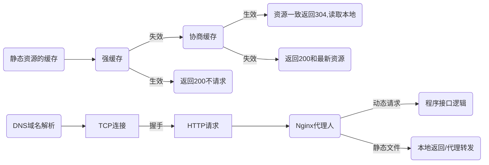
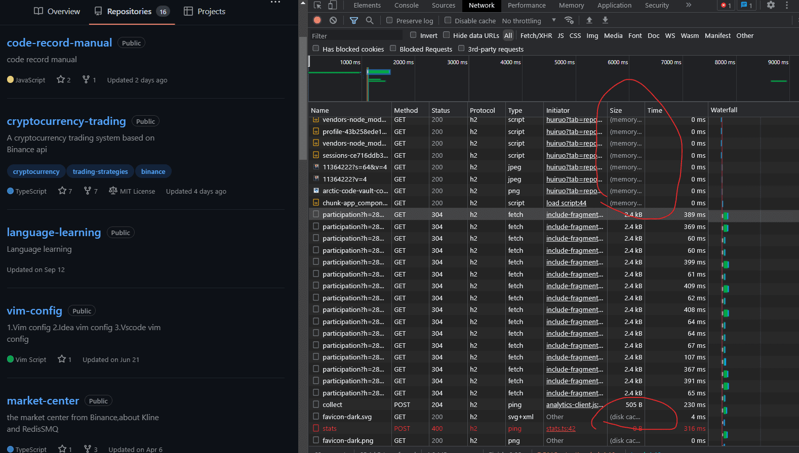
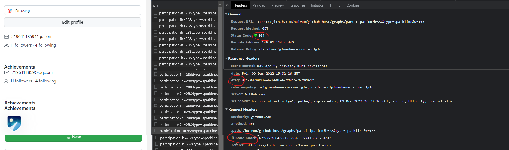
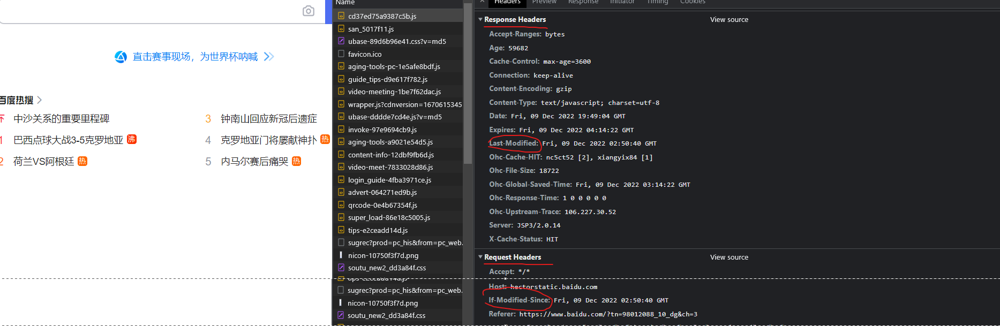
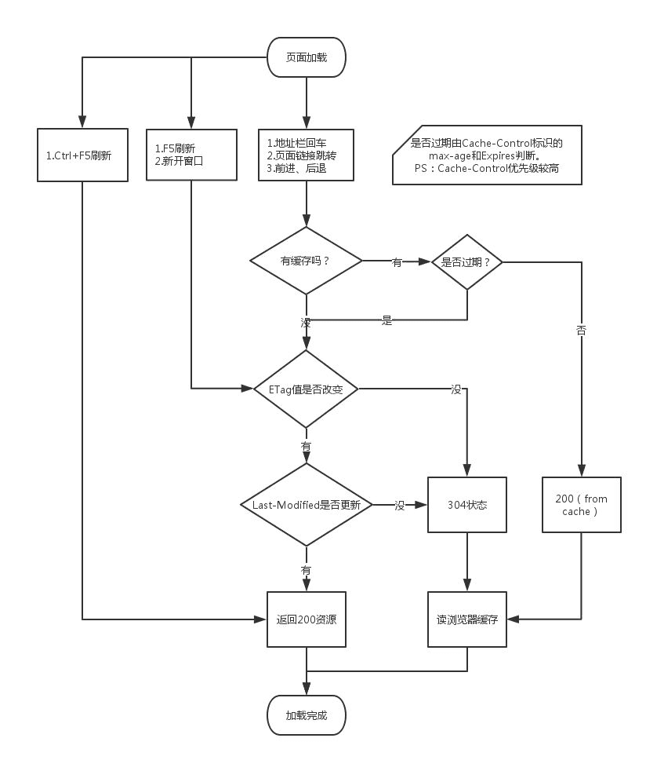
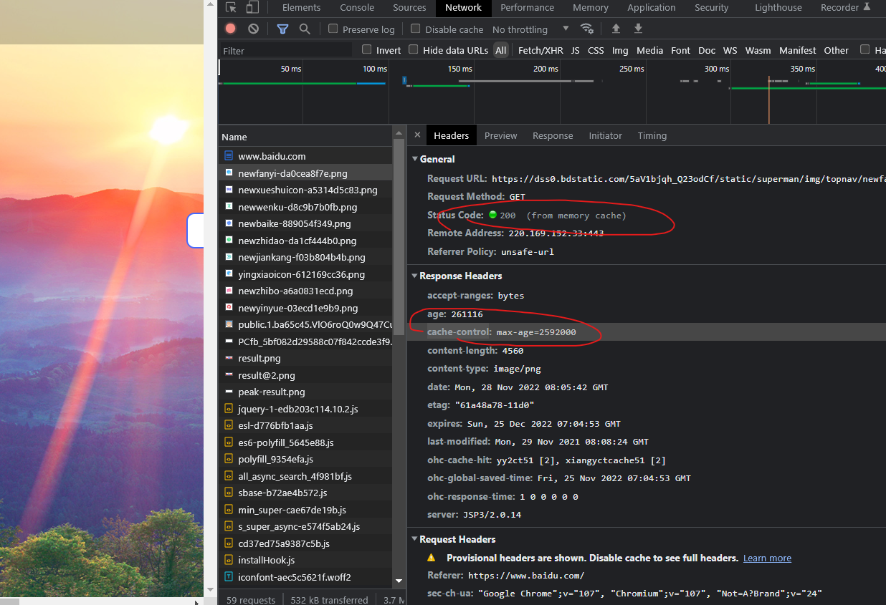
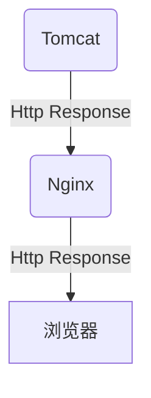
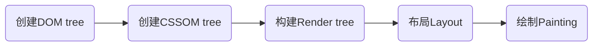

# 输入github.com 浏览器的一系列流程
简要过程:


# 步骤1. 在发起网络请求之前,涉及到浏览器静态资源的缓存
浏览器缓存优先级：
1. 首次请求,客户端请求一个资源,服务端返回资源，并在response header中加上字段cache-control/expires，Last-Modified/ETag
2. 客户端展现该页面，浏览器将页面连同header中的字段存储

3. 再次请求,先去内存看，如果有，直接加载;如果内存没有，择取硬盘获取，如果有直接加载,这两个都是强缓存。浏览器会根据当前运行环境内存来决定是从 Memory Cache 还是 从Disk Cache中拿所以缓存资源不过期的时候，如果资源在内存那么就from memory，如果只有在磁盘上就from disk。

4. 如果是刷新页面或则第二次打开页面，浏览器请求有`if-none-match/If-Modified-Since请求头`,
对应服务端资源设置了协商缓存`ETag/Last-Modified响应头`，开始请求服务端进行协商,内容没有更新返回304，直接使用本地资源加载渲染,如果有更新返回更新资源并返回200
5. 加载到的资源缓存到硬盘和内存


### 用户行为对浏览器缓存的影响
主要有 3 种：
- 打开网页，地址栏输入地址： 查找 disk cache 中是否有匹配。如有则使用；如没有则发送网络请求
- 普通刷新 (F5)：因为 TAB 并没有关闭，因此 memory cache 是可用的，会被优先使用(如果匹配的话)。其次才是 disk cache。
- 强制刷新 (Ctrl + F5)：浏览器不使用缓存，因此发送的请求头部均带有 Cache-control: no-cache(为了兼容，还带了 Pragma: no-cache),服务器直接返回 200 和最新内容。

可见不会影响协商缓存

### 缓存的分类: 以下四种缓存都没有命中的话，那么只能发起请求来获取资源
1. 强缓存1：内存缓存memory cache
```
Memory Cache 也就是内存中的缓存，主要包含的是当前中页面中已经抓取到的资源,例如页面上已经下载的样式、脚本、图片等。读取内存中的数据肯定比磁盘快,但是关闭消失。
```
2. 强缓存2：硬盘缓存disk cache
```
Disk Cache 也就是存储在硬盘中的缓存，读取速度慢点，但是什么都能存储到磁盘中，比之 Memory Cache 胜在容量和存储时效性上。

Disk Cache 覆盖面基本是最大的。它会根据 HTTP Herder 中的字段判断哪些资源需要缓存，哪些资源可以不请求直接使用，哪些资源已经过期需要重新请求。并且即使在跨站点的情况下，相同地址的资源一旦被硬盘缓存下来，就不会再次去请求数据。绝大部分的缓存都来自 Disk Cache，关于 HTTP 的协议头中的缓存字段。
```
3. Service Worker
```
Service Worker 是运行在浏览器背后的独立线程，一般可以用来实现缓存功能。使用 Service Worker的话，传输协议必须为 HTTPS。因为 Service Worker 中涉及到请求拦截，所以必须使用 HTTPS 协议来保障安全。
```
4. Push Cache
```
Push Cache（推送缓存）是 HTTP/2 中的内容，当以上三种缓存都没有命中时，它才会被使用。它只在会话（Session）中存在，一旦会话结束就被释放，并且缓存时间也很短暂，在Chrome浏览器中只有5分钟左右，同时它也并非严格执行HTTP头中的缓存指令。

1.可以推送 no-cache 和 no-store 的资源
2.一旦连接被关闭，Push Cache 就被释放
3.Push Cache 中的缓存只能被使用一次
4.浏览器可以拒绝接受已经存在的资源推送
```

## 通常浏览器缓存策略分为两种：强缓存和协商缓存
那么为了性能上的考虑，大部分的资源都应该选择好缓存策略，缓存存在于http的get请求中，浏览器可以根据request和response的header中字段的值、客户端时间等，判断使用本地存储的内容还是服务端返回的内容。

览器缓存机制的关键:
- 浏览器每次发起请求，都会先在浏览器缓存中查找该请求的结果以及缓存标识
- 浏览器每次拿到返回的请求结果都会将该结果和缓存标识存入浏览器缓存中



* 1.频繁变动的资源: Cache-Control: no-cache

对于频繁变动的资源，首先需要使用Cache-Control: no-cache 使浏览器每次都请求服务器，然后配合 ETag 或者 Last-Modified 来验证资源是否有效。这样的做法虽然不能节省请求数量，但是能显著减少响应数据大小。

* 2.不常变化的资源: Cache-Control: max-age=31536000

通常在处理这类资源时，给它们的 Cache-Control 配置一个很大的 max-age=31536000 (一年)，这样浏览器之后请求相同的 URL 会命中强制缓存。而为了解决更新的问题，就需要在文件名(或者路径)中添加 hash， 版本号等动态字符，之后更改动态字符，从而达到更改引用 URL 的目的，让之前的强制缓存失效 (其实并未立即失效，只是不再使用了而已)。
在线提供的类库 (如 jquery-3.3.1.min.js, lodash.min.js 等) 均采用这个模式。

## A.协商缓存:需要向服务器重新发起HTTP请求
强缓存判断是否缓存的依据来自于是否超出某个时间或者某个时间段，而不关心服务器端文件是否已经更新，这可能会导致加载文件不是服务器端最新的内容，那我们如何获知服务器端内容是否已经发生了更新呢？此时我们需要用到协商缓存策略。

`注意:`协商缓存发生在在第二次以上的请求，浏览器不同tab打开页面也是第二次，第一次请求不会发生

若强制缓存(Expires和Cache-Control)生效则直接使用缓存，若不生效则进行协商缓存

* 方法1:响应头Etag/请求头If-None-Match
* 方法2:响应头Last-Modified/请求头If-Modified-Since
### 1.协商缓存实现方法1：响应头etag/请求头if-none-match
响应头Last-Modified/请求头If-Modified-Since,根据文件修改时间来决定是否缓存尚有不足，能否可以直接根据文件内容是否修改来决定缓存策略？所以在 HTTP / 1.1 出现了 ETag 和If-None-Match

ETag实现和Last-Modified实现对比
* 首先在精确度上，Etag要优于Last-Modified。
* 在优先级上，服务器校验优先考虑Etag
* 性能上，Etag要逊于Last-Modified，毕竟Last-Modified只需要记录时间，而Etag需要服务器通过算法来计算出一个hash值。

Etag是服务器响应请求时，返回当前资源文件的一个唯一标识(由服务器生成)，只要资源有变化，Etag就会重新生成。

浏览器在下一次加载资源向服务器发送请求时，会将上一次返回的Etag值放到request header里的If-None-Match里，服务器只需要比较客户端传来的If-None-Match跟自己服务器上该资源的ETag是否一致，就能很好地判断资源相对客户端而言是否被修改过了。

如果服务器发现ETag匹配不上，那么直接以常规GET 200回包形式将新的资源（当然也包括了新的ETag）发给客户端；如果ETag是一致的，则直接返回304知会客户端直接使用本地缓存即可。

Etag ETag将返回给浏览器一个资源ID(字符串), 如果有了新版本则正常发送并附上新ID, 否则返回304. ETag是为了解决Last-Modified只能精确到秒的问题，可以精确到毫秒。但是在服务器集群情况下, 必须保证每个分布式服务器返回相同的ETag.

例子：https://github.com/huiruo?tab=repositories
```
response header:
etag: W/"8ae3cb9da6a714e57ef2ed500e105dd9"

request header:
if-none-match: W/"8ae3cb9da6a714e57ef2ed500e105dd9"
```




### 2.协商缓存实现方法2：响应头Last-Modified/请求头If-Modified-Since
步骤1：浏览器下一次请求这个资源，浏览器检测到有 Last-Modified这个header，于是添加If-Modified-Since这个header，值=Last-Modified；

步骤2：服务器再次收到这个资源请求，会根据 If-Modified-Since 中的值与服务器中这个资源的最后修改时间对比，如果没有变化，返回304和空的响应体，直接从缓存读取，如果If-Modified-Since的时间小于服务器中这个资源的最后修改时间，说明文件有更新，于是返回新的资源文件和200。

Last-Modified: 该资源的最后修改时间, 在浏览器下一次请求资源时, 浏览器将先发送一个请求到服务器上, 并附上If-odified-Since头来说明浏览器所缓存资源的最后修改时间, 如果服务器发现没有修改, 则直接返回304(Not Modified)回应信息给浏览器(内容很少), 如果服务器对比时间发现修改了, 则照常返回所请求的资源.

例子 https://www.baidu.com/
```
response header:
Last-Modified: Wed, 16 Nov 2022 12:11:52 GMT

request header:
If-Modified-Since: Wed, 16 Nov 2022 12:11:52 GMT
```




```
看到这里，不知道你是否存在这样一个疑问:如果什么缓存策略都没设置，那么浏览器会怎么处理？

对于这种情况，浏览器会采用一个启发式的算法，通常会取响应头中的 Date 减去 Last-Modified 值的 10% 作为缓存时间。
```

## B.强缓存
### 3-2.Expires和Cache-Control两者对比
Expires 是http1.0的产物(Expires其实是过时的产物，现阶段它的存在只是一种兼容性的写法,在某些不支持HTTP1.1的环境下，Expires就会发挥用处)
```
Expires 受限于本地时间，如果修改了本地时间，可能会造成缓存失效。Expires: Wed, 22 Oct 2018 08:41:00 GMT表示资源会在 Wed, 22 Oct 2018 08:41:00 GMT 后过期，需要再次请求;

绝对过期时间 设置一个绝对过期时间Date字符串, 优先级比Cache-Control低, 同时设置Expires和Cache-Control则后者生效. 这种方式有一个明显的缺点，由于失效时间是一个绝对时间，所以当客户端本地时间被修改以后，服务器与客户端时间偏差变大以后，就会导致缓存混乱。

Expires:缓存过期时间，用来指定资源到期的时间，是服务器端的具体的时间点;
Expires=max-age + 请求时间，需要和Last-modified结合使用。Expires是Web服务器响应消息头字段，在响应http请求时告诉浏览器在过期时间前浏览器可以直接从浏览器缓存取数据，而无需再次请求。
```

`Cache-Control优先级高于Expires`,是http1.1的产物,Cache-Control 可以在请求头或者响应头中设置，并且可以组合使用多种指令;缓存指令是单向的，这意味着在请求中设置的指令，不一定被包含在响应中。
https://developer.mozilla.org/zh-CN/docs/Web/HTTP/Headers/Cache-Control
* Cache-Control
   - 以下属性可缓存性
   - public: 可以被任何缓存区缓存, 如: 浏览器、服务器、代理服务器等
   - no-cache: 数据内容不能被缓存, 每次请求都重新访问服务器,若有max-age, 则缓存期间不访问服务器.在发布缓存副本之前，强制要求缓存把请求提交给原始服务器进行验证 (协商缓存验证)
   - no-store: 缓存不应存储有关客户端请求或服务器响应的任何内容，即不使用任何缓存。
   - private(默认): 只能在浏览器中缓存, 不能作为共享缓存（即代理服务器不能缓存它）,只有在第一次请求的时候才访问服务器, 若有max-age, 则缓存期间不访问服务器
   - 以下是到期属性
   - `max-age=<seconds>`设置缓存存储的最大周期，超过这个时间缓存被认为过期 (单位秒)。与Expires相反，时间是相对于请求的时间。
```
比如当Cache-Control:max-age=300时，则代表在这个请求正确返回时间（浏览器也会记录下来）的5分钟内再次加载资源，就会命中强缓存。

将多个指令配合起来一起使用，达到多个目的。比如说我们希望资源能被缓存下来，并且是客户端和代理服务器都能缓存，还能设置缓存失效时间等等:
res header:
cache-control: max-age=0, private, must-revalidate
```


# 步骤2.DNS域名解析
浏览器首先要做的事情就是获得 github.com 的IP地址，具体的做法就是发送一个UDP的包给DNS服务器，DNS服务器会返回 github.com 的IP, 这时候浏览器通常会把IP地址给缓存起来，这样下次访问就会加快。
```
chrome://net-internals/#dns
可以看到IP地址:
43.128.224.150
```

2. 使用DNS域名解析（域名和服务器IP对应关系保存在hosts文件中），找到对应服务器IP
1. 浏览器缓存
2. 本机缓存
3. hosts 文件
4. 路由器缓存
5. ISP DNS 缓存
6. DNS 递归查询（可能存在负载均衡导致每次 IP 不一样）

# 步骤3.建立TCP连接
有了服务器的IP，浏览器就要可以发起HTTP请求了，但是HTTP Request/Response 基于传输层TCP.

想要建立“虚拟的”TCP连接，TCP邮差需要知道4个东西：
* 本机IP
* 本机端口
* 服务器IP
* 服务器端口

DNS查询后知道了本机IP,服务器IP，本机端口和服务器端口怎么获取？
本机端口操作系统可以给浏览器随机分配一个，服务器端口HTTP服务就是80，我们直接告诉TCP邮差就行。

### 步骤3-1.TCP三次握手建立连接
```
02-http1.1-http2.0-握手.md
## 三次握手解析
```

# 步骤3.发送http请求,比如get
经过三次握手以后，客户端和服务器端的TCP连接就建立后开始发送HTTP请求 (包括端口路径，请求参数和各种信息),组装一个 HTTP（GET）请求报文

## 步骤3-1.服务处理:使用Nginx这个Web服务器来举例
一个HTTP GET请求历经多个路由器的转发，到达服务器端,服务器需要着手处理了，它有三种方式来处理：
1. 可以用一个线程来处理所有请求，同一时刻只能处理一个，这种结构易于实现，但是这样会造成严重的性能问题
2. 可以为每个请求分配一个进程/线程，但是当连接太多的时候，服务器端的进程/线程会耗费大量内存资源，进程/线程的切换也会让CPU不堪重负。
3. 复用I/O的方式，很多Web服务器都采用了复用结构，例如通过epoll的方式监视所有的连接，当连接的状态发生变化（如有数据可读）， 才用一个进程/线程对那个连接进行处理，处理完以后继续监视，等待下次状态变化。 用这种方式可以用少量的进程/线程应对成千上万的连接请求。

对于HTTP GET请求，Nginx利用epoll的方式给读取了出来， Nginx接下来要判断，这是个静态的请求还是个动态的请求

* 1.静态的请求（HTML文件，JavaScript文件，CSS文件，图片等），也许自己就能搞定了（当然依赖于Nginx配置，可能转发到别的缓存服务器去），读取本机硬盘上的相关文件，直接返回

* 2.动态的请求，需要后端服务器（如Tomcat)处理以后才能返回，那就需要向Tomcat转发;
```
Nginx支持这么几种：
1.轮询：按照次序挨个向后端服务器转发

2.权重：给每个后端服务器指定一个权重，相当于向后端服务器转发的几率。

3.ip_hash： 根据ip做一个hash操作，然后找个服务器转发，这样的话同一个客户端ip总是会转发到同一个后端服务器。

3.fair：根据后端服务器的响应时间来分配请求，响应时间段的优先分配。
不管用哪种算法，某个后端服务器最终被选中，然后Nginx需要把HTTP Request转发给后端的Tomcat，并且把Tomcat输出的HttpResponse再转发给浏览器。

由此可见，Nginx在这种场景下，是一个代理人的角色。
```

## 步骤3-2.服务器处理静态请求:关于响应缓存
服务器看是否需要缓存，服务器处理完请求，发出一个响应（这部分也是重点，请查询资料了解http响应头各个字段的含义）

服务器检查`HTTP 请求头是否包含缓存验证信息`如果验证缓存新鲜，返回`304`等对应状态码

当服务器给浏览器发送JS,CSS这些文件时，会告诉浏览器这些文件什么时候过期（使用Cache-Control或者Expire），浏览器可以把文件缓存到本地，当第二次请求同样的文件时，如果不过期，直接从本地取就可以了。

如果过期了，浏览器就可以询问服务器端，文件有没有修改过？（依据是上一次服务器发送的Last-Modified和ETag），如果没有修改过（304 Not Modified），还可以使用缓存。否则的话服务器就会被最新的文件发回到浏览器。
<br />

## 步骤3-3.服务器处理动态请求
如同Web服务器一样，Tomcat也可能为每个请求分配一个线程去处理，即通常所说的BIO模式（Blocking I/O 模式）也可能使用I/O多路复用技术，仅仅使用若干线程来处理所有请求，即NIO模式。

不管用哪种方式，Http Request 都会被交给某个Servlet处理，这个Servlet又会把Http Request做转换，变成框架所使用的参数格式，然后分发给某个Controller(如果你是在用Spring)或者Action(如果你是在Struts)。接下来就是增删改查逻辑，在这个过程中很有可能和缓存、数据库等后端组件打交道，最终返回HTTP Response

Tomcat把Http Response发给了Nginx。
Nginx把Http Response 发给了浏览器。


### 步骤3-4.浏览器在与服务器建立了一个TCP连接后是否会在一个 HTTP 请求完成后断开？什么情况下会断开？
* 在 HTTP 1.0 协议中，通常在一个 HTTP 请求完成后会断开 TCP 连接。这种方式叫做短连接。
但是这样每次请求都会重新建立和断开 TCP 连接，代价过大。所以虽然标准中没有设定，某些服务器对 Connection: keep-alive 的 Header 进行了支持。

* HTTP1.1中 这个连接默认是keep-alive，也就是说不能关闭;默认情况下建立 TCP 连接不会断开，只有在请求报头中声明 Connection: close 才会在请求完成后关闭连接。

# 步骤4.浏览器接收http response
如果需要下载的外部资源太多，浏览器会创建多个TCP连接，并行地去下载。
但是同一时间对同一域名下的请求数量也不能太多，要不然服务器访问量太大，受不了。所以浏览器要限制一下， 例如Chrome在Http1.1下只能并行地下载6个资源。

1. 浏览器检查响应状态码：是否为 1XX，3XX， 4XX， 5XX，这些情况处理与 2XX 不同
2. 如果资源可缓存，进行缓存
3. 对响应进行解码（例如 gzip 压缩）
4. 根据资源类型决定如何处理（假设资源为 HTML 文档）


# 步骤5.浏览器对页面进行渲染，执行js代码开始解析资源（JS、CSS、HTML），解析HTML构建 渲染树和开始渲染
浏览器HTML文件，开始准备显示这个页面。HTML页面中可能引用了大量其他资源，例如js文件，CSS文件，图片等浏览器会分别去下载，从使用DNS获取IP开始，之前做过的事情还要再来一遍。

浏览器的引擎工作流程大致分为5步：


## 浏览器-步骤1. 使用HTML解析器，分析HTML元素，构建一颗DOM树
浏览器解析html代码，当解析时遇到css或js文件，就向服务器请求并下载对应的css文件和js文件

浏览器把获取到的HTML代码解析成DOM树，HTML中的每个tag都是DOM树中的1个节点，根节点就是我们常用的document对象。DOM树里包含了所有HTML标签，包括display:none隐藏的节点，还有用JS动态添加的元素等。


可以发现图中还有一个紫色的DOM三角，实际上这里是js对DOM的相关操作；
在HTML解析时，如果遇到JavaScript标签，就会停止解析HTML，而去加载和执行JavaScript代码；

### 步骤1扩展.js 解析如下
1. 浏览器创建 Document 对象并解析 HTML，将解析到的元素和文本节点添加到文档中，此时document.readystate 为 loading;

2. HTML 解析器遇到没有 async 和 defer 的 script 时，将他们添加到文档中，然后执行行内或外部脚本。这些脚本会同步执行，并且在脚本下载和执行时解析器会暂停。这样就可以用 document.write()把文本插入到输入流中。同步脚本经常简单定义函数和注册事件处理程序，他们可以遍历和操作 script 和他们之前的文档内容

3. 当解析器遇到设置了async属性的 script 时，开始下载脚本并继续解析文档。脚本会在它下载完成后尽快执行，但是解析器不会停下来等它下载。异步脚本禁止使用 document.write()，它们可以访问自己 script 和之前的文档元素

4. 当文档完成解析，document.readState 变成 interactive

5. 所有defer脚本会按照在文档出现的顺序执行，延迟脚本能访问完整文档树，禁止使用 document.write()

6. 浏览器在 Document 对象上触发 DOMContentLoaded 事件

7. 此时文档完全解析完成，浏览器可能还在等待如图片等内容加载，等这些内容完成载入并且所有异步脚本完成载入和执行，document.readState 变为 complete,window 触发 load 事件

### 浏览器-步骤2. 使用CSS解析器，分析CSS文件和元素上的inline样式，生成页面的CSSOM 树
浏览器把所有样式(用户定义的CSS和用户代理)解析成样式结构体，在解析的过程中会去掉浏览器不能识别的样式，比如IE会去掉-moz开头的样式，而FF会去掉_开头的样式。

### 浏览器-步骤3. CSSOM 与 DOM 一起构建渲染树(Render Tree)，浏览器依次使用渲染树来布局和绘制网页。

将上面的DOM树和CSSOM tree一起构建构建Render树。这一过程又称为Attachment。每个DOM节点都有attach方法，接收样式信息，返回一个render对象(又名renderer)。这些render对象最终会被构建成一颗Render树。

让我们来具体了解下每一步具体做了什么,为了构建渲染树，浏览器主要完成了以下工作：
1. 从DOM树的根节点开始遍历每个可见节点。
```
render tree中每个NODE都有自己的style，render tree不包含隐藏的节点(比如display:none的节点，还有head节点)，因为这些节点不会用于呈现，而且不会影响呈现的，所以就不会包含到 render tree中。

第一步中，既然说到了要遍历可见的节点，那么我们得先知道，什么节点是不可见的。不可见的节点包括：
1.一些不会渲染输出的节点，比如script、meta、link等。
2.一些通过css进行隐藏的节点。比如display:none。注意，利用visibility和opacity隐藏的节点，还是会显示在渲染树上的。因为visibility:hidden 会影响布局(layout)，会占有空间。

总结:
只有display:none的节点才不会显示在渲染树上。
```
2. 对于每个可见的节点，找到CSSOM树中对应的规则，并应用它们。
3. 根据每个可见节点以及其对应的样式，组合生成渲染树。


# 步骤6.有了Render树后，浏览器开始布局，会为每个Render树上的节点确定一个在显示屏上出现的精确坐标值
这里涉及回流,每个页面至少需要一次回流，就是在页面第一次加载的时候;
在回流的时候，浏览器会使渲染树中受到影响的部分失效，并重新构造这部分渲染树，完成回流后,下一步就是绘制。

## 6-1. Render树和节点显示的位置坐标也有了，最后就是调用每个节点的paint方法，让它们显示出来。
正式渲染:将像素发送给GPU，展示在页面上。（这一步其实还有很多内容，比如会在GPU将多个合成层合并为同一个层，并展示在页面中。

## 扩展：reflow(回流):根据生成的渲染树，进行回流(reflow)，得到节点的几何信息（位置，大小）

规则注意：
> 回流一定会触发重绘，而重绘不一定会回流;在性能优先的前提下，性能消耗 回流 大于 重绘。
体现：重绘 是某个 DOM 元素进行重绘；回流 是整个页面进行重排，也就是页面所有 DOM 元素渲染。

定义：

当render tree中的一部分(或全部)因为元素的规模尺寸，布局，隐藏等改变而需要重新构建。计算的过程称为回流(reflow)。

每个页面至少需要一次回流，就是在页面第一次加载的时候。 在回流的时候，浏览器会使渲染树中受到影响的部分失效，并重新构造这部分渲染树，

### 回流这一阶段主要是计算节点的位置和几何信息，那么当页面布局和几何信息发生变化的时候，就需要回流。比如以下情况:

1. 页面渲染初始化
2. 浏览器窗口大小改变（因为回流是根据视口的大小来计算元素的位置和大小的）
3. 添加、删除可见的dom元素
4. 元素的位置改变
5. 元素的尺寸改变（包括外边距、内边框、边框大小、高度和宽度等）,width/height/border/margin/padding 的修改，如 width=778px；
6. 设置style属性
7. 改变文字大小
8. 添加/删除样式表
9. 操作class属性
10. 内容的改变，(用户在输入框中写入内容也会,比如文本变化或图片被另一个不同尺寸的图片所替代)

### 扩展. Painting(重绘):根据渲染树以及回流得到的几何信息，得到节点的绝对像素
定义：

通过构造渲染树和回流阶段，我们知道了哪些节点是可见的，以及可见节点的样式和具体的几何信息(位置、大小)，

那么我们就可以将渲染树的每个节点都转换为屏幕上的实际像素，这个阶段就叫做重绘节点。

* color 的修改，如 color=#ddd；
* text-align 的修改，如 text-align=center；

引起Repaint的属性:
```
color	border-style	visibility	background
text-decoration	background-image	background-position	background-repeat
outline-color	outline	outline-style	border-radius
outline-width	box-shadow	background-size
```

## 扩展之回流和重绘优化相关-总结以上：利用浏览器优化策略
浏览器优化策略:

浏览器会维护一个队列，把所有引起重排、重绘的操作放入这个队列，等队列中的操作到了一定数量或时间间隔，浏览器就会flush队列，进行一个批处理。这样让多次的重排重绘变成一次。

但有时候一些特殊的style属性会使这种优化失效。
例如offsetTop, scrollTop, clientTop, getComputedStyle()（IE中currentStyle）等属性，这些属性都是需要实时回馈给用户的几何属性或布局属性，因此浏览器不得不立即执行，并随之触发重排返回正确的值。

此时我们就要
1. 避免设置多项内联样式：使用常用的 class 的方式进行设置样式，以避免设置样式时访问 DOM 的低效率。

2. 减少回流、重绘,可以合并多次对DOM和样式的修改，然后一次处理掉。  
``` javascript
var el = document.querySelector('.el');
el.style.borderLeft = '1px';
el.style.borderRight = '2px';
el.style.padding = '5px';

可以使用内联样式的cssText方法实现：
var el = document.querySelector('.el');
el.style.cssText = 'border-left: 1px; border-right: 2px; padding: 5px';

也可以使用切换类名的方法：
//css
.active {
padding: 5px;
border-left: 1px;
border-right: 2px;
}

// javascript
var el = document.querySelector('.el');
el.className = 'active';
```

4. 对于复杂动画效果,使用绝对定位让其脱离文档流
设置动画元素 position 属性为 fixed 或者 absolute：由于当前元素从 DOM 流中独立出来，因此受影响的只有当前元素，元素 repaint。

3. 避免在 CSS 中使用运算式

### 7. JavaScript，它可以修改DOM Tree


<br />

# 最后显示页面（HTML 解析过程中会逐步显示页面）

# 释放连接四次