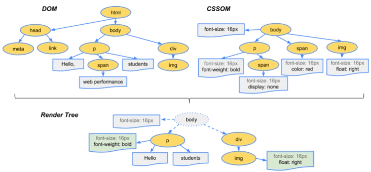
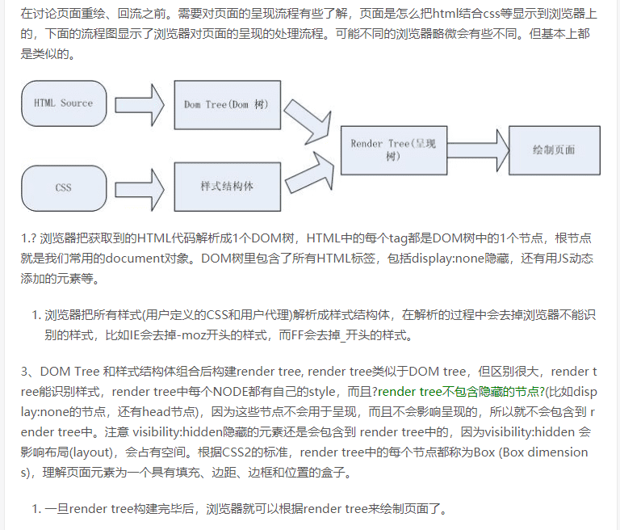

# 输入github.com 浏览器的一系列流程
简要过程:


## 步骤1. 在发起网络请求之前,涉及到浏览器静态资源的缓存
[浏览器缓存](./'http-浏览器缓存/浏览器缓存')


## 步骤2.DNS域名解析
浏览器首先要做的事情就是获得 github.com 的IP地址，具体的做法就是发送一个UDP的包给DNS服务器，DNS服务器会返回 github.com 的IP, 这时候浏览器通常会把IP地址给缓存起来，这样下次访问就会加快。
```
chrome://net-internals/#dns
可以看到IP地址:
43.128.224.150
```

2. 使用DNS域名解析（域名和服务器IP对应关系保存在hosts文件中），找到对应服务器IP
1. 浏览器缓存
2. 本机缓存
3. hosts 文件
4. 路由器缓存
5. ISP DNS 缓存
6. DNS 递归查询（可能存在负载均衡导致每次 IP 不一样）

## 步骤3.建立TCP连接
有了服务器的IP，浏览器就要可以发起HTTP请求了，但是HTTP Request/Response 基于传输层TCP.

想要建立“虚拟的”TCP连接，TCP邮差需要知道4个东西：
* 本机IP
* 本机端口
* 服务器IP
* 服务器端口

DNS查询后知道了本机IP,服务器IP，本机端口和服务器端口怎么获取？
本机端口操作系统可以给浏览器随机分配一个，服务器端口HTTP服务就是80，我们直接告诉TCP邮差就行。

### 步骤3-1.TCP三次握手建立连接
[三次握手解析](./TCP-IP-握手)

## 步骤3-1.发送http请求,比如get
经过三次握手以后，客户端和服务器端的TCP连接就建立后开始发送HTTP请求 (包括端口路径，请求参数和各种信息),组装一个 HTTP（GET）请求报文

## 步骤3-2.服务处理:使用Nginx这个Web服务器来举例
一个HTTP GET请求历经多个路由器的转发，到达服务器端,服务器需要着手处理了，它有三种方式来处理：
1. 可以用一个线程来处理所有请求，同一时刻只能处理一个，这种结构易于实现，但是这样会造成严重的性能问题
2. 可以为每个请求分配一个进程/线程，但是当连接太多的时候，服务器端的进程/线程会耗费大量内存资源，进程/线程的切换也会让CPU不堪重负。
3. 复用I/O的方式，很多Web服务器都采用了复用结构，例如通过epoll的方式监视所有的连接，当连接的状态发生变化（如有数据可读）， 才用一个进程/线程对那个连接进行处理，处理完以后继续监视，等待下次状态变化。 用这种方式可以用少量的进程/线程应对成千上万的连接请求。

对于HTTP GET请求，Nginx利用epoll的方式给读取了出来， Nginx接下来要判断，这是个静态的请求还是个动态的请求

* 1.静态的请求（HTML文件，JavaScript文件，CSS文件，图片等），也许自己就能搞定了（当然依赖于Nginx配置，可能转发到别的缓存服务器去），读取本机硬盘上的相关文件，直接返回

* 2.动态的请求，需要后端服务器（如Tomcat)处理以后才能返回，那就需要向Tomcat转发;
```
Nginx支持这么几种：
1.轮询：按照次序挨个向后端服务器转发

2.权重：给每个后端服务器指定一个权重，相当于向后端服务器转发的几率。

3.ip_hash： 根据ip做一个hash操作，然后找个服务器转发，这样的话同一个客户端ip总是会转发到同一个后端服务器。

3.fair：根据后端服务器的响应时间来分配请求，响应时间段的优先分配。
不管用哪种算法，某个后端服务器最终被选中，然后Nginx需要把HTTP Request转发给后端的Tomcat，并且把Tomcat输出的HttpResponse再转发给浏览器。

由此可见，Nginx在这种场景下，是一个代理人的角色。
```

## 步骤3-2.服务器处理静态请求:关于响应缓存
服务器看是否需要缓存，服务器处理完请求，发出一个响应（这部分也是重点，请查询资料了解http响应头各个字段的含义）

服务器检查`HTTP 请求头是否包含缓存验证信息`如果验证缓存新鲜，返回`304`等对应状态码

当服务器给浏览器发送JS,CSS这些文件时，会告诉浏览器这些文件什么时候过期（使用Cache-Control或者Expire），浏览器可以把文件缓存到本地，当第二次请求同样的文件时，如果不过期，直接从本地取就可以了。

如果过期了，浏览器就可以询问服务器端，文件有没有修改过？（依据是上一次服务器发送的Last-Modified和ETag），如果没有修改过（304 Not Modified），还可以使用缓存。否则的话服务器就会被最新的文件发回到浏览器。
<br />

## 步骤3-3.服务器处理动态请求
如同Web服务器一样，Tomcat也可能为每个请求分配一个线程去处理，即通常所说的BIO模式（Blocking I/O 模式）也可能使用I/O多路复用技术，仅仅使用若干线程来处理所有请求，即NIO模式。

不管用哪种方式，Http Request 都会被交给某个Servlet处理，这个Servlet又会把Http Request做转换，变成框架所使用的参数格式，然后分发给某个Controller(如果你是在用Spring)或者Action(如果你是在Struts)。接下来就是增删改查逻辑，在这个过程中很有可能和缓存、数据库等后端组件打交道，最终返回HTTP Response

Tomcat把Http Response发给了Nginx。
Nginx把Http Response 发给了浏览器。


## 步骤3-4.浏览器在与服务器建立了一个TCP连接后是否会在一个 HTTP 请求完成后断开？什么情况下会断开？
* 在 HTTP 1.0 协议中，通常在一个 HTTP 请求完成后会断开 TCP 连接。这种方式叫做短连接。
但是这样每次请求都会重新建立和断开 TCP 连接，代价过大。所以虽然标准中没有设定，某些服务器对 Connection: keep-alive 的 Header 进行了支持。

* HTTP1.1中 这个连接默认是keep-alive，也就是说不能关闭;默认情况下建立 TCP 连接不会断开，只有在请求报头中声明 Connection: close 才会在请求完成后关闭连接。

## 步骤4.浏览器接收http response
如果需要下载的外部资源太多，浏览器会创建多个TCP连接，并行地去下载。
但是同一时间对同一域名下的请求数量也不能太多，要不然服务器访问量太大，受不了。所以浏览器要限制一下， 例如Chrome在Http1.1下只能并行地下载6个资源。

1. 浏览器检查响应状态码：是否为 1XX，3XX， 4XX， 5XX，这些情况处理与 2XX 不同
2. 如果资源可缓存，进行缓存
3. 对响应进行解码（例如 gzip 压缩）
4. 根据资源类型决定如何处理（假设资源为 HTML 文档）


## 步骤5.浏览器对页面进行渲染，执行js代码开始解析资源JS,CSS,HTML，解析HTML构建渲染树和开始渲染
浏览器HTML文件，开始准备显示这个页面。HTML页面中可能引用了大量其他资源，例如js文件，CSS文件，图片等浏览器会分别去下载，从使用DNS获取IP开始，之前做过的事情还要再来一遍。

浏览器的引擎工作流程大致分为5步：


## 步骤5-1.使用HTML解析器，分析HTML元素，构建一颗DOM树
浏览器解析html代码，当解析时遇到css或js文件，就向服务器请求并下载对应的css文件和js文件

浏览器把获取到的HTML代码解析成DOM树，HTML中的每个tag都是DOM树中的1个节点，根节点就是我们常用的document对象。DOM树里包含了所有HTML标签，包括display:none隐藏的节点，还有用JS动态添加的元素等。


可以发现图中还有一个紫色的DOM三角，实际上这里是js对DOM的相关操作；
在HTML解析时，如果遇到JavaScript标签，就会停止解析HTML，而去加载和执行JavaScript代码；

### 步骤5扩展js解析如下
1. 浏览器创建 Document 对象并解析 HTML，将解析到的元素和文本节点添加到文档中，此时document.readyState为loading;

2. HTML 解析器遇到没有 async 和 defer 的 script 时，将他们添加到文档中，然后执行行内或外部脚本。这些脚本会同步执行，并且在脚本下载和执行时解析器会暂停。这样就可以用 document.write()把文本插入到输入流中。同步脚本经常简单定义函数和注册事件处理程序，他们可以遍历和操作 script 和他们之前的文档内容

3. 当解析器遇到设置了async属性的 script 时，开始下载脚本并继续解析文档。脚本会在它下载完成后尽快执行，但是解析器不会停下来等它下载。异步脚本禁止使用 document.write()，它们可以访问自己 script 和之前的文档元素

4. 当文档完成解析，document.readState 变成 interactive

5. 所有defer脚本会按照在文档出现的顺序执行，延迟脚本能访问完整文档树，禁止使用 document.write()

6. 浏览器在 Document 对象上触发 DOMContentLoaded 事件

7. 此时文档完全解析完成，浏览器可能还在等待如图片等内容加载，等这些内容完成载入并且所有异步脚本完成载入和执行，document.readState 变为 complete,window 触发 load 事件

## 步骤5-2.使用CSS解析器，分析CSS文件和元素上的inline样式，生成页面的CSSOM 树
浏览器把所有样式(用户定义的CSS和用户代理)解析成样式结构体，在解析的过程中会去掉浏览器不能识别的样式，比如IE会去掉-moz开头的样式，而FF会去掉_开头的样式。

## 步骤5-3.CSSOM 与 DOM 一起构建渲染树(Render Tree)，浏览器依次使用渲染树来布局和绘制网页。

将上面的DOM树和CSSOM tree一起构建构建Render树。这一过程又称为Attachment。每个DOM节点都有attach方法，接收样式信息，返回一个render对象(又名renderer)。这些render对象最终会被构建成一颗Render树。

让我们来具体了解下每一步具体做了什么,为了构建渲染树，浏览器主要完成了以下工作：
1. 从DOM树的根节点开始遍历每个可见节点。
```
render tree中每个NODE都有自己的style，render tree不包含隐藏的节点(比如display:none的节点，还有head节点)，因为这些节点不会用于呈现，而且不会影响呈现的，所以就不会包含到 render tree中。

第一步中，既然说到了要遍历可见的节点，那么我们得先知道，什么节点是不可见的。不可见的节点包括：
1.一些不会渲染输出的节点，比如script、meta、link等。
2.一些通过css进行隐藏的节点。比如display:none。注意，利用visibility和opacity隐藏的节点，还是会显示在渲染树上的。因为visibility:hidden 会影响布局(layout)，会占有空间。

总结:
只有display:none的节点才不会显示在渲染树上。
```
2. 对于每个可见的节点，找到CSSOM树中对应的规则，并应用它们。
3. 根据每个可见节点以及其对应的样式，组合生成渲染树。




## 步骤6.有了Render树后，浏览器开始布局，会为每个Render树上的节点确定一个在显示屏上出现的精确坐标值
这里涉及回流,每个页面至少需要一次回流，就是在页面第一次加载的时候;
在回流的时候，浏览器会使渲染树中受到影响的部分失效，并重新构造这部分渲染树，完成回流后,下一步就是绘制。

## 6-1. Render树和节点显示的位置坐标也有了，最后就是调用每个节点的paint方法，让它们显示出来。
正式渲染:将像素发送给GPU，展示在页面上。（这一步其实还有很多内容，比如会在GPU将多个合成层合并为同一个层，并展示在页面中。

[reflow-repaint](./reflow-repaint)


## 7. JavaScript可能修改DOM Tree



## 最后显示页面（HTML 解析过程中会逐步显示页面）

## 释放连接四次