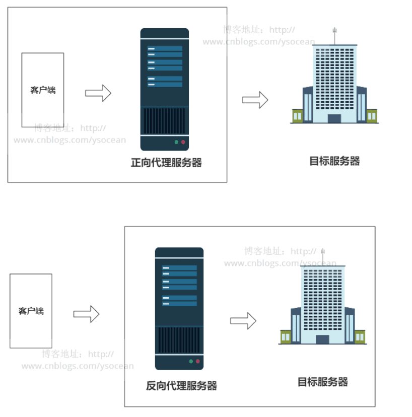

## 同源-协议、域名和端口相同
`浏览器的同源策略`，限制了来自不同源的"document"或脚本，对当前"document"读取或设置某些属性。如果没有没有同源限制，客户端可以与任意服务器通信。比如WebSocket

URL由协议、域名、端口和路径组成,只要有任何一个不同，都被当作是不同的域。

非同源：
```
(1)同一域名，不同端口
http://www.demo.com:8000/a.js
http://www.demo.com/b.js

(2)同一域名，不同协议
http://www.demo.com/a.js
https://www.demo.com/b.js

(3)域名和域名对应相同ip
http://www.demo.com/a.js
http://127.0.0.1/b.js

(4)不同域名
http://www.demo1.com/a.js
http://www.demo2.com/b.js
```

## 跨域方式总结
1. JSONP：JSONP（JSON with Padding）是一种跨域解决方案，它利用了script标签没有跨域限制的特性。通过在请求URL中传递一个回调函数名，服务器将数据包装在回调函数中返回给客户端，从而实现跨域请求。缺点是只支持GET请求。

2. CORS：CORS（Cross-Origin Resource Sharing）是一种新的跨域解决方案，它需要服务器支持。服务器通过设置响应头中的`Access-Control-Allow-Origin`字段来允许特定来源的请求访问资源，从而实现跨域请求。

3. 反向代理：服务器反向代理，将客户端请求转发到目标服务器，并将响应返回给客户端，从而实现跨域请求。需要额外的服务器资源

4. postMessage：可以使用HTML5提供的postMessage方法，在不同域之间进行消息传递，从而实现跨域通信。

## 方法1-跨域资源共享
`跨源资源共享 (CORS)`是一种基于 HTTP 头的机制，该机制通过允许服务器标示除了它自己以外的其它 origin（域，协议和端口），允许服务器声明哪些源站通过浏览器有权限访问哪些资源。

如果Origin指定的源不在允许范围之内,服务器就会返回一个正常的HTTP回应,然后浏览器发现头信息中没有包含`Access-Control-Allow-Origin`字段,然后抛出错误。
```
Access-Control-Allow-Origin 这个字段是必须的,表示接受那些域名的请求(*为所有)

Access-Control-Allow-Credentials: true
该字段可选, 表示是否可以发送cookie
```

### Node.js和Express框架配置CORS
```
npm install cors --save
```

在Express应用程序中使用cors中间件
```js
// 配置CORS选项。如果需要更精细地控制跨域访问，可以使用CORS选项进行配置。例如，以下代码将允许来自指定域的请求访问服务端资源：
const express = require('express');
const cors = require('cors');

const app = express();

const corsOptions = {
  origin: 'https://example.com'
};

app.use(cors(corsOptions));
```

## 方法2-反向代理实现跨域
原理：跨域是浏览器禁止的，服务端并不禁止跨域

Proxy（代理）:用户先将数据发给代理服务器，再由代理服务器转发给目的服务器,又分为正向代理和反向代理:
* 反向代理中，客户端不知道真正的服务器是谁，以为自己访问的就是真实的服务器。
* 正向代理中，服务器不知道真正的客户端到底是谁，以为访问自己的就是真实的客户端。


### 反向代理:反向代理是服务器架设的,反向代理确保用户不会与后端服务器直接通信
客服端无法知道的服务器地址，因为真实的服务器被代理了，客服端请求的只是代理的地址；其实是"代理服务器"代理了"目标服务器"，去和"客户端"进行交互。

客户端对代理是无感知的，因为客户端不需要任何配置就可以访问，我们只需要将请求发送到反向代理服务器,由反向代理服务器去选择目标服务器获取数据后，再返回给客户端;

此时反向代理服务器和目标服务器对外就是一个服务器，暴露的是代理服务器地址，隐藏了真实服务器IP地址。

### 跨域中反向代理
+ 1.启动一个node服务，这个服务的作用1是静态文件服务，让你可以访问到html/js等文件包括监听文件变动等，
  2.是启动一个http代理，你js发送的请求会请求到这个服务A，由服务A代理到服务B，而服务A和静态文件服务器是同源的，并不影响同源策略。
+ 2.浏览器是没有必要设置CORS的，服务器设置CORS就是为了告知浏览器允许访问我的源，不是跟我同源的，要在浏览器接受到响应后抛出错误。

举个简单的例子：
前端请求 服务器a，然后就得到了想要的数据。但其实 服务器a 中本身没有部署任何接口，它只是偷偷地从 服务器b 上取来数据，返回给前端。
这个过程只在server端发生，前端是无感知的。
https://baijiahao.baidu.com/s?id=1709750103413296714&wfr=spider&for=pc
实例：vue-cli生成的配置文件上的proxytabl
```js
dev: {
  env: require('./dev'),
  port: 9000,
  autoOpenBrowser: true,
  assetsSubDirectory: 'static',
  assetsPublicPath: '/',
  proxyTable: {
    '/api': {
    }
  }
}
```

### nginx 的反向代理
那么如何只需要输入 www.123.com 便可以跳转到 Tomcat初始界面呢？便用到 nginx的反向代理。
```nginx
server {
        listen       80;
        server_name  www.123.com;

        location / {
            proxy_pass http://127.0.0.1:8080;
            index  index.html index.htm index.jsp;
        }
}
```

### 正向代理:需要在客户端进行一些代理的设置,隐藏真实客户端地址
"代理服务器"代理了"客户端"，去和"目标服务器"进行交互。
正向代理一般是客户端架设的，比如在自己的机器上安装一个代理软件。帮助客户端访问其无法访问的服务器资源。
反向代理则是服务器的代理，帮助服务器做负载均衡，安全防护等。

正向代理作用:
1. 反向代理的作用主要是为服务器做缓存和负载均衡:
反向代理的负载均衡是指：在多个真正的服务器前架设一个代理服务器，用户所有的数据都发给代理服务器，然后代理服务器根据各个真实服务器的状态将数据转发给一个任务较少的服务器处理。

2. 隐藏服务器真实IP:
使用反向代理，可以对客户端隐藏服务器的IP地址。

3. shadowsocks 等协议
翻墙所用的代理都是正向代理。vpn常用,比如你通过vpn的服务器去访问google,此时vpn的服务器就是客户端

<br />

## 跨域实现-jsonp和img
### 使用jsonp:允许 script 加载第三方资源
它只支持GET请求而不支持POST等其它类型的HTTP请求
JSONP有两部分组成：
回调函数和数据。回调函数的名字一般是在请求中指定。而数据就是传入回调函数中的json数据。

### 方式1-在 URL 中添加参数
1. 在 URL 中添加参数是 JSONP 传递参数的最简单方式。例如，在 example.com 的页面中，可以使用以下代码向 otherdomain.com 发送带有参数的请求：
```html
<script>
function handleResponse(response) {
  console.log(response);
}

const name = 'John';
const age = 30;
const script = document.createElement('script');
script.src = `http://otherdomain.com/data?callback=handleResponse&name=${name}&age=${age}`;
document.body.appendChild(script);
</script>
```

2. 在 otherdomain.com 的服务器端，可以获取 URL 中的参数并返回相应的数据：
```js
const name = req.query.name;
const age = req.query.age;
const data = { name, age };
const jsonpResponse = `handleResponse(${JSON.stringify(data)})`;

res.send(jsonpResponse);
```
### 方式2-在回调函数中添加参数
另一种传递参数的方式是在回调函数中添加参数。在 example.com 的页面中，可以使用以下代码向 otherdomain.com 发送带有参数的请求：
```html
<script>
function handleResponse(name, age, response) {
  console.log(name, age, response);
}

const name = 'John';
const age = 30;
const script = document.createElement('script');
script.src = `http://otherdomain.com/data?callback=handleResponse.bind(null, '${name}', ${age})`;
document.body.appendChild(script);
</script>
```

在 otherdomain.com 的服务器端，可以将参数作为 JSON 对象的属性传递给回调函数：
```js
const name = req.query.name;
const age = req.query.age;
const data = { name, age };
const jsonpResponse = `handleResponse(${JSON.stringify(data)})`;

res.send(jsonpResponse);
```


### 图片跨域只能用于浏览器与服务器的单向通信-->用的比较少
```js
let img = new Image()
img.onload = img.onerror = function(){
 console.log('done')
}
img.src = 'http://www.xx.com/test?name=ruo'
/*
创建Image，然后将onload和 onerror事件处理程序指定为同一个函数。无论什么样的响应，只要请求完成，就能得到通知。
缺点：1.只能发送get 2.无法访问服务器的响应文本。
只能用于浏览器与服务器的单向通信
*/
```

## 跨域-预请求
AJAX 跨域请求可以分为两种：简单请求与非简单请求
* 简单请求：
```
请求方法为 HEAD、GET、POST 中的 1 种
请求的 header 中没有自定义的请求头
Content-Type 为以下几种：application/x-www-form-urlencoded、multipart/form-data、text/plain等
```
* 非简单请求：
```
header 中包含自定义请求头的 AJAX 请求
PUT、DELETE 形式的 AJAX 请求
Content-Type 字段的类型是 application/json 等
```

预检请求是预先检查服务器是否允许发起实际的请求，避免跨域请求对服务器的用户数据产生未预期的影响，让跨域更加的安全。
总结触发option条件：
1. 前提是发生跨域请求
2. 触发一定条件，例如post请求的Request headers 的 content-type为application/json
```
注意：
1. 必须是request header;
2.get请求设置不了content-type，因为get会把参数拼接在url上
```

此次OPTIONS请求返回了响应头的内容，但没有返回响应实体response body内容。
```
另外，规范要求，对那些可能对服务器数据产生副作用的 HTTP 请求方法,浏览器必须首先使用 OPTIONS 方法发起一个预检请求（preflight request），从而获知服务端是否允许该跨源请求。

在预检请求的返回中，服务器端也可以通知客户端，是否需要携带身份凭证（包括 Cookies 和 HTTP 认证 相关数据）。
```

### 优化options请求的3种方法：
当发起跨域请求时，简单请求只发起一次请求；复杂请求则需要2次，先发起options请求，确认目标资源是否支持跨域，浏览器会根据服务端响应的header自动处理剩余的请求，如果响应支持跨域，则继续发出正常请求；不支持的话，会在控制台显示错误。
所以，当触发预检时，跨域请求便会发送2次请求，增加请求次数，同时，也延迟了请求真正发起的时间，会影响性能。

* 对 options 请求进行缓存。
服务器端设置 Access-Control-Max-Age 字段，那么当第一次请求该 URL 时会发出 OPTIONS 请求，浏览器会根据返回的 Access-Control-Max-Age 字段缓存该请求的 OPTIONS 预检请求的响应结果（具体缓存时间还取决于浏览器的支持的默认最大值，取两者最小值，一般为 10 分钟）。在缓存有效期内，该资源的请求（URL 和 header 字段都相同的情况下）不会再触发预检。（chrome 打开控制台可以看到，当服务器响应 Access-Control-Max-Age 时只有第一次请求会有预检，后面不会了。注意要开启缓存，去掉 disable cache 勾选。）
```
Access-Control-Max-Age这个响应首部表示 preflight request （预检请求）的返回结果（即 Access-Control-Allow-Methods 和Access-Control-Allow-Headers 提供的信息） 可以被缓存的最长时间，单位是秒。(MDN)
```
* withCredentials为true时需要后端配置响应头Access-Control-Allow-Credentials为true （不会产生预请求）

前端：
```js
let xhr = new XMLHttpRequest()
    xhr.open('POST','http://127.0.0.1:8080/Public//testPost')
    xhr.withCredentials = true
    xhr.onload = function(res){
    console.log(res)
}
xhr.send()
```

当请求跨域，后端没有配置时，报错如下

则后端配置代码：
```java
public function testPost(){
  header("Access-Control-Allow-Origin: *");
  echoJsonResult(1,'',$_POST);
}
```

* 用其它的跨域方式做跨域请求，将复杂请求转为简单请求，比如JSONP等；

### 关于缓存:预检请求不一定每一次都会产生
* 这个因为浏览器会对预检请求进行缓存
同时通过服务器端设置 Access-Control-Max-Age 字段来设置缓存时间
那么当第一次请求该 URL 时会发出 OPTIONS 请求，浏览器会根据返回的 Access-Control-Max-Age 字段缓存该请求的 OPTIONS 预检请求的响应结果（具体缓存时间还取决于浏览器的支持的默认最大值，取两者最小值，一般为 10 分钟）。在缓存有效期内，该资源的请求（URL 和 header 字段都相同的情况下）不会再触发预检。（chrome 打开控制台可以看到，当服务器响应 Access-Control-Max-Age 时只有第一次请求会有预检，后面不会了。注意要开启缓存，去掉 disable cache 勾选。）
在 Firefox 中，上限是24小时 （即 86400 秒）。
在 Chromium v76 之前， 上限是 10 分钟（即 600 秒)。
从 Chromium v76 开始，上限是 2 小时（即 7200 秒)。
Chromium 同时规定了一个默认值 5 秒。
```js
// 如果值为 -1，表示禁用缓存，则每次请求前都需要使用 OPTIONS 预检请求。
es.setHeader('Access-Control-Max-Age',600) //10秒
```

### 要避免使用Option请求方式
需要注意的是，Option请求是由浏览器发起的，用于查询服务端是否支持跨域访问。在客户端无法控制服务端的情况下，无法完全避免Option请求。

1. 使用HTTP GET或POST请求替代Option请求。如果你需要跨域访问资源，可以使用JSONP或者CORS（跨域资源共享）来进行跨域请求。

2. 使用代理服务器。如果你需要访问其他域的资源，可以使用代理服务器来进行访问，代理服务器将请求转发到目标服务器，这样就不需要跨域访问了。

3. 将目标资源放到同一域名下。如果你有控制目标资源的权利，可以将目标资源放到与你的网站同一域名下，这样就不需要跨域访问了。