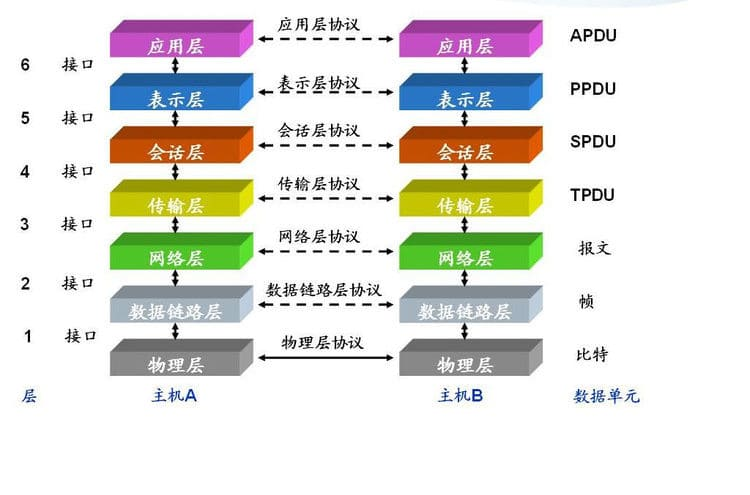

## TCP/IP协议分为4层
* Http                应用层
* tcp                 传输层,提供再抽象的、由应用管理的端口之间的数据交换。例如：TCP、UDP
* ip                  网络层,定义抽象的数据包和提供路由。例如：IP、IPv6、ICMP
* 网络特有的链路接口    数据链路层,用于网络层到基于多接入链路层网络的链路层的地址映射的非正式的“层”。例如：ARP
<!-- * 物理网络硬件        物理层 -->

### TCP/UDP 协议
传输控制协议，对应于传输层，主要解决数据在网络中的传输。

### IP协议
对应于网络层，同样解决数据在网络中的传输。

传输数据的时候只使用 TCP/IP 协议(传输层)，如果没有应用层来识别数据内容，传输后的协议都是无用的。




### osi和tcp/ip不一样，一个是理论模型一个是实际应用模型
共同点:
1. OSI参考模型和TCP/IP参考模型都采用了层次结构的概念
2. 都能够提供面向连接和无连接两种通信服务机制
不同点:
1. OSI采用的七层模型，而TCP/IP是四层结构
2. OSI模型是在协议开发前设计的，具有通用性。TCP/IP是先有协议集然后建立模型，不适用于非TCP/IP网络
3. TCP/IP参考模型的网络接口层并不是真正的一层；OSI参考模型的缺点是层次过多，划分意义不大但增加了复杂性
4. OSI参考模型虽然被看好，由于没把握好时机，技术不成熟，实现困难；相反，TCP/IP参考模型虽然有许多不尽人意的地方，但还是比较成功的

### TCP/IP 通信传输流
利用TCP/IP协议族进行网络通信时，会通过分层顺序与对方进行通信。发送端从应用层往下走，接收端则往应用层往上走。
实例：

用HTTP举例来说明，客户端：
1. 首先作为发送端的客户端在应用层 （HTTP 协议）发出一个想看某个 Web 页面的 HTTP 请求。
2. 接着，为了传输方便，在传输层（TCP 协议）把从应用层处收到的数 据（HTTP 请求报文）进行分割，
3. 并在各个报文上打上标记序号及端口号后转发给网络层
4. 在网络层（IP 协议），增加作为通信目的地的 MAC 地址后转发给链 路层。这样一来，发往网络的通信请求就准备齐全了。

服务端：
接收端的服务器在链路层接收到数据，按序往上层发送，一直到应用层。当传输到应用层，才能算真正接收到由客户端发送过来的HTTP请求。

解析：
发送端在层与层之间传输数据时，每经过一层时必定会被打上一个该层所属的首部信息。反之，接收端在层与层传输数据时，每经过一层时会把对应的首部消去。

## 应用层
在TCP/IP模型最上层的是应用层（Application layer），它包含所有高层的协议：
* 文件传输协议FTP
* 电子邮件传输协议SMTP
* 域名系统服务DNS
* 网络新闻传输协议NNTP和HTTP协议等
* HTTP 协议也处于该层

应用层决定了向用户提供应用服务时通信的活动。
应用层负责处理特定的应用程序细节。 

DNS服务是和http协议在应用层的协议，dns提供域名到ip地址之间的解析服务

用户通常通过使用主机名或域名来访问对方的计算机，而不是直接通过IP地址访问。所有需要dns协议提供通过域名查找ip地址，或逆向从ip地址查找域名服务。

## 传输层:TCP位于传输层，提供可靠的字节流服务
所谓的字节流服务：为方便传输，将大块数据分割成以报文段 为单位的数据包进行管理。

可靠的传输服务：能够把数据准确可靠传给对方。

在传输层有两个性质不同的协议：TCP（Transmission Control Protocol，传输控制协议）和 UDP（User Data Protocol，用户数据报 协议）。

主要为两台主机上的应用程序提供端到端的通信。在TCP/IP协议族中，有两个互不相同的传输协议：TCP（传输控制协议）和UDP（用户数据报协议）。

TCP为两台主机提供高可靠性的数据通信。它所做的工作包括把应用程序交给它的数据分成合适的小块交给下面的网络层，确认接收到的分组，设置发送最后确认分组的超时时钟等。由于运输层提供了高可靠性的端到端的通信，因此应用层可以忽略所有这些细节。为了提供可靠的服务，TCP采用了超时重传、发送和接收端到端的确认分组等机制。

UDP则为应用层提供一种非常简单的服务。它只是把称作数据报的分组从一台主机发送到另一台主机，但并不保证该数据报能到达另一端。一个数据报是指从发送方传输到接收方的一个信息单元（例如，发送方指定的一定字节数的信息）。UDP协议任何必需的可靠性必须由应用层来提供。

### 如何理解
1.应用数据块如何在浩瀚的互联网准确无误找到目的地？
  IP协议:在应用数据块的外层写上目的地IP地址，使得应用数据块可以找到目的地，这样就解决问题1。
2.服务器回应数据块如何在浩瀚的互联网准确无误地返回？
  IP协议还会在应用数据块的外层写上源IP地址，使得服务器回应数据块返回源主机，这样就解决问题2。
3.应用数据块在到达目的地之前丢失了，如何处理？
4.服务器回应数据块旅途中丢失了，如何处理？

IP协议解决1和2问题点基于
* 底层物理网络的连通性是IP能否正常工作的前提
* IP路由表在全球路由器里完成了同步

**即使有了这两个前提条件，也不能100%保证IP报文能够到达目的地！**<br/>

信号传输过程失真造成丢包、网络发生拥堵而丢包

我们还需要一个协议，这个协议需要有以下特质：
1.当丢包发生时，能够自动修复丢包，而无需人的手动干预
2.能够智能感知网络的拥堵情况，网络空闲时，尽最大速率发包；网络拥堵时，降低速率发包，不给互联网添堵

TCP协议也不是什么大神，不过是一个任劳任怨的流量调度员。说到底它就有一个本事：
**确认机制！**

凭着这个看家本领，TCP可以保证应用数据的可靠传输。
TCP会对发出的数据包（以下简称包裹）进行编号，如同快递的快递单号一样。对方TCP收到包裹，会回复一个确认消息，确认收到了该编号的包裹了

有同学会说，确认机制可以理解，TCP发数据就发数据，但为何TCP发数据之前需要连接？

在互联网上可以找到各种各样的解释，而我的观点是：

双方通过TCP连接，分享彼此的应用数据块第一个字节的原点序号。

如果TCP没有提前分享，接收方不知道接收的数据是否是第一个包。

如果不是第一个包，接收方的TCP却将该数据包提交给应用程序，应用程序压根无法理解。


应用程序以为是第一个包，其实并不是，应用程序的小翻译（HTTP/FTP/SMTP）瞬间懵逼，风雨中瑟瑟发抖。。。

为何无法理解?
分享了原点序列号，即使第二个、第三个数据包先到达目的地，而第一个数据包姗姗来迟的情况，接收方的TCP可以耐心等待第一个数据包的到来，然后按序将数据包提交给应用程序。这样应用程序的小翻译就会秒懂。。。

有了TCP协议的帮助，即使老王的网线拔掉了一段时间，稍后再插入，恢复了网络连通性，老王中断的文件下载任务可以继续工作，而无需老王重新下载。


## 网络层:负责传输的IP协议
网络层用来处理在网络上流动的数据包。数据包是网络传输的最小数据单位。该层规定了通过怎样的路径（所谓的传输路线）到达对方计 算机，并把数据包传送给对方。

与对方计算机之间通过多台计算机或网络设备进行传输时，网络层所 起的作用就是在众多的选项内选择一条传输路线。

也称作互联网层（在第一个图中为网际层），处理分组在网络中的活动，例如分组的选路。在TCP/IP协议族中，网络层协议包括IP协议（网际协议），ICMP协议（Internet互联网控制报文协议），以及IGMP协议（Internet组管理协议）

IP是一种网络层协议，提供的是一种不可靠的服务，它只是尽可能快地把分组从源结点送到目的结点，但是并不提供任何可靠性保证。同时被TCP和UDP使用。TCP和UDP的每组数据都通过端系统和每个中间路由器中的IP层在互联网中进行传输。

ICMP是IP协议的附属协议。IP层用它来与其他主机或路由器交换错误报文和其他重要信息。

IGMP是Internet组管理协议。它用来把一个UDP数据报多播到多个主机。

按层次分，IP（Internet Protocol）网际协议位于网络层。Internet Protocol 这个名称可能听起来有点夸张，但事实正是如此，因为几乎 所有使用网络的系统都会用到 IP 协议。TCP/IP 协议族中的 IP 指的就 是网际协议，协议名称中占据了一半位置，其重要性可见一斑。可能 有人会把“IP”和“IP 地址”搞混，“IP”其实是一种协议的名称。

IP 协议的作用是把各种数据包传送给对方。而要保证确实传送到对方 那里，则需要满足各类条件。其中两个重要的条件是 IP 地址和 MAC 地址。
IP 地址指明了节点被分配到的地址，MAC 地址是指网卡所属的固定 地址。IP 地址可以和 MAC 地址进行配对。IP 地址可变换，但 MAC 地址基本上不会更改。
##使用 ARP 协议凭借 MAC 地址进行通信。

IP 间的通信依赖 MAC 地址。在网络上，通信的双方在同一局域网 （LAN）内的情况是很少的，通常是经过多台计算机和网络设备中转 才能连接到对方。而在进行中转时，会利用下一站中转设备的 MAC 地址来搜索下一个中转目标。这时，会采用 ARP 协议（Address Resolution Protocol）。ARP 是一种用以解析地址的协议，根据通信方 的 IP 地址就可以反查出对应的 MAC 地址。

## 数据链路层
物理层的作用就是定义怎么用物理信号来表示数据。
将数据最终编码为用0、1标识的比特流，然后传输。

比如为什么网线是8根小线组成的而不是6根，wifi的电磁波频率为什么是2.4G和5G而不是别的，这些都是ieee（电气和电子工程师协会）规定的标准

最后一层了，经过上述拆件、打完各层标签后的6个数据帧，物理层将他们翻译文6段0、1表示的比特流，然后通过光纤、铜缆进行传输。

用来处理连接网络的硬件部分。包括控制操作系统、硬件的设备驱 动、NIC（Network Interface Card，网络适配器，即网卡），及光纤等 物理可见部分（还包括连接器等一切传输媒介）。硬件上的范畴均在 链路层的作用范围之内

也称作数据链路层或网络接口层（在第一个图中为网络接口层和硬件层），通常包括操作系统中的设备驱动程序和计算机中对应的网络接口卡。它们一起处理与电缆（或其他任何传输媒介）的物理接口细节。ARP（地址解析协议）和RARP（逆地址解析协议）是某些网络接口（如以太网和令牌环网）使用的特殊协议，用来转换IP层和网络接口层使用的地址。

## 一个HTTP请求的分层解析流程
通过一个 HTTP 请求看一下不同层次之间是如何工作的：


我们的服务器上部署了一个静态页面(图片又上角黄色的部分)，通过 Nginx 部署在我们的公网上面，现在我们通过浏览器来进行访问，在浏览器中输入域名，点下回车之后它们是如何工作的呢？
### 第一步，获取域名：
浏览器先会去解析域名，因为在客户端 C 与服务端 S 进行数据交互的时候，它是不认域名的，认的是 ip 地址，所以浏览器先会解析域名，然后去看下浏览器中有没有域名对应的 DNS 的相关信息的缓存，有的话我们就能从中拿到服务端 S 的 ip 地址，没有的话，会去本地的 host 文件里看有没有配置，没有配置的话，会发起一个 DNS 的请求，获取服务器的 ip 地址(DNS 也是一台服务器，也有自己的 ip 地址，通常是配置在操作系统上的)。

### 获取服务器 IP 地址过程：
应用层------>传输层

这时应用层会构造一个 DNS 请求报文，然后应用层会调用传输层的一个接口，因为 DNS 使用 UDP 来进行数据的传输，所以应用层会调用传输层的 UDP 相关的一个协议，实现数据的传输。

说白了就是应用层会调用传输层的 API,传输层会在 DNS 请求报文的基础上加一个 UDP 的请求头。

  传输层---->网络层---->数据链路层
然后传输层会把数据交给网络层，网络层同样的会在 UDP 的请求报文的基础上再加一个 IP 的请求头，网络层再把 IP 请求报文交给数据链路层，

  数据链路层----->然后通过物理层传出去，通常传到路由器上面
数据链路层会实现一个二层的寻址，这时它会把自己的 make 头加上去，并且会把对应的请求报文应该要去交给下一个机器的 make 地址也加上去(会通过网络层的 ARP 协议去找到，ARP 会发送 ARP 的请求去看下 IP 地址对应的 make 地址是多少，拿到之后会交给数据链路层)，然后通过物理层传出去，通常传到路由器上面。
<font color='red'>路由器返回域名对应的IP地址(拿到后层层往上传到应用层)</font>

路由器是一个三层的设备，最开始会通过物理层来进行连接，之后物理层把数据交给数据链路层，链路层会看下 make 地址是不是给我的，是给我的就解析，不是就丢弃，解析完后，数据报文在往上面去传输到网络层，网络层会去看下这个数据应该传到下一个路由器的地址是多少，这个时候它会通过运营商的网络接口传到运营商的路由器上面，

运营商这边就比较复杂，运营商会有自己的 DNS 服务器，如果电脑配置的是运营商的 DNS 的话，会直接去运营商的 DNS 服务器上去找对应的域名，
这个时候就会拿到对应的 ip 地址，然后开始一个层层的原路返回，直到应用层拿到了返回的报文，也就是拿到了域名对应的 IP 地址。

### 这时应用层就会进行 HTTP 请求报文的发送，这时 HTTP 会干什么呢？
应用层------>传输层

同样的它会去调用传输层的协议,因为 HTTP 是基于 TCP 协议来实现的，所以在调用传输协议的时候，传的是 TCP 的一些参数，

传输层---->网络层---->数据链路层--->然后通过物理层传出去，通常传到路由器进行传输

TCP 会调网络层的 IP 协议，IP 协议会加 IP 头，然后数据链路层会加上 make 头，和刚才 UDP 协议是一样的，会通过物理层和路由器进行数据的传输，

这一次携带的是 IP 地址，所以不用访问运营商的 DNS 服务器，而是运营商根据 IP 地址把数据报文传输给目标服务器的运营商，运营商之前有专线进行连接，所以数据到达了服务器的网络环境下，仍然逐层解析，物理层发往数据链路层，链路层判断数据是不是给自己的，是的话就进行解析，链路层发往网络层，判断网络的 IP 地址是不是自己，是的话进行解析，发往传输层，解析 TCP 的端口比如 80，传输层会把请求报文交给应用层应用程序，如果部署的是 Nginx 服务器的话，默认去找 80 端口对应的应用程序，应用层解析报文，构造一个 HTTP 的响应报文，逐层返回到客户端 C。


## 三次握手
使用TCP协议建立连接需要经过三次握手
```
A--SYN请求-->B

A<--确认--B
A<--请求--B   合并

A--确认-->B
```


详解：刚开始客户端处于 Closed 的状态，服务端处于 Listen 状态。 进行三次握手： 
* 第一次握手：客户端给服务端发一个 SYN 报文，并指明客户端的初始化序列号 ISN(c)。此时客户端处于 `SYN_SEND` 状态。
首部的同步位SYN=1，初始序号seq=x，SYN=1的报文段不能携带数据，但要消耗掉一个序号。 

* 第二次握手：服务器收到客户端的 SYN 报文之后，会以自己的 SYN 报文作为应答，并且也是指定了自己的初始化序列号 ISN(s)。同时会把客户端的 ISN + 1 作为ACK 的值，表示自己已经收到了客户端的 SYN，此时服务器处于 `SYN_REVD` 的状态。
在确认报文段中SYN=1，ACK=1，确认号ack=x+1，初始序号seq=y。 

* 第三次握手：客户端收到 SYN 报文之后，会发送一个 ACK 报文，当然，也是一样把服务器的 ISN + 1 作为 ACK 的值，表示已经收到了服务端的 SYN 报文，此时客户端处于 `ESTABLISHED` 状态。服务器收到 ACK 报文之后，也处于 `ESTABLISHED` 状态，此时，双方已建立起了连接。
确认报文段ACK=1，确认号ack=y+1，序号seq=x+1（初始为seq=x，第二个报文段所以要+1），ACK报文段可以携带数据，不携带数据则不消耗序号。
发送第一个SYN的一端将执行主动打开（active open），接收这个SYN并发回下一个SYN的另一端执行被动打开（passive open）。

## 为什么三次握手
我们将原有的问题转换成了:为什么需要通过三次握手才可以初始化 Sockets、窗口大小和初始序列号？
* 1.通过三次握手才能阻止重复历史连接的初始化；
* 2.通过三次握手才能对通信双方的初始序列号进行初始化；
* 3.讨论其他次数握手建立连接的可能性；

### 第一个原因详细解析:通过三次握手才能阻止重复历史连接的初始化
第一个是 TCP 选择使用三次握手的最主要原因，其他的几个原因相比之下都是次要的原因。
RFC 793 - Transmission Control Protocol 其实就指出了 TCP 连接使用三次握手的首要原因:

> 为了阻止历史的重复连接初始化造成的混乱问题，防止使用 TCP 协议通信的双方建立了错误的连接。

`连接的定义，我们才能去尝试回答为什么 TCP 建立连接需要三次握手`
RFC 793 - Transmission Control Protocol 文档中非常清楚地定义了 TCP 中的连接是什么，我们简单总结一下：用于保证可靠性和流控制机制的信息，包括 Socket、序列号以及窗口大小叫做连接。

建立 TCP 连接就是通信的双方需要对上述的三种信息达成共识，连接中的一对 Socket 是由互联网地址标志符和端口组成的，窗口大小主要用来做流控制，最后的`序列号是用来追踪通信发起方发送的数据包序号，接收方可以通过序列号向发送方确认某个数据包的成功接收。 TCP 选择使用三次握手来建立连接并在连接引入了 RST 这一控制消息，接收方当收到请求时会将发送方发来的 SEQ+1 发送给对方，这时由发送方来判断当前连接是否是历史连接：`
- 如果当前连接是历史连接，即 SEQ 过期或者超时，<font color='red'>那么发送方就会直接发送 RST 控制消息中止这一次连接；</font>
- 如果当前连接不是历史连接，那么发送方就会发送 ACK 控制消息，通信双方就会成功建立连接；

使用三次握手和 RST 控制消息将是否建立连接的最终控制权交给了发送方，因为只有发送方有足够的上下文来判断当前连接是否是错误的或者过期的，这也是 TCP 使用三次握手建立连接的最主要原因。

### 扩展：如果采用两次
```
假如两次握手：
A--请求-->B

A<--确认--B
A<--请求--B    合并
```

采用两次那么发送方一旦发出建立连接的请求之后它就没有办法撤回这一次请求,造成服务端资源一直在等待；

如果在网络状况复杂或者较差的网络中，发送方连续发送多次建立连接的请求，如果TCP建立连接只能通信两次，那么接收方只能选择接受或者拒绝发送方发起的请求，它并不清楚这一次请求是不是由于网络拥堵而早早过期的连接。此时假设的是不采用三次握手，只要服务端发出确认，就建立新的连接了，此时客户端忽略服务端发来的确认，也不发送数据，则导致服务端一致等待客户端发送数据，浪费资源。

两次握手没有办法建立 TCP 连接，使用三次握手是建立连接所需要的最小次数。
目的：为了防止失效的连接请求报文段突然又传送到主机B，因而产生错误。

### 第二个原因详细解析:通过三次握手才能对通信双方的初始序列号进行初始化；
三次握手能够帮助通信双方获取初始化序列号，它们能够保证数据包传输的不重不丢，还能保证它们的传输顺序，不会因为网络传输的问题发生混乱。

原因就是通信双方都需要获得一个用于发送信息的初始化序列号，作为一个可靠的传输层协议，TCP 需要在不稳定的网络环境中构建一个可靠的传输层，网络的不确定性可能会导致数据包的缺失和顺序颠倒等问题，常见的问题可能包括：
- 数据包被发送方多次发送造成数据的重复；
- 数据包在传输的过程中被路由或者其他节点丢失；
- 数据包到达接收方可能无法按照发送顺序；

为了解决上述这些可能存在的问题，TCP 协议要求发送方在数据包中加入『序列号』字段，有了数据包对应的序列号，我们就可以：
- 接收方可以通过序列号对重复的数据包进行去重；
- 发送方会在对应数据包未被 ACK 时进行重复发送；
- 接收方可以根据数据包的序列号对它们进行重新排序；

```
序列号在 TCP 连接中有着非常重要的作用，初始序列号作为 TCP 连接的一部分也需要在三次握手期间进行初始化，由于 TCP 连接通信的双方都需要获得初始序列号，所以它们其实需要向对方发送 SYN 控制消息并携带自己期望的初始化序列号 SEQ，对方在收到 SYN 消息之后会通过 ACK 控制消息以及 SEQ+1 来进行确认。
```

### 扩展：SYN攻击是什么？三次握手过程中可以携带数据吗？
`服务器端的资源分配是在二次握手时分配的，而客户端的资源是在完成三次握手时分配的`，所以服务器容易受到SYN洪泛攻击。SYN攻击就是Client在短时间内伪造大量不存在的IP地址，并向Server不断地发送SYN包，Server则回复确认包，并等待Client确认，由于源地址不存在，因此Server需要不断重发直至超时，这些伪造的SYN包将长时间占用未连接队列，导致正常的SYN请求因为队列满而被丢弃，从而引起网络拥塞甚至系统瘫痪。SYN 攻击是一种典型的 DoS/DDoS 攻击。

检测 SYN 攻击非常的方便，当你在服务器上看到大量的半连接状态时，特别是源IP地址是随机的，基本上可以断定这是一次SYN攻击。在 Linux/Unix 上可以使用系统自带的 netstats 命令来检测 SYN 攻击。

其实第三次握手的时候，是可以携带数据的。但是，第一次、第二次握手不可以携带数据
为什么这样呢?大家可以想一个问题，假如第一次握手可以携带数据的话，如果有人要恶意攻击服务器，那他每次都在第一次握手中的 SYN 报文中放入大量的数据。因为攻击者根本就不理服务器的接收、发送能力是否正常，然后疯狂着重复发 SYN 报文的话，这会让服务器花费很多时间、内存空间来接收这些报文。

也就是说，第一次握手不可以放数据，其中一个简单的原因就是会让服务器更加容易受到攻击了。而对于第三次的话，此时客户端已经处于 ESTABLISHED 状态。对于客户端来说，他已经建立起连接了，并且也已经知道服务器的接收、发送能力是正常的了，所以能携带数据也没问题。

# 四次挥手
建立一个连接需要三次握手，而终止一个连接要经过四次挥手（也有将四次挥手叫做四次握手的）。这由TCP的`半关闭`（half-close）造成的。所谓的半关闭，其实就是TCP提供了连接的一端在结束它的发送后还能接收来自另一端数据的能力。

TCP 的连接的拆除需要发送四个包，因此称为四次挥手(Four-way handshake)，客户端或服务器均可主动发起挥手动作。

刚开始双方都处于 ESTABLISHED 状态，假如是客户端先发起关闭请求。四次挥手的过程如下：

- 第一次挥手：客户端发送一个 FIN 报文，报文中会指定一个序列号。此时客户端处于 `FIN_WAIT1` 状态。 即发出`连接释放报文段`（FIN=1，序号seq=u），并停止再发送数据，主动关闭TCP连接，进入FIN_WAIT1（终止等待1）状态，等待服务端的确认。
- 第二次挥手：服务端收到 FIN 之后，会发送 ACK 报文，且把客户端的序列号值 +1 作为 ACK 报文的序列号值，表明已经收到客户端的报文了，此时服务端处于 `CLOSE_WAIT` 状态。 即服务端收到连接释放报文段后即发出`确认报文段`（ACK=1，确认号ack=u+1，序号seq=v），服务端进入CLOSE_WAIT（关闭等待）状态，此时的TCP处于半关闭状态，客户端到服务端的连接释放。客户端收到服务端的确认后，进入FIN_WAIT2（终止等待2）状态，等待服务端发出的连接释放报文段。
- 第三次挥手：如果服务端也想断开连接了，和客户端的第一次挥手一样，发给 FIN 报文，且指定一个序列号。此时服务端处于 `LAST_ACK` 的状态。 即服务端没有要向客户端发出的数据，服务端发出`连接释放报文段`（FIN=1，ACK=1，序号seq=w，确认号ack=u+1），服务端进入LAST_ACK（最后确认）状态，等待客户端的确认。
- 第四次挥手：客户端收到 FIN 之后，一样发送一个 ACK 报文作为应答，且把服务端的序列号值 +1 作为自己 ACK 报文的序列号值，此时客户端处于 `TIME_WAIT` 状态。需要过一阵子以确保服务端收到自己的 ACK 报文之后才会进入 CLOSED 状态，服务端收到 ACK 报文之后，就处于关闭连接了，处于 `CLOSED` 状态。 即客户端收到服务端的连接释放报文段后，对此发出`确认报文段`（ACK=1，seq=u+1，ack=w+1），客户端进入TIME_WAIT（时间等待）状态。此时TCP未释放掉，需要经过时间等待计时器设置的时间2MSL后，客户端才进入CLOSED状态。

收到一个FIN只意味着在这一方向上没有数据流动。客户端执行主动关闭并进入TIME_WAIT是正常的，服务端通常执行被动关闭，不会进入TIME_WAIT状态。

在socket编程中，任何一方执行close()操作即可产生挥手操作。


### 挥手为什么需要四次？
tcp是全双工通信，服务端和客服端都能发送和接收数据。
```
tcp在断开连接时，需要服务端和客服端都确定对方将不再发送数据。

第1次挥手
由客户端向服务端发起，服务端收到信息后就能确定客户端已经停止发送数据。

第2次挥手
由服务端向客户端发起，客户端收到消息后就能确定服务端已经知道客户端不会再发送数据。

第3次握手
由服务端向客户端发起，客户端收到消息后就能确定服务端已经停止发送数据。

第4次挥手
由客户端向服务端发起，服务端收到信息后就能确定客户端已经知道服务端不会再发送数据。
```

为什么不是3次挥手
```
在客服端第1次挥手时，服务端可能还在发送数据。

所以第2次挥手和第3次挥手不能合并。
```

A:我没有数据发给你了，你如果还有数据发给我，就继续发吧
B：我知道了，我发完了告诉你
B：我也发完了，你可以关了 
A：我知道了，我断开了，可以确认断开了

关闭 TCP 连接或者保留重用，关闭 TCP 连接的四次握手:
```
1. 主动方发送`Fin=1， Ack=Z， Seq= X`报文
2. 被动方发送`ACK=X+1， Seq=Z`报文
3. 被动方发送`Fin=1， ACK=X， Seq=Y`报文
4. 主动方发送`ACK=Y， Seq=X`报文
```
因为当服务端收到客户端的SYN连接请求报文后，可以直接发送SYN+ACK报文。其中ACK报文是用来应答的，SYN报文是用来同步的。但是关闭连接时，当服务端收到FIN报文时，很可能并不会立即关闭SOCKET，所以只能先回复一个ACK报文，告诉客户端，"你发的FIN报文我收到了"。只有等到我服务端所有的报文都发送完了，我才能发送FIN报文，因此不能一起发送。故需要四次挥手。