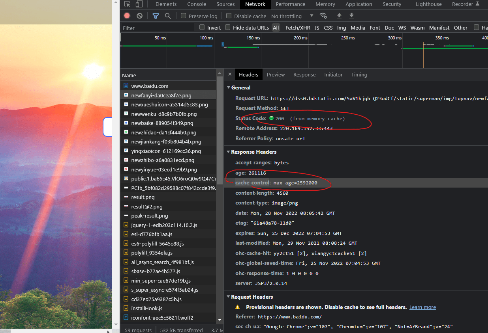
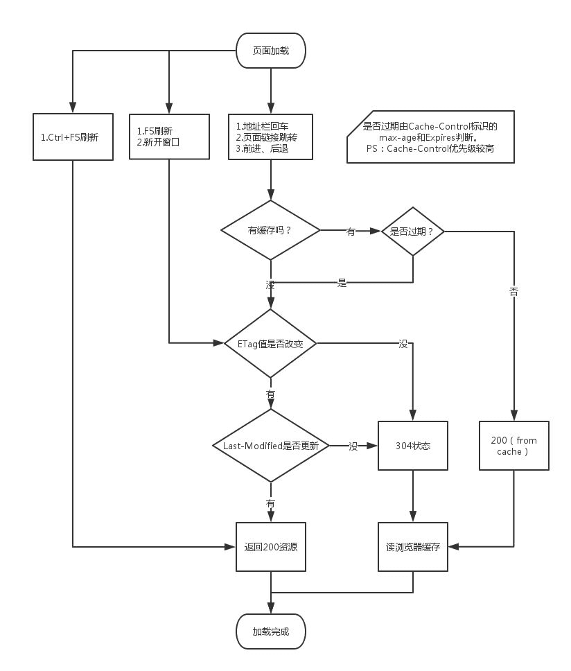

## 强缓存
### Expires和Cache-Control两者对比
Expires 是http1.0的产物(Expires其实是过时的产物，现阶段它的存在只是一种兼容性的写法,在某些不支持HTTP1.1的环境下，Expires就会发挥用处)
```
Expires 受限于本地时间，如果修改了本地时间，可能会造成缓存失效。Expires: Wed, 22 Oct 2018 08:41:00 GMT表示资源会在 Wed, 22 Oct 2018 08:41:00 GMT 后过期，需要再次请求;

绝对过期时间 设置一个绝对过期时间Date字符串, 优先级比Cache-Control低, 同时设置Expires和Cache-Control则后者生效. 这种方式有一个明显的缺点，由于失效时间是一个绝对时间，所以当客户端本地时间被修改以后，服务器与客户端时间偏差变大以后，就会导致缓存混乱。

Expires:缓存过期时间，用来指定资源到期的时间，是服务器端的具体的时间点;
Expires=max-age + 请求时间，需要和Last-modified结合使用。Expires是Web服务器响应消息头字段，在响应http请求时告诉浏览器在过期时间前浏览器可以直接从浏览器缓存取数据，而无需再次请求。
```

`Cache-Control优先级高于Expires`,是http1.1的产物,Cache-Control 可以在请求头或者响应头中设置，并且可以组合使用多种指令;缓存指令是单向的，这意味着在请求中设置的指令，不一定被包含在响应中。
https://developer.mozilla.org/zh-CN/docs/Web/HTTP/Headers/Cache-Control
* Cache-Control
   - 以下属性可缓存性
   - public: 可以被任何缓存区缓存, 如: 浏览器、服务器、代理服务器等
   - no-cache: 数据内容不能被缓存, 每次请求都重新访问服务器,若有max-age, 则缓存期间不访问服务器.在发布缓存副本之前，强制要求缓存把请求提交给原始服务器进行验证 (协商缓存验证)
   - no-store: 缓存不应存储有关客户端请求或服务器响应的任何内容，即不使用任何缓存。
   - private(默认): 只能在浏览器中缓存, 不能作为共享缓存（即代理服务器不能缓存它）,只有在第一次请求的时候才访问服务器, 若有max-age, 则缓存期间不访问服务器
   - 以下是到期属性
   - `max-age=<seconds>`设置缓存存储的最大周期，超过这个时间缓存被认为过期 (单位秒)。与Expires相反，时间是相对于请求的时间。
```
比如当Cache-Control:max-age=300时，则代表在这个请求正确返回时间（浏览器也会记录下来）的5分钟内再次加载资源，就会命中强缓存。

将多个指令配合起来一起使用，达到多个目的。比如说我们希望资源能被缓存下来，并且是客户端和代理服务器都能缓存，还能设置缓存失效时间等等:
res header:
cache-control: max-age=0, private, must-revalidate
```


## 协商缓存:需要向服务器重新发起HTTP请求
强缓存判断是否缓存的依据来自于是否超出某个时间或者某个时间段，而不关心服务器端文件是否已经更新，这可能会导致加载文件不是服务器端最新的内容，那我们如何获知服务器端内容是否已经发生了更新呢？此时我们需要用到协商缓存策略。

`注意:`协商缓存发生在在第二次以上的请求，浏览器不同tab打开页面也是第二次；第一次访问不会请求不会发生协商请求

若强制缓存(Expires和Cache-Control)生效则直接使用缓存，若不生效则进行协商缓存

* 方法1:响应头Etag/请求头If-None-Match
* 方法2:响应头Last-Modified/请求头If-Modified-Since

### 协商缓存实现方法1：响应头etag/请求头if-none-match
响应头Last-Modified/请求头If-Modified-Since,根据文件修改时间来决定是否缓存尚有不足，能否可以直接根据文件内容是否修改来决定缓存策略？所以在 HTTP / 1.1 出现了 ETag 和If-None-Match

ETag实现和Last-Modified实现对比
* 首先在精确度上，Etag要优于Last-Modified。
* 在优先级上，服务器校验优先考虑Etag
* 性能上，Etag要逊于Last-Modified，毕竟Last-Modified只需要记录时间，而Etag需要服务器通过算法来计算出一个hash值。

Etag是服务器响应请求时，返回当前资源文件的一个唯一标识(由服务器生成)，只要资源有变化，Etag就会重新生成。

浏览器在下一次加载资源向服务器发送请求时，会将上一次返回的Etag值放到request header里的If-None-Match里，服务器只需要比较客户端传来的If-None-Match跟自己服务器上该资源的ETag是否一致，就能很好地判断资源相对客户端而言是否被修改过了。

如果服务器发现ETag匹配不上，那么直接以常规GET 200回包形式将新的资源（当然也包括了新的ETag）发给客户端；如果ETag是一致的，则直接返回304知会客户端直接使用本地缓存即可。

Etag ETag将返回给浏览器一个资源ID(字符串), 如果有了新版本则正常发送并附上新ID, 否则返回304. ETag是为了解决Last-Modified只能精确到秒的问题，可以精确到毫秒。但是在服务器集群情况下, 必须保证每个分布式服务器返回相同的ETag.

例子：https://github.com/huiruo?tab=repositories
```
response header:
etag: W/"8ae3cb9da6a714e57ef2ed500e105dd9"

request header:
if-none-match: W/"8ae3cb9da6a714e57ef2ed500e105dd9"
```


### 协商缓存实现方法2：响应头Last-Modified/请求头If-Modified-Since
步骤1：浏览器下一次请求这个资源，浏览器检测到有 Last-Modified这个header，于是添加If-Modified-Since这个header，值=Last-Modified；

步骤2：服务器再次收到这个资源请求，会根据 If-Modified-Since 中的值与服务器中这个资源的最后修改时间对比，如果没有变化，返回304和空的响应体，直接从缓存读取，如果If-Modified-Since的时间小于服务器中这个资源的最后修改时间，说明文件有更新，于是返回新的资源文件和200。

Last-Modified: 该资源的最后修改时间, 在浏览器下一次请求资源时, 浏览器将先发送一个请求到服务器上, 并附上If-odified-Since头来说明浏览器所缓存资源的最后修改时间, 如果服务器发现没有修改, 则直接返回304(Not Modified)回应信息给浏览器(内容很少), 如果服务器对比时间发现修改了, 则照常返回所请求的资源.

例子 https://www.baidu.com/
```
response header:
Last-Modified: Wed, 16 Nov 2022 12:11:52 GMT

request header:
If-Modified-Since: Wed, 16 Nov 2022 12:11:52 GMT
```



```
看到这里，不知道你是否存在这样一个疑问:如果什么缓存策略都没设置，那么浏览器会怎么处理？

对于这种情况，浏览器会采用一个启发式的算法，通常会取响应头中的 Date 减去 Last-Modified 值的 10% 作为缓存时间。
```

## 浏览器缓存优先级：
1. 首次请求,客户端请求一个资源,服务端返回资源，服务端在response header中加上字段`cache-control/expires`，`Last-Modified/ETag`

2. 客户端展现该页面，浏览器将页面连同header中的字段存客户端

3. 再次请求,先去内存看，如果有，直接加载;如果内存没有，择取硬盘获取，如果有直接加载,这两个都是强缓存。浏览器会根据当前运行环境内存来决定是从 Memory Cache 还是 从Disk Cache中拿所以缓存资源不过期的时候，如果资源在内存那么就from memory，如果只有在磁盘上就from disk。

4. 如果是刷新页面或则第二次打开页面，浏览器请求有`if-none-match/If-Modified-Since请求头`,
对应服务端资源设置了协商缓存`ETag/Last-Modified响应头`，开始请求服务端进行协商,内容没有更新返回304，直接使用本地资源加载渲染,如果有更新返回更新资源并返回200
5. 加载到的资源缓存到硬盘和内存

### 用户行为对浏览器缓存的影响
主要有 3 种：
- 打开网页，地址栏输入地址： 查找 disk cache 中是否有匹配。如有则使用；如没有则发送网络请求
- 普通刷新 (F5)：因为 TAB 并没有关闭，因此 memory cache 是可用的，会被优先使用(如果匹配的话)。其次才是 disk cache。
- 强制刷新 (Ctrl + F5)：浏览器不使用缓存，因此发送的请求头部均带有 Cache-control: no-cache(为了兼容，还带了 Pragma: no-cache),服务器直接返回 200 和最新内容。

可见不会影响协商缓存

## 缓存的分类: 四种缓存都没有命中的话，只能发起请求来获取资源
1. 强缓存1：内存缓存memory cache<br/>
Memory Cache 也就是内存中的缓存，主要包含的是当前中页面中已经抓取到的资源,例如页面上已经下载的样式、脚本、图片等。读取内存中的数据肯定比磁盘快,但是关闭消失。
2. 强缓存2：硬盘缓存disk cache<br/>Disk Cache 也就是存储在硬盘中的缓存，读取速度慢点，但是什么都能存储到磁盘中，比之 Memory Cache 胜在容量和存储时效性上。
<br/>Disk Cache 覆盖面基本是最大的。它会根据 HTTP Herder 中的字段判断哪些资源需要缓存，哪些资源可以不请求直接使用，哪些资源已经过期需要重新请求。并且即使在跨站点的情况下，相同地址的资源一旦被硬盘缓存下来，就不会再次去请求数据。绝大部分的缓存都来自 Disk Cache，关于 HTTP 的协议头中的缓存字段。

3. Service Worker
Service Worker 是运行在浏览器背后的独立线程，一般可以用来实现缓存功能。使用 Service Worker的话，传输协议必须为 HTTPS。因为 Service Worker 中涉及到请求拦截，所以必须使用 HTTPS 协议来保障安全。

4. Push Cache
Push Cache（推送缓存）是 HTTP/2 中的内容，当以上三种缓存都没有命中时，它才会被使用。它只在会话（Session）中存在，一旦会话结束就被释放，并且缓存时间也很短暂，在Chrome浏览器中只有5分钟左右，同时它也并非严格执行HTTP头中的缓存指令。
```
1.可以推送 no-cache 和 no-store 的资源
2.一旦连接被关闭，Push Cache 就被释放
3.Push Cache 中的缓存只能被使用一次
4.浏览器可以拒绝接受已经存在的资源推送
```

## 通常浏览器缓存策略分为两种：强缓存和协商缓存
那么为了性能上的考虑，大部分的资源都应该选择好缓存策略，缓存存在于http的get请求中，浏览器可以根据request和response的header中字段的值、客户端时间等，判断使用本地存储的内容还是服务端返回的内容。

览器缓存机制的关键:
- 浏览器每次发起请求，都会先在浏览器缓存中查找该请求的结果以及缓存标识
- 浏览器每次拿到返回的请求结果都会将该结果和缓存标识存入浏览器缓存中


* 1.频繁变动的资源: Cache-Control: no-cache

对于频繁变动的资源，首先需要使用Cache-Control: no-cache 使浏览器每次都请求服务器，然后配合 ETag 或者 Last-Modified 来验证资源是否有效。这样的做法虽然不能节省请求数量，但是能显著减少响应数据大小。

* 2.不常变化的资源: Cache-Control: max-age=31536000

通常在处理这类资源时，给它们的 Cache-Control 配置一个很大的 max-age=31536000 (一年)，这样浏览器之后请求相同的 URL 会命中强制缓存。而为了解决更新的问题，就需要在文件名(或者路径)中添加 hash， 版本号等动态字符，之后更改动态字符，从而达到更改引用 URL 的目的，让之前的强制缓存失效 (其实并未立即失效，只是不再使用了而已)。
在线提供的类库 (如 jquery-3.3.1.min.js, lodash.min.js 等) 均采用这个模式。

