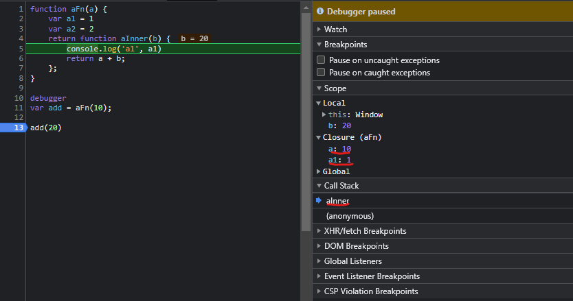
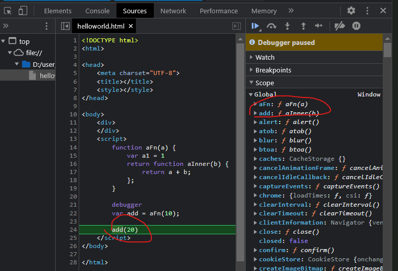

## 闭包: 能够读取其他函数内部变量的函数

### `闭包的本质:`
>作用域大部分时候是静态作用域,又叫词法作用域,这是因为作用域的嵌套关系可以在语法分析时确定;

>闭包保持着对父函数得作用域引用，这在语法分析已经确定，父级函数的执行上下文在运行时赋值，所以闭包return的值就是执行上下文赋值的值，也就是父级函数执行之后不会销毁引用的作用域。

本质:`就是上级作用域内变量的生命周期，因为被下级作用域内引用，而没有被释放。`

先要明白作用域和上下文: `三种上下文之1:函数执行上下文`：存在无数个，只有在函数被调用的时候才会被创建，每次调用函数都会创建一个新的执行上下文。函数作用域是在函数声明的时候就已经确定了，而函数执行上下文是在函数调用时创建的。

函数的特殊属性使其能够记住其创建时所在执行环境的的词法环境，当离开该执行环境并执行时仍然能够访问其词法环境的这一过程就叫做“闭包”,父级函数的执行上下文在运行时赋值，所以闭包return的值就是执行上下文赋值的值，也就是父级函数执行之后不会销毁引用的作用域。

参考:[step3-执行上下文-函数调用栈-this](./step3-执行上下文-函数调用栈-this)

作用域参考：[step2-作用域-块级作用域原理-作用域和闭包](./step2-作用域-块级作用域原理)
```
作用域大部分时候是静态作用域,又叫词法作用域,这是因为作用域的嵌套关系可以在语法分析时确定
```
在函数外部自然无法读取函数内的局部变量;

在一个函数内部定义函数-->闭包就产生了；

### 闭包和作用域
```js
function func() {
  var a = 1;
  (function () {
    console.log(a)
  }());
}
func(); // 1
```

### 如何从外部读取局部变量？
无法读取函数内变量：
```js
function f1(){
  var n = 999;
}

console.log(n);
/*
Uncaught ReferenceError: n is not defined
*/
```

使用闭包： 就是在一个函数内部创建另一个函数。f2 可以读取 f1 中的局部变量，那么只要把 f2 作为返回值，我们不就可以在 f1 外部读取它的内部变量
```js
function f1() {
  var n = 999;
  function f2() {
    console.log(n);
    return n
  }

  return f2;
}

var result = f1();
debugger
console.log('res:',result()); // 999
```


## 闭包和预解析
闭包（closure）是一个函数以及其捆绑的周边环境状态（lexical environment，词法环境）的引用的组合。

https://developer.mozilla.org/zh-CN/docs/Web/JavaScript/Closures

```js
function foo() {
    var d = 20
    return function inner(a, b) {
        const c = a + b + d
        return c
    }
}
const f = foo()
```
上面这段代码的执行过程：
1. 当调用 foo 函数时，foo 函数会将它的内部函数 inner 返回给全局变量 f；
2. 然后 foo 函数执行结束，执行上下文被 V8 销毁；
3. 虽然 foo 函数的执行上下文被销毁了，但是依然存活的 inner 函数引用了 foo 函数作用域中的变量 d。

foo 函数的执行上下文虽然被销毁了，但是 inner 函数引用的 foo 函数中的变量却不能被销毁，那么 V8 就需要为这种情况做特殊处理，需要保证即便 foo 函数执行结束，但是 foo 函数中的 d 变量依然保持在内存中，不能随着 foo 函数的执行上下文被销毁掉。

那么怎么处理呢？

在执行 foo 函数的阶段，虽然采取了惰性解析，不会解析和执行 foo 函数中的 inner 函数，但是 V8 还是需要预解析器判断 inner 函数是否引用了 foo 函数中的变量。

预解释不生成 ast，不生成作用域，只是快速查看内部函数是否引用了外部的变量，快速查看是否存在语法错误，这种执行速度非常快。

### 预解析器如何解决闭包所带来的问题？
当解析顶层代码的时候，遇到了一个函数，那么预解析器并不会直接跳过该函数，而是对该函数做一次快速的预解析，检查函数内部是否引用了外部变量，如果引用了外部的变量，预解析器会将栈中的变量复制到堆中，并追加一个闭包引用，这样当上层函数执行结束之后，只要闭包突然引用了该变量，那么V8也不会销毁改变量,在下次执行到该函数的时候，直接使用堆中的引用，这样就解决了闭包所带来的问题。

## 调用栈的角度，理解闭包
继续分析没被销毁原因：
在执行上下文的创建阶段，跟着被创建的还有作用域链。闭包正是一层层作用域链的关系，实现了对父作用域执行上下文信息的保留。

`作用域在嵌套的情况下，外部作用域是不能访问内部作用域的变量的。一般来说，函数出栈后，我们都没有办法再访问到函数内部的变量了。但闭包可不是这样:`
```js
function aFn(a) {
    var a1 = 1
    var a2 = 2
    return function aInner(b) {
        console.log('a1', a1)
        return a + b;
    };
}

debugger
var add = aFn(10);

add(20)
```
当执行到`add(20)`闭包让函数的执行上下文存在aFn的执行上下文a,a1，aFn的a,a1没被销毁,但是a2已经被销毁


当执行到add,看截图add:ƒ aInner(b),并不是指向初始化的：add:undefined


当add执行的时候，调用的是aInner(),可见Closure-闭合/闭包：
```js
{
    a: 10
    a1: 1
}
```

### 使用闭包的注意点
* 由于闭包会使得函数中的变量都被保存在内存中，内存消耗很大，所以不能滥用闭包，否则会造成网页的性能问题，在 IE 中可能导致内存泄露。解决方法是，在退出函数之前，将不使用的局部变量全部删除。

* 闭包会在父函数外部，改变父函数内部变量的值。所以，如果你把父函数当作对象（object）使用，把闭包当作它的公用方法（Public Method），把内部变量当作它的私有属性（private value），这时一定要小心，不要随便改变父函数内部变量的值。

## 题1-但实际是无论点击哪个目标都会弹出数字5
想每次点击对应目标时弹出对应的数字下标 0~4
```js
function onMyLoad() {
  var arr = document.getElementsByTagName("p");
  for (var i = 0; i &lt; arr.length; i++) {
    arr[i].onclick = function () {
      alert(i);
    }
  }
}
```

问题所在：arr 中的每一项的 onclick 均为一个函数实例(Function 对象)，这个函数实例也产生了一个闭包域，这个闭包域引用了外部闭包域的变量，其 function scope 的 closure 对象有个名为 i 的引用，外部闭包域的私有变量内容发生变化，内部闭包域得到的值自然会发生改变。

解决办法一
解决思路：增加若干个对应的闭包域空间(这里采用的是匿名函数)，专门用来存储原先需要引用的内容(下标)，不过只限于基本类型(基本类型值传递，对象类型引用传递)。
```js
//声明一个匿名函数，若传进来的是基本类型则为值传递，故不会对实参产生影响,
//该函数对象有一个本地私有变量 arg(形参) ，该函数的 function scope 的 closure 对象属性有两个引用，一个是 arr，一个是 i
//尽管引用 i 的值随外部改变 ，但本地私有变量(形参) arg 不会受影响，其值在一开始被调用的时候就决定了
for (var i = 0; i &lt; arr.length; i++) {
  (function (arg) {
    arr[i].onclick = function () {
      // onclick 函数实例的 function scope 的 closure 对象属性有一个引用 arg,
      alert(arg);
      //只要 外部空间的 arg 不变，这里的引用值当然不会改变
    }
  })(i); //立刻执行该匿名函数，传递下标 i (实参)
}
```

解决办法二
解决思路：将事件绑定在新增的匿名函数返回的函数上，此时绑定的函数中的 function scope 中的 closure 对象的 引用 arg 是指向将其返回的匿名函数的私有变量 arg
```js
for (var i = 0; i &lt; arr.length; i++) {
  arr[i].onclick = (function (arg) {
    return function () {
      alert(arg);
    }
  })(i);
}
```

使用 ES6 新语法 let 关键字
```js
for (var i = 0; i &lt; arr.length; i++) {
  let j = i; // 创建一个块级变量
  arr[i].onclick = function () {
    alert(j);
  }
}
```

## 题2-经典问题setTimeout
原因是：setTimeout是异步操作不会马上执行，event loop会等主线机制完成后执行，
需要等待到函数调用栈清空之后才开始执行。即所有可执行代码执行完毕之后，才会开始执行由setTimeout定义的操作。
而这些操作进入队列的顺序，则由设定的延迟时间来决定。
因此在上面这个例子中，即使我们将延迟时间设置为0，它定义的操作仍然需要等待所有代码执行完毕之后才开始执行。这里的延迟时间，并非相对于setTimeout执行这一刻，而是相对于其他代码执行完毕这一刻。

所以上面的例子执行结果就非常容易理解了。而for是同步执行，因此执行setTimeout的时候for循环已经执行完了，结果打印的值为3个3
```js
function testBi() {
    const testArr = [1, 2, 3]
    for (var i = 0; i < testArr.length; i++) {
        setTimeout(function () {
            console.log('闭包题目：', i)
        }, 0)
    }
}
testBi() // 输出 333
```

### 方法1可使用闭包的方法解决
解决思路：增加若干个对应的闭包域空间(这里采用的是匿名函数)，
专门用来存储原先需要引用的内容(下标)，不过只限于基本类型(基本类型值传递，对象类型引用传递)。

声明一个匿名函数，若传进来的是基本类型则为值传递，故不会对实参产生影响,
该函数对象有一个本地私有变量 arg(形参) ，该函数的 function scope 的 closure 对象属性有两个引用，一个是 arr，一个是 i
尽管引用 i 的值随外部改变 ，但本地私有变量(形参) arg 不会受影响，其值在一开始被调用的时候就决定了

// 而我们想要让输出结果依次执行，我们就必须借助闭包的特性，每次循环时，将i值保存在一个闭包中，当setTimeout中定义的操作执行时，则访问对应闭包保存的i值即可。
```js
function testBi2() {
    const testArr = [1, 2, 3]
    for (var i = 0; i < testArr.length; i++) {
        (function (arg) {       //外部函数
            setTimeout(function () {     //内部函数
                // 只要 外部空间的 arg 不变，这里的引用值当然不会改变
                console.log('闭包题目@：', arg)
            })
        })(i)
    }
}
testBi2() // 输出 1,2,3
```

### 2.使用let解决
遍历i是通过 let 关键字声明的：通过 let 和 const 关键字声明的变量是拥有块级作用域（指的是任何在 {} 中的内容）。

在每次的遍历过程中，i都有一个新值，并且每个值都在循环内的作用域中，使其结果依次输出0,1,2
```js
for (var i = 0; i< 10; i++){
	setTimeout(() => {
		console.log(i)kk;
    }, 1000)
}

// 解法一：
for (let i = 0; i< 10; i++){
  setTimeout(() => {
    console.log(i);
  }, 1000)
}

// 解法二：
for (var i = 0; i< 10; i++){
  ((i) => {
    setTimeout(() => {
      console.log(i);
    }, 1000)
 })(i)
}
```

## 闭包使用场景
### 可以读取函数内部的变量,让这些变量的值始终保持在内存中
```js
function f1() {
  var n = 999;
  nAdd = function () { n += 1 }
  function f2() {
    alert(n);
  }
  return f2;
}

var result = f1();

result(); // 999
nAdd();
result(); // 100
```

在这段代码中，result 实际上就是闭包 f2 函数。它一共运行了两次，第一次的值是 999，第二次的值是 1000。这证明了，函数 f1 中的局部变量 n 一直保存在内存中，并没有在 f1 调用后被自动清除。

为什么会这样呢 ？

原因就在于 f1 是 f2 的父函数，而 f2 被赋给了一个全局变量，这导致 f2 始终在内存中，而 f2 的存在依赖于 f1，因此 f1 也始终在内存中，不会在调用结束后，被垃圾回收机制（garbage collection）回收。

这段代码中另一个值得注意的地方，就是

* "nAdd=function(){ n+=1 }" 这一行，首先在 nAdd 前面没有使用 var 关键字，因此 nAdd 是一个全局变量，而不是局部变量。

* 其次，nAdd 的值是一个匿名函数（anonymous function），而这个匿名函数本身也是一个闭包，所以 nAdd 相当于是一个 setter，可以在函数外部对函数内部的局部变量进行操作。

### 模仿块级作用域
因此可以利用闭包的特性来模仿块级作用域。

这个例子闭包就是那个匿名函数，这个闭包可以当函数testFn内部的活动变量，又能保证自己内部的变量在自执行后直接销毁。
这种写法经常用在全局环境中，可以避免添加太多全局变量和全局函数，特别是多人合作开发的时候可以减少因此产生的命名冲突等，避免污染全局环境。

```js
function testFn(num) {
    (function () {
        for (var i = 0; i < num.length; i++) {
            num++
        }
    }).call() //声明一个函数立即调用以后，浏览器刷新页面会报错，可以用一个小括号把整段函数包起来。
    console.log(i)//undefined
}
```

### 闭包可以让一个变量长期驻扎在内存中，避免全局变量的污染
```js
var res = (function () {
    var count = 29;
    return function add() {
        // return count++;
        console.log(count);
        count++;
    }
})();
console.log(res());
console.log(res());
```

### 封装私有变量
我们可以把函数当作一个范围，函数内部的变量就是私有变量，在外部无法引用，但是我们可以通过闭包的特点来访问私有变量。

```js
var person = function () {
    //变量作用域为函数内部，外部无法访问
    var name = "default";
    return {
        getName: function () {
            return name;
        },
        setName: function (newName) {
            name = newName;
        }
    }
}();

console.log('封装私有变量:', person.name);//直接访问，结果为undefined
console.log('封装私有变量:', person.getName()); // default
person.setName("abruzzi");
console.log('封装私有变量:', person.getName()); // abruzzi
```

## 内存生命周期和泄漏场景
最基础的造成内存泄漏的几个点，应该还有更深层次一点的。而内存泄漏最核心的还是因为垃圾机制，全局变量或者是被全局变量引用，垃圾机制就无法回收，要是一直需要使用的还好，要是一些用完一次就不再使用的没有释放，那么积累的多了就容易造成内存溢出。

JavaScript 具有自动垃圾收集机制（GC：Garbage Collecation），也就是说，执行环境会负责管理代码执行过程中使用的内存。


## JavaScript内存的生命周期：
1. 内存分配：分配你所需要的暂时使用内存大小，当申明变量、函数、对象的时候，系统会自动为他们分配内存
2. 内存使用：即读写内存，在每次创建字变量、函数、对象的时候，程序会分配新内存来存储实体。
3. 内存回收：对于不需要使用的内存将其释放。

内存也是有生命周期的，不管什么程序语言，一般可以按顺序分为三个周期：
* 分配期：分配所需要的内存
* 使用期：使用分配到的内存（读、写）
* 释放期：不需要时将其释放和归还

为了便于理解，下面用一个简单的例子来解释JavaScript内存的生命周期。
```js
var a = 50;  // 在内存中给数值变量分配空间
alert(a + 100);  // 使用内存
a = null; // 使用完毕之后，释放内存空间
```

## 实现垃圾回收的两种常见算法:引用计数和标记清除
1. 标记清除

标记清除法是现代浏览器常用的一种垃圾收集方式，当变量进入环境（即在一个函数中声明一个变量）时，就将此变量标记为“进入环境”，进入环境的变量是不能被释放，因为只有执行流进入相应的环境，就可能会引用它们。

而当变量离开环境时，就标记为“离开环境”。

垃圾收集器在运行时会给储存在内存中的所有变量加上标记，然后会去掉环境中的变量以及被环境中的变量引用的变量的标记，当执行完毕那些没有存在引用无法访问的变量就被加上标记，最后垃圾收集器完成清除工作，释放掉那些打上标记的变量所占的内存。

标记清除之所以不存在循环引用的问题，是因为当函数执行完毕之后，对象A和B就已经离开了所在的作用域，此时两个变量被标记为“离开环境”，等待被垃圾收集器回收，最后释放其内存。

2. 引用计数
引用计数（reference counting）：当声明一个变量并将一个引用类型复制给该变量时，则这个值引用就加1，相反，如果包含这个值的变量又取得另外一个值，那么这个值的引用就减1，当引用次数变为0，则说明这个值不再用到了，这时就可以将这块内存释放。

## JavaScript中涉及内存泄漏的几种场景：
### 场景1. 全局变量引起的内存泄漏：
根据JavaScript的垃圾回收机制我们知道，全局变量是不会被回收的，所以一些意外的、不需要的全局变量多了，没有释放，就造成了内存泄漏。
例：不断地创建全局变量，不管有没有用到它们，它们都将滞留在程序的整个执行过程中。如果这些变量是深层嵌套对象，将会浪费大量内存。

### 场景2. 闭包：
闭包其实也是跟全局变量挂钩了，但是闭包只是因为被全局变量引用了，内部的变量因为被闭包引用得不到释放，也会造成内存泄漏。
因为Javascript范围的限制，许多实现依赖Javascript闭包。闭包可以导致内存泄漏是因为内部方法保持一个对外部方法变量的引用，所以尽管方法返回了内部方法还可以继续访问在外部方法中定义的私有变量。最好的做法是在页面重载前断开所有的事件处理器。

举例说明：
运行下面的代码，会发现已经造成了大量的内存泄露，每秒泄露1M的内存，显然光靠垃圾回收器是无法帮助你的了。由上面的代码来看，似乎是longstr在每次replaceThing调用的时候都没有得到回收。每一个theThing结构都含有一个longstr结构列表。每一秒当我们调用 replaceThing, 它就会把当前的指向传递给priorThing。但是到这里我们也会看到并没有什么问题，因为priorThing每回也是先解开上次函数的指向才会接受新的赋值。并且所有的这一切都是发生在replaceThing函数体当中，按常理来说当函数体结束之后，函数中的本地变量也将会被垃圾回收器回收，也就不会出现内存泄露的问题了，但是为什么会出现上面的错误呢？
这是因为longstr的定义是在一个闭包中进行的，而它又被其他的闭包所引用，js规定，在闭包中引入闭包外部的变量时，当闭包结束时此对象无法被垃圾回收。
```js
var theThing = null; 
var replaceThing = function () { 
    var priorThing = theThing; 
    var unused = function () { 
        if (priorThing) {       
            console.log("hi");     
        }   
    }; 
    theThing = {     
        longStr: new Array(100).join('*'),
        someMethod: function () {       
            console.log(someMessage);  
        }   
    }; 
};
setInterval(replaceThing, 1000);
```

### 场景3.计时器、回调、监听等事件没有移除：
```
计时器、回调、事件监听等没有清除是一直存在的，一直存在没有被释放就会造成内存泄漏。
为了增强网站的交互性或者是制作一些浮华的动画，你可能会创建大量的事件监听器。而用户在你的单页面应用中移向其他页面时，你又忘记移除这些监听器，那么也可能会导致内存泄漏。当用户在这些页面来回移动的时候，这些监听器会不断增加。
```
### 场景4.给DOM添加属性或方法：
给DOM添加点击方法、添加属性等，也会造成变量引用得不到释放，造成内存泄漏。
例移除 DOM 元素：这个问题很常见，类似于全局变量导致的内存泄漏。DOM 元素存在于对象图内存和 DOM 树中。用例子来解释可能会更好：
```js
var terminator = document.getElementById('terminate');
var badElem = document.getElementById('toDelete');
terminator.addEventListener('click', function()  {
  badElem.remove();
});
```

在你通过 id = ‘terminate’ 点击了按钮之后，toDelete 会从 DOM 中移除。不过，由于它仍然被监听器引用，为这个对象分配的内存并不会被释放。
```js
var terminator = document.getElementById('terminate');
terminator.addEventListener('click', function()  {
  var badElem = document.getElementById('toDelete');
  badElem.remove();
});
```
badElem 是局部变量，在移除操作完成之后，内存将会被垃圾回收器回收。

### 场景5.循环引用
```
简单的例子：一个 DOM 对象被一个 Javascript 对象引用，与此同时又引用同一个或其它的 Javascript 对象，这个 DOM 对象可能会引发内存泄露。这个 DOM 对象的引用将不会在脚本停止的时候被垃圾回收器回收。要想破坏循环引用，引用 DOM 元素的对象或 DOM 对象的引用需要被赋值为null
```
