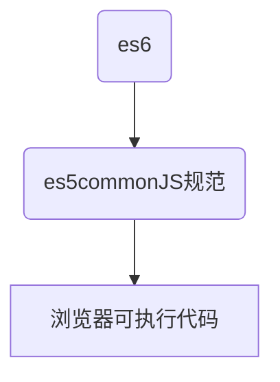

## A. es6-babel转化
Babel 是一个 JavaScript 编译器,把最新版的javascript编译成当下可以执行的版本.

babel转换后的代码是遵循commonJS规范,浏览器(支持的是 ECMAScript)并不能识别。因此导入到浏览器中会报错;而nodeJS是commonJS的实现者，所以在babel转换后的代码是可以在node中运行的。

为了将babel生成的遵循 commonJS 规范的es5写法能够在浏览器上直接运行，我们就借助webpack这个打包工具来完成。

Babel 把 ES6 的模块机制转换成 CommonJS 的形式，然后使用 Browserify 或者 Webpack 这样的打包工具把他们打包起来,生成能在在浏览器上运行的es5。


### A-1. babel运行原理
* 1.解析阶段：包括词法分析和语法分析。
完成js代码到AST（js代码--令牌流--AST）的解析工作.Babel提供@babel/parser解析代码，用到的解析器是babylon
```
1.词法分析：将字符串形式的代码转译成 令牌（token）流.
  1.举例： n * n
  [
  {type: {...}, value: "n", start: 0, end: 1, loc: {...} },
  {type: {...}, value: "*", start: 2, end: 3, loc: {...} },
  {type: {...}, value: "n", start: 4, end: 5, loc: {...} },
  ]

  2.每个type由一组属性来进行描述
  type: {
    label：'name'，
    keyword: undefined,
    beforeExpr: false,
    startsExpr: true,
    rightAssociative: false,
    isLoop: false,
    isAssign: false,
    prefix: false,
    postfix: false,
    binop: null,
    updateContext: null
  }
2.语法分析: 将令牌流转译成AST形式
```

* 2.转译：Babel提供@babel/traverse进行AST的遍历，完成对其节点的增加、删除、替换。该方法接受的参数为AST及自定义的转译规则，返回转换后的AST.

* 3.生成: Babel提供@babel/generator将转换后的AST生成字符串形式的js代码，可以对是否压缩及是否删除注释进行配置，并且支持sourceMap。


上文我们提到了babel的作用是将浏览器无法识别的较新的JS语法，编译从浏览器能够支持的JS语法。然而也是由于它的编译，一些我们原本看似没有副作用的代码，便转化为了(可能)有副作用的。

<br />

### A-2. babel 使用
安装的依赖:
@babel/core：babel的核心包，核心的api都在这里。
@babel/cli ：通过命令行运行babel.
  此外，babel进行代码编译时需要指定转换规则，也就是babel的plugin或者preset
  @babel/preset-env 将高版本es转成es5
  @babel/preset-react jsx语法转译
  plugin
    @babel/polyfill：因为@babel/preset-env本身只支持转换箭头函数、结构赋值这些语法糖类的语法，而Polyfill中包含了Promise函数等新的特征。

### A-2-1. baberc来做配置文件，babel7引入了babel.config.js
.babelrc
```json
{
  "presets": ["@babel/preset-flow","@babel/preset-react", "@babel/preset-typescript"],
  "plugins": [...]
}
```
babel.config.js
```js
module.exports = function () {
  const presets = [ 
      ["env", {
            "targets": { //指定要转译到哪个环境
                //浏览器环境
                "browsers": ["last 2 versions", "safari >= 7"],
                //node环境
                "node": "6.10", //"current"  使用当前版本的node
                
            },
             //是否将ES6的模块化语法转译成其他类型
             //参数："amd" | "umd" | "systemjs" | "commonjs" | false，默认为'commonjs'
            "modules": 'commonjs',
            //是否进行debug操作，会在控制台打印出所有插件中的log，已经插件的版本
            "debug": false,
            //强制开启某些模块（包含在该Preset中的），默认为[]
            "include": ["transform-es2015-arrow-functions"],
            //禁用某些模块，默认为[]
            "exclude": ["transform-es2015-for-of"],
            // babel / preset-env处理polyfill的方式。
            // 参数：usage | entry | false，默认为false.
            /*
            entry：在应用程序入口导入一次core-js，多次导入可能会有全局冲突或其他问题。
            usage：自动为每个文件添加特定的该文件所用到的polyfill。
            false：不要为每个文件自动添加polyfill，也不将“@babel/polyfill”导入到单个polyfill。 
            */
            "useBuiltIns": false
     }]
 ]; // 不包含在Preset中的Plugins需要单独引入
  const plugins = [ "@babel/transform-arrow-functions" ];

  return {
    presets,
    plugins
  };
}
```

### A-3. 常用配合:利用webpack es6转化es5
```
npm install --save webpack
npm install --save babel-loader
npm install --save babel-core
npm install --save babel-preset-es2015

自从babel升级6.x版本后就分成了两个插件，一个是babel-core【终端运行】(如果是node请安装babel-cli )，一个是babel-preset-es2015
```

比如我们用ES6语法定义了Person类:
```js
export class Animal {
  constructor ({ breed, age, sex }) {
    this.breed = breed
    this.age = age
    this.sex = sex
  }
  getBreed () {
    return this.breed
  }
}

|
|
V

function _classCallCheck(instance, Constructor) { if (!(instance instanceof Constructor)) { throw new TypeError("Cannot call a class as a function"); } }

var _createClass = function() {
  function defineProperties(target, props) {
    for (var i = 0; i < props.length; i++) {
      var descriptor = props[i];
      descriptor.enumerable = descriptor.enumerable || !1, descriptor.configurable = !0,
      "value" in descriptor && (descriptor.writable = !0), Object.defineProperty(target, descriptor.key, descriptor);
    }
  }
  return function(Constructor, protoProps, staticProps) {
    return protoProps && defineProperties(Constructor.prototype, protoProps), staticProps && defineProperties(Constructor, staticProps),
    Constructor;
  };
}()

var Animal = function () {
  function Animal(_ref) {
    var breed = _ref.breed, age = _ref.age, sex = _ref.sex;
    _classCallCheck(this, Animal);
    this.breed = breed;
    this.age = age;
    this.sex = sex;
  }

  _createClass(Animal, [{
    key: 'getBreed',
    value: function getBreed() {
      return this.breed;
    }
  }]);
  return Animal;
}();
```
我们可以看到，在创建Animal的时候使用了_createClass函数，由此产生了副作用。
按照我们常规的想法（我们之前写类的方式），我们希望的编译结果可能是这样的：
```js
var Animal = function () {
  function Animal() {

  }
  Animal.prototype.getBreed = function () { return this.breed };
  return Anaimal;
}();
```

### babel默认使用符合ES6真正的语义的语法进行编译。
那babel为什么要使用Object.defineProperty，而不是原型链的方式去编译呢？babel默认使用符合ES6真正的语义的语法进行编译。
如果需要(不严格遵循ES6的语义，而采取更符合我们平常编写代码时的习惯去编译代码)。
babel有一个loose模式的，直译的话叫做宽松模式。
```js
{
  "presets": [["env", { "loose": false }]]
}
```

答案见下面:
1. 模块导出时通过 Object.defineProperty 定义的 exports.__esModule 有什么用？

<br />

## B.Babel 是怎么实现 ES6 模块的转换的？
Babel 依然通过 exports 对象来输出模块内的引用，但是增加了一个特殊的 exports.default 属性用来实现 ES6 的默认输出对象。并且依然通过 require 来实现模块的加载。

### B-1. 模块导出
```js
export const InlineExport = { }
const NormalExport = { }
const RenameExport = { }
const DefaultExport = { }

export { NormalExport }
export { RenameExport as HasRenamed }
export default DefaultExport

// 转换后
"use strict";

Object.defineProperty(exports, "__esModule", {
  value: true
});
var InlineExport = exports.InlineExport = {};
var NormalExport = {};
var RenameExport = {};
var DefaultExport = {};

exports.NormalExport = NormalExport;
exports.HasRenamed = RenameExport;
exports.default = DefaultExport;
```

### B-2. 模块引入
```js
import { NormalExport } from 'normal'
import { HasRenamed as RenameAgain } from 'rename'
import DefaultExport from 'default'
import * as All from 'all'

NormalExport()
RenameAgain()
DefaultExport()
All()

// 转换后
'use strict';

var _normal = require('normal');
var _rename = require('rename');

var _default = require('default');
var _default2 = _interopRequireDefault(_default);

var _all = require('all');
var all = _interopRequireWildcard(_all);

(0, _normal.NormalExport)();
(0, _rename.HasRenamed)();
(0, _default2.default)();
all.hello();

function _interopRequireDefault(obj) {
  return obj && obj.__esModule
    ? obj
    : { default: obj };
}

function _interopRequireWildcard(obj) {
  if (obj && obj.__esModule) {
    return obj;
  } else {
    var newObj = {};
    if (obj != null) {
      for (var key in obj) {
        if (Object.prototype.hasOwnProperty.call(obj, key))
          newObj[key] = obj[key];
      }
    }
    newObj.default = obj;
    return newObj;
  }
}
```

### B-3. 打包后
```
03-打包后.js
```

上面webpack打包的代码，整体可以简化成下面的结构：
https://cloud.tencent.com/developer/article/1918260
```js
(function (modules) {/* 省略函数内容 */})
([
function (module, exports, __webpack_require__) {
    /* 模块index.js的代码 */
},
function (module, exports, __webpack_require__) {
    /* 模块bar.js的代码 */
}
]);
```

可以看到，整个打包生成的代码是一个IIFE(立即执行函数)，函数内容我们待会看，我们先来分析函数的参数。

函数参数是我们写的各个模块组成的数组，只不过我们的代码，被webpack包装在了一个函数的内部，也就是说我们的模块，在这里就是一个函数。为什么要这样做，是因为浏览器本身不支持模块化，那么webpack就用函数作用域来hack模块化的效果。

如果你debug过node代码，你会发现一样的hack方式，node中的模块也是函数，跟模块相关的参数exports、require，或者其他参数__filename和__dirname等都是通过函数传值作为模块中的变量，模块与外部模块的访问就是通过这些参数进行的，当然这对开发者来说是透明的。

同样的方式，webpack也控制了模块的module、exports和require，那么我们就看看webpack是如何实现这些功能的。


### B-4. 结论
https://cloud.tencent.com/developer/article/1918260
到这里，webpack就hack了commonjs代码。

原理还是很简单的，其实就是实现exports和require，然后自动加载入口模块，控制缓存模块，that's all。

### B-5. 有两个疑问
1. 模块导出时通过 Object.defineProperty 定义的 exports.__esModule 有什么用？
```
给模块的输出对象增加 __esModule 是为了将不符合 Babel 要求的 CommonJS 模块转换成符合要求的模块，这一点在 require 的时候体现出来。

如果加载模块之后，发现加载的模块带着一个 __esModule 属性，Babel 就知道这个模块肯定是它转换过的，这样 Babel 就可以放心地从加载的模块中调用 exports.default 这个导出的对象，也就是 ES6 规定的默认导出对象，所以这个模块既符合 CommonJS 标准，又符合 Babel 对 ES6 模块化的需求。

然而如果 __esModule 不存在，也没关系，Babel 在加载了一个检测不到 __esModule 的模块时，它就知道这个模块虽然符合 CommonJS 标准，但可能是一个第三方的模块，Babel 没有转换过它，如果以后直接调用 exports.default 是会出错的，所以现在就给它补上一个default 属性，就干脆让 default 属性指向它自己就好了，这样以后就不会出错了。
```

2. 模块引入后执行时为什么使用逗号表达式？
```
这个逗号表达式是 JavaScript 的语言特性，具体含义是这样的：整个逗号表达式都会从左到右执行一遍，然后逗号表达式的值等于最后一个逗号之后的表达式的值。这跟 C/C++ 等其他 C 类语言是一样的。

但是这句话对 JavaScript 有个特殊含义，如果执行 (0, foo.bar)()，这个逗号表达式等价于执行 foo.bar()，但是执行时的上下文环境会被绑定到全局对象身上，所以实际上真正等价于执行 foo.bar.call(GLOBAL_OBJECT)。
```

要解开这两个疑惑，必须得理解 ES6 的模块化方案和 CommonJS 方案有什么区别与联系。

CommonJS 方案的特点:
```
1. 所有要输出的对象统统挂载在 module.exports 上，然后暴露给外界
2. 通过 require 加载别的模块，require 的返回值就是模块暴露的对象
3. CommonJS 是一个单对象输出，单对象加载的模型
```

ES6 的模块化机制有什么特点：
```
1. 可通过以下方式输出任何对模块内部的引用
  export { A, B }
  export { A as a, B }
  export default A
  export const A = { }
            
2. 通过以下方式加载模块中输出的任意引用
        import A from './module'
        import * as A from './module'
        import { A, B } from './module'
        import { A as a, B } from './module'
    
3. ES6 module 是一个多对象输出，多对象加载的模型
```