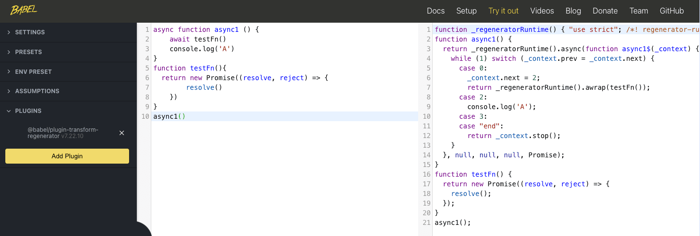

## async
* 函数前面使用async关键字，这个函数就会返回一个promise
* 如果返回的不是一个promise，JavaScript也会自动把这个值"包装"成Promise的resolve值。

返回一个promise
```js
async function fn() {
    return new Promise(resolve => {
        setTimeout(function(){
            resolve('hello world');
        }, 1000);
    });
}

fn().then(res => {
    console.log(res); // hello world
});

let test1 = Object.prototype.toString.call(fn) === '[object AsyncFunction]';
let test2 = Object.prototype.toString.call(fn()) === '[object Promise]';
console.log({test1,test2}) // true,true
```

返回一个非promise
```js
async function fn() {
    return 2;
}
const test = fn(); 

console.log(test); // Promise {<resolved>: 2}

fn().then(res => {
    console.log(res); // 2
})
```

## await
await 操作符用于等待一个Promise 对象。只能在异步函数async function使用;

当代码执行到await语句时，会暂停执行，直到await后面的promise正常处理。

这和我们之前讲到的generator一样，可以让代码在某个地方中断。只不过，在generator中，我们需要手动写代码去执行generator，而await则是像一个自带执行器的generator。

可以理解为：await就是generator的语法糖


await 表达式会暂停当前 async function 的执行，等待 Promise 处理完成。若 Promise 正常处理(fulfilled)，其回调的resolve函数参数作为 await 表达式的值，继续执行 async function。若 Promise 处理异常(rejected)，await 表达式会把 Promise 的异常原因抛出。另外，如果 await 操作符后的表达式的值不是一个 Promise，则返回该值本身。
```js
const promiseTest = function() {
    return new Promise(resolve => {
        setTimeout(function(){
            resolve(1);
        }, 1000);
    });
};

const fn = async function() {
    const res = await promiseTest();
    console.log(res); 
    const res2 = await 2;
    console.log(res2);
};

fn();
```


把await放在try catch中捕获错误
```js
const promiseTest = function() {
    return new Promise(resolve => {
        console.log(test);
        resolve();
    });
};

const fn = async function() {
    try {
        await promiseTest();
    } catch (e) {
        console.log(e); // test is not defined
    }
};

fn();
```

## promise和async/await区别
### 错误处理
1. Promise使用catch()方法处理失败状态下的结果
2. async/await 中，使用 try/catch 语句来处理异步操作的错误

```js
// Promise 的错误处理
function example() {
  return somePromise()
    .then(result => {
      console.log(result)
    })
    .catch(error => {
      console.error(error)
    })
}

// async/await 的错误处理
async function example() {
  try {
    const result = await somePromise()
    console.log(result)
  } catch (error) {
    console.error(error)
  }
}
```

### 执行顺序
1. Promise链式调用`.then()`方法来处理多个异步操作的结果，从而形成一条执行链。但是，这种方法有时会导致代码难以阅读和维护。
2. async/await 中，使用更加直观的同步代码形式来处理异步操作。async/await 中的异步操作会被自动转换为 Promise 对象,从而可以使用 Promise 的链式调用方法。
```js
// Promise 的链式调用
function example() {
  return somePromise1()
    .then(result1 => {
      return somePromise2(result1)
    })
    .then(result2 => {
      console.log(result2)
    })
}

// async/await 的同步代码形式
async function example() {
  const result1 = await somePromise1()
  const result2 = await somePromise2(result1)
  console.log(result2)
}
```

## 生成器+promise=async function
Async/Await就是一个自执行的generate函数

使用babel插件可以用于将 async/await 语法转化为标准的 JavaScript 代码：
* @babel/preset-env：这是 Babel 的预设，它可以根据你的目标浏览器环境自动选择需要的转译插件
* @babel/plugin-transform-async-to-generator：这个插件用于将 async/await 转化为 Generator 函数
* @babel/plugin-transform-regenerator：这个插件用于引入 regenerator-runtime，以便在不支持 async/await 的环境中运行

### 测试方式1：
[es6-to-es5-本地测试](https://github.com/huiruo/es6-to-es5)

### 测试方式2：
[babeljs.io](https://babeljs.io/repl)

比如：添加`@babel/plugin-transform-arrow-functions`babel插件,代码中的所有箭头函数（arrow functions）都将被转换为 ES5 兼容的函数表达式了



## 转化成es5
[babeljs.io](https://babeljs.io/repl)
`@babel/plugin-transform-regenerator`:将async转化为es5
```js
async function async1 () {
    await testFn()
    console.log('A')
}
function testFn(){
  return new Promise((resolve, reject) => {
        resolve()
    })
}
async1()

|
|
V
// 省略包...
function _regeneratorRuntime() { "use strict"; /*! regenerator-runtime -- Copyright (c) 2014-present, Facebook, Inc. -- license (MIT): https://github.com/facebook/regenerator/blob/main/LICENSE */ _regeneratorRuntime = function () { return e; }; 

  // 省略
  // ...
}


// 解析之后
function async1() {
  return _regeneratorRuntime().async(function async1$(_context) {
    while (1) switch (_context.prev = _context.next) {
      case 0:
        _context.next = 2;
        return _regeneratorRuntime().awrap(testFn());
      case 2:
        console.log('A');
      case 3:
      case "end":
        return _context.stop();
    }
  }, null, null, null, Promise);
}
function testFn() {
  return new Promise((resolve, reject) => {
    resolve();
  });
}
async1();
```

这段代码是一个使用异步函数（async/await）和 Promise 的 JavaScript 代码。
1. async1 是一个异步函数（async function）。
2. 在 async1 函数内部，有一个 await 表达式，它等待 testFn() 函数返回的 Promise 对象的状态变为 resolved。await 关键字用于等待一个 Promise 对象的解决，并在解决后继续执行后续代码。
3. testFn 是一个函数，它返回一个 Promise 对象，该 Promise 在创建后立即被 resolved（解决）。这表示异步操作成功完成。
4. 当 testFn 的 Promise 被 resolved 后，async1 函数会继续执行。它会打印出 'A'。

5. 请注意 _regeneratorRuntime() 和 _regeneratorRuntime().async()、_regeneratorRuntime().awrap() 是 Babel 转译器生成的辅助函数，用于支持 async/await 的转译。这是因为不同 JavaScript 引擎可能对 async/await 支持程度不同，Babel 被用来确保代码在不同环境中的兼容性。

综上所述，这段代码的主要目的是演示如何使用 async/await 来处理异步操作，以及如何使用 Promise 来进行异步操作的封装和管理。在这个特定的示例中，async1 函数等待 testFn 函数返回的 Promise 被 resolved，然后打印 'A'。如果 testFn 中的 Promise 被 rejected，你可以在 async1 函数内部使用 try/catch 来捕获错误。


## 转化成yield
[babeljs.io](https://babeljs.io/repl)
配置好plugins:`plugin-transform-async-to-generator`
### 转化前
```js
async function async1 () {
    await testFn()
    console.log('A')
}
function testFn(){
  return new Promise((resolve, reject) => {
        resolve()
    })
}
async1()
```

### 转化后
```js
function asyncGeneratorStep(gen, resolve, reject, _next, _throw, key, arg) {
  try {
    var info = gen[key](arg);
    var value = info.value;
  } catch (error) {
    reject(error);
    return;
  }
  if (info.done) {
    resolve(value);
  } else {
    Promise.resolve(value).then(_next, _throw);
  }
}
function _asyncToGenerator(fn) {
  return function () {
    var self = this,
      args = arguments;
    return new Promise(function (resolve, reject) {
      var gen = fn.apply(self, args);
      function _next(value) {
        asyncGeneratorStep(gen, resolve, reject, _next, _throw, "next", value);
      }
      function _throw(err) {
        asyncGeneratorStep(gen, resolve, reject, _next, _throw, "throw", err);
      }
      _next(undefined);
    });
  };
}
function async1() {
  return _async.apply(this, arguments);
}
function _async() {
  _async = _asyncToGenerator(function* () {
    yield testFn();
    console.log('A');
  });
  return _async.apply(this, arguments);
}
function testFn() {
  return new Promise((resolve, reject) => {
    resolve();
  });
}
async1();
```

这段代码是一个实现异步操作的 JavaScript 代码，其中使用了 async/await 和 Promise。让我为你解析它：
1. asyncGeneratorStep 函数：这个函数是一个生成器函数内部的辅助函数。它接受生成器对象 gen、resolve、reject、下一个 _next、抛出异常 _throw、操作键 key 和参数 arg 作为参数。它的主要作用是执行生成器的下一步，处理成功和失败的情况。如果生成器步骤成功完成，它会通过 resolve 返回结果，否则通过 reject 抛出错误。
2. _asyncToGenerator 函数：这个函数接受一个生成器函数 fn 作为参数，返回一个新的函数。这个新函数使用 Promise 包装生成器函数，并返回 Promise。它内部创建了一个 Promise 对象，然后执行生成器函数，将生成器对象传递给 asyncGeneratorStep 函数来逐步执行生成器的步骤。生成器函数内部会通过 yield 暂停执行，然后通过 Promise 的 then 方法继续执行。
3. async1 函数：这是一个异步函数，它使用了 _async 函数来定义。async1 函数内部的主要操作是调用 testFn 函数，并在 testFn 函数返回的 Promise 被 resolved 后打印 'A'。
4. _async 函数：这个函数是一个使用了 _asyncToGenerator 的异步函数。它内部定义了一个生成器函数，这个生成器函数在执行时会通过 yield 暂停，然后等待 testFn 函数的 Promise 被 resolved。一旦 testFn 的 Promise 被 resolved，它会继续执行并打印 'A'。
5. testFn 函数：这个函数返回一个 Promise，该 Promise 在创建后立即被 resolved。这表示异步操作成功完成。
6. 最后，通过调用 async1 函数来启动整个异步操作链。async1 函数内部的 _async 函数会启动异步操作并等待 testFn 的 Promise 被 resolved，然后打印 'A'。

这段代码演示了如何使用 async/await 和 Promise 来管理异步操作，以及如何定义生成器函数来处理异步操作的暂停和继续。这种代码结构有助于处理异步逻辑，使其更容易理解和维护。

### 例子2
[babeljs.io](https://babeljs.io/repl)
`plugin-transform-runtime`
```js
const fetchData = (data) => new Promise((resolve) => setTimeout(resolve, 1000, data + 1))

const fetchValue = async function () {
    var value1 = await fetchData(1);
    var value2 = await fetchData(value1);
    var value3 = await fetchData(value2);
    console.log(value3)
};

fetchValue();
```

```js
function asyncGeneratorStep(gen, resolve, reject, _next, _throw, key, arg) {
  try {
    var info = gen[key](arg);
    var value = info.value;
  } catch (error) {
    reject(error);
    return;
  }
  if (info.done) {
    resolve(value);
  } else {
    Promise.resolve(value).then(_next, _throw);
  }
}
function _asyncToGenerator(fn) {
  return function () {
    var self = this,
      args = arguments;
    return new Promise(function (resolve, reject) {
      var gen = fn.apply(self, args);
      function _next(value) {
        asyncGeneratorStep(gen, resolve, reject, _next, _throw, "next", value);
      }
      function _throw(err) {
        asyncGeneratorStep(gen, resolve, reject, _next, _throw, "throw", err);
      }
      _next(undefined);
    });
  };
}
const fetchData = data = > new Promise(resolve = > setTimeout(resolve, 1000, data + 1));
const fetchValue =
  /*#__PURE__*/
  function () {
    var _ref = _asyncToGenerator(function* () {
      var value1 = yield fetchData(1);
      var value2 = yield fetchData(value1);
      var value3 = yield fetchData(value2);
      console.log(value3);
    });
    return function fetchValue() {
      return _ref.apply(this, arguments);
    };
  }();
fetchValue();
```