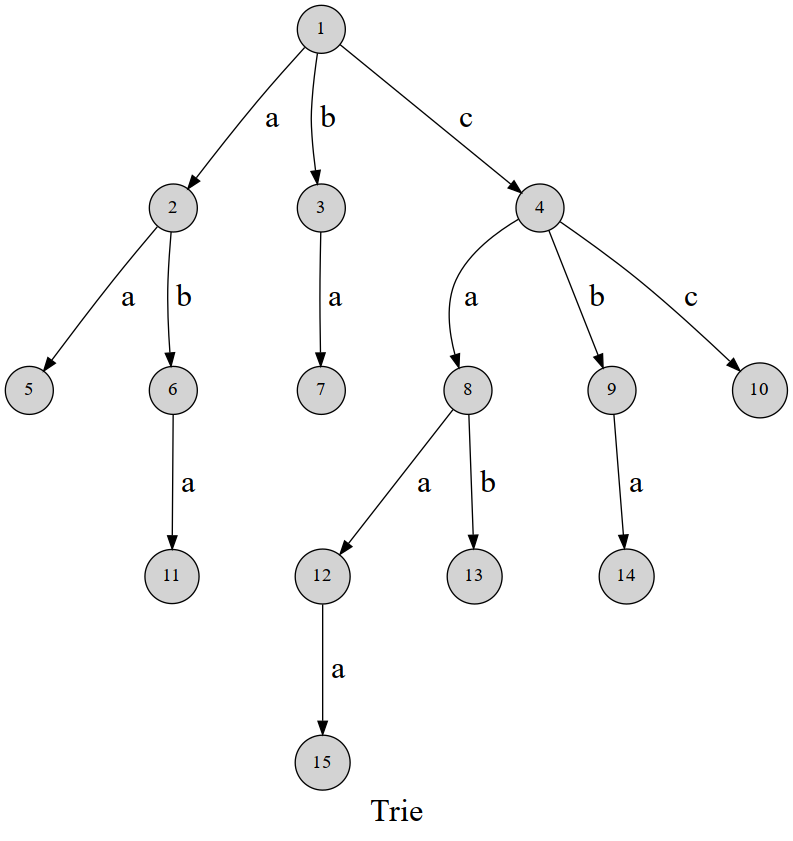

## 文档
[trie doc](https://oi-wiki.org/string/trie/)



可以发现，这棵字典树用边来代表字母，而从根结点到树上某一结点的路径就代表了一个字符串。举个例子，
```
1->4->8->12 
```
表示的就是字符串`caa`

典型应用是用于统计和排序大量的字符串（但不仅限于字符串），所以经常被搜索引擎系统用于文本词频统计。它的优点是：利用字符串的公共前缀来减少查询时间，最大限度地减少无谓的字符串比较。

### 和二叉树搜索对比怎么样？
Trie 树和二叉搜索树各有优势，选择取决于具体的应用场景和需求。如果处理字符串数据且需要支持前缀匹配、模糊搜索等，Trie 树可能更适合；如果处理有序数据且对平衡性要求不高，二叉搜索树可能更合适。在实际应用中，可能会根据数据特点选择更为适合的数据结构
1. 结构差异：
  * Trie 树是多叉树结构，每个节点有多个子节点，通常用于处理字符串数据。
  * 二叉搜索树是每个节点最多有两个子节点的树结构，左子树的节点值小于父节点，右子树的节点值大于父节点。
2. 搜索性能：
  * Trie 树在字符串搜索、前缀匹配等场景下表现良好，搜索时间复杂度与搜索词长度有关，通常为 O(m)，其中 m 是搜索词长度。
  * 二叉搜索树的搜索性能取决于树的平衡性，对于平衡的二叉搜索树，搜索时间复杂度为 O(log n)，其中 n 是树的节点数。但在最坏情况下，如果二叉搜索树不平衡，时间复杂度可能达到 O(n)。
3. 适用场景：
  * Trie 树适用于处理字符串数据，如文本搜索、字典等应用。它在处理前缀匹配、模糊搜索等方面优势明显。
  * 二叉搜索树适用于有序数据集的搜索，比如数值或有序对象。它在维护有序性的同时支持搜索和插入操作。
4. 空间复杂度：
  * Trie 树在处理相同前缀的数据时可能节省空间，因为共享相同前缀的节点可以被多个单词共享。
  * 二叉搜索树的空间复杂度取决于树的平衡性，不如 Trie 树在处理相同前缀的情况下节省空间