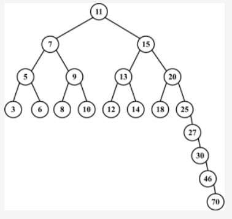
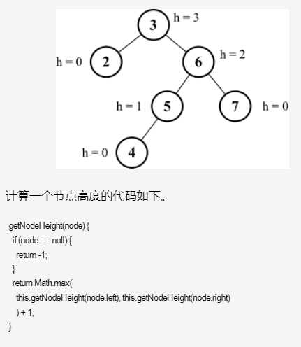
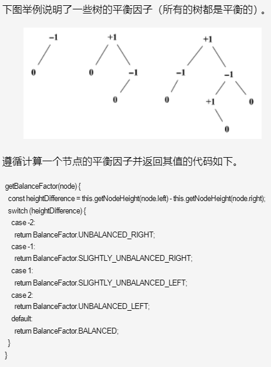
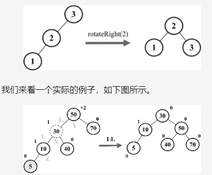

##  自平衡树:Adelson-Velskii-Landi树（AVL树）
```
二叉搜索树BST 存在一个问题：取决于你添加的节点数，树的一条边可能会非常深；也就是说，树的一条分支会有很多层，而其他的分支却只有几层

这会在需要在某条边上添加、移除和搜索某个节点时引起一些性能问题。
为了解决这个问题，有一种树叫作Adelson-Velskii-Landi树（AVL树）。
AVL树是一种自平衡二叉搜索树，意思是任何一个节点左右两侧子树的高度之差最多为1。
```

<!--  -->

```
AVL树是一种自平衡树。添加或移除节点时，AVL树会尝试保持自平衡。任意一个节点（不论深度）的左子树和右子树高度最多相差1。
添加或移除节点时，AVL树会尽可能尝试转换为完全树。
```

##  2.实现：AVL树
```
既然AVL树是一个BST，我们可以扩展我们写的BST类，只需要覆盖用来维持AVL树平衡的方法，也就是insert、insertNode和removeNode方法。
所有其他的BST方法将会被AVLTree类继承。

在AVL树中插入或移除节点和BST完全相同。然而，AVL树的不同之处在于我们需要检验它的平衡因子，如果有需要，会将其逻辑应用于树的自平衡。
```

##  2-1.相关术语

##  2-1-1.节点的高度和平衡因子
树的节点的高度：是从节点到其任意子节点的边的最大值。下图展示了一个包含每个节点高度的树。

<!--  -->

平衡因子：
```
在AVL树中，需要对每个节点计算右子树高度（hr）和左子树高度（hl）之间的差值，
该值（hr－hl）应为0、1或-1。如果结果不是这三个值之一，则需要平衡该AVL树。这就是平衡因子的概念。
```

<!--  -->

##  2-1-2.平衡操作——AVL旋转
```
在对AVL树添加或移除节点后，我们要计算节点的高度并验证树是否需要进行平衡。
```
向AVL树插入节点时，可以执行单旋转或双旋转两种平衡操作，分别对应四种场景。
```
左-左（LL）：向右的单旋转
右-右（RR）：向左的单旋转
左-右（LR）：向右的双旋转（先LL旋转，再RR旋转）
右-左（RL）：向左的双旋转（先RR旋转，再LL旋转）
```
##  2-1-2-a.左-左（LL）：向右的单旋转
```
这种情况出现于节点的左侧子节点的高度大于右侧子节点的高度时，并且左侧子节点也是平衡或左侧较重的，如下图所示。
```

<!--  -->

```
假设向AVL树插入节点5，这会造成树失衡（节点50-Y高度为+2），需要恢复树的平衡。下面是我们执行的操作：
a.与平衡操作相关的节点有三个（X、Y、Z），将节点X置于节点Y（平衡因子为+2）所在的位置（行{1}）；

b.节点X的左子树保持不变；

c.将节点Y的左子节点置为节点X的右子节点Z（行{2}）；

d.将节点X的右子节点置为节点Y（行{3}）。
```

下面的代码举例说明了整个过程。
```js
rotationLL(node) {   
    const tmp = node.left; // {1}   
    node.left = tmp.right; // {2}   
    tmp.right = node; // {3}   
    return tmp; 
}
```

##  2-1-2-b.右-右（RR）：向左的单旋转
##  2-1-2-c.左-右（LR）：向右的双旋转（先LL旋转，再RR旋转）
##  2-1-2-d.右-左（RL）：向左的双旋转（先RR旋转，再LL旋转）


##  1.向AVL树插入节点
```
向AVL树插入节点和在BST中是一样的。除了插入节点外，我们还要验证插入后树是否还是平衡的，如果不是，就要进行必要的旋转操作。

在向AVL树插入节点后，我们需要检查树是否需要进行平衡，因此要使用递归计算以每个插入树的节点为根的节点的平衡因子（行{1}），
然后对每种情况应用正确的旋转。
```

##  2.从AVL树中移除节点
```
从AVL树移除节点和在BST中是一样的。除了移除节点外，我们还要验证移除后树是否还是平衡的，如果不是，就要进行必要的旋转操作。

既然AVLTree类是BinarySearchTree类的子类，我们也可以使用BST的removeNode方法来从AVL树中移除节点（行{1}）。在从AVL树中移除节点后，
我们需要检查树是否需要进行平衡，所以使用递归计算以每个移除的节点为根的节点的平衡因子（行{2}），然后需要对每种情况应用正确的旋转。
```