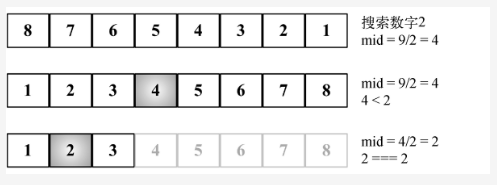

## 二者区别
动态规划算法与分治法类似，其基本思想也是将待求解问题分解成若干个子问题，先求解子问题，然后从这些子问题的解得到原问题的解。

* 分而治之方法是把问题分解成相互独立的子问题，然后组合它们的答案，
* 而动态规划则是将问题分解成相互依赖的子问题。

与分治法不同的是，适合于用动态规划求解的问题，经分解得到子问题往往「不是互相独立」的，而分而治之的子问题是相互独立的
若用分治法来解这类问题，则分解得到的子问题数目太多，有些子问题被重复计算了很多次
如果我们能够保存已解决的子问题的答案，而在需要时再找出已求得的答案，这样就可以避免大量的重复计算，节省时间。

总结：
* 动态规划：有最优子结构和重叠子问题
* 分而治之：各子问题独立


## 分而治之
分而治之是算法设计中的一种方法。它将一个问题分成多个和原问题相似的小问题，递归解决小问题，再将解决方式合并以解决原来的问题。

三个步骤：
* 分解：将原问题分解为若干个规模较小，相对独立，与原问题形式相同的子问题
* 解决：若子问题规模较小且易于解决时，则直接解。否则，递归地解决各子问题
* 合并：将各子问题的解合并为原问题的解

归并和排序算法两者的共同点在于它们都是分而治之算法。

## 分而治之算法可以分成三个部分
1. 分解原问题为多个子问题（原问题的多个小实例）。
2. 解决子问题，用返回解决子问题的方式的递归算法。递归算法的基本情形可以用来解决子问题。
3. 组合这些子问题的解决方式，得到原问题的解。

## 将二分搜索用分而治之的方式实现
* 分解：计算mid并搜索数组较小或较大的一半。
* 解决：在较小或较大的一半中搜索值。
* 合并：这步不需要，因为我们直接返回了索引值。

## 3.2.binarySearchRecursive是分而治之算法
```
我们将low参数以0传递，将high参数以sortedArray.length - 1传递，来在已排序的数组中进行搜索。
在计算mid元素的索引值后，我们确定待搜索的值比mid大还是小。如果小（行{1}）或大（行{2}），就再次调用binarySearchRecursive函数，
但是这次， 我们在子数组中进行搜索，改变low或high参数（不同于我们在第13章中那样移动指针）。
如果不大也不小，表示我们找到了这个值（行{3}） 并且这就是一 种基本情形。还有一种情况是low比high要大，这表示算法没有找到这个值（行{4}）。
```
<!--  -->


### 例如归并排序的实现，同样经历了实现分而治之的三个步骤：
* 分解：把数组从中间一分为二
* 解决：递归地对两个子数组进行归并排序
* 合并：将两个字数组合并称有序数组

同样关于快速排序的实现，亦如此：
* 分：选基准，按基准把数组分成两个字数组
* 解：递归地对两个字数组进行快速排序
* 合：对两个字数组进行合并

同样二分搜索也能使用分而治之的思想去实现:
```js
function binarySearch(arr,l,r,target){
    if(l> r){
        return -1;
    }
    let mid = l + Math.floor((r-l)/2)
    if(arr[mid] === target){
        return mid;
    }else if(arr[mid] < target ){
        return binarySearch(arr,mid + 1,r,target)
    }else{
        return binarySearch(arr,l,mid - 1,target)
    }
}
```
