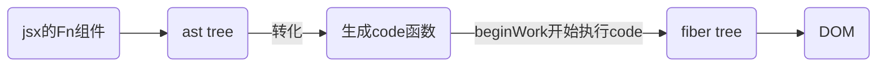
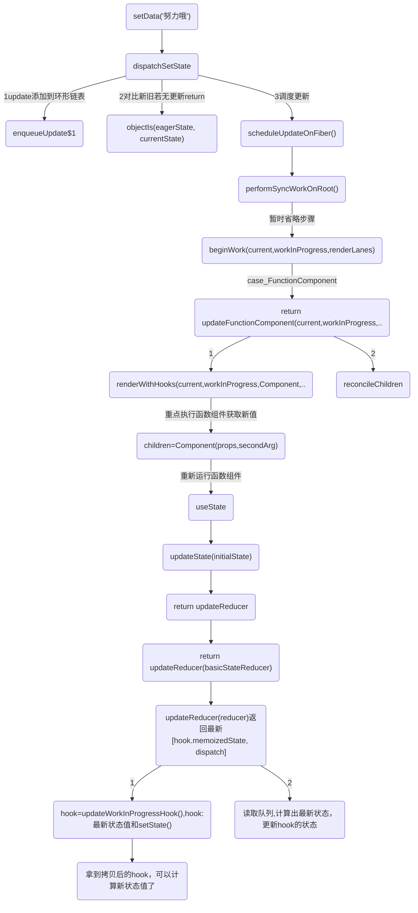

## react 特点
### 模板引擎
react初始化的时候使用babel 处理jsx模板组件，得到ast树的结构树,并转化为code函数；<br/>
jsx 转换为了浏览器能够识别的原生js语法，为 react 后续对状态改变、事件响应以及页面更新等奠定了基础。


### 其他
1. 配合ts比较友好,函数式编程是用函数的组合来进行编程,组件化开发
    1. 比如区分容器组件和展示组件
    2. react提倡把业务拆分更小的组件，使用shouldComponentUpdate(){return true}重新渲染组件或则 React.memo():{return true}不会渲染,进行深层比较去控制组件的渲染
2. react 渲染/更新方式
3. 丰富的技术生态圈,很多大型应用都是react

## vue和react异同
### 异同
1. 虚拟dom,以数据为驱动的开发模式;vue和react同样采用的是虚拟dom 编译时+运行时+渲染,渲染时找出差异修改;

2. 单向数据流，单向数据流就是model的更新会触发view的更新，view的更新不会触发model的更新，它们的作用是单向的


3. 不同：Vue 是通过 template 模版进行编译的，所以在编译的时候可以很好对静态节点进行分析然后进行打补丁标记，然后在 Diff 的时候，Vue2 是判断如果是静态节点则跳过过循环对比，而 Vue3 则是把整个静态节点进行提升处理，Diff 的时候是不过进入循环的，所以 Vue3 比 Vue2 的 Diff 性能更高效。

4. 不同：React 因为是通过 JSX 进行编译的，是无法进行静态节点分析的，所以 React 在对静态节点处理这一块是要逊色的。
```
React使用的是babel
```

5. 渲染/更新方式
在Vue中，一个组件在渲染期间依赖于自动追踪，因此vue框架知道提前哪一个组件需要渲染当组件状态发生改变时。每个组件可以被认为具有自动为你实现react shouldComponentUpdate。

6. react 改变state,react不允许直接更改状态，需要setState(),并且批量地对state进行更新以提高性能的,减少渲染次数

7. Vue2 和 Vue3 的比对和更新是同步进行的，这个跟 React15 是相同的，就是在比对的过程中，如果发现了那些节点需要移动或者更新或删除，是立即执行的，也就是 React 中常讲的不可中断的更新，如果比对量过大的话，就会造成卡顿，所以 React16 起就更改为了比对和更新是异步进行的，所以 React16 以后的 Diff 是可以中断，Diff 和任务调度都是在内存中进行的，所以即便中断了，用户也不会知道。

8. Vue2 和 Vue3 都使用了双端对比算法，而 React 的 Fiber 由于是单向链表的结构，所以在 React 不设置由右向左的链表之前，都无法实现双端对比。

## 优化.useState同步还是异步? 
参考：[React/setState的异步和同步问题](./React/setState异步-同步)

## 两大阶段：render和commit
## render构建fiber树:beginWork阶段和completeWork阶段
render阶段是在内存中构建一棵新的fiber树（称为workInProgress树）,构建过程是依照现有fiber树（current树）从root开始深度优先遍历再回溯到root的过程，这个过程中每个fiber节点都会经历两个阶段：beginWork和completeWork。
1. beginWork阶段:将ast树转换为fiber 树。
2. completeWork阶段:生成实例

组件的状态计算、diff的操作:通过 Diff 算法找出所有节点变更，例如节点新增、删除、属性变更等等, 获得需要更新的节点信息，以及render函数的执行，发生在beginWork阶段

### render可调度
在 render 阶段，一个庞大的更新任务被分解为了一个个的工作单元，这些工作单元有着不同的优先级，React 可以根据优先级的高低去实现工作单元的打断和恢复。

异步可中断更新，在构建 workInProgress 的过程中，如果有更高优先级的更新产生， React 会停止 workInProgress fiber tree 的构建，然后开始处理更高优先级的更新，重新构建 workInProgress fiber tree。

等更高优先级的更新处理完毕之后，才会处理原来被中断的更新。

React fiber的构建的过程以每个fiber作为一个工作单元，进行工作循环，工作循环中每次处理一个任务（工作单元），处理完毕有一次喘息的机会：
```js
while (nextUnitOfWork !== null && !shouldYieldToRenderer()) {
  nextUnitOfWork = performUnitOfWork(nextUnitOfWork);
}
```

## commit阶段:可以分为3个阶段：
在render阶段结束后，会进入commit阶段，该阶段不可中断,commit阶段的调度优先级采用的是最高优先级，以保证commit阶段同步执行不可被打断。

相应的节点进行提交，渲染到页面上,在commit阶段就会操作真实节点，将它们插入到dom树中:
* 1.Before mutation 阶段（执行 DOM 操作前）；
    - 对于类组件，执行 getSnapshotBeforeUpdate 生命周期
    - 对于函数组件，异步调用 useEffect

* 2.mutation 阶段（执行 DOM 操作）；
    - 进行真实的 DOM 操作

* 3.layout 阶段（执行 DOM 操作后）
    - 对于类组件，会执行setState的callback
    - 对于函数组件，会执行useLayoutEffect

主要是去依据workInProgress树中有变化的那些节点（render阶段的completeWork过程收集到的effect链表）,去完成DOM操作，将更新应用到页面上，除此之外，还会异步调度useEffect以及同步执行useLayoutEffect。

complete阶段workInProgress节点都是经过diff算法调和过的，也就意味着对于某个节点来说它fiber的形态已经基本确定了，但除此之外还有两点：
* 目前只有fiber形态变了，对于原生DOM组件（HostComponent）和文本节点（HostText）的fiber来说，对应的DOM节点（fiber.stateNode）并未变化。
* 经过Diff生成的新的workInProgress节点持有了flag(即effectTag)

workInProgress节点的completeWork阶段主要做的:
* 真实DOM节点的创建以及挂载
```
构建过程中，会自下而上将子节点的第一层第一层插入到当前节点。
更新过程中，会计算DOM节点的属性，一旦属性需要更新，会为DOM节点对应的workInProgress节点标记Update的effectTag
```
* effectList的收集
```
执行beginWork后会创建子 Fiber 节点，节点上可能存在effectTag。
```
* DOM属性的处理,次要理解
* 错误处理,次要理解

## hook之state
beginWork-->children=Component(props,secondArg)--执行函数组件-->dev.useState(initialState)

初始化state:
1. 第一步处理链表
2. 绑定dispatch
3. 返回[hook.memoizedState,dispatch]

## setState 更新,重点在dispatchSetState
当执行setState("努力哦")-->dispatchSetState 其中对比新旧值：
```js
objectIs(eagerState, currentState)
// 如果有更新：调度更新
performSyncWorkOnRoot()
```

1. 重新执行函数组件，updateReducer(reducer)返回最新[hook.memoizedState, dispatch]

2. reconcileChildren 走上面的更新逻辑

