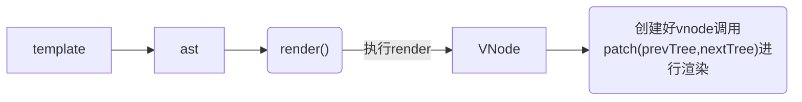
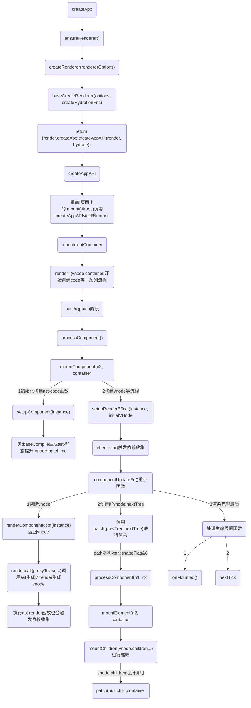

## vue 特点
重点：`render.call(proxyToUse,..)调用ast生成的render生成vnode`


1. Vue的template、script、style是分离的，可读性和可维护性比较好

2. 提供了便捷的模板命令
```
vue 用v-if 条件渲染div
还有v-model,v-on:click,v-for

react中用js，运算符去实现 v-if, array.map() 去实现 v-for
```

3. 提供了computed,watch 副作用的钩子，在react 统一使用useEffect去实现这些功能
4. 改变组件状态：
```js
vue: this.data = x;
react: setState(x);
```

4. 模板引擎和生成虚拟dom方式不同;vue和react同样采用的是虚拟dom 运行时+编译时 都是找出差异修改;


## 宏观流程
* compiler表示template-->AST抽象语法树

* reactivity表示响应式,effect 副作用函数（Vue3中已经没有了watcher概念,由effect取而代之）
```
1. Vue3 用 ES6的Proxy 重构了响应式，new Proxy(target, handler)

2. Proxy 的 get handle 里 执行track() 用来收集依赖(收集 activeEffect，也就是 effect )
3. Proxy 的 set handle 里执行 trigger() 用来触发响应(执行收集的 effect)
```
* runtime表示运行时相关功能，虚拟DOM(即：VNode)、diff算法、真实DOM操作等

## 首次渲染流程
renderComponentRoot 执行构建ast生成的render() 生成vnode
	组件挂载前:onBeforeMount在什么时候执行?



### 1阶段函数
```js
mount(rootContainer, isHydrate, isSVG) {
	// 省略函数
	// 未挂载执行
	if (!isMounted) {
		// 水合或者渲染虚拟节点
		if (isHydrate && hydrate) {
			hydrate(vnode, rootContainer);
		}
		else {
			console.log('%c运行时==>createAppAPI--mount中调用render:渲染虚拟节点,render函数可以说是vue重点中的重点,vue的patch算法便是在这里执行：', 'color:yellow')
			render(vnode, rootContainer, isSVG);
		}
	}
	// 省略函数
}
```

```js
const render = (vnode, container, isSVG) => {
	if (vnode == null) {
		// 没有传入新的虚拟节点，当存在旧虚拟节点，则卸载旧虚拟节点
		if (container._vnode) {
			console.log('%crender:-->虚拟节点不存在，则销毁', 'color:red', '')
			unmount(container._vnode, null, null, true);
		}
	}
	else {
		// 创建、或者更新节点，创建的时候这里container._vnode是不存在的
		// 第一个参数: 旧的虚拟节点
		// 第二个参数：新的vnode
		// 第三个参数：vnode转化为dom，最终要挂载的dom容器
		console.log('%crender:-->存在新虚拟节点，则执行patch算法，比较新旧虚拟节点,虚拟节点存在，创建或更新', 'color:red')
		patch(container._vnode || null, vnode, container, null, null, null, isSVG);
	}
	flushPreFlushCbs();
	flushPostFlushCbs();
	// 缓存虚拟节点数据，作为已完成渲染的标识,容器指向新的虚拟的节点
	container._vnode = vnode;
};
```

```js
const patch = (n1, n2, container, anchor = null, parentComponent = null, parentSuspense = null, isSVG = false, slotScopeIds = null, optimized = isHmrUpdating ? false : !!n2.dynamicChildren) => {
	// 省略函数
	// 根据vNode类型，执行不同的算法
	switch (type) {
			default:
			if (shapeFlag & 1 /* ShapeFlags.ELEMENT */) {
				console.log(`%c运行时==>patch-->较为重点的1:ELEMENT类型:调用processElement处理DOM元素:`, 'color:red')
				processElement(n1, n2, container, anchor, parentComponent, parentSuspense, isSVG, slotScopeIds, optimized);
			}
			else if (shapeFlag & 6 /* ShapeFlags.COMPONENT */) {
				console.log(`%c运行时==>patch-->较为重点的2:COMPONENT:调用processComponent处理组件元素:`, 'color:red')
				processComponent(n1, n2, container, anchor, parentComponent, parentSuspense, isSVG, slotScopeIds, optimized);
			}
	}
}
```

```js
const processComponent = (n1, n2, container, anchor, parentComponent, parentSuspense, isSVG, slotScopeIds, optimized) => {
	n2.slotScopeIds = slotScopeIds;
	if (n1 == null) {
		if (n2.shapeFlag & 512 /* ShapeFlags.COMPONENT_KEPT_ALIVE */) {
			parentComponent.ctx.activate(n2, container, anchor, isSVG, optimized);
		}
		else {
			console.log(`%cpath之processComponent:1调用mountComponent:`, 'color:magenta')
			mountComponent(n2, container, anchor, parentComponent, parentSuspense, isSVG, optimized);
		}
	}
	else {
		console.log(`%cpath之processComponent:2调用updateComponent:`, 'color:magenta')
		updateComponent(n1, n2, optimized);
	}
};

const mountComponent = (initialVNode, container, anchor, parentComponent, parentSuspense, isSVG, optimized) => {
	const instance = (initialVNode.component = createComponentInstance(initialVNode, parentComponent, parentSuspense));
	console.log(`%c组件挂载：mountComponent:1调用createComponentInstance创建组件实例:`, 'color:magenta', instance)
	if (instance.type.__hmrId) {
		registerHMR(instance);
	}
	{
		pushWarningContext(initialVNode);
		startMeasure(instance, `mount`);
	}
	// inject renderer internals for keepAlive
	// 将keepAlive注入渲染器内部
	if (isKeepAlive(initialVNode)) {
		instance.ctx.renderer = internals;
	}
	// resolve props and slots for setup context
	{
		{
			startMeasure(instance, `init`);
		}

		console.log(`%c组件挂载：mountComponent:2调用setupComponent设置组件实例:`, 'color:magenta')
		console.log('test:定义在data的响应式start==>mountComponent调用setupComponent')
		setupComponent(instance);
		{
			endMeasure(instance, `init`);
		}
	}
	// setup() is async. This component relies on async logic to be resolved
	// before proceeding
	if (instance.asyncDep) {
		parentSuspense && parentSuspense.registerDep(instance, setupRenderEffect);
		// Give it a placeholder if this is not hydration
		// TODO handle self-defined fallback
		if (!initialVNode.el) {
			const placeholder = (instance.subTree = createVNode(Comment));
			processCommentNode(null, placeholder, container, anchor);
		}
		return;
	}
	console.log(`%c组件挂载：==end mountComponent:3调用setupRenderEffect 执行带副作用的渲染函数setupRenderEffect:`, 'color:magenta')
	setupRenderEffect(instance, initialVNode, container, anchor, parentSuspense, isSVG, optimized);
	{
		popWarningContext();
		endMeasure(instance, `mount`);
	}
};
```

renderComponentRoot 创建好vnode -->patch
```js
const componentUpdateFn = () => {
	console.log('effect.run==>:调用componentUpdateFn组件的初始挂载和更新')
  if (!instance.isMounted) {
		  if (el && hydrateNode) {
						// 省略函数
			}
			else {
				{
					startMeasure(instance, `render`);
				}
				console.log('$ceffect.run==>调用renderComponentRoot，获取组件当前的 VNode', 'color:chartreuse')
				console.log('$ceffect.run==>调用renderComponentRoot，ast 创建render函数执行时会读取组件的响应式数据，这会触发依赖收集', 'color:chartreuse')
				const subTree = (instance.subTree = renderComponentRoot(instance));
				{
					endMeasure(instance, `render`);
				}
				{
					startMeasure(instance, `patch`);
				}
				console.log("effect.run==>创建好vnode,调用patch进行组件内容的渲染,把子树挂载到container上")
				patch(null, subTree, container, anchor, instance, parentSuspense, isSVG);
				{
					endMeasure(instance, `patch`);
				}
				initialVNode.el = subTree.el;
			}
	}
}
```

```js
const setupRenderEffect = (instance, initialVNode, container, anchor, parentSuspense, isSVG, optimized) => {
	// 省略函数
	console.log('依赖收集==>setupRenderEffect:3调用ReactiveEffect 创建一个副作用:', { componentUpdateFn })
	const effect = (instance.effect = new ReactiveEffect(componentUpdateFn, () => queueJob(update), instance.scope // track it in component's effect scope
	));
	console.log('依赖收集==>a,关键：调用effect.run()为了触发一下依赖收集')
	const update = (instance.update = () => effect.run());
	// 省略函数
}
```

```js
function renderComponentRoot(instance) {
    const { type: Component, vnode, proxy, withProxy, props, propsOptions: [propsOptions], slots, attrs, emit, render, renderCache, data, setupState, ctx, inheritAttrs } = instance;
    let result;
    let fallthroughAttrs;
    const prev = setCurrentRenderingInstance(instance);
    {
      accessedAttrs = false;
    }
    try {
      if (vnode.shapeFlag & 4 /* ShapeFlags.STATEFUL_COMPONENT */) {
        // withProxy is a proxy with a different `has` trap only for
        // runtime-compiled render functions using `with` block.
        const proxyToUse = withProxy || proxy;
        console.log('vnode-构建:start-->调用Ast生成render函数', { render })
        result = normalizeVNode(render.call(proxyToUse, proxyToUse, renderCache, props, setupState, data, ctx));
        console.log('vnode-构建:end-->调用Ast生成render函数render返回vnode:', { result })
        fallthroughAttrs = attrs;
      }
		// 省略函数

}
```

### 2阶段函数
初始化：path-->processComponent(n1, n2, container, anchor, parentComponent, parentSuspense, isSVG, slotScopeIds, optimized);
```js
const patch = (n1, n2, container, anchor = null, parentComponent = null, parentSuspense = null, isSVG = false, slotScopeIds = null, optimized = isHmrUpdating ? false : !!n2.dynamicChildren) => {
	/*
	n1,旧节点
	n2,新节点
	container,DOM容器，vNode渲染成dom会挂载到该节点下 
	*/

	// 省略函数

	const { type, ref, shapeFlag } = n2;

	console.log(`%c运行时==>patch开启,n1旧节点、n2新节点:`, 'color:yellow', { type, n1, n2 })
	// 根据vNode类型，执行不同的算法
	switch (type) {

		// 省略函数

		default:
			if (shapeFlag & 1 /* ShapeFlags.ELEMENT */) {
				console.log(`%c运行时==>patch-->较为重点的1:ELEMENT类型:调用processElement处理DOM元素:`, 'color:red')
				processElement(n1, n2, container, anchor, parentComponent, parentSuspense, isSVG, slotScopeIds, optimized);
			}
			else if (shapeFlag & 6 /* ShapeFlags.COMPONENT */) {
				console.log(`%c运行时==>patch-->较为重点的2:COMPONENT:调用processComponent处理组件元素:`, 'color:red')
				processComponent(n1, n2, container, anchor, parentComponent, parentSuspense, isSVG, slotScopeIds, optimized);
			}
			else if (shapeFlag & 64 /* ShapeFlags.TELEPORT */) {
				console.log(`%c运行时==>patch处理TELEPORT:`, 'color:red')
				type.process(n1, n2, container, anchor, parentComponent, parentSuspense, isSVG, slotScopeIds, optimized, internals);
			}
			else if (shapeFlag & 128 /* ShapeFlags.SUSPENSE */) {
				console.log(`%c运行时==>patch处理SUSPENSE:`, 'color:red')
				type.process(n1, n2, container, anchor, parentComponent, parentSuspense, isSVG, slotScopeIds, optimized, internals);
			}
			else {
				warn$1('Invalid VNode type:', type, `(${typeof type})`);
			}
	}
	// set ref
	if (ref != null && parentComponent) {
		setRef(ref, n1 && n1.ref, parentSuspense, n2 || n1, !n2);
	}
```

mountElement-->mountChildren
```js
const mountElement = (vnode, container, anchor, parentComponent, parentSuspense, isSVG, slotScopeIds, optimized) => {
	let el;
	let vnodeHook;
	const { type, props, shapeFlag, transition, dirs } = vnode;

	el = vnode.el = hostCreateElement(vnode.type, isSVG, props && props.is, props);
	console.log('%c挂载dom元素mountElement调用hostCreateElement创建新元素', 'color:magenta', el)
	// mount children first, since some props may rely on child content
	// being already rendered, e.g. `<select value>`
	if (shapeFlag & 8 /* ShapeFlags.TEXT_CHILDREN */) {
		console.log('挂载dom元素mountElement:处理子节点是文本内容的情况')
		hostSetElementText(el, vnode.children);
	}
	else if (shapeFlag & 16 /* ShapeFlags.ARRAY_CHILDREN */) {
		console.log('%c挂载dom元素mountElement:处理子节点是数组的情况,调用mountChildren对vnode.children进行递归', 'color:magenta', vnode.children)
		mountChildren(vnode.children, el, null, parentComponent, parentSuspense, isSVG && type !== 'foreignObject', slotScopeIds, optimized);
	}
	// 省略函数
}
```

mountChildren开始递归
```js
const mountChildren = (children, container, anchor, parentComponent, parentSuspense, isSVG, slotScopeIds, optimized, start = 0) => {
	for (let i = start; i < children.length; i++) {
		const child = (children[i] = optimized
			? cloneIfMounted(children[i])
			: normalizeVNode(children[i]));
		console.log('%c调用mountChildren递归调用patch', 'color:cyan')
		patch(null, child, container, anchor, parentComponent, parentSuspense, isSVG, slotScopeIds, optimized);
	}
};
```

处理生命周期
```js
const componentUpdateFn = () => {

	// 省略

	else {
		console.log("effect.run==>创建好vnode,调用patch进行组件内容的渲染,把子树挂载到container上")
		patch(null, subTree, container, anchor, instance, parentSuspense, isSVG);
	}

	// 省略

	console.log('%ceffect.run==>:调用patch进行组件渲染结束,开始处理生命周期函数', 'color:yellow')
	// mounted hook
	if (m) {
		console.log('effect.run==>:生命周期mounted')
		queuePostRenderEffect(m, parentSuspense);
	}
	// onVnodeMounted
	if (!isAsyncWrapperVNode &&
		(vnodeHook = props && props.onVnodeMounted)) {
		const scopedInitialVNode = initialVNode;
		queuePostRenderEffect(() => invokeVNodeHook(vnodeHook, parent, scopedInitialVNode), parentSuspense);
	}
}
```

<br />

## data发生改变dom更新流程
参考：[data发生改变dom更新流程](./Vue/data发生改变dom更新流程)

## v-for的`:key`
参考：[v-for的key](./Vue/v-for的key)
