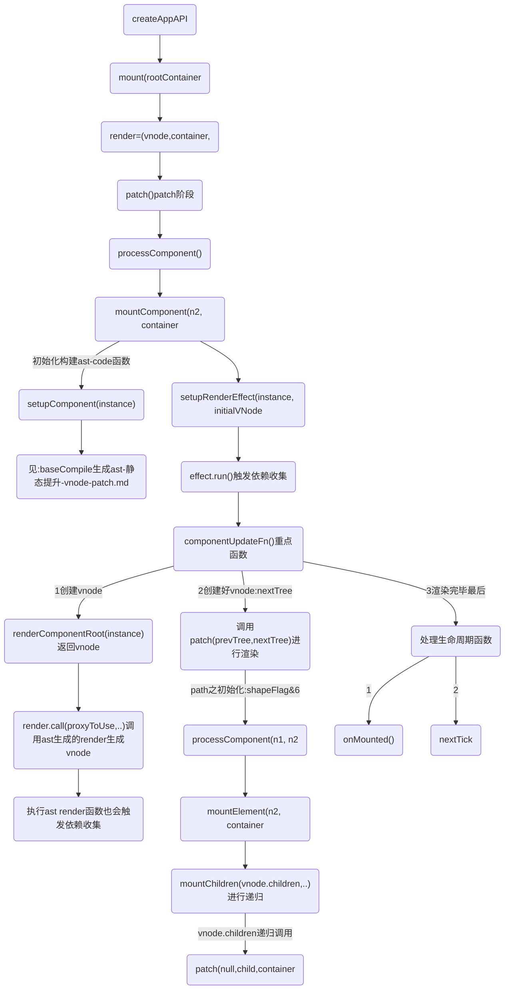
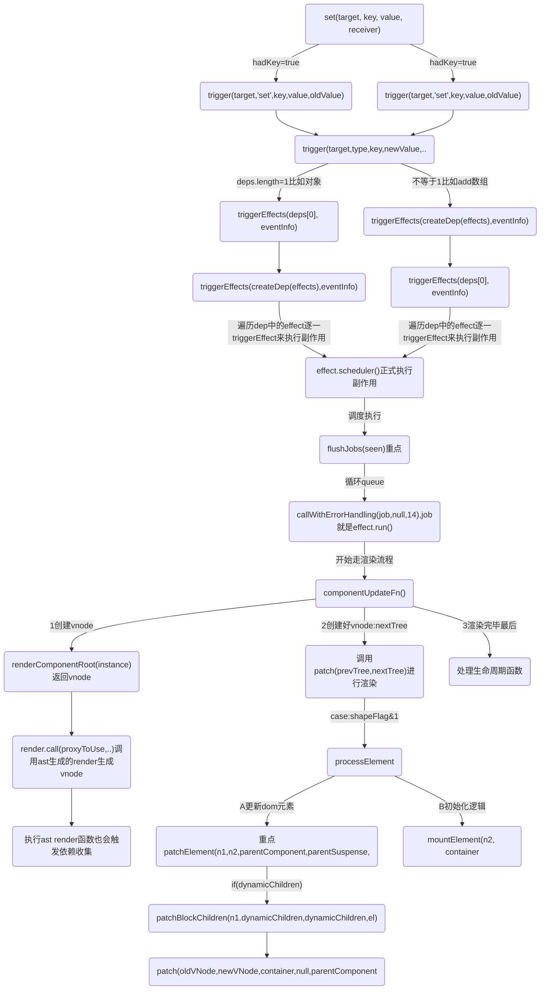
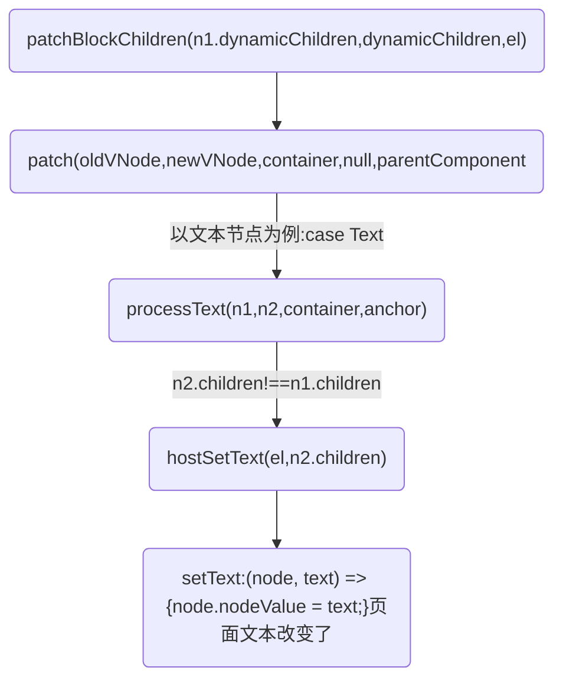
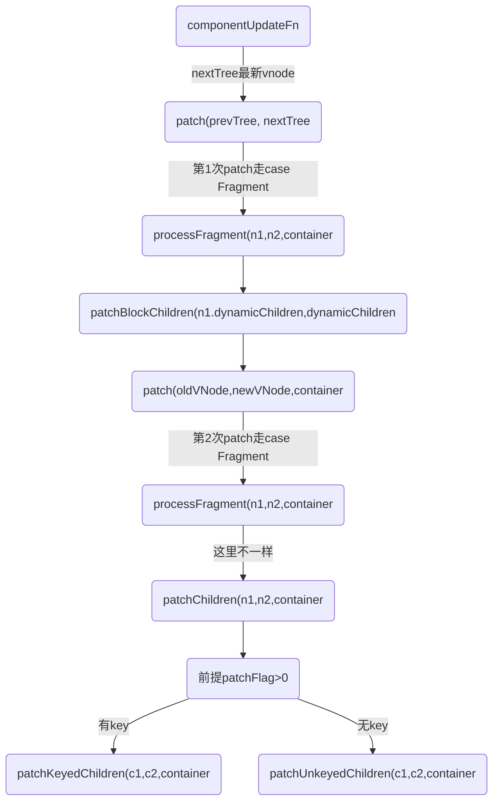
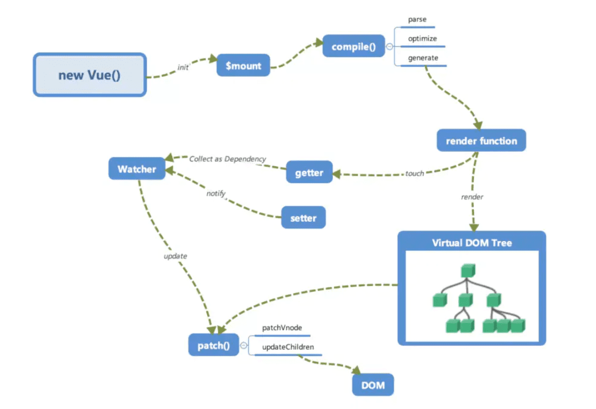

# vue 特点
重点：`render.call(proxyToUse,..)调用ast生成的render生成vnode`


* 1.Vue的template、script、style是分离的，可读性和可维护性比较好

* 2.提供了便捷的模板命令
```
vue 用v-if 条件渲染div
还有v-model,v-on:click,v-for

react中用js，运算符去实现 v-if, array.map() 去实现 v-for
```

* 3.提供了computed,watch 副作用的钩子，在react 统一使用useEffect去实现这些功能
```js
改变组件状态：
vue: this.data = x;
react: setState(x);
```
4. 模板引擎和生成虚拟dom方式不同;

## vue模板引擎
一方面从初始化 data 开始，到解析 template 模版，进行依赖收集。另一方面能够从 data 改变，通知渲染 Effect 更新，到页面变化；


vue和react同样采用的是虚拟dom 运行时+编译时 都是找出差异修改;
vue在模板的compile-time做了的优化:比如提升不变的vNode(静态提升)，以及blockTree配合patchFlag靶向更新

编译模板阶段生成render函数:
如果有配置，直接使用配置的render函数，如果没有，使用运行时编译器，把模板编译成render函数。

注意:如果在webpack：
```
用vue-loader将.vue文件编译成js，然后使用render函数渲染，打包的时候就编译成了render函数需要的格式，不需要在客户端编译;
```

在执行render函数的过程中会搜集所有依赖，将来依赖发生变换时会出现执行updateComponent函数。

在执行_update的过程中，会触发patch函数，由于目前还没有就的虚拟DOM树，因此直接为当前的虚拟DOM树的每一个节点生成对应elm属性，即真实DOM。

最终会把创建好的组件实例挂载到vnode的componentInstance属性中，以便复用。

1. baseParse生成ast

2. transform对ast进行转换,变换AST的结构
因为只有拿到生成的 AST 我们才能遍历 AST 的节点进行 transform 转换操作，比如解析 v-if、v-for 等各种指令。
也能对源码进行优化:
vue3新特性：transform中的hoistStatic发生静态提升
hoistStatic其会递归ast并发现一些不会变的节点与属性，给他们打上可以静态提升的标记。在生成代码字符串阶段，将其序列化成字符串、以减少编译和渲染成本。

3. generate根据变换后的转换AST生成render()函数

4. renderComponentRoot 执行构建ast生成的render() 生成vnode
	组件挂载前:onBeforeMount在什么时候执行?



### 1阶段函数
```js
mount(rootContainer, isHydrate, isSVG) {
	// 省略函数
	// 未挂载执行
	if (!isMounted) {
		// 水合或者渲染虚拟节点
		if (isHydrate && hydrate) {
			hydrate(vnode, rootContainer);
		}
		else {
			console.log('%c运行时==>createAppAPI--mount中调用render:渲染虚拟节点,render函数可以说是vue重点中的重点,vue的patch算法便是在这里执行：', 'color:yellow')
			render(vnode, rootContainer, isSVG);
		}
	}
	// 省略函数
}
```

```js
const render = (vnode, container, isSVG) => {
	if (vnode == null) {
		// 没有传入新的虚拟节点，当存在旧虚拟节点，则卸载旧虚拟节点
		if (container._vnode) {
			console.log('%crender:-->虚拟节点不存在，则销毁', 'color:red', '')
			unmount(container._vnode, null, null, true);
		}
	}
	else {
		// 创建、或者更新节点，创建的时候这里container._vnode是不存在的
		// 第一个参数: 旧的虚拟节点
		// 第二个参数：新的vnode
		// 第三个参数：vnode转化为dom，最终要挂载的dom容器
		console.log('%crender:-->存在新虚拟节点，则执行patch算法，比较新旧虚拟节点,虚拟节点存在，创建或更新', 'color:red')
		patch(container._vnode || null, vnode, container, null, null, null, isSVG);
	}
	flushPreFlushCbs();
	flushPostFlushCbs();
	// 缓存虚拟节点数据，作为已完成渲染的标识,容器指向新的虚拟的节点
	container._vnode = vnode;
};
```

```js
const patch = (n1, n2, container, anchor = null, parentComponent = null, parentSuspense = null, isSVG = false, slotScopeIds = null, optimized = isHmrUpdating ? false : !!n2.dynamicChildren) => {
	// 省略函数
	// 根据vNode类型，执行不同的算法
	switch (type) {
			default:
			if (shapeFlag & 1 /* ShapeFlags.ELEMENT */) {
				console.log(`%c运行时==>patch-->较为重点的1:ELEMENT类型:调用processElement处理DOM元素:`, 'color:red')
				processElement(n1, n2, container, anchor, parentComponent, parentSuspense, isSVG, slotScopeIds, optimized);
			}
			else if (shapeFlag & 6 /* ShapeFlags.COMPONENT */) {
				console.log(`%c运行时==>patch-->较为重点的2:COMPONENT:调用processComponent处理组件元素:`, 'color:red')
				processComponent(n1, n2, container, anchor, parentComponent, parentSuspense, isSVG, slotScopeIds, optimized);
			}
	}
}
```

```js
const processComponent = (n1, n2, container, anchor, parentComponent, parentSuspense, isSVG, slotScopeIds, optimized) => {
	n2.slotScopeIds = slotScopeIds;
	if (n1 == null) {
		if (n2.shapeFlag & 512 /* ShapeFlags.COMPONENT_KEPT_ALIVE */) {
			parentComponent.ctx.activate(n2, container, anchor, isSVG, optimized);
		}
		else {
			console.log(`%cpath之processComponent:1调用mountComponent:`, 'color:magenta')
			mountComponent(n2, container, anchor, parentComponent, parentSuspense, isSVG, optimized);
		}
	}
	else {
		console.log(`%cpath之processComponent:2调用updateComponent:`, 'color:magenta')
		updateComponent(n1, n2, optimized);
	}
};

const mountComponent = (initialVNode, container, anchor, parentComponent, parentSuspense, isSVG, optimized) => {
	const instance = (initialVNode.component = createComponentInstance(initialVNode, parentComponent, parentSuspense));
	console.log(`%c组件挂载：mountComponent:1调用createComponentInstance创建组件实例:`, 'color:magenta', instance)
	if (instance.type.__hmrId) {
		registerHMR(instance);
	}
	{
		pushWarningContext(initialVNode);
		startMeasure(instance, `mount`);
	}
	// inject renderer internals for keepAlive
	// 将keepAlive注入渲染器内部
	if (isKeepAlive(initialVNode)) {
		instance.ctx.renderer = internals;
	}
	// resolve props and slots for setup context
	{
		{
			startMeasure(instance, `init`);
		}

		console.log(`%c组件挂载：mountComponent:2调用setupComponent设置组件实例:`, 'color:magenta')
		console.log('test:定义在data的响应式start==>mountComponent调用setupComponent')
		setupComponent(instance);
		{
			endMeasure(instance, `init`);
		}
	}
	// setup() is async. This component relies on async logic to be resolved
	// before proceeding
	if (instance.asyncDep) {
		parentSuspense && parentSuspense.registerDep(instance, setupRenderEffect);
		// Give it a placeholder if this is not hydration
		// TODO handle self-defined fallback
		if (!initialVNode.el) {
			const placeholder = (instance.subTree = createVNode(Comment));
			processCommentNode(null, placeholder, container, anchor);
		}
		return;
	}
	console.log(`%c组件挂载：==end mountComponent:3调用setupRenderEffect 执行带副作用的渲染函数setupRenderEffect:`, 'color:magenta')
	setupRenderEffect(instance, initialVNode, container, anchor, parentSuspense, isSVG, optimized);
	{
		popWarningContext();
		endMeasure(instance, `mount`);
	}
};
```

renderComponentRoot 创建好vnode -->patch
```js
const componentUpdateFn = () => {
	console.log('effect.run==>:调用componentUpdateFn组件的初始挂载和更新')
  if (!instance.isMounted) {
		  if (el && hydrateNode) {
						// 省略函数
			}
			else {
				{
					startMeasure(instance, `render`);
				}
				console.log('$ceffect.run==>调用renderComponentRoot，获取组件当前的 VNode', 'color:chartreuse')
				console.log('$ceffect.run==>调用renderComponentRoot，ast 创建render函数执行时会读取组件的响应式数据，这会触发依赖收集', 'color:chartreuse')
				const subTree = (instance.subTree = renderComponentRoot(instance));
				{
					endMeasure(instance, `render`);
				}
				{
					startMeasure(instance, `patch`);
				}
				console.log("effect.run==>创建好vnode,调用patch进行组件内容的渲染,把子树挂载到container上")
				patch(null, subTree, container, anchor, instance, parentSuspense, isSVG);
				{
					endMeasure(instance, `patch`);
				}
				initialVNode.el = subTree.el;
			}
	}
}
```

```js
const setupRenderEffect = (instance, initialVNode, container, anchor, parentSuspense, isSVG, optimized) => {
	// 省略函数
	console.log('依赖收集==>setupRenderEffect:3调用ReactiveEffect 创建一个副作用:', { componentUpdateFn })
	const effect = (instance.effect = new ReactiveEffect(componentUpdateFn, () => queueJob(update), instance.scope // track it in component's effect scope
	));
	console.log('依赖收集==>a,关键：调用effect.run()为了触发一下依赖收集')
	const update = (instance.update = () => effect.run());
	// 省略函数
}
```

```js
function renderComponentRoot(instance) {
    const { type: Component, vnode, proxy, withProxy, props, propsOptions: [propsOptions], slots, attrs, emit, render, renderCache, data, setupState, ctx, inheritAttrs } = instance;
    let result;
    let fallthroughAttrs;
    const prev = setCurrentRenderingInstance(instance);
    {
      accessedAttrs = false;
    }
    try {
      if (vnode.shapeFlag & 4 /* ShapeFlags.STATEFUL_COMPONENT */) {
        // withProxy is a proxy with a different `has` trap only for
        // runtime-compiled render functions using `with` block.
        const proxyToUse = withProxy || proxy;
        console.log('vnode-构建:start-->调用Ast生成render函数', { render })
        result = normalizeVNode(render.call(proxyToUse, proxyToUse, renderCache, props, setupState, data, ctx));
        console.log('vnode-构建:end-->调用Ast生成render函数render返回vnode:', { result })
        fallthroughAttrs = attrs;
      }
		// 省略函数

}
```

### 2阶段函数
初始化：path-->processComponent(n1, n2, container, anchor, parentComponent, parentSuspense, isSVG, slotScopeIds, optimized);
```js
const patch = (n1, n2, container, anchor = null, parentComponent = null, parentSuspense = null, isSVG = false, slotScopeIds = null, optimized = isHmrUpdating ? false : !!n2.dynamicChildren) => {
	/*
	n1,旧节点
	n2,新节点
	container,DOM容器，vNode渲染成dom会挂载到该节点下 
	*/

	// 省略函数

	const { type, ref, shapeFlag } = n2;

	console.log(`%c运行时==>patch开启,n1旧节点、n2新节点:`, 'color:yellow', { type, n1, n2 })
	// 根据vNode类型，执行不同的算法
	switch (type) {

		// 省略函数

		default:
			if (shapeFlag & 1 /* ShapeFlags.ELEMENT */) {
				console.log(`%c运行时==>patch-->较为重点的1:ELEMENT类型:调用processElement处理DOM元素:`, 'color:red')
				processElement(n1, n2, container, anchor, parentComponent, parentSuspense, isSVG, slotScopeIds, optimized);
			}
			else if (shapeFlag & 6 /* ShapeFlags.COMPONENT */) {
				console.log(`%c运行时==>patch-->较为重点的2:COMPONENT:调用processComponent处理组件元素:`, 'color:red')
				processComponent(n1, n2, container, anchor, parentComponent, parentSuspense, isSVG, slotScopeIds, optimized);
			}
			else if (shapeFlag & 64 /* ShapeFlags.TELEPORT */) {
				console.log(`%c运行时==>patch处理TELEPORT:`, 'color:red')
				type.process(n1, n2, container, anchor, parentComponent, parentSuspense, isSVG, slotScopeIds, optimized, internals);
			}
			else if (shapeFlag & 128 /* ShapeFlags.SUSPENSE */) {
				console.log(`%c运行时==>patch处理SUSPENSE:`, 'color:red')
				type.process(n1, n2, container, anchor, parentComponent, parentSuspense, isSVG, slotScopeIds, optimized, internals);
			}
			else {
				warn$1('Invalid VNode type:', type, `(${typeof type})`);
			}
	}
	// set ref
	if (ref != null && parentComponent) {
		setRef(ref, n1 && n1.ref, parentSuspense, n2 || n1, !n2);
	}
```

mountElement-->mountChildren
```js
const mountElement = (vnode, container, anchor, parentComponent, parentSuspense, isSVG, slotScopeIds, optimized) => {
	let el;
	let vnodeHook;
	const { type, props, shapeFlag, transition, dirs } = vnode;

	el = vnode.el = hostCreateElement(vnode.type, isSVG, props && props.is, props);
	console.log('%c挂载dom元素mountElement调用hostCreateElement创建新元素', 'color:magenta', el)
	// mount children first, since some props may rely on child content
	// being already rendered, e.g. `<select value>`
	if (shapeFlag & 8 /* ShapeFlags.TEXT_CHILDREN */) {
		console.log('挂载dom元素mountElement:处理子节点是文本内容的情况')
		hostSetElementText(el, vnode.children);
	}
	else if (shapeFlag & 16 /* ShapeFlags.ARRAY_CHILDREN */) {
		console.log('%c挂载dom元素mountElement:处理子节点是数组的情况,调用mountChildren对vnode.children进行递归', 'color:magenta', vnode.children)
		mountChildren(vnode.children, el, null, parentComponent, parentSuspense, isSVG && type !== 'foreignObject', slotScopeIds, optimized);
	}
	// 省略函数
}
```

mountChildren开始递归
```js
const mountChildren = (children, container, anchor, parentComponent, parentSuspense, isSVG, slotScopeIds, optimized, start = 0) => {
	for (let i = start; i < children.length; i++) {
		const child = (children[i] = optimized
			? cloneIfMounted(children[i])
			: normalizeVNode(children[i]));
		console.log('%c调用mountChildren递归调用patch', 'color:cyan')
		patch(null, child, container, anchor, parentComponent, parentSuspense, isSVG, slotScopeIds, optimized);
	}
};
```

处理生命周期
```js
const componentUpdateFn = () => {

	// 省略

	else {
		console.log("effect.run==>创建好vnode,调用patch进行组件内容的渲染,把子树挂载到container上")
		patch(null, subTree, container, anchor, instance, parentSuspense, isSVG);
	}

	// 省略

	console.log('%ceffect.run==>:调用patch进行组件渲染结束,开始处理生命周期函数', 'color:yellow')
	// mounted hook
	if (m) {
		console.log('effect.run==>:生命周期mounted')
		queuePostRenderEffect(m, parentSuspense);
	}
	// onVnodeMounted
	if (!isAsyncWrapperVNode &&
		(vnodeHook = props && props.onVnodeMounted)) {
		const scopedInitialVNode = initialVNode;
		queuePostRenderEffect(() => invokeVNodeHook(vnodeHook, parent, scopedInitialVNode), parentSuspense);
	}
}
```

<br />

# vue data更新
## 前言
有一个注意点： 初始化的时候instance.data
```js
console.log('start响应式=>a:applyOptions-调用reactive,重点，响应式赋值给实例的data', 'color:magenta')

instance.data = reactive(data);
```
1. 第一步:所以副作用set的修改的也是instance.data的值,这样就生成的新的instance
下面debugger可以看到instance数据结构
```js
	debugger
	const nextTree = renderComponentRoot(instance);
	{
		endMeasure(instance, `render`);
	}
	// 获取组件上次渲染的 VNode
	const prevTree = instance.subTree;
	instance.subTree = nextTree;
```

但是我目前还不知道多个组件它是怎么处理instance.data的，得测试一下

2. 第2步：执行renderComponentRoot,也就是render函数生成最新的vnode
```js
console.log('$ceffect.run==>调用renderComponentRoot，获取组件最新的 VNode,render会读取组件的响应式数据，这会触发依赖收集', 'color:chartreuse')

const nextTree = renderComponentRoot(instance);
```

3. 第3步：执行patch 走diff流程
```js
const componentUpdateFn = () => {
	// 省略...
	console.log('$ceffect.run==>调用renderComponentRoot，获取组件最新的 VNode,render会读取组件的响应式数据，这会触发依赖收集', 'color:chartreuse')
	const nextTree = renderComponentRoot(instance);
	{
		endMeasure(instance, `render`);
	}
	// 获取组件上次渲染的 VNode
	const prevTree = instance.subTree;
	instance.subTree = nextTree;
	{
		startMeasure(instance, `patch`);
	}
	console.log('effect.run==>:componentUpdateFn之updateComponent调用patch 函数进行组件的更新')
	patch(prevTree, nextTree,
		// parent may have changed if it's in a teleport
		hostParentNode(prevTree.el),
		// anchor may have changed if it's in a fragment
		getNextHostNode(prevTree), instance, parentSuspense, isSVG);
	// 省略...
```

## 流程图


更新的时候以处理文本节点为例子


# vue v-for 的 :key
```html
<div id="root">
	<li v-for="item in list" :key="item.key">
		<!-- <li v-for="item in list"> -->
		{{item.val}}{{item.key}}
	</li>
	<button v-on:click='onAdd' class="btn">Add</button>
	<button v-on:click='onChangeVal(0)' class="btn">Change</button>
</div>
<script>
Vue.createApp({
	data() {
		return {
			list: [
				{
					key: 1,
					val: 'li a',
					isshow: true
				},
			]
		}
	},
	methods: {
		onAdd() {
			console.log('=点击了按钮:', this.list)
			this.list.push({
				key: 4,
				val: 'li d',
				isshow: true
			})
		},
		onChangeVal(index) {
			console.log('=点击了按钮:', index)
			this.list[index].val = 'li zzz'
			this.list.push({
				key: 4,
				val: 'li d',
				isshow: true
			})
		}
	},
}).mount('#root')
</script>
```
总结：添加key以后，vue会通过key来执行diff算法匹配新旧结点，计算出结点最大的复用，效率更高。

有key更新流程:


```js
const processFragment = (n1, n2, container, anchor, parentComponent, parentSuspense, isSVG, slotScopeIds, optimized) => {
	// 省略..
	if (n1 == null) {
		// 初始化流程省略..
		mountChildren(n2.children, container, fragmentEndAnchor, parentComponent, parentSuspense, isSVG, slotScopeIds, optimized);
	}
	else {
		if (patchFlag > 0 &&
			patchFlag & 64 /* PatchFlags.STABLE_FRAGMENT */ &&
			dynamicChildren &&
			n1.dynamicChildren) {
			console.log('=processFragment调用patchBlockChildren=更新')
			patchBlockChildren(n1.dynamicChildren, dynamicChildren, container, parentComponent, parentSuspense, isSVG, slotScopeIds);
			if (parentComponent && parentComponent.type.__hmrId) {
				traverseStaticChildren(n1, n2);
			}
			else if (
				n2.key != null ||
				(parentComponent && n2 === parentComponent.subTree)) {
				traverseStaticChildren(n1, n2, true /* shallow */);
			}
		}
		else {
			patchChildren(n1, n2, container, fragmentEndAnchor, parentComponent, parentSuspense, isSVG, slotScopeIds, optimized);
		}
	}
}; 
```

### patchChildren 执行有key和无key
```js
const patchChildren = (n1, n2, container, anchor, parentComponent, parentSuspense, isSVG, slotScopeIds, optimized = false) => {
		const c1 = n1 && n1.children;
		const prevShapeFlag = n1 ? n1.shapeFlag : 0;
		const c2 = n2.children;
		const { patchFlag, shapeFlag } = n2;
		// fast path
		if (patchFlag > 0) {
			if (patchFlag & 128 /* PatchFlags.KEYED_FRAGMENT */) {
				// this could be either fully-keyed or mixed (some keyed some not)
				// presence of patchFlag means children are guaranteed to be arrays
				console.log('=patchChildren调用1,有key->patchKeyedChildren',)
				patchKeyedChildren(c1, c2, container, anchor, parentComponent, parentSuspense, isSVG, slotScopeIds, optimized);
				return;
			}
			else if (patchFlag & 256 /* PatchFlags.UNKEYED_FRAGMENT */) {
				// unkeyed
				console.log('=patchChildren调用2,没key->patchUnkeyedChildren',)
				patchUnkeyedChildren(c1, c2, container, anchor, parentComponent, parentSuspense, isSVG, slotScopeIds, optimized);
				return;
			}
		}
		// children has 3 possibilities: text, array or no children.
		if (shapeFlag & 8 /* ShapeFlags.TEXT_CHILDREN */) {
			// text children fast path
			if (prevShapeFlag & 16 /* ShapeFlags.ARRAY_CHILDREN */) {
				unmountChildren(c1, parentComponent, parentSuspense);
			}
			if (c2 !== c1) {
				hostSetElementText(container, c2);
			}
		}
		else {
			if (prevShapeFlag & 16 /* ShapeFlags.ARRAY_CHILDREN */) {
				// prev children was array
				if (shapeFlag & 16 /* ShapeFlags.ARRAY_CHILDREN */) {
					// two arrays, cannot assume anything, do full diff
					patchKeyedChildren(c1, c2, container, anchor, parentComponent, parentSuspense, isSVG, slotScopeIds, optimized);
				}
				else {
					// no new children, just unmount old
					unmountChildren(c1, parentComponent, parentSuspense, true);
				}
			}
			else {
				// prev children was text OR null
				// new children is array OR null
				if (prevShapeFlag & 8 /* ShapeFlags.TEXT_CHILDREN */) {
					hostSetElementText(container, '');
				}
				// mount new if array
				if (shapeFlag & 16 /* ShapeFlags.ARRAY_CHILDREN */) {
					console.log('mountChildren=2')
					mountChildren(c2, container, anchor, parentComponent, parentSuspense, isSVG, slotScopeIds, optimized);
				}
			}
		}
	};
```

### 函数1：patchKeyedChildren
### 函数2：patchUnkeyedChildren
# 其他异同点
5. 由于 Vue 是通过 template 模版进行编译的，所以在编译的时候可以很好对静态节点进行分析然后进行打补丁标记，然后在 Diff 的时候，Vue2 是判断如果是静态节点则跳过过循环对比，而 Vue3 则是把整个静态节点进行提升处理，Diff 的时候是不过进入循环的，所以 Vue3 比 Vue2 的 Diff 性能更高效。而 React 因为是通过 JSX 进行编译的，是无法进行静态节点分析的，所以 React 在对静态节点处理这一块是要逊色的。

6. 渲染/更新方式,见下面扩展
回答react和vue不同：
在Vue中，一个组件在渲染期间依赖于自动追踪，因此vue框架知道提前哪一个组件需要渲染当组件状态发生改变时。每个组件可以被认为具有自动为你实现react shouldComponentUpdate。


7. Vue2 和 Vue3 的比对和更新是同步进行的，这个跟 React15 是相同的，就是在比对的过程中，如果发现了那些节点需要移动或者更新或删除，是立即执行的，也就是 React 中常讲的不可中断的更新，如果比对量过大的话，就会造成卡顿，所以 React16 起就更改为了比对和更新是异步进行的，所以 React16 以后的 Diff 是可以中断，Diff 和任务调度都是在内存中进行的，所以即便中断了，用户也不会知道。


8. 另外 Vue2 和 Vue3 都使用了双端对比算法，而 React 的 Fiber 由于是单向链表的结构，所以在 React 不设置由右向左的链表之前，都无法实现双端对比。

## 扩展:vue渲染/更新方式
数据劫持结合发布者-订阅者模式的方式实现:数据-->视图的变化

通过过劫持可以精确响应更新,检测到data的改变就会重新渲染视图(vue 值会立刻改变，但是 DOM 是异步更新的)

创建 — 在组件创建时执行
挂载 — DOM 被挂载时执行
更新 — 当响应数据被修改时执行
销毁 — 在元素被销毁之前立即运行

####  实现数据的双向绑定4个步骤：
1. 实现一个监听器Observer，用来劫持并监听所有属性，如果有变动的，就通知订阅者。

在组件初始化时候Vue遍历data所有的属性，并使用defineProperty把这些属性全部转为getter/setter,实现了一个`监听器Observer`对所有属性进行劫持监听。如果属性发上变化了，执行`订阅者Watcher`;

2. 每一个`订阅者Watcher`都绑定一个更新函数，因为Watcher是有很多个，所以我们需要有一个`消息订阅器Dep`来专门收集这些订阅者，然后在`监听器Observer和`和`订阅者Watcher`之间进行统一管理的。，

3. watcher可以收到属性的变化通知并执行相应的函数，这里就涉及到`解析器Compile`从而更新视图。

6. `解析器Compile`，可以扫描和解析每个节点的相关指令（v-model，v-on等指令），如果节点存在v-model，v-on等指令，则解析器Compile初始化这类节点的模板数据，使之可以显示在视图上，然后将相关指令（如v-model，v-on）对应初始化成一个`订阅者Watcher`，并替换模板数据或者绑定相应的函数，此时当订阅者Watcher接收到相应属性的变化，执行updateComponent方法(异步),通过vm._render()更新vNode(新旧node对比),最后渲染到html中


```js
//observer:观察者
function observer(obj) {
	if (obj && typeof obj === 'object') {
		for (let key in obj) {
			if (!obj.hasOwnProperty(key)) break;
			defineReactive(obj, key, obj[key]);
		}
	}
}

function defineReactive(obj, key, value) {
	observer(value);
	Object.defineProperty(obj, key, {
		get() {
			return value;
		},
		set(newValue) {
			observer(newValue);
			if (value === newValue) return;
			value = newValue;
		}
	});
}

function $set(data, key, value) {
	defineReactive(data, key, value);
}
```
