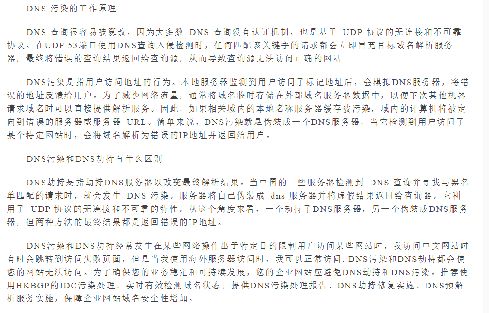

## DNS解析的作用是把域名解析成相应的IP地址
在广域网上路由器需要知道IP地址才知道把报文发给谁。

### 浏览器是怎么知道DNS解析服务器的?
在本机的网络设置里面可以看到当前的DNS服务器IP,一般宽带服务商都会提供DNS服务器，谷歌还为公众提供了两个免费的DNS服务，分别为8.8.8.8和8.8.4.4

总结查询过程
* 第一步：
客户端向域名解析服务器发起查询，然后服务器返回响应。DNS服务器nameservers是在设备接入网络的时候路由器通过DHCP发给设备的，chrome会按照nameservers的顺序发起查询，并将结果缓存，有效时间根据ttl，有效期内两次查询直接使用cache。

本地电脑会检查浏览器缓存中有没有这个域名对应的解析过的IP地址，如果缓存中有，这个解析过程就结束。

* 第二步骤：
如果浏览器缓存中没有数据，浏览器会查找操作系统缓存etc\hosts文件来设置中是否有这个域名对应的DNS解析结果，
用户可以将任何域名解析到任何能够访问的IP地址。

前两个过程无法解析时，就要用到我们网络配置中的"DNS服务器地址"了。操作系统会把这个域名发送给这个本地DNS服务器。

接受请求的顶级DNS服务器查找并返回此域名对应的Name Server域名服务器的地址，这个Name Server服务器就是我要访问的网站域名提供商的服务器，其实该域名的解析任务就是由域名提供商的服务器来完成。   比如我要访问www.baidu.com，而这个域名是从A公司注册获得的，那么A公司上的服务器就会有www.baidu.com的相关信息。

Name Server服务器会查询存储的域名和IP的映射关系表，再把查询出来的域名和IP地址等等信息，连同一个TTL值返回给本地DNS服务器。

返回该域名对应的IP和TTL值，本地DNS服务器会缓存这个域名和IP的对应关系，缓存时间由TTL值控制。


## 墙的两种
1. ip封杀，https特征流阻断
2. DNS污染
浏览器打开 github.com 是通过域名访问，域名转为 ip 需要 DNS 解析，
而DNS污染污染就是将域名指向错误甚至恶意的ip。
```
dns汚染改 dns没用的，dns包不加密，可以
篡改或者直接抢答

当初我就发现 Github 从2021年3月开会时就被SNI千扰了，因此哪天被完全封禁也毫不奇怪。
SNI千扰的大概表现为：时通时不通，一旦访问就可能 443端口超时 3分钟，但ICMP、TCP 80 端口均正常，随便指向任意iP去访问该域名，都会可能导致该P的443端口超
时，而这个超时机制精细到 NAT 用户
```
3. dns劫持




### 1.Dns劫持
DNS劫持的现象：你输入的网址是http://www.google.com，出来的是百度的页面。

HTTP劫持的现象：你打开的是知乎的页面，右下角弹出唐老师的不孕不育广告

ip是网络上各主机的“地址”，要想访问“别人家”，当然得要有地址。但ip是一串数字，是给电脑看的，人记起来太麻烦，所以就有了域名（也就是我们常说的网址）

dns（网域名称系统，Domain Name System）。域名是一串英文字符串，方便人记忆。
dns将域名和ip关联起来，形成映射。

用户访问域名所在的目标网站前，将域名发给dns服务器询问这对映射关系，拿到对应的ip后就可以在茫茫网海中找到那个“她”了。

而GFW所做的就是站在用户和dns服务器之间，破坏它们的正常通讯，并向用户回传一个假ip。用户拿不到真正的ip，自然也就访问不到本想访问的网站了。

对于 DNS劫持，可以通过手动更换 DNS 服务器为 公共DNS 解决

### 2.ip封锁
```
dns劫持之后，GFW引入了ip封锁，直接锁住了访问目标网站的去路，用户发往被封锁ip的任何数据都会被墙截断。

这个时候，依靠类似于修改Hosts文件这种低成本方法突破封锁就显得有些天方夜谭了。那么，解决办法是什么呢？答案是：在第三方架设翻墙服务器，中转与目标服务器间的来往流量。目前为止，GFW采用的是黑名单模式，像Google、Facebook这种在黑名单上的网站的ip无法访问，而不在黑名单上的第三方不记名ip可以。于是，一切就很明朗了，我们目前几乎所有的翻墙手段都是基于上述原理实现的
```

在客户机发送请求到服务器的过程中会经过一系列路由的转发，在路由器转发的过程中会根据路由表中存储的表项来决定下一跳的路由器或主机，选择的下一跳地址会根据路由协议来决定。

早期使用的是ACL（访问控制列表）来进行IP黑名单限制，现在更高效的路由扩散技术来进行对特定的IP进行封锁。早期路由器都是采用静态路由协议，每一条路由需要进行人工来配置路由表项，或者配置一些策略，在决定路由转发，这时可以通过检测，对相应要封锁的IP配置一条错误的路由，将之牵引到一个不做任何操作的服务器（黑洞服务器），此服务器所要做的就是丢包，这样便无声息封锁掉了。

动态路由协议的出现可以更高效的进行屏蔽，动态路由协议可以让路由器通过交换路由表信息来动态更新路由表，并通过寻址算法来决定最优化的路径。因此可以通过动态路由协议的路由重分发功能将错误的信息散播到整个网络，从而达到屏蔽目的。

## IP/端口黑名单
```
该手段可以结合上边提到的IP封锁技术，将封锁精确到具体的端口，使该IP的具体端口接收不到请求，从而达到更细粒度的封锁。
```
经常被封锁的端口如下：
```
SSH的TCP协议22端口
HTTP的80端口
PPTP类型VPN使用的TCP协议1723端口
L2TP类型VPN使用的UDP协议1701端口
IPSec类型VPN使用的UDP协议500端口和4500端口
OpenVPN默认使用的TCP协议和UDP协议的1194端口
TLS/SSL/HTTPS的TCP协议443端口
Squid Cache的TCP协议3128端口
```

### 什么是DNS污染？
在进行域名访问时，首先会将域名通过dns解析为对应的真实IP，然后通过IP进行HTTP访问。

所谓DNS攻击手段，即通过某种手段使得客户机发起DNS查询但得到的却是错误的IP，导致客户机无法正常访问。

防火长城会在骨干网出口的53端口进行IDS入侵检测，检测到黑名单域名等，会伪装成域名服务器向客户机发送虚假的回应，由于DNS查询请求一般是基于UDP无连接传输层协议，该协议特征是无状态连接、不可靠传输，DNS查询会接收最先到达的请求，抛弃之后到达的请求，因此导致客户机被欺骗，请求被重定位到虚假IP。

DNS污染是指一些刻意制造或无意中制造出来的域名服务器分组，把域名指往不正确的IP地址。

它是一种让一般用户由于得到虚假目标主机IP而不能与其通信的方法，是一种DNS缓存投毒攻击.

DNS污染是发生在用户请求的第一步上，直接从协议上对用户的DNS请求进行干扰。简单来说,DNS污染就是指运营商对于你的DNS域名解析请求会进行修改，以插入广告，或者让你无法访问某些网站，网速也会变慢。

### 如何判断
可以通过命令：nslookup 域名 144.223.xxx.xxx，就可以判断这个域名有没有被污染，结果显示144.223.xxx.xxx是不存在的，那么结果应该不存在任何返回。结果我们得到一个错误的IP（不确定）。足够说明域名出现DNS污染了。

### 怎么解决
1. 通过SSH加密代理，在加密代理里使用远程DNS解析/使用VPN上网。
2. 修改hosts文件，在操作系统中Hosts文件的权限会优先级高于DNS服务器，在操作系统在访问域名时，最先检测hosts文件，再查询DNS服务器，因此可以在hosts添加受到污染的DNS地址去解决DNS污染。
3. 如使用的是Firefox only，也仅用Firefox，不想更换可以直接打开Firefox的远程DNS解析，在地址栏中输入：about:config找到network.proxy.socks_remote_dns一项改成true。

## 无状态TCP连接重置
```
TCP连接会有三次握手，此种攻击方式利用了该特点来进行攻击。

gfw会对特定IP的所有数据包进行监控，会对特定黑名单动作进行监控（如TLS加密连接）;

当进行TCP连接时，会在TCP连接的第二部SYNC-ACK阶段，伪装成客户端和服务器同时向真实的客户端和服务器发送RESET重置，以很低的成本来达到切断双方连接的目的。

与丢弃客户机的包相比，在丢包后客户机会不断的发起重试，这样会加重黑洞服务器的负担，利用TCP连接重置来断开连接，客户机也不必发送ACK来确认，这样成本就要低得多。
```

## TCP协议关键字阻断
```
该手段在无状态TCP连接重置手段之上，加入了关键字过滤功能，当协议的头部包含特定的关键字便对其连接进行重置，比如HTTP协议、ED2K协议等等。
```

## 深度包检测
```
深度数据包检测（Deep packet inspection,DPI）是一种于应用层对网络上传递的数据进行侦测与处理的技术，被广泛用于入侵检测、流量分析及数据挖掘。

就字面意思考虑，所谓“深度”是相对于普通的报文检测而言的——DPI可对报文内容和协议特征进行检测。

基于必要的硬件设施、适宜的检测模型及相应的模式匹配算法，gfw能够精确且快速地从实时网络环境中判别出有悖于预期标准的可疑流量，并对此及时作出审查者所期望的应对措施。
```