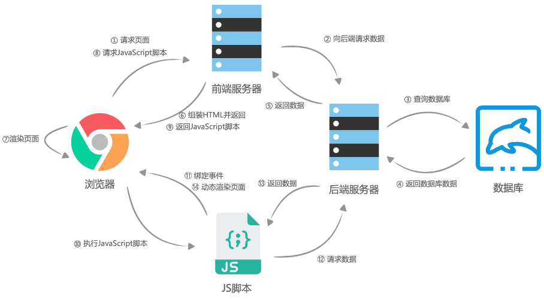
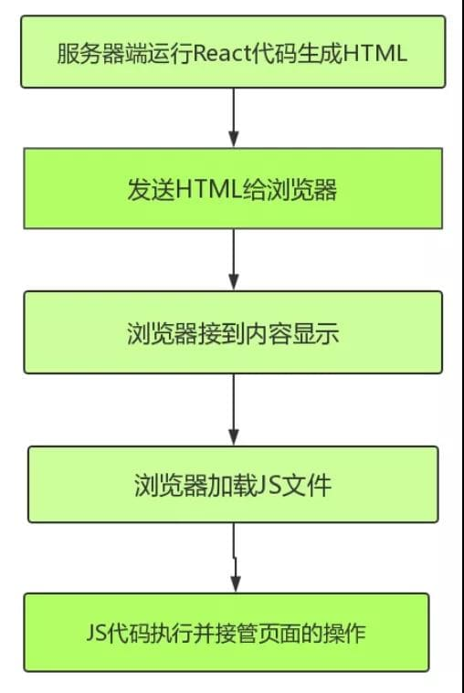

## 客户端渲染的缺点
在 SPA 模式下，所有的数据请求和 DOM 渲染都在浏览器端完成，所以当我们第一次访问页面的时候很可能会存在“白屏”等待，

首先浏览器请求URL，前端服务器直接返回一个空的静态HTML文件（不需要任何查数据库和模板组装），这个HTML文件中加载了很多渲染页面需要的 JavaScript 脚本和 CSS 样式表，

浏览器拿到 HTML 文件后开始加载脚本和样式表，并且执行脚本，这个时候脚本请求后端服务提供的API，获取数据，获取完成后将数据通过JavaScript脚本动态的将数据渲染到页面中，完成页面显示。

+ 首屏速度加载慢。
+ 不支持SEO和搜索引擎优化。
+ 首页需要请求来初始化数据。


### 先回顾下页面的渲染流程：
1. 浏览器通过请求得到一个HTML文本 
2. 渲染进程解析HTML文本，构建DOM树
3. 解析HTML的同时，如果遇到内联样式或者样式脚本，则下载并构建样式规则（stytle rules），若遇到JavaScript脚本，则会下载执行脚本。
4. DOM树和样式规则构建完成之后，渲染进程将两者合并成渲染树（render tree）
5. 渲染进程开始对渲染树进行布局，生成布局树（layout tree）
6. 渲染进程对布局树进行绘制，生成绘制记录 
7. 渲染进程的对布局树进行分层，分别栅格化每一层，并得到合成帧 
8. 渲染进程将合成帧信息发送给GPU进程显示到页面中


可以看到，页面的渲染其实就是浏览器将HTML文本转化为页面帧的过程。
而如今我们大部分WEB应用都是使用 JavaScript 框架（Vue、React、Angular）进行页面渲染的，也就是说，在执行 JavaScript 脚本的时候，HTML页面已经开始解析并且构建DOM树了，JavaScript 脚本只是动态的改变 DOM 树的结构，使得页面成为希望成为的样子，这种渲染方式叫动态渲染，也可以叫客户端渲染（client side rende）。 

+ 页面上的内容由于浏览器执行js脚本而渲染到页面上。
  - 浏览器访问服务器，服务器返回空的HTML页面，里边有一个js脚本client
  - 浏览器下载js代码，并在浏览器中运行。
  - 内容呈现在页面上。

### 以前的服务端渲染
1. 服务器内部获取数据。
2. 服务器内部渲染HTML.
3. 客户端从远程加载代码。
4. 客户端开始水合。

缺点：
+ 一切都是串行的，一个没有结束，后边都要等待。
+ 这个操作必须是整体性的，而水合的过程比较慢，会引起卡顿。

## 服务端渲染（SSR) 优缺点
服务端渲染：
将组件或页面通过服务器生成html字符串，再发送到浏览器，当用户第一次请求页面时，客户端拿到手的，是可以直接渲染然后呈现给用户的 HTML 内容，不需要为了生成 DOM 内容自己再去跑一遍 JS 代码。

优点：
- 首屏渲染快
相对于客户端渲染，服务端渲染在浏览器请求URL之后已经得到了一个带有数据的HTML文本，浏览器只需要解析HTML，直接构建DOM树就可以。
而客户端渲染，需要先得到一个空的HTML页面，这个时候页面已经进入白屏，之后还需要经过加载并执行 JavaScript、请求后端服务器获取数据、JavaScript 渲染页面几个过程才可以看到最后的页面。特别是在复杂应用中，由于需要加载 JavaScript 脚本，越是复杂的应用，需要加载的 JavaScript 脚本就越多、越大，这会导致应用的首屏加载时间非常长，进而降低了体验感。

- 利于SEO
- 可以生成缓存片段，生成静态化文件

### 缺点:
- 服务端压力较大<br/>
代码复杂度增加。为了实现服务端渲染，应用代码中需要兼容服务端和客户端两种运行情况，而一部分依赖的外部扩展库却只能在客户端运行，需要对其进行特殊处理，才能在服务器渲染应用程序中运行。

* 需要更多的服务器负载均衡。由于服务器增加了渲染HTML的需求，使得原本只需要输出静态资源文件的nodejs服务，新增了数据获取的IO和渲染HTML的CPU占用，如果流量突然暴增，有可能导致服务器down机，因此需要使用响应的缓存策略和准备相应的服务器负载。

* 涉及构建设置和部署的更多要求。与可以部署在任何静态文件服务器上的完全静态单页面应用程序 (SPA) 不同，服务器渲染应用程序，需要处于 Node.js server 运行环境。

## 服务端渲染
单页应用（SPA）的发展，程序员们渐渐发现 SEO（Search Engine Optimization，即搜索引擎优化）出了问题，而且随着应用的复杂化，JavaScript 脚本也不断的臃肿起来，使得首屏渲染相比于 Web1.0时候的服务端渲染，也慢了不少。

使用 nodejs 在服务器进行页面的渲染，进而再次出现了服务端渲染。大体流程与客户端渲染有些相似，首先是浏览器请求URL，前端服务器接收到URL请求之后，根据不同的URL，前端服务器向后端服务器请求数据，服务端将我们需要的HTML文本组装好，并返回给浏览器，这个HTML文本被浏览器解析之后，不需要经过 JavaScript 脚本的执行，即可直接构建出DOM 树并展示到页面中。

请求完成后，前端服务器会组装一个携带了具体数据的HTML文本，并且返回给浏览器，浏览器得到HTML之后开始渲染页面，同时，浏览器加载并执行 JavaScript 脚本，给页面上的元素绑定事件，让页面变得可交互，当用户与浏览器页面进行交互，如跳转到下一个页面时，浏览器会执行 JavaScript 脚本，向后端服务器请求数据，获取完数据之后再次执行 JavaScript 代码动态渲染页面。



### 同构
React 的虚拟 DOM 以对象树的形式保存在内存中，所以可以在浏览器和 Node 中生成，这位前后端同构提供了条件。
```
在浏览器里，React 通过 ReactDom 的 render 方法将虚拟 Dom 渲染到真实的 Dom 树上，生成网页

但是在 Node 环境下是没有渲染引擎的，所以 React 提供了另外两个方法：： ReactDOMServer.renderToString 和 ReactDOMServer.renderToStaticMarkup 可将其渲染为 HTML 字符串;
在服务端上 Component 生命周期只会到 componentWillMount ，客户端则是完整的。
```

服务端渲染所有数据和 html 内容已在服务端处理完成，浏览器收到的是完整的 html 内容，可以更快地看到渲染内容。react-dom提供了服务端渲染的 renderToString方法，负责把React组件解析成html。

但是像一些事件处理的方法，是无法在服务端完成，因此需要将组件代码在浏览器中再执行一遍，这种服务器端和客户端共用一套代码的方式就称之为「同构」

同构:就是一套React代码在服务器上运行一遍，到达浏览器又运行一遍：
- 服务端渲染完成页面结构
- 浏览器端渲染完成事件绑定

浏览器实现事件绑定的方式为让浏览器去拉取JS文件执行，让JS代码来控制，因此需要引入script标签
通过script标签为页面引入客户端执行的react代码，并通过express的static中间件为js文件配置路由

这种方法就能够简单实现首页的react服务端渲染，过程对应如下图：



服务端返回给浏览器的源码中应该还有一个 js 文件，包含了你的代码的所有的事件绑定。

那么怎么创建出这个 js 文件呢？
这里就需要使用 ReactDom 的 hydrate 方法

## react服务端渲染过程
* node server 接收客户端请求，得到当前的请求url 路径，然后在已有的路由表内查找到对应的组件，拿到需要请求的数据，将数据作为 props、context或者store 形式传入组件

* 然后基于 react 内置的服务端渲染方法 renderToString()把组件渲染为 html字符串在把最终的 html进行输出前需要将数据注入到浏览器端

* 浏览器开始进行渲染和节点对比，然后执行完成组件内事件绑定和一些交互，浏览器重用了服务端输出的 html 节点，整个流程结束

同构时，服务端结合数据将 Component 渲染成完整的 HTML 字符串并将数据状态返回给客户端，客户端会判断是否可以直接使用或需要重新挂载。

React 在客户端通过 checksum 判断是否需要重新render 相同则不重新render，省略创建 DOM 和挂 载DOM 的过程，接着触发 componentDidMount 等事件来处理服务端上的未尽事宜(事件绑定等)，从而加快了交互时间；不同时，组件将客户端上被重新挂载 render。

renderToStaticMarkup 则不会生成与 react 相关的 data-* ，也不存在 checksum.
在客户端时组件会被重新挂载，客户端重新挂载不生成 checknum( 也没这个必要 )，所以该方法只当服务端上所渲染的组件在客户端不需要时才使用。

checknum 实际上是 HTML 片段的 adler32 算法值，实际上调用 
```
React.render(<MyComponent />, container);
```


### webpack.server.config.js
+  @babel/preset-env 这是一个预设，它允许你使用最新的 JavaScript 语法，而无需对目标环境需要哪些语法转换进行管理。 
+ @babel/preset-react 将react转换成js文件包。

```js
const path = require('path')

const config = {
  mode: 'development',
  // 代码运行环境：node
  target: 'node',
  // 入口文件
  entry: './server/index.js',
  // 导出
  output: {
    // 打包路径：使用path的API进行路径拼接
    path: path.join(__dirname, 'build'),
    // 打包文件名
    filename: 'bundle.js',
  },
  // 配置打包规则
  module: { 
    rules: [ 
      { 
        // js文件规则 
        test: /\.(js|jsx)$/,
        // 忽略node_modulse文件夹 
        exclude: /node_modulse/, 
        use: { 
          // 使用babel转换 
          loader: 'babel-loader', 
          // 配置babel 
          options: { 
            // babel预制 
            presets: ['@babel/preset-env', '@babel/preset-react'], 
          }, 
        }, 
      }, 
    ], 
  }
}
```

## 同构解决浏览器事件绑定
https://juejin.cn/post/7096396341940584461
```js
// index.js 
import express from 'express'; 
import { renderToString } from 'react-dom/server'; 
import React from 'react' 
import Home from './Home'; 
import Text from './Text'; 

const app = express(); 

const content = renderToString(<Home />); 
const text = renderToString(<Text text={'hello world!'} />) 

app.get('/', function (req, res) { 
    res.send( ` 
        <html lang=""> 
            <head> 
                <title>ssr</title> 
            </head> 
            <body> 
                <div id="root">${content} ${text}</div> 
            </body> 
        </html> ` 
    ); 
}) 

app.listen(8090, () => { console.log('listen:8090') })
```

```js
// Home.js 
import React from 'react'; 
const Home = () => { 
    return ( 
        <div> 
            <div>This is wbh's ssr demo</div> 
        </div> 
    ) 
} 
export default Home 

// Text.js 
import React from 'react'; 

const Text = (props) => { 
    return ( 
        <div onClick={() => console.log('click')}> 
            <div>{props.text}</div> 
        </div> 
    ) 
} 
export default Text
```
刷新页面，点击 Text 组件部分，发现 click 事件并没有和我们预想的一样触发，我们添加的 click 事件是没有绑定到对应的元素上的。我们的 click 事件消失了，这说明，目前我们的服务端渲染是不完全的，事件绑定是无效的，renderToString 函数并不会帮我们做这一步的处理！


```js
import React from "react";
import App from "./page/App/index.jsx";
import { hydrateRoot } from "react-dom/client";

const root = document.getElementById("root");
const element = <App />
hydrateRoot(root, element);
```

+ service.js文件

```js
const express = require("express");
const register = require("@babel/register");
register({
  ignore: [/node_modules/],
  presets: ["@babel/preset-env", "@babel/preset-react"],
  plugins: ["@babel/plugin-transform-modules-commonjs"],
});
const static = require('serve-static');
const webpack = require("webpack");
const render = require("./oldRender");
const webpackConfig = require("./webpack.config");

webpack(webpackConfig, (error, status) => {
  const statusJson = status.toJson({ assets: true });
  const assets = statusJson.assets.reduce((item, { name }) => {
    item[name] = `/${name}`;
    return item;
  }, {});
  console.log(assets, 'assets')
  const app = express();
  app.get("/", (req, res) => {
    render(req, res, assets);
  });
  app.use(static('build'));
  app.listen(8100, () => {
    console.log("运行在8100端口");
  });
});

```

+ render函数代码

```js
import React from "react";
import App from "./src/page/App";
import { renderToString } from "react-dom/server";

function render(req, res, assets) {
  const html = renderToString(<App />);
  res.statusCode = "200";
  res.setHeader("Content-Type", "text/html; charset=utf-8");
  res.send(
    `<!DOCTYPE html>
    <html lang="en">
    <head>
      <meta charset="UTF-8">
      <meta http-equiv="X-UA-Compatible" content="IE=edge">
      <meta name="viewport" content="width=device-width, initial-scale=1.0">
      <title>ssr</title>
    </head>
    <body>
      <div id="root">${html}</div>
      <script src="${assets["main.js"]}"></script>
    </body>
    </html>`
  );
}

module.exports = render;
```

在做完初始渲染的时候，一个应用会存在路由的情况，配置信息如下：
```js
import React from 'react'                   //引入React以支持JSX 
import { Route } from 'react-router-dom'    //引入路由 
import Home from './containers/Home'        //引入Home组件 
 
export default ( 
    <div> 
        <Route path="/" exact component={Home}></Route> 
    </div> 
)
```

```js
import React from 'react' 
import ReactDom from 'react-dom' 
import { BrowserRouter } from'react-router-dom' 
import Router from'../Routers' 
 
const App= () => { 
    return ( 
        <BrowserRouter> 
           {Router} 
        </BrowserRouter> 
    ) 
} 
 
ReactDom.hydrate(<App/>, document.getElementById('root'))
```
这时候控制台会存在报错信息，原因在于每个Route组件外面包裹着一层div，但服务端返回的代码中并没有这个div

解决方法只需要将路由信息在服务端执行一遍，使用使用StaticRouter来替代BrowserRouter，通过context进行参数传递
这样也就完成了路由的服务端渲染:
```js
import express from 'express' 
import React from 'react'//引入React以支持JSX的语法 
import { renderToString } from 'react-dom/server'//引入renderToString方法 
import { StaticRouter } from 'react-router-dom' 
import Router from '../Routers' 
  
const app = express() 
app.use(express.static('public')); 
//使用express提供的static中间件,中间件会将所有静态文件的路由指向public文件夹 
 
app.get('/',(req,res)=>{ 
    const content  = renderToString(( 
        //传入当前path 
        //context为必填参数,用于服务端渲染参数传递 
        <StaticRouter location={req.path} context={{}}> 
           {Router} 
        </StaticRouter> 
    )) 
    res.send(` 
   <html> 
       <head> 
           <title>SSR demo</title> 
       </head> 
       <body> 
       <div id="root">${content}</div> 
       <script src="/index.js"></script> 
       </body> 
   </html> 
    `) 
}) 
 
app.listen(3001, () => console.log('Exampleapp listening on port 3001!'))
```
