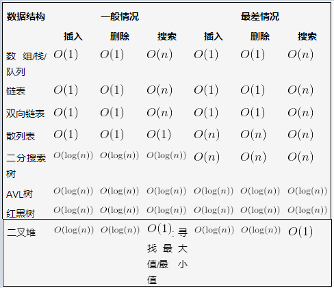
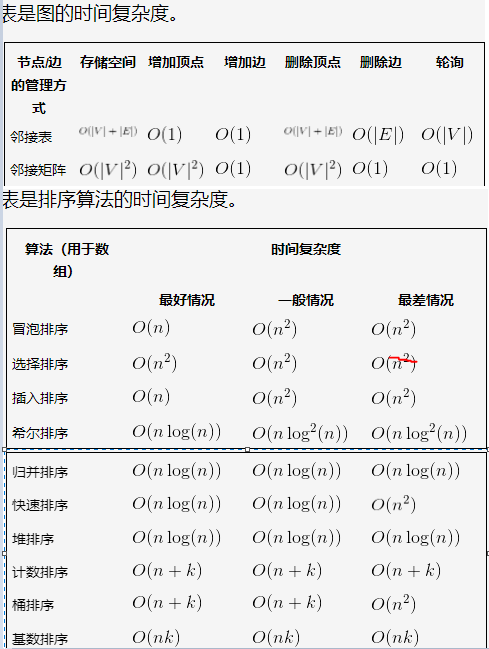
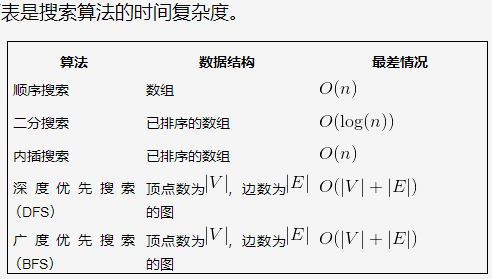

# 算法基础
时间维度：是指执行当前算法所消耗的时间，我们通常用「时间复杂度」来描述。
空间维度：是指执行当前算法需要占用多少内存空间，我们通常用「空间复杂度」来描述。空间复杂度 O(n):
```java
int[] m = new int[n]
for(i=1; i<=n; ++i)
{
   j = i;
   j++;
}
/*
这段代码中，第一行new了一个数组出来，这个数据占用的大小为n，这段代码的2-6行，虽然有循环，但没有再分配新的空间，因此，这段代码的空间复杂度主要看第一行即可，即 S(n) = O(n)
*/
```

常见的时间复杂度量级有：
* 常数阶O(1)
* 对数阶O(logN)
* 线性阶O(n)
* 线性对数阶O(nlogN)
* 平方阶O(n²)
* 立方阶O(n³)
* K次方阶O(n^k)
* 指数阶(2^n)

```
符号              名称

O(1)             常数
O(log(n))        对数的
O((log(n))c)    对数多项式
O(n)            线性的
O(n^2)          二次的
O(n^c)          多项式的
O(c^n)          指数的

不同的时间复杂度

输入大小(n)   O(1)    O(log(n))    O(n)   O(nlog(n))   O(n^2)  O(2^n)
10            1        1          10        10          100     1024
20            1        1.30       20        26.02       400     1048576
50            1        1.69       50        84.94       2500    非常大
100           1        2          100       200         10000   非常大
500           1        2.69       500       1349.48     25000
1000          1        3          1000      3000        1000 000
10000         1        4          10000     40000       1000 000 000
```

## 常用数据结构的时间复杂度





##  常数阶O(1)
无论代码执行了多少行，只要是没有循环等复杂结构，那这个代码的时间复杂度就都是O(1)，如：
```js
int i = 1;
int j = 2;
++i;
j++;
int m = i + j;
/*
上述代码在执行的时候，它消耗的时候并不随着某个变量的增长而增长，那么无论这类代码有多长，即使有几万几十万行，都可以用O(1)来表示它的时间复杂度。
*/
```
##  线性阶O(n)
```js
for(i=1; i<=n; ++i)
{
   j = i;
   j++;
}
/*
for循环里面的代码会执行n遍，因此它消耗的时间是随着n的变化而变化的，因此这类代码都可以用O(n)来表示它的时间复杂度。
*/
```

在大O符号表示法中，时间复杂度的公式是： T(n) =O(f(n))，其中f(n) 表示每行代码执行次数之和，而 O 表示正比例关系，这个公式的全称是：算法的渐进时间复杂度。
```
我们继续看上面的例子，假设每行代码的执行时间都是一样的，我们用 1颗粒时间 来表示，那么这个例子的第一行耗时是1个颗粒时间，第三行的执行时间是 n个颗粒时间，第四行的执行时间也是 n个颗粒时间（第二行和第五行是符号，暂时忽略），那么总时间就是 1颗粒时间 + n颗粒时间 + n颗粒时间 ，即 (1+2n)个颗粒时间，即： T(n) = (1+2n)*颗粒时间，从这个结果可以看出，这个算法的耗时是随着n的变化而变化，因此，我们可以简化的将这个算法的时间复杂度表示为：T(n) = O(n) 为什么可以这么去简化呢，因为大O符号表示法并不是用于来真实代表算法的执行时间的，它是用来表示代码执行时间的增长变化趋势的。

所以上面的例子中，如果n无限大的时候，T(n) = time(1+2n)中的常量1就没有意义了，倍数2也意义不大。因此直接简化为T(n) = O(n) 就可以了。
```
##  对数阶O(logN)
```js
int i = 1;
while(i<n)
{
    i = i * 2;
}
/*
从上面代码可以看到，在while循环里面，每次都将 i 乘以 2，乘完之后，i 距离 n 就越来越近了。我们试着求解一下，假设循环x次之后，i 就大于 n 了，此时这个循环就退出了，也就是说 2^x=n，那么 x = log2^n
也就是说当循环 log2^n 次以后，这个代码就结束了。因此这个代码的时间复杂度为：O(logn)
*/

如果a^x =N（a>0，且a≠1），那么数x叫做以a为底N的对数，记作x=logaN

当底数为2的时候,信息论编码时，这个就是默认的以2为底的,默认省略---->底数无关紧要 可以省略 如果是5也一样 时间复杂度只是描述算法耗时的程度而已 不是计算具体时间

二分查找在最坏的情况下依次是n/2,n/4,n/8。。。。 一直到1为止，这就有点惨了
然后，意思就是要循环多少次才能查找到目标数呢，我们假设是x次。
然后我们可以观察到分母是每次都乘以1/2，分子不变，所以可以根据题意列出下面等式：
n(1/2)^x = 1 等价于： 2^x=n   --->log2(N)   最后在计算机中底数可以省略：算法复杂度为：log(n)=x  ---->所以时间复杂度：O(logn)
```
##  线性对数阶O(nlogN)
线性对数阶O(nlogN) 其实非常容易理解，将时间复杂度为O(logn)的代码循环N遍的话，那么它的时间复杂度就是 n * O(logN)，也就是了O(nlogN)。
```js
for(m=1; m<n; m++)
{
    i = 1;
    while(i<n)
    {
        i = i * 2;
    }
}
```

##  平方阶O(n²)
平方阶O(n²) 就更容易理解了，如果把 O(n) 的代码再嵌套循环一遍，它的时间复杂度就是 O(n²) 了。
```js
for(x=1; i<=n; x++)
{
   for(i=1; i<=n; i++)
    {
       j = i;
       j++;
    }
}
如果将其中一层循环的n改成m，即：
for(x=1; x<=m; x++)
{
   for(i=1; i<=n; i++)
    {
       j = i;
       j++;
    }
}
那它的时间复杂度就变成了 O(m*n)
```
##  立方阶O(n³)、K次方阶O(n^k)
参考上面的O(n²) 去理解就好了，O(n³)相当于三层n循环，其它的类似。


# 快速排序与冒泡排序
快速排序复杂度和冒泡是一样的，但是又优于冒泡排序
因为在快速排序中它每次找出最大值只是交换下标索引；


而冒泡排序每次交换都是值交换，改变了内存中储存的值。
所以快速排序优于冒泡排序，但是没得什么用，二者的时
间复杂度都是o（n^2）,空间复杂度为o(1).

##  快速排序
```
（1）、确定基准数

我们把数组的第一个元素作为基准数。
2.将比这个数小全放左边，大于右边
3.在对左右区间重复第二步骤，直到区间只有一个数(条件就是数组中的元素要大于等于2个);返回排序好的左右数组
4.将有序的区间合并起来，这样整个数列就是有序的了;  合并好排序好的坐数组，基准数，排序好的右数组，并且返回
```

```js
let arr = [31,23,34,2,13,234]
function quickSort(arr){
	let base_num = arr[0]
	let left_arr = []
	let right_arr = []
	//1
	for (var i = 1; i < arr.length; i++) {
		if(arr[i]<base_num){
			left_arr.push(arr[i])
		}else{
			right_arr.push(arr[i])
		}
	}
	//2
	if(left_arr.length>=2){
		left_arr=quickSort(left_arr)
	}
	if(right_arr.length>=2){
		right_arr=quickSort(right_arr)
	}
	//3.合并左数组,基准数，右数组
	return left_arr.concat(base_num,right_arr)
}
quickSort(arr)
```

##  二叉树
http://data.biancheng.net/view/192.html
简单地理解，满足以下两个条件的树就是二叉树：
本身是有序树；
树中包含的各个节点的度不能超过 2，即只能是 0、1 或者 2；

需求:输入某二叉树的前序遍历和中序遍历的结果，请重建该二叉树
例如：
输入前序遍历序列[1,2,4,7,3,5,6,8]  中序序列 [4,7,2,1,5,3,8,6] ,请重建二叉树并返回