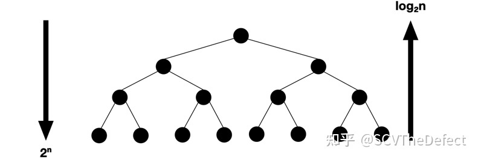

## 前言
```text
二分应该用底数为2的log吧，我一开始看到没有写底数还以为是以10为底数，就不理解了，现在才知道原来是以2

国内教科书说lg是以10为底
英文书基本上lg都是以2为底

计算机，2进制。EECS里，1K都等于1024,用2做底数太方便太应该了。
```

## 关于数量级的理解
```text
这是数量级的问题。但如果你不是很理解这句话（当初我就是这样），那么不妨参考我现在的理解：
关键点：
1.对数运算是指数运算的逆运算。
2.在渐进复杂度中，指数复杂度 aⁿ 中的底数 a 是不重要的。因此 2ⁿ、3ⁿ、5ⁿ 甚至 9999ⁿ 尽管实际上差距巨大，但在渐进意义上是一样的。

基于以上两点，不妨把对数复杂度的理解转换为对指数复杂度的理解，毕竟后者看起来友善多了。
观察二叉树节点的增长方式，自顶往下就是指数级的增长速度，自低往上就是对数级的增长速度：
```


```text
即使把二叉树改为三叉树、十叉树或 a 叉树，只不过每次增长的节点数改变了，但增长方式是不变的
（可以自己脑补一下图示，每层增加 2 个节点变为增加 a 个节点）。

如果你把对数复杂度写为 O(log₂n) ，那么对应的指数复杂度就是 O(2ⁿ) ；如果你把对数复杂度写为 O(log₁₀n) 即 O(lgn)，
那么对应的指数复杂度就是 O(10ⁿ) ；如果你把对数复杂度写为 O(lnN)，那么对应的指数复杂度就是 O(eⁿ)。

因此 log₂n、lgn、lnN 在渐进意义上是一样的，这就正如 2ⁿ、10ⁿ、eⁿ 几种写法在渐进意义上相同。对底数的纠结，就好比在纠结
“为什么指数复杂度要写成 2ⁿ，而不是 3ⁿ、5ⁿ、7ⁿ ？”。既然底数无所谓，那么简写成 logn 或者 lgn，又有什么所谓呢。
```