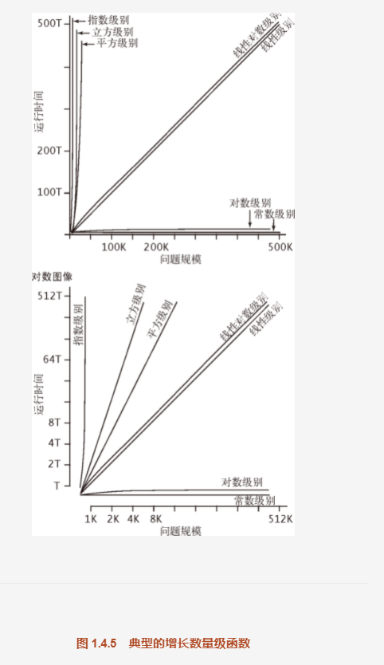

## 算法分析中见的函数
算法分析中进行数学建模不在本书的范畴，理解特定的数学模型对于理解基础算法的运行效率很关键。
我们会遇到各种数学分析中广泛使用的函数和近似函数。
```
描述  			记号		定义
向下取整	X			不大于x的最大整数
向上取整  X			不小于x的最小整数
自然对数	lnN			log(e)N(e^x	= N)

2为底对数	lgN			log(2)N(2^x	= N)

2为底整型对数	[lgN]		不大于lgN的最大整数 - 1

调和级数 		HN		1 + 2/2 + 1/3 + 1/4 + ... + 1/N

阶乘			N!		1X2X3X4...X N
```
##

## 算法分析中见的近似函数
```
描述			近似函数

调和级数求和			HN = 1 + 2/2 + 1/3 + 1/4 + ... + 1/N ~ lnN

等差数列求和			1 + 2 + 3 + 4 + ... N ~ N^2/2

等比数列求和			1 + 2 + 4 + 8 + ... + N = 2N - 1 ~ 2N,其中N = 2^n

指数函数					(1 - 1/x)^x ~ 1/e

斯特林公式

二项式系数
```

## 对增长数量级的常见假设
描述					增长数量级			典型代码				说明				举例

常数级别			1							a = b + c					普通语句		两个数相加
```
运行时间的增长数量级为常数的程序完成它的任务-------所需操作的次数一定，因此它的运行时间不依赖N.
大多java操作所需的时间均为常数。
```

对数级别			logN					二分查找					二分策略		二分查找
```
比常数程序慢。对数的底数和增长的数量级无关（因为不同的底数仅相当于一个常数因子），所以我们说明对数级别一般用
logN.
```

线性					N																循环					找出最大数
级别
```
double max = a[0];
for(int i = 1;i<N;i++)
if(a[i]>max) max = a[i];

使用常数时间处理输入数据中的所有的元素 或是基于单个for循环的程序十分常见。
增长的数量级是线性的---------运行时间和N成正比。
```

线性对数级别		NlogN				见算法2.4					分治				归并排序
```
线性对数 描述运行时间和问题规模N的关系为	NlogN的程序。和之前一样对数的底数和数量级无关。
典型例子：Merge.sort 和 Quick.sort()
```

平方级别			N^2							双层循环				双层循环		检查所有元素对
```
初级排序算法 Selection.sort()和 Insertion.sort()
```

立方级别			N^3							三层循环				双层循环		检查所有三元组
```
本书的 TreeSum，对于N个元素得到的所有三元组进行计算。
```

指数级别			2^N							第六章					穷举查找		检查所有子集
```
我们用指数级别来描述增长数量级：b^N,b为常数。不可能用它来处理大规模问题。
```

以上是最常见的分类，但是算法的增长数量级可能是：
N^2logN 或则 N^(3/2)类似的函数
因此，可以在某个成本模型下提出十分准确的命题。例如：
```
归并排序 所需要的比较次数在 1/2NlgN 到 NlgN 之间，由此立即可知 归并排序所需要的运行时间 的增长数量级是线性对数的。
简单起见，这句话简写为归并排序是线性对数的。
```

## 用图来表示 增长数量级函数在实际应用中的重要性
图说明了平方级别和立方级别的算法，在大规模问题是不可用的。
许多重要的问题的直观解法是平方级别的，也发现它们的线性对数级别的算法。此类算法（包括归并排序）在实践中非常重要，它们解决问题的规模远大于 平方级别的解法 能够处理的规模。
所以本书自然希望 为各种基础问题找到对数级别，线性级别，线性对数级别的算法。


