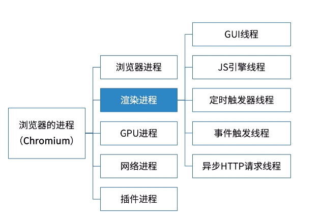

## 事件循环
我们在浏览器中打开新标签时，就会创建一个任务队列。每个标签都是单线程处理所有的任务。

JavaScript是一门单线程语言，指主线程只有一个。Event Loop事件循环，其实就是JS引擎管理事件执行的一个流程，具体由运行环境确定。

浏览器要负责多个任务，如渲染HTML、执行JavaScript代码、处理用户交互（用 户输入、鼠标点击等）、执行和处理异步请求。

## 2.Event Loop ( 事件循环 )
浏览器的事件循环分为同步任务和异步任务；

所有同步任务都在主线程上执行，形成一个函数调用栈（执行栈），

而异步则先放到任务队列（task queue）里， 任务队列又分为宏任务（macro-task）与微任务（micro-task）。下面的整个执行过程就是事件循环:

宏任务大概包括：script（整块代码）、setTimeout、setInterval、I/O、UI交互事件、setImmediate（node环境）

微任务大概包括：new promise().then(回调)、MutationObserver(html5新特新)、Object.observe(已废弃)、process.nextTick（node环境）
若同时存在promise和nextTick，则先执行nextTick。

执行过程
1. 先从script(整块代码)开始第一次循环执行，接着对同步任务进行执行，直到调用栈被清空，

2. 然后去执行所有的微任务，当所有微任务执行完毕之后。

3. 再次从宏任务开始循环执行，直到执行完毕，然后再执行所有的微任务，就这样一直循环下去。

4. 如果在执行微队列任务的过程中，又产生了微任务，那么会加入整个队列的队尾，也会在当前的周期中执行。

## 简单的参考例子
```js
setTimeout(function() {
    console.log('timeout1');
})

new Promise(function(resolve) {
    console.log('promise1');
    for(var i = 0; i < 1000; i++) {
        i == 99 && resolve();
    }
    console.log('promise2');
}).then(function() {
    console.log('then1');
})

console.log('global1');
/*
    promise1
    promise2
    global1
    then1
    undefined
    timeout1
* */
```

## 先了解浏览器的进程和线程
参考：https://blog.csdn.net/weixin_52092151/article/details/119788483
```
浏览器是多进程的，浏览器每一个打开一个Tab页面(网页)都代表着创建一个独立的进程（至少需要四个，若页面有插件运行，则五个）。

渲染进程（浏览器内核）是多线程的，也是浏览器的重点，因为页面的渲染，JS执行等都在这个进程内进行
```


1.GUI渲染线程
```
负责渲染浏览器界面,包括解析HTML，CSS，构建DOM树和RenderObject树，布局和绘制等。
当界面需要重绘（Repaint）或由于某种操作引发回流(reflow)时，该线程就会执行。
注意 : GUI渲染线程与JS引擎线程是互斥的。
```
2.JS引擎线程
```
也称为JS内核，负责解析处理Javascript脚本，运行代码。（例如V8引擎）。
JS引擎一直等待并处理任务队列中任务。一个Tab页中无论什么时候都只有一个JS线程在运行JS程序
```

3.定时触发器线程
```
setInterval和setTimeout所在线程。通过此线程计时完毕后，添加到事件队列中，等待JS引擎空闲后执行
```
4.事件触发线程
```
当一个事件被触发时该线程会把事件添加到事件队列，等待JS引擎的处理
这些事件可来自JS引擎当前执行的代码块如setTimeOut、也可来自浏览器内核的其他线程如鼠标点击、AJAX异步请求等，但由于JS的单线程关系所有这些事件都得排队等待JS引擎处理。
```
5.异步http请求线程
```
在XMLHttpRequest连接后是通过浏览器新开一个线程请求。
将检测到状态变更时，如果设置有回调函数，异步线程就产生状态变更事件，将这个回调再放入事件队列中。再由JS引擎执行
```
