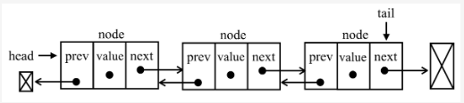

## 单向链表
单向链表和双向链表，它们最大的区别在于节点是否具有指向前驱节点的引用。

单向链表中，每个节点只有一个指针，指向其后继节点。因此，如果要访问某个节点的前驱节点，需要从头节点开始遍历整个链表，直到找到目标节点的前一个节点。
```
+--------+    +--------+    +--------+
| Node 1 | -> | Node 2 | -> | Node 3 | -> NULL
+--------+    +--------+    +--------+
```

### 双向链表示意图：
双向链表中，每个节点有两个指针，一个指向其后继节点，另一个指向其前驱节点。因此，如果要访问某个节点的前驱节点，只需要使用该节点的前驱指针即可，无需遍历整个链表。这种特性使得双向链表在某些场景下比单向链表更加高效。

总体来说，单向链表比双向链表更简单，更易于实现，但在某些场景下可能会带来一些性能问题。而双向链表则比单向链表更加灵活，可以在某些情况下提高访问和操作效率。
```
NULL <-+------+    +------+ -> <-+------> NULL
       | Node 1 | <-> | Node 2 | <-> | Node 3 |
NULL <-+------+    +------+ <- +------> NULL
```

## 双向链表介绍
双向链表和普通链表的区别在于，在链表中，一个节点只有链向下一个节点的链接；
而在双向链表中，链接是双向的：一个链向下一个元素，另一个链向前一个元素

单链表寻找某结点的前驱结点时，必须遍历一遍链表，最坏的时间复杂度O(n)
单向链表中，如果迭代时错过了要找的元素，就需要回到起点，重新开始迭代。
而双向链表可以直接寻找某结点的前驱结点,这是双向链表的一个优势。

