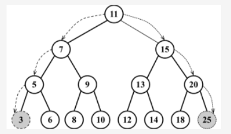

# 定义
BST 树，全称为二叉搜索树（Binary Search Tree），是一种基于二分查找的二叉树结构，它的每个节点都包含一个关键字，且所有节点的关键字都满足以下条件：

1. 左子树上所有节点的关键字均小于该节点的关键字；
2. 右子树上所有节点的关键字均大于该节点的关键字。

BST 树的主要特点是支持快速的查找、插入和删除操作，时间复杂度均为 O(log n)，其中 n 是树中节点的数量。具体地，对于查找操作，从根节点开始，不断与目标关键字比较，根据比较结果选择左子树或右子树继续查找，直到找到目标节点或遇到空节点为止。对于插入和删除操作，首先需要按照查找的方式找到待插入或待删除节点，然后根据具体情况进行节点的插入或删除操作，最后通过调整树的结构保持树的平衡性。

BST 树的缺点是，如果节点的插入顺序不合理，可能会导致树的不平衡，从而影响树的性能。例如，如果将节点按照递增或递减的顺序插入，则 BST 树会退化成一条链表，使得查找操作的时间复杂度退化为 O(n)，其中 n 是树中节点的数量。因此，在实际应用中，需要采取一些措施来保证 BST 树的平衡性，比如使用 AVL 树、红黑树等自平衡二叉树。

## 搜索树中的值在树中
```
有三种经常执行的搜索类型：搜索最小值搜索最大值搜索特定的值
```
实例：


## 1-1.寻找树的最小键的方法。
```js
min() {   
 return this.minNode(this.root); // {1}
}

/*
minNode方法允许我们从树中任意一个节点开始寻找最小的键。我们可以使用它来找到一棵树或其子树中最小的键。
因此，我们在调用minNode方法的时候传入树的根节点（行{1}），因为我们想要找到整棵树的最小键。

在minNode方法内部，我们会遍历树的左边（行{2}和行{3}）直到找到树的最下层（最左端）。
后一个节点使用的代码很相似。这里的不同之处在于我们遍历到树最左端的节点。
* */
minNode(node) {
    let current = node;
    while (current != null && current.left != null) {
        current = current.left;
    }
    return current;
}
```

## 1-2.以相似的方式，可以实现max方法。
```js
  max() {
    return this.maxNode(this.root);
  }
  maxNode(node) {
    let current = node;
    while (current != null && current.right != null) {
      current = current.right;
    }
    return current;
  }
```

## 总结：
```
要找到最大的键，我们要沿着树的右边进行遍历（行{5}）直到找到最右端的节点。

因此，对于寻找最小值，总是沿着树的左边；而对于寻找最大值，总是沿着树的右边。
```

## 1-3.搜索特定值
```js
search(key) {
   return this.searchNode(this.root, key);
}

searchNode(node, key) {
    if (node == null) {
      return false;
    }
    if (this.compareFn(key, node.key) === Compare.LESS_THAN) {
      return this.searchNode(node.left, key);
    } else if (this.compareFn(key, node.key) === Compare.BIGGER_THAN) {
      return this.searchNode(node.right, key);
    }
    return true;
}

console.log(tree.search(1) ? 'Key 1 found.' : 'Key 1 not found.'); 
console.log(tree.search(8) ? 'Key 8 found.' : 'Key 8 not found.');
// 输出结果如下所示。Value 1 not found. Value 8 found.
```

```
searchNode方法可以用来寻找一棵树或其任意子树中的一个特定的值。这也是为什么在行{1}中调用它的时候传入树的根节点作为参数。

在开始算法之前，要验证作为参数传入的node是否合法（不是null或undefined）。如果是的话，说明要找的键没有找到，返回false。

如果传入的节点不是null，需要继续验证。如果要找的键比当前的节点小（行{3}），那么继续在左侧的子树上搜索（行{4}）。
如果要找的键比当前的节点大（行{5}），
那么就从右侧子节点开始继续搜索（行{6}），否则就说明要找的键和当前节点的键相等，返回true来表示找到了这个键（行{7}）。
```

## 2.移除一个节点
这是我们在本书中要实现的最复杂的方法。