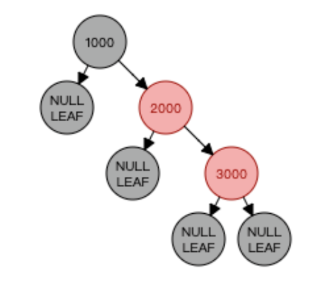
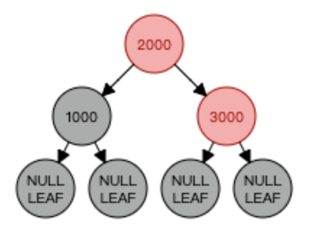

##  1.红黑树也是一个自平衡二叉搜索树
对AVL树插入和移除节点可能会造成旋转，所以我们需要一个包含多次插入和删除的自平衡树，红黑树是比较好的。

如果插入和删除频率较低（我们更需要多次进行搜索操作），那么AVL树比红黑树更好。

### 定义
红黑树（Red-Black Tree）是一种自平衡的二叉查找树（Binary Search Tree），它的每个节点上都带有颜色属性，可以是红色或黑色。红黑树是一种特化的AVL树（平衡二叉树），都是在进行插入和删除操作时通过特定操作保持二叉查找树的平衡，从而获得较高的查找性能。 
红黑树满足以下规则：
1. 每个节点是红色或黑色。
2. 根节点是黑色。
3. 每个叶节点（NIL节点，空节点）是黑色的。(用NULL引用表示的节点）
4. 如果一个节点是红色的，则它的子节点必须是黑色的。(不能有两个相邻的红节点，一个红节点不能有红的父节点或子节点；)
5. 从任意节点到其每个叶子节点的所有路径都包含相同数目的黑色节点。
从性质5又可以推出：性质5.1：如果一个结点存在黑子结点，那么该结点肯定有两个子结点。
```
         11(B)
        /     \
      2(B)    14(R)
     /   \   /   \
  1(B)  7(B)13(B)15(B)
         \
         8(R)
在这个树中，节点11、2、1、7、13和15都是黑色节点，节点14和8是红色节点。每个红色节点的两个子节点都是黑色的，从根节点到任何一个叶子节点的路径上的黑色节点数量是相同的，即3个。这满足了红黑树的所有规则。

```

Q1.红黑树可不可以全为黑结点？
 
A：不可以。
反证法：假设有一颗红黑满二叉树结点都为黑色结点时，此时添加一个黑色结点，不满足（5）特性，但是就算经过旋转，也无法满足（5）特性，大家都是黑色，变不了红黑树。

这些规则保证了红黑树的平衡性质，使得它的最坏情况下的时间复杂度为 O(log n)，其中 n 为树中节点的数量。因此，红黑树被广泛应用于需要高效插入、删除和查找操作的数据结构领域，比如在 C++ STL 中的 map 和 set 容器就是基于红黑树实现的。

性质4：每个红色结点的两个子结点一定都是黑色。(不能有两个连续的红色节点)
2000的子节点不是黑色，不满足性质4，需要进行“自平衡”操作。


平衡后


## 红黑树的自平衡操作
前面讲到红黑树能自平衡，它靠的是什么？
三种操作：左旋、右旋和变色。

## 性能
(1) 查找代价：
由于红黑树的性质(最长路径长度不超过最短路径长度的2倍)，可以说明红黑树虽然不像AVL一样是严格平衡的，但平衡性能还是要比BST要好。其查找代价基本维持在O(logN)左右，但在最差情况下(最长路径是最短路径的2倍少1)，比AVL要略逊色一点

(2) 插入代价：
RBT插入结点时，需要旋转操作和变色操作。但由于只需要保证RBT基本平衡就可以了。因此插入结点最多只需要2次旋转，这一点和AVL的插入操作一样。虽然变色操作需要O(logN)，但是变色操作十分简单，代价很小。

(3) 删除代价：
RBT的删除操作代价要比AVL要好的多，删除一个结点最多只需要3次旋转操作。

从根到叶子节点的最大路径不能大于最短路径的两倍长,大致上是平衡的，插入、删除和查找某个值的最坏情况时间都要求与树的高度成比例。

如果查找、插入、删除频率差不多，那么选择红黑树。


##  3.向红黑树中插入节点
向红黑树插入节点和在二叉搜索树中是一样的。除了插入的代码，我们还要在插入后给节点应用一种颜色，
并且验证树是否满足红黑树的条件以及是否还是自平衡的。
```js
insert(key: T) { 
    // special case: first key
    if (this.root == null) { // 1
      this.root = new RedBlackNode(key); // 2
      this.root.color = Colors.BLACK; // 3
    } else {
      const newNode = this.insertNode(this.root, key); // 4
      this.fixTreeProperties(newNode); // 5
    }
}
/*
为了满足规则2，我们要将这个根节点的颜色设为黑色（行{3}）。默认情况下，创建的节点颜色是红色（行{6}）。
如果树不是空的，我们会像二叉搜索树一样在正确的位置插入节点（行{4}）。在这种情况下，insertNode方法
需要返回新插入的节点，这样我们可以验证在插入后，红黑树的规则是否得到了满足（行{5}）。
* */
```

对红黑树来说，节点和之前比起来需要一些额外的属性：节点的颜色（行{6}）和指向父节点的引用（行{7}）。
```js
import { Node } from './node';

export enum Colors {
  RED = 0,
  BLACK = 1
}

export class RedBlackNode<K> extends Node<K> {
  left: RedBlackNode<K>;
  right: RedBlackNode<K>;
  parent: RedBlackNode<K>;
  color: Colors;

  constructor(public key: K) {
    super(key);
    this.color = Colors.RED; // 6
  }

  isRed() {
    return this.color === Colors.RED;
  }

  flipColor() {
    if (this.color === Colors.RED) {
      this.color = Colors.BLACK;
    } else {
      this.color = Colors.RED;
    }
  }
}
```

重写insertNode:
```
逻辑和二叉搜索树中的一样。不同之处在于我们保存了指向被插入节点父节点的引用（行{8}和行{10}），并且返回了节点的引用（行{9}和行{11}），
这样我们可以在后面验证树的属性。
```

```js
// 
protected insertNode(node: RedBlackNode<T>, key: T): RedBlackNode<T> {
    if (this.compareFn(key, node.key) === Compare.LESS_THAN) {
        if (node.left == null) {
            node.left = new RedBlackNode(key);
            node.left.parent = node; // 8
            return node.left; // 9
        } else {
            return this.insertNode(node.left, key);
        }
    } else if (node.right == null) {
        node.right = new RedBlackNode(key);
        node.right.parent = node; // 10
        return node.right; // 11
    } else {
        return this.insertNode(node.right, key);
    }
}

// BinarySearchTree
insertNode(node, key) {
    if (this.compareFn(key, node.key) === Compare.LESS_THAN) {
      if (node.left == null) {
        node.left = new Node(key);
      } else {
        this.insertNode(node.left, key);
      }
    } else if (node.right == null) {
      node.right = new Node(key);
    } else {
      this.insertNode(node.right, key);
    }
}
```

##  4.在插入节点后验证红黑树属性
要验证红黑树是否还是平衡的以及满足它的所有要求，我们需要使用两个概念：重新填色和旋转。
```
在向树中插入节点后，新节点将会是红色。这不会影响黑色节点数量的规则（规则6），
但会影响规则5：两个后代红节点不能共存。如果插入节点的父节点是黑色，那没有问题。

但是如果插入节点的父节点是红色，那么会违反规则5。要解决这个冲突，我们只需要改变父节点、祖父节点和叔节点（因为我们同样改变了父节点的颜色）。
```


