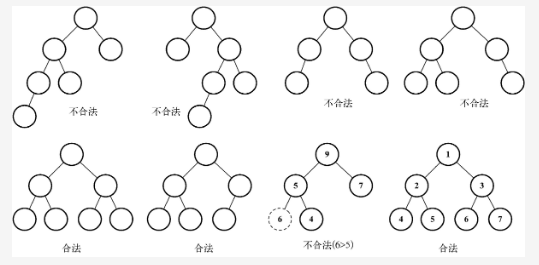
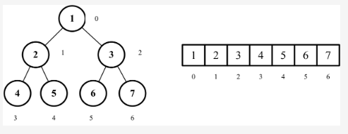

##  堆定义
堆是一种常见的数据结构，通常用来实现优先队列等抽象数据类型。堆是一个二叉树，具有以下两个特点：
1. 堆是一棵完全二叉树，即除了最后一层节点可以不满之外，其余层的节点数都要达到最大值。
2. 堆中每个节点的值都必须大于等于或小于等于其子节点的值，这个性质被称为堆的堆序性质。

由于堆的堆序性质，可以通过堆来实现一个可以快速找到最小或最大元素的数据结构，这个元素位于堆的根节点。如果堆的堆序性质是每个节点的值都大于等于其子节点的值，那么这个堆被称为大根堆；如果堆的堆序性质是每个节点的值都小于等于其子节点的值，那么这个堆被称为小根堆。

二叉堆是计算机科学中一种非常著名的数据结构，由于它能高效、快速地找出最大值和最小值，常被应用于优先队列。它也被用于著名的堆排序算法中。

两点特性：
它是一棵完全二叉树，表示树的每一层都有左侧和右侧子节点（除了最后一层的叶节点），并且最后一层的叶节点尽可能都是左侧子节点，这叫作结构特性。

二叉堆不是最小堆就是最大堆。最小堆允许你快速导出树的最小值，最大堆允许你快速导出树的最大值。所有的节点都大于等于（最大堆）或小于等于（最小堆）每个它的子节点。这叫作堆特性。



```
尽管二叉堆是二叉树，但并不一定是二叉搜索树（BST）。
在二叉堆中，每个子节点都要大于等于父节点（最小堆）或小于等于父节点（最大堆）。

然而在二叉搜索树中，左侧子节点总是比父节点小，右侧子节点也总是更大。
```

##  2.实现
二叉树的数组表示二叉树有两种表示方式。
第一种是使用一个动态的表示方式，也就是指针（用节点表示），在上一章使用过。

第二种是使用一个数组，通过索引值检索父节点、左侧和右侧子节点的值。下图展示了两种不同的表示方式。


##  2-1.要访问使用普通数组的二叉树节点
```
我们可以用下面的方式操作index。 

对于给定位置index的节点：

它的左侧子节点的位置是2 * index + 1（如果位置可用）；

它的右侧子节点的位置是2 * index + 2（如果位置可用）；

它的父节点位置是index / 2（如果位置可用）。
```

```js
getLeftIndex(index) {
    return (2 * index) + 1;
}
getRightIndex(index) {
    return (2 * index) + 2;
}
getParentIndex(index) {
    if (index === 0) {
        return undefined;
    }
    return Math.floor((index - 1) / 2);
}
```

##  2-2.向堆中插入新值
```
向堆中插入值是指将值插入堆的底部叶节点（数组的最后一个位置——行{1}）再执行siftUp方法（行{2}），
表示我们将要将这个值和它的父节点进行交换，直到父节点小于这个插入的值。这个上移操作也被称为up head、percolate up、bubble up、heapify up或cascade up。
```

```js
insert(value) {
    if (value != null) {
        const index = this.heap.length;
        this.heap.push(value);
        this.siftUp(index);
        return true;
    }
    return false;
}
```

##  2-3.从堆中找到最小值或最大值
```js
// 在最小堆中，最小值总是位于数组的第一个位置（堆的根节点）。
findMinimum() {
    return this.isEmpty() ? undefined : this.heap[0];
}
```

##  最大堆
MaxHeap类的算法和MinHeap类的算法一模一样。不同之处在于我们要把所有>（大于）的比较换成<（小于）的比较。

##  堆排序算法
它包含下面三个步骤。
1. 用数组创建一个最大堆用作源数据。
2. 在创建最大堆后，最大的值会被存储在堆的第一个位置。我们要将它替换为堆的最后一个值，将堆的大小减1。
3. 最后，我们将堆的根节点下移并重复步骤2直到堆的大小为1。

```js
import { defaultCompare,swap } from '../../util';

export default function heapSort(array: any[], compareFn = defaultCompare) {
  let heapSize = array.length;
  buildMaxHeap(array, compareFn);
  while (heapSize > 1) {
    swap(array, 0, --heapSize);
    heapify(array, 0, heapSize, compareFn);
  }
  return array;
}
```