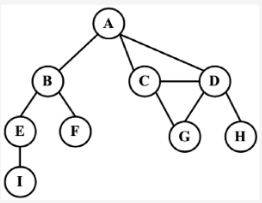
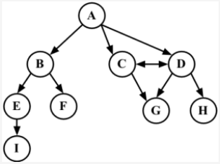
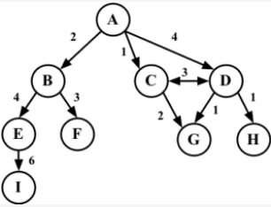
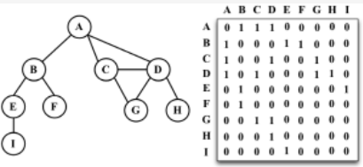
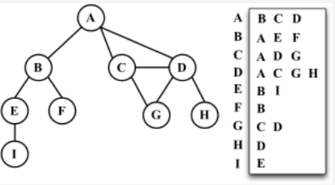

##  1.非线性数据结构——图。
我们可以使用图来解决计算机科学世界中的很多问题，比如搜索图中的一个特定顶点或搜索一条特定边，
寻找图中的一条路径（从一个顶点到另一个顶点），寻找两个顶点之间的最短路径，以及环检测。

### 定义
图是由节点和边构成的数据结构，用于表示对象之间的关系。图可以用来解决许多实际问题，例如社交网络分析、路线规划、计算机网络设计等。

图数据结构可以用邻接矩阵或邻接表来实现。邻接矩阵是一个二维矩阵，其中行和列分别表示节点，而矩阵中的元素表示边的存在或权重。邻接表是一个由链表组成的数组，每个链表表示与该节点相邻的所有节点。



### 图是一组由边连接的节点（或顶点）。

### 由一条边连接在一起的顶点称为相邻顶点。

一个顶点的度是其相邻顶点的数量。比如，A和其他三个顶点相连接，因此A的度为3；E和其他两个顶点相连，因此E的度为2。

### 路径
路径是顶点的一个连续序列。

### 简单路径
简单路径要求不包含重复的顶点。举个例子，A D G是一条简单路径。除去最后一个顶点（因为它和第一个顶点是同一个顶点），环也是一个简单路径，比如A D C A（最后一个顶点重新回到A）。

### 无环，连通
如果图中不存在环，则称该图是无环的。

如果图中每两个顶点间都存在路径，则该图是连通的。

## 以下是几个常用的图数据结构及其定义：
### 1.无向图（Undirected Graph）：
由一组节点和连接这些节点的无序边构成的图。如果两个节点之间存在一条边，那么这条边可以同时从这两个节点中的任意一个出发。例如：
```
A----B
|    |
|    |
C----D
```

### 2.有向图（Directed Graph）：
由一组节点和连接这些节点的有向边构成的图。如果节点 A 到节点 B 有一条有向边，那么这条边只能从节点 A 出发，并指向节点 B。例如：
```
A --> B
|     |
v     v
C <-- D
```

### 3.加权图（Weighted Graph）：
在图的边上赋予一个权重，表示两个节点之间的距离或者代价。例如：
```
A----2----B
|         |
3         5
|         |
C----4----D
```

### 4.无向加权图（Undirected Weighted Graph）：
由一组节点和连接这些节点的无序边，以及每条边的权重构成的图。例如：
```
A----2----B
|         |
3         5
|         |
C----4----D
```

##  2.有向图，无向图
```
图可以是无向的（边没有方向）或是有向的（有向图）。
如下图所示，有向图的边有一个方向。
```


强连通
```
如果图中每两个顶点间在双向上都存在路径，则该图是强连通的。例如，C和D是强连通的，而A和B不是强连通的。
```

加权
```
还可以是未加权的或是加权的。如下图所示，加权图的边被赋予了权值。
```



##  3.图的表示
###  3-1.邻接矩阵
```
图最常见的实现是邻接矩阵。每个节点都和一个整数相关联，该整数将作为数组的索引。我们用一个二维数组来表示顶点之间的连接。
如果索引为i的节点和索引为j的节点相邻，则array[i][j] === 1，否则array[i][j] === 0，如下图所示
```

不是强连通的图（稀疏图）如果用邻接矩阵来表示，则矩阵中将会有很多0，这意味着我们浪费了计算机存储空间来表示根本不存在的边。
例如，找给定顶点的相邻顶点，即使该顶点只有一个相邻顶点，我们也不得不迭代一整行。

邻接矩阵表示法不够好的另一个理由是， 图中顶点的数量可能会改变，而二维数组不太灵活。

###  3-2.邻接表的动态数据结构来表示图
```
邻接表由图中每个顶点的相邻顶点列表所组成。存在好几种方式来表示这种数据结构。
我们可以用列表（数组）、链表，甚至是散列表或是字典来表示相邻顶点列表。本书采用这种方式。
```


###  3-3.邻接矩阵
在关联矩阵中，矩阵的行表示顶点，列表示边。

##  实现类
默认情况下，图是无向的。我们使用一个数组来存储图中所有顶点的名字（行{2}），
以及一个字典来存储邻接表（行{3}）。字典将会使用顶点的名字作为键，邻接顶点列表作为值。

接着，我们将实现两个方法：一个用来向图中添加一个新的顶点（因为图实例化后是空的），
另外一个方法用来添加顶点之间的边。我们先实现addVertex方法。

见实例