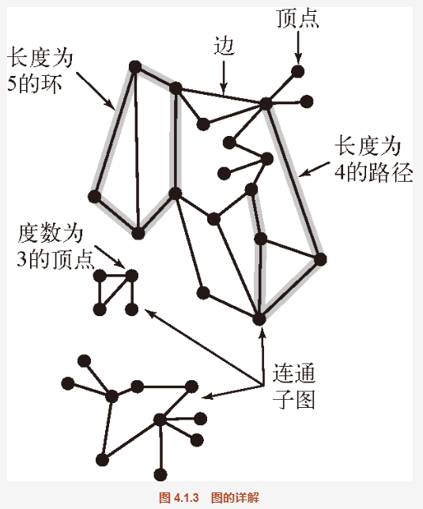
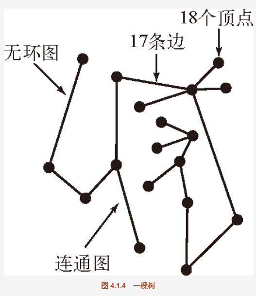
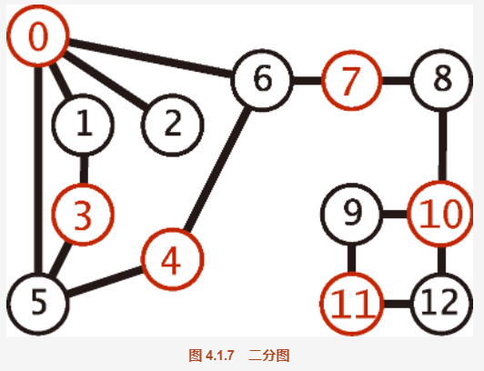

##  1-1.相邻  子图
```
当两个顶点通过一条边相连时，我们称这两个顶点是相邻的，并称这条边依附于这两个顶点。

某个顶点的度数即为依附于它的边的总数。

子图是由一幅图的所有边的一个子集（以及它们所依附的所有顶点）组成的图。
许多计算问题都需要识别各种类型的子图，特别是由能够顺序连接一系列顶点的边所组成的子图。
```

##  1-2.路径  环  连通图
```
路径是由边顺序连接的一系列顶点。 简单路径是一条没有重复顶点的路径。

环是一条至少含有一条边且起点和终点相同的路径。简单环是一条（除了起点和终点必须相同之外）不含有重复顶点和边的环。路径或者环的长度为其中所包含的边数。

大多数情况下，我们研究的都是简单环和简单路径并会省略掉简单二字。当允许重复的顶点时，我们指的都是一般的路径和环

当两个顶点之间存在一条连接双方的路径时，我们称一个顶点和另一个顶点是连通的。

我们用类似 u-v-w-x 的记法来表示 u 到 x 的一条路径，用 u-v-w-x-u 表示从 u 到 v 到 w 到 x 再回到 u 的一条环。我们会学习几种查找路径和环的算法。
```

连通图

如果从任意一个顶点都存在一条路径到达另一个任意顶点，我们称这幅图是连通图。一幅非连通的图由若干连通的部分组成，它们都是其极大连通子图。
```
直观上来说，如果顶点是物理存在的对象，例如绳节或是念珠，而边也是物理存在的对象，例如绳子或是电线，那么将任意顶点提起，连通图都将是一个整体，
而非连通图则会变成两个或多个部分。一般来说，要处理一张图就需要一个个地处理它的连通分量（子图）。
```


##  2.无环图：无环图是一种不包含环的图。
```
树是一幅无环连通图。互不相连的树组成的集合称为森林。连通图的生成树是它的一幅子图，它含有图中的所有顶点且是一棵树。
图的生成树森林是它的所有连通子图的生成树的集合
```

总结：
```
树的定义非常通用，稍做改动就可以变成用来描述程序行为的（函数调用层次）模型和数据结构（二叉查找树、2-3 树等）。
```

例如：
当且仅当一幅含有v 个结点的G图 满足下列 5 个条件之一时，它就是一棵树：
```
1.G有v-1 条边且不含有环；
2.G有v-1 条边且是连通的；
3.是连通的，但删除任意一条边都会使它不再连通；
4.G是无环图，但添加任意一条边都会产生一条环；
5.G中的任意一对顶点之间仅存在一条简单路径。
```

##  2-2.图的密度
```
是指已经连接的顶点对占所有可能被连接的顶点对的比例。在稀疏图中，被连接的顶点对很少；而在稠密图中，
只有少部分顶点对之间没有边连接。一般来说，如果一幅图中不同的边的数量在顶点总数V的一个小的常数倍以内，
那么我们就认为这幅图是稀疏的,否则则是稠密的
```

##  2-3.二分图
```
二分图是一种能够将所有结点分为两部分的图，其中图的每条边所连接的两个顶点都分别属于不同的部分。
示例，其中红色的结点是一个集合，黑色的结点是另一个集合。二分图会出现在许多场景中，我们会在本节的最后详细研究其中的一个场景。
```

