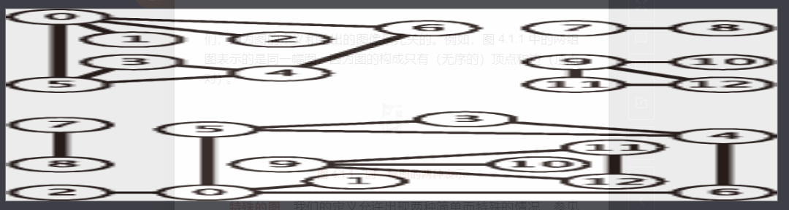
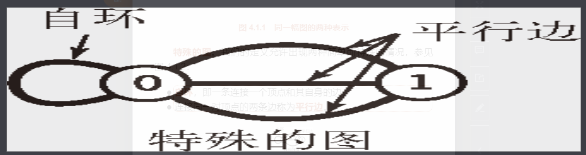

```
无向图 图模型中，边（edge）仅仅是两个顶点（vertex）之间的连接。为了和其他图模型相区别，我们将它称为无向图。

这是一种最简单的图模型，我们先来看一下它的定义:
图是由一组顶点和一组能够将两个顶点相连的边组成的
```

```
就定义而言，顶点叫什么名字并不重要，但我们需要一个方法来指代这些顶点。一般使用 0 至 v-1 来表示一张含有v个顶点的图中的各个顶点。
这样约定是为了方便使用数组的索引来编写能够高效访问各个顶点中信息的代码。


用一张符号表来为顶点的名字和 0 到 的整数值建立一一对应的关系并不困难，因此直接使用数组索引作为结点的名称更方便且不失一般性（也不会损失什么效率）。
我们用 v-w 的记法来表示连接 v 和 w 的边，w-v 是这条边的另一种表示方法。
```

##  2-1.图
在绘制一幅图时，用圆圈表示顶点，用连接两个顶点的线段表示边，这样就能直观地看出图的结构。
但这种直觉有时也可能会误导我们，因为图的定义和绘出的图像是无关的。

例如，图 4.1.1 中的两组图表示的是同一幅图，因为图的构成只有（无序的）顶点和边（顶点对）。



##  2-2.特殊的图。我们的定义允许出现两种简单而特殊的情况，参见图 4.1.2：
```
1.自环，即一条连接一个顶点和其自身的边；
2.连接同一对顶点的两条边称为平行边。
```



```
数学家常常将含有平行边的图称为多重图，而将没有平行边或自环的图称为简单图。
一般来说，实现允许出现自环和平行边（因为它们会在实际应用中出现），但我们不会将它们作为示例。因此，我们用两个顶点就可以指代一条边了。
```