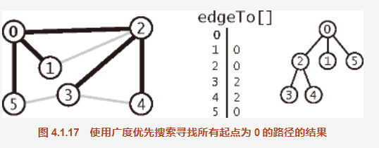
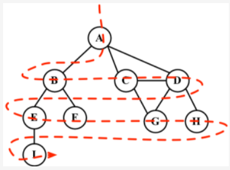

##  运用
单点最短路径。给定一幅图和一个起点 s，回答“从 s 到给定目的顶点 v 是否存在一条路径？如果有，找出其中最短的那条（所含边数最少）。”等类似问题。

解决这个问题的经典方法叫做广度优先搜索（BFS)。它也是许多图算法的基石。

深度优先搜索得到的路径不仅取决于图的结构，还取决于图的表示和递归调用的性质。

##  实现
使用了一个队列来保存所有已经被标记过但其邻接表还未被检查过的顶点。先将起点加入队列，然后重复以下步骤直到队列为空：
1. 取队列中的下一个顶点 v 并标记它；
2. 将与 v 相邻的所有未被标记过的顶点加入队列。

```
算法 4.2 中的 bfs() 方法不是递归的。不像递归中隐式使用的栈，它显式地使用了一个队列。
和深度优先搜索一样，它的结果也是一个数组 edgeTo[]，也是一棵用父链接表示的根结点为 s 的树。

它表示了 s 到每个与 s 连通的顶点的最短路径。用例也可以使用算法 4.1 中为深度优先搜索实现的相同的 pathTo() 方法得到这些路径。
用例也可以使用算法 4.1 中为深度优先搜索实现的相同的 pathTo() 方法得到这些路径。

图 4.1.17 和图 4.1.18 显示了用广度优先搜索处理样图时，算法使用的数据结构在每次循环的迭代开始时的内容。
首先，顶点 0 被加入队列，然后循环开始搜索。
```



当要标注已经访问过的顶点时，我们用三种颜色来反映它们的状态。

白色：表示该顶点还没有被访问。
灰色：表示该顶点被访问过，但并未被探索过。
黑色：表示该顶点被访问过且被完全探索过。

这就是之前提到的务必访问每个顶点最多两次的原因。为了有助于在广度优先和深度优先算法中标记顶点，
我们要使用Colors变量（作为一个枚举器）。

两个算法还需要一个辅助对象来帮助存储顶点是否被访问过。
在每个算法的开头，所有的顶点会被标记为未访问（白色）。
我们要用下面的函数来初始化每个顶点的颜色。

```js
const Colors = {
  WHITE: 0,
  GREY: 1,
  BLACK: 2
};

const initializeColor = vertices => {
  const color = {};
  for (let i = 0; i < vertices.length; i++) {
    color[vertices[i]] = Colors.WHITE;
  }
  return color;
};
```

##  2.广度优先搜索
```
广度优先搜索算法会从指定的第一个顶点开始遍历图，先访问其所有的邻点（相邻顶点），就像一次访问图的一层。
换句话说，就是先宽后深地访问顶点，如下图所示。
```


```
以下是从顶点U开始的广度优先搜索算法所遵循的步骤。
(1) 创建一个队列Q。
(2) 标注U为被发现的（灰色），并将U入队列 。
(3) 如果Q非空，则运行以下步骤:
    (a) 将U从Q中出队列；
    (b) 标注U为被发现的（灰色）；
    (c) 将U所有未被访问过的邻点（白色）入队列；　　
    (d) 标注U为已被探索的（黑色）。
```
##  2-1.广度优先搜索具体代码：如实例
```
我们要做的第一件事情是用initializeColor函数来将color数组初始化为白色（行{1}）。
我们还需要声明和创建一个Queue实例（行{2}），它将会存储待访问和待探索的顶点。

breadthFirstSearch方法接收一个图实例和顶点作为算法的起始点。
起始顶点是必要的，我们将此顶点入队列（行{3}）。如果队列非空（行{4}），
我们将通过出队列（行{5}）操作从队列中移除一个顶点，并取得一个包含其所有邻点的邻接表（行{6}）。
该顶点将被标注为灰色（行{7}），表示我们发现了它（但还未完成对其的探索）。

当完成探索该顶点和其相邻顶点后，我们将该顶点标注为已探索过的（颜色设置为黑色——行{13}）。
我们实现的这个breadthFirstSearch方法也接收一个回调（我们在第10章中遍历树时使用了一个相似的方法）。
这个参数是可选的，如果我们传递了回调函数（行{14}），就会用到它。
```

##  2-1-1.测试函数
```
接收一个回调（我们在第10章中遍历树时使用了一个相似的方法）。这个参数是可选的，如果我们传递了回调函数（行{14}），就会用到它。
让我们执行下面这段代码来测试一下该算法。
const printVertex = (value) => console.log('Visited vertex: ' + value); // {15}
breadthFirstSearch(graph, myVertices[0], printVertex);

首先，我们声明了一个回调函数（行{15}），它仅仅在浏览器控制台上输出已经被完全探索过的顶点的名字。
接着，我们会调用breadthFirstSearch方法，给它传递图（和我们在本章之前用来测试Graph类的示例一样），
第一个顶点（A——来自本章开头声明的myVertices数组）和回调函数（printVertex）。
当我们执行这段代码时，该算法会在浏览器控制台输出如下所示的结果。

Visited vertex: A 
Visited vertex: B 
Visited vertex: C 
Visited vertex: D 
Visited vertex: E 
Visited vertex: F 
Visited vertex: G 
Visited vertex: H 
Visited vertex: I
```

##  3.使用BFC寻找最短路径
我们可以用该算法做更多事情，而不只是输出被访问顶点的顺序。
```
给定一个图G和源顶点V，找出每个顶点U和V之间最短路径的距离（以边的数量计）。

对于给定顶点V，广度优先算法会访问所有与其距离为1的顶点，接着是距离为2的顶点，
以此类推。所以，可以用广度优先算法来解这个问题。

我们可以修改breadthFirstSearch方法以返回给我们一些信息：
    a.从V到U的距离distances[u]；
    b.前溯点predecessors[u]，用来推导出从V到其他每个顶点U的最短路径。
```

##  4.实例代码 BFS
```
这个版本的BFS方法有些什么改变？

我们还需要声明数组distances（行{1}）来表示距离， 以及predecessors数组（行{2}）来表示前溯点。 
下一步则是对于图中的每一个顶点（行{3}），用0来初始化数组distances（行{4}），用null来初始化数组predecessors（行{5}）。

当我们发现顶点u的邻点w时，则设置w的前溯点值为u（行{7}）。
我们还通过给distances[u]加1来增加v和w之间的距离（u是w的前溯点，distances[u]的值已经有了）。

方法最后返回了一个包含distances和predecessors的对象（行{8}）。

现在，我们可以再次执行BFS方法，并将其返回值存在一个变量中。
const shortestPathA = BFS(graph, myVertices[0]); 
console.log(shortestPathA);

对顶点A执行BFS方法，以下将会是输出。

distances: [A: 0, B: 1, C: 1, D: 1, E: 2, F: 2, G: 2, H: 2 , I: 3], 
predecessors: [A: null, B: "A", C: "A", D: "A", E: "B", F: "B", G: "C", H: "D", I: "E"]
这意味着顶点A与顶点B、C和D的距离为1；与顶点E、F、G和H的距离为2；与顶点I的距离为3。
```