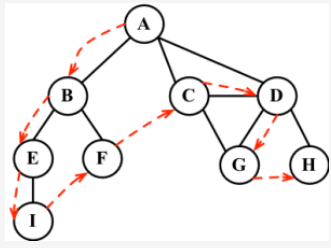
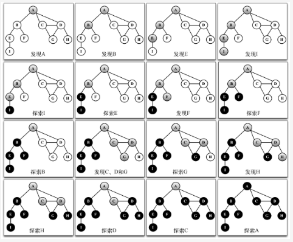

##  深度优先搜索算法
深度优先搜索算法将会从第一个指定的顶点开始遍历图，沿着路径直到这条路径最后一个顶点被访问了，接着原路回退并探索下一条路径。
```
当节点v的所在边都己被探寻过, 搜索将回溯到发现节点v的那条边的起始节点. 这一过程一直进行到已发现从源节点可达的所有节点为止.
如果还存在未被发现的节点, 则选择其中一个作为源节点并重复以上过程, 整个进程反复进行直到所有节点都被访问为止.
```


```
深度优先搜索算法不需要一个源顶点。在深度优先搜索算法中，若图中顶点V未访问，则访问该顶点V。

要访问顶点V，照如下步骤做：
(1) 标注V为被发现的（灰色）；
(2) 对于V的所有未访问（白色）的邻点W，访问顶点W；
(3) 标注V为已被探索的（黑色）。

如你所见，深度优先搜索的步骤是递归的，这意味着深度优先搜索算法使用栈来存储函数调用（由递归调用所创建的栈）。
```

##  实现:见实例
```
depthFirstSearch函数接收一个Graph类实例和回调函数作为参数（行{1}）。
在初始化每个顶点的颜色后，对于图实例中每一个未被访问过的顶点（行{2}和行{3}），
我们调用私有的递归函数depthFirstSearchVisit，传递的参数为要访问的顶点u、颜色数组以及回调函数 （行{4}）。

当访问顶点u时，我们标注其为被发现的（灰色——行{5}）。如果有callback函数的话（行{6}），则执行该函数输出已访问过的顶点。
接下来的一步是取得包含顶点u所有邻点的列表（行{7}）。对于顶点u的每一个未被访问过（颜色为白色——行{10}和行{8}）的
邻点w（行{9}），我们将调用depthFirstSearchVisit函数，传递w和其他参数（行{11}——添加顶点w入栈，这样接下来就能访问它）。
最后，在该顶点和邻点按深度访问之后，我们回退，意思是该顶点已被完全探索，并将其标注为黑色（行{12}）。
```

```js
depthFirstSearch(graph, printVertex);

// 输出如下。
Visited vertex: A 
Visited vertex: B 
Visited vertex: E 
Visited vertex: I 
Visited vertex: F 
Visited vertex: C 
Visited vertex: D 
Visited vertex: G 
Visited vertex: H
```
下面这个示意图展示了该算法每一步的执行过程。
```
在我们示例所用的图中，行{4}只会被执行一次，因为所有其他的顶点都有路径到第一个调用depthFirstSearchVisit函数的顶点（顶点A）。
如果顶点B第一个调用函数，则行{4}将会为其他顶点再执行一次（比如顶点A）。
```

