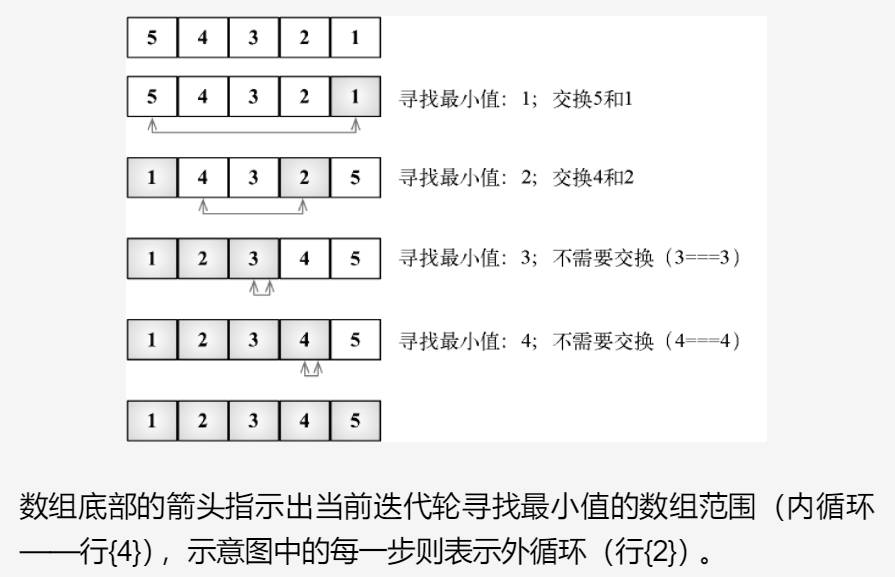

## 选择排序
选择排序同样也是一个复杂度为O(N^2)的算法。和冒泡排序一样，它包含有嵌套的两个循环，这导致了二次方的复杂度。

选择排序算法是一种原址比较排序算法。选择排序大致的思路是找到数据结构中的最小值并将其放置在第一位，
接着找到第二小的值并将其放在第二位，以此类推。

外循环（行{2}）迭代数组，并控制迭代轮次（数组的第N个值——下一个最小值）。我们假设本迭代轮次的第
一个值为数组最小值（行{3}）。然后，从当前i的值开始至数组结束（行{4}），我们比较是否位置j的值比
当前最小值小（行{5}）；如果是，则改变最小值至新最小值（行{6}）。当内循环结束（行{4}），将得出
数组第N小的值。最后，如果该最小值和原最小值不同（行{7}），则交换其值。

[5, 4, 3, 2, 1] --->实例

## 和冒泡排序区别
区别：
1. 实现方式不同：选择排序在每个迭代中找到未排序部分中的最小值，并将其与已排序部分的末尾交换位置，而冒泡排序在每个迭代中将最大值“冒泡”到已排序部分的末尾。

2. 性能不同：选择排序的最坏时间复杂度为O(n^2)，但它通常比冒泡排序快。冒泡排序的最坏时间复杂度也为O(n^2)，但它通常比选择排序慢，因为它需要进行更多的交换操作。

3. 交换次数不同：选择排序在每个迭代中仅交换一次元素，而冒泡排序在每个迭代中可能要交换多次元素，因此选择排序需要更少的交换操作。
