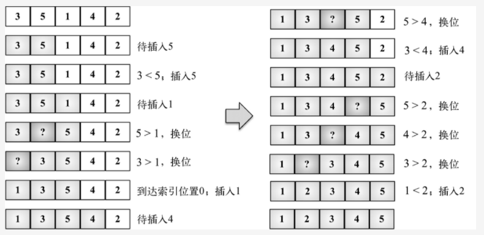

## 插入排序
插入排序每次排一个数组项，以此方式构建最后的排序数组。假定第一项已经排序了。接着，它和第二项进行比较—— 第二项是应该待在原位还是插到第一项
之前呢？这样，头两项就已正确排序，接着和第三项比较（它是该插入到第一、第二还是第三的位置呢），以此类推。

在完全有序的情况下，插入排序每个未排序区间元素只需要比较1次，所以时间复杂度是O(n)。而在极端情况完全逆序，时间复杂度为O(n^2).就等于每次
都把未排序元素插入到数组第一位。在数组中插入1个元素的时间复杂度为O(n),那插入n个就是o(n^2)了。

## 插入排序与冒泡排序对比
插入排序的移动操作比冒泡排序简单很多，插入排序需要一个赋值操作，冒泡要三个

* 插入排序的思想是将未排序的元素插入到已排序的元素中。在插入过程中，将待插入元素与已排序元素进行比较，找到插入位置并将其插入。插入排序的时间复杂度为 O(n^2)，其中 n 是待排序元素的数量。由于插入排序的比较次数和元素移动次数较少，因此在实际应用中，插入排序比冒泡排序具有更好的性能。

* 冒泡排序的思想是从左到右逐个比较相邻元素的大小，如果前一个元素大于后一个元素，则交换它们的位置。在每一轮比较中，将未排序元素中最大的元素放到了已排序元素的末尾。冒泡排序的时间复杂度也为 O(n^2)，但是冒泡排序的比较次数和元素移动次数均较多，因此在实际应用中，其性能通常不如插入排序。

* 总体来说，插入排序比冒泡排序更加高效，因为插入排序的平均时间复杂度比冒泡排序低，而且插入排序的性能在处理较大数据集时更加优越。如果待排序的数据集规模很小，两种算法的性能差异可以忽略不计。

## 代码解读
```
迭代数组来给第i项找到正确的位置（行{2}）。注意，算法是从第二个位置（索引1）而不是0位置开始的（我们认为第一项已排序了）变量（行{3}）并也
将其值存储在一个临时变量中（行{4}），便于之后将其插入到正确的位置上。下一步是要找到正确的位置来插入项目。只要变量j比0大（因为数组的第一个
索引是0——没有负值的索引）并且数组中前面的值比待比较的值大（行{5}），我们就把这个值移到当前位置上（行{6}）并减小j。
最终，能将该值插入到正确的位置上。
```

[3, 5, 1, 4, 2] --->实例


* (1) 3已被排序，所以我们从数组第二个值5开始。3比5小，所以5待在原位（数组的第二位）。3和5排序完毕。

* (2) 下一个待排序和插到正确位置上的值是1（目前在数组的第三位）。5比1大，所以5被移至第三位去了。我们得分析1是否应该被插入到第二位——1比3大吗？
 不，所以3被移到第二位去了。接着，我们得证明1应该插入到数组的第一位上。因为0是第一个位置且没有负数位，所以1必须被插入第一位。1、3、5三个数字已经排序。

* (3) 然后看下一个值：4。4应该在当前位置（索引3）还是要移动到索引较低的位置上呢？4比5小，所以5移动到索引3位置上去。那么应该把4插到索引2的位置上去吗？
4比3大，所以把4插入数组的位置3上。

* (4) 下一个待插入的数字是2（数组的位置4）。5比2大，所以5移动至索引4。4比2大，所以4也得移动（位置3）。3也比2大，所以3还得移动。1比2小，所以2插入
到数组的第二位置上。至此，数组已排序完成。

## 实现
这个算法的基本思路是，维护一个已排序的子数组，每次将未排序部分的第一个元素插入到已排序部分的合适位置。
具体步骤如下：
1. 从第二个元素开始，遍历整个数组。
2. 对于当前元素，将它存储在一个变量 currentVal 中。
3. 从当前元素的前一个元素开始，向前遍历已排序的子数组。
4. 如果遍历到的元素大于 currentVal，就将它向右移动一位，为插入 currentVal 腾出位置。
5. 重复步骤 4，直到找到一个小于等于 currentVal 的元素，或者遍历到已排序部分的开头。
6. 将 currentVal 插入到上一步找到的位置后面。
7. 重复步骤 2 到 6，直到遍历完整个数组。

最终，整个数组就会被排序好，算法的时间复杂度为 O(n^2)，空间复杂度为 O(1)。
```js
function insertionSort(arr) {
  for (let i = 1; i < arr.length; i++) {
    let currentVal = arr[i];
    let j = i - 1;
    debugger
    while (j >= 0 && arr[j] > currentVal) {
      arr[j + 1] = arr[j];
      j--;
    }
    arr[j + 1] = currentVal;
  }
  return arr;
}

// 示例使用
const arr = [52, 63, 14, 59, 68, 35, 8, 67, 45, 99];
console.log(insertionSort(arr)); // 输出 [8, 14, 35, 45, 52, 59, 63, 67, 68, 99]
```