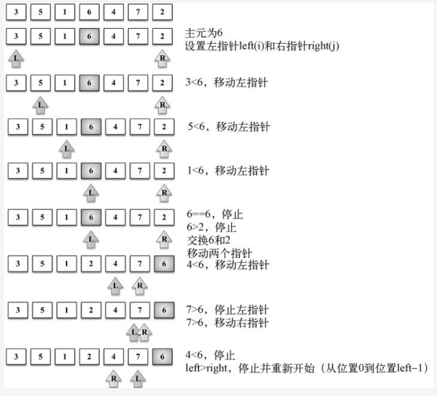
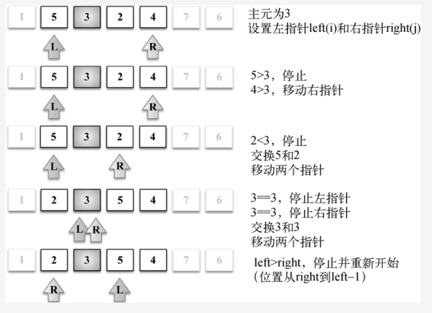
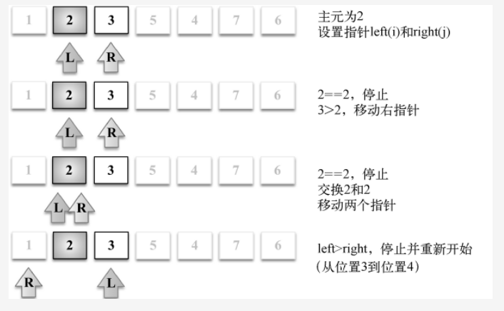
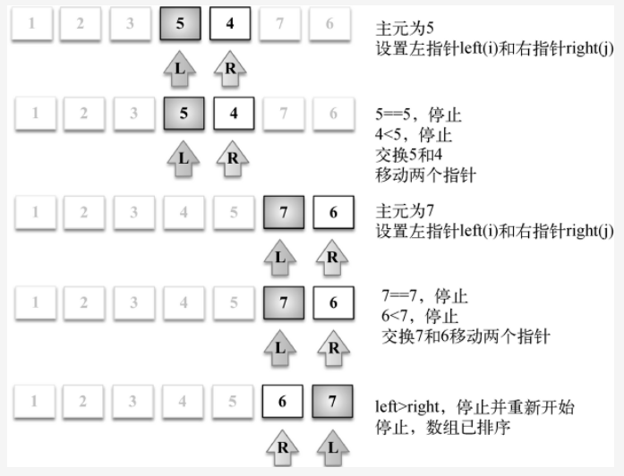

## 快速排序前言
快速排序也许是最常用的排序算法了。它的复杂度为O(nlog(n))，且性能通常比其他复杂度为O(nlog(n))的排序算法要好。

和归并排序一样，快速排序也使用分而治之的方法， 将原始数组分为 较小的数组（但它没有像归并排序那样将它们分割开）。

## 1.基本算法
快速排序特点包括它是原地排序（只需要一个很小的辅助栈），且
时间和 Nlg N 成正比。

目前所学的排序都没二则优点。

另外，快排的内循环比大多数排序算法都短小。主要缺点是非常脆弱，在实现要小心才能避免地劣的性能。
```
快排是一种分治的排序算法。
分成两个子数组，并独立排序。
```

快排和归并排序是互补的：
```
归并将数组分成两个子数组分别排序，并将有序的子数组归并并将整个数组排序。

而快排将子数组都有序时候整个数组也就自然有序了。
```

```
在第一种情况中，递归调用发生在处理整个数组之前；
第二种情况中，递归调用发生在处理整个数组之后。

在归并排序中，一个数组被等分为两半；在快排，切分的位置取决于数组的内容。
```

## 步骤
```
(1) 首先，从数组中选择一个值作为主元（pivot），也就是数组中间的那个值。

(2) 创建两个指针（引用），左边一个指向数组第一个值，右边一个指向数组最后一个值。移动左指针直到我们找到一个比主元大的值，
接着，移动右指针直到找到一个比主元小的值，然后交换它们，重复这个过程，直到左指针超过了右指针。这个过程将使得比主元小的值
都排在主元之前，而比主元大的值都排在主元之后。这一步叫作划分（partition）操作。

(3) 接着，算法对划分后的小数组（较主元小的值组成的子数组，以及较主元大的值组成的子数组）重复之前的两个步骤，直至数组已完全排序。
```

## quick 实例
```
首先声明index（行{1}），该变量能帮助我们将子数组分离为较小值数组和较大值数组。这样就能再次递归地调用quick函数了。
partition函数返回值将赋值给index（行{3}）。

如果数组的长度比1大（因为只有一个元素的数组必然是已排序了的——行{2}），
我们将对给定子数组执行partition操作（第一次调用是针对整个数组）以得到index（行{3}）。
如果子数组存在较小值的元素（行{4}），则对该数组重复这个过程（行{5}）。同理，对存在较大值的子数组也是如此，
如果有子数组存在较大值（行{6}），我们也将重复快速排序过程（行{7}）。
```

## 划分过程
```
第一件要做的事情是选择主元，有好几种方式。最简单的一种是选择数组的第一个值（最左边的值）。然而，研究表明对于几乎已排序的数组，
这不是一个好的选择，它将导致该算法的最差表现。另外一种方式是随机选择数组的一个值或是选择中间的值。
	现在，让我们看看划分过程。
```

```
在本实现中，我们选择中间值作为主元（行{8}）。我们初始化两个指针：left（低——行{9}），初始化为数组第一{10}），初始化为数组最后一个元素。

只要left和right指针没有相互交错（行{11}），就执行划分操作。首先，移动left指针直到找到一个比主元大的元素（行{12}）。对right指针，
我们做同样的事情，移动right指针直到我们找到一个比主元小的元素（行{13}）。

当左指针指向的元素比主元大且右指针指向的元素比主元小，并且此时左指针索引没有右指针索引大时（行{14}），意思是左项比右项大（值比较），
我们交换它们（行{15}），然后移动两个指针，并重复此过程（从行{11}再次开始）。
	在划分操作结束后，返回左指针的索引，用来在行{3}处创建子数组。
```

## 排序实例
```
给定数组[3, 5, 1, 6, 4, 7, 2]，示意图展示了划分操作的第一次执行。
```


下面的示意图展示了对有较小值的子数组执行的划分操作（注意7和6不包含在子数组之内）。


接着，我们继续创建子数组，如下图所示，但是这次操作是针对上图中有较大值的子数组（有1的那个较小子数组不用再划分了，因为它仅含有一个值）。


对子数组[2, 3, 5, 4]中的较小子数组[2, 3]继续进行划分（算法代码中的行{5}）。


然后子数组[2, 3, 5, 4]中的较大子数组[5, 4]也继续进行划分（算法中的行{7}），示意图如下。

最终，较大子数组[6, 7]也会进行划分操作，快速排序算法的操作执行完成。

## 简单版本
当我们调用 quickSort 函数时，传入一个数组作为参数。首先，函数会检查数组的长度是否小于等于 1。
如果是，说明数组已经有序，直接返回即可。

接下来，我们选择数组中间的元素作为基准元素（这个实现并不是最优的，但是足够简单）。我们创建两个
新数组 left 和 right 来存储数组中比基准元素小和大的元素。遍历原始数组中除基准元素外的所有元素，
如果元素小于基准元素，则将它放入左数组，否则放入右数组。

然后我们对左数组和右数组分别递归调用 quickSort 函数。递归调用的结束条件就是数组长度小于等于 1。

最后，我们将左数组、基准元素和右数组合并起来，返回一个新数组。
这里我们使用了扩展运算符 ...，可以将多个数组合并成一个。

这个实现虽然简单易懂，但是它并不是最优的，因为在每次调用函数时都要创建新的数组，可能会消耗大量的内存空间。
在实际使用中，我们可以通过修改数组中元素的位置来实现原地排序，从而节省空间。
```js
function quickSort(arr) {
  if (arr.length <= 1) {
    return arr;
  }

  debugger
  const pivotIndex = Math.floor(arr.length / 2);
  const pivot = arr[pivotIndex];
  const left = [];
  const right = [];

  for (let i = 0; i < arr.length; i++) {
    if (i === pivotIndex) {
      continue;
    }
    if (arr[i] < pivot) {
      left.push(arr[i]);
    } else {
      right.push(arr[i]);
    }
  }

  return [...quickSort(left), pivot, ...quickSort(right)];
}

const arr = [52, 63, 14, 59, 68, 35, 8, 67, 45, 99];
const sortedArr = quickSort(arr);
console.log(sortedArr); // [8, 14, 35, 45, 52, 59, 63, 67, 68, 99]
```

## 实现2
```js
const Compare = {
  LESS_THAN: -1,
  BIGGER_THAN: 1,
  EQUALS: 0
};

function defaultCompare(a, b) {
  if (a === b) {
    return Compare.EQUALS;
  }
  return a < b ? Compare.LESS_THAN : Compare.BIGGER_THAN;
}

function swap(array, index1, index2) {
  const aux = array[index1];
  array[index1] = array[index2];
  array[index2] = aux;
}


function partition(array, left, right, compareFn) {
  const pivot = array[Math.floor((right + left) / 2)]; // 8
  let i = left; // 9
  let j = right; // 10

  while (i <= j) { // 11
    while (compareFn(array[i], pivot) === Compare.LESS_THAN) { // 12
      i++;
    }
    while (compareFn(array[j], pivot) === Compare.BIGGER_THAN) { // 13
      j--;
    }
    if (i <= j) { // 14
      swap(array, i, j); // 15
      i++;
      j--;
    }
  }
  return i; // 16
}

function quick(array, left, right, compareFn) {
  let index;  // 1
  if (array.length > 1) { // 2
    index = partition(array, left, right, compareFn); // 3
    if (left < index - 1) {   // 4
      quick(array, left, index - 1, compareFn); // 5
    }
    if (index < right) {  // 6
      quick(array, index, right, compareFn); // 7
    }
  }
  return array;
}

function quickSort(array, compareFn = defaultCompare) {
  return quick(array, 0, array.length - 1, compareFn);
}

const array = [52, 63, 14, 59, 68, 35, 8, 67, 45, 99];
console.log('array:', array)
console.log('array:', quickSort(array))
```