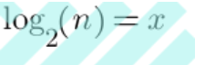
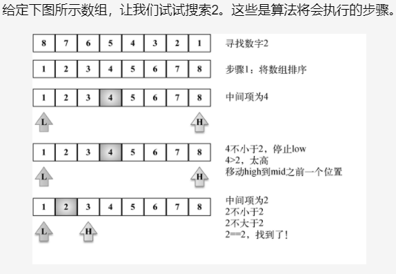

```
二分查找的基本思想是将n个元素分成大致相等的两部分，取a[n/2]与x做比较，如果x=a[n/2],则找到x,算法中止；如果x<a[n/2],
则只要在数组a的左半部分继续搜索x,如果x>a[n/2],则只要在数组a的右半部搜索x.
时间复杂度即是while循环的次数。
总共有n个元素，
渐渐跟下去就是n,n/2,n/4,....n/2^k（接下来操作元素的剩余个数），其中k就是循环的次数
由于你n/2^k取整后>=1
即令n/2^k=1
可得k=log2n,（是以2为底，n的对数）
所以时间复杂度可以表示O(h)=O(log2n) 或 忽略底数：O(log(n))  快速排序是O(nlog(n)
```

## 1.二分查找步骤
要求被搜索的数据结构已排序。
(1) 选择数组的中间值
(2) 如果选中值是待搜索值，那么算法执行完毕（值找到了）。
(3) 如果待搜索值比选中值要小，则返回步骤1并在选中值左边的子数组中寻找（较小）。
(4) 如果待搜索值比选中值要大，则返回步骤1并在选种值右边的子数组中寻找（较大）。


## 2.算法分析
```
二分查找在最坏的情况下依次是n/2,n/4,n/8。。。。一直到1为止，这就有点惨了。
假设循环x次才能查找到目标数
以观察到分母是每次都乘以1/2，分子不变，所以可以根据题意列出下面等式：
n(1/2)x = 1

也就是：
n(1/2)^x = 1

运算下：
2^x = n
```
得到：

对数函数的底数省略掉，所以也就是:
log(n) = x

## 3.代码解析
```
设置low（行{2}）和high（行{3}）指针（它们是边界）。

当low比high小时（行{4}），我们计算得到中间项索引并取得中间项的值，此处如果low比high大，
则意味着该待搜索值不存在并返回-1（行{12}）。

接着，我们比较选中项的值和搜索值（行{7}）。如果小了，则选择数组低半边并重新开始。

如果选中项的值比搜索值大了，则选择数组高半边并重新开始。
若两者都是不是，则意味着选中项的值和搜索值相等，因此直接返回该索引（行{11}）。
```

