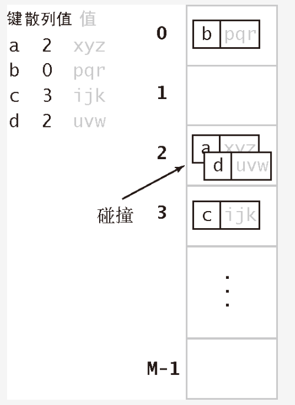

## 使用散列的查找算法分为两步。
```
第一步是用散列函数将被查找的键转化为数组的一个索引。理想情况下，不同的键都能转化为不同的索引值。

当然，这只是理想情况，所以我们需要面对两个或者多个键都会散列到相同的索引值的情况。

散列查找的第二步就是一个处理碰撞冲突的过程，如图 3.4.1 所示。在描述了多种散列函数的计算后，我们会学习两种解决碰撞的方法：拉链法和线性探测法。
```


## 散列表解析
```
散列表是算法在时间和空间上作出权衡的经典例子。
如果没有内存限制，我们可以直接将键作为（可能是一个超大的）数组的索引，那么所有查找操作只需要访问内存一次即可完成。
但这种理想情况不会经常出现，因为当键很多时需要的内存太大。

另一方面，如果没有时间限制，我们可以使用无序数组并进行顺序查找，这样就只需要很少的内存。而散列表则使用了适度的空间和时间并在这两个极端之间找到了一种平衡。
事实上，我们不必重写代码，只需要调整散列算法的参数就可以在空间和时间之间作出取舍。我们会使用概率论的经典结论来帮助我们选择适当的参数。
```

## 一.散列函数我们面对的第一个问题就是散列函数的计算
```
这个过程会将键转化为数组的索引。
如果我们有一个能够保存 个键值对的数组，那么我们就需要一个能够将任意键转化为该数组范围内的索引（ 范围内的整数）的散列函数。

这个函数应该易于计算并且能够均匀分布所有的键，即对于任意键，0 到 之间的每个整数都有相等的可能性与之对应（与键无关）。
```

## 1-1.散列函数和键的类型有关。
```
严格地说，对于每种类型的键都我们都需要一个与之对应的散列函数。

如果键是一个数，比如社会保险号，我们就可以直接使用这个数；

如果键是一个字符串，比如一个人的名字，我们就需要将这个字符串转化为一个数；

如果键含有多个部分，比如邮件地址，我们需要用某种方法将这些部分结合起来。

对于许多常见类型的键，我们可以利用 Java 提供的默认实现。我们会简略讨论多种数据类型的散列函数。
```

## 1-2 正整数将整数散列最常用方法是除留余数法
```
我们选择大小为素数M的数组，对于任意正整数K ，计算 K除以M 的余数。这个函数的计算非常容易（在 Java 中为 k% M）并能够有效地将键散布在 0 到 M-1的范围内。
如果M不是素数，我们可能无法利用键中包含的所有信息，这可能导致我们无法均匀地散列散列值。
例如，如果键是十进制数而 为 ，那么我们只能利用键的后 位，这可能会产生一些问题。举个简单的例子，假设键为电话号码的区号且 。
由于历史原因，美国的大部分区号中间位都是 0 或者 1，因此这种方法会将大量的键散列为小于 20 的索引，但如果使用素数 97，
散列值的分布显然会更好（一个离 100 更远的素数会更好）
```

## 1-3 字符串
```
字符串除留余数法也可以处理较长的键，例如字符串，我们只需将它们当作大整数即可。例如，右侧的代码就能够用除留余数法计算 String S 的散列值：
```