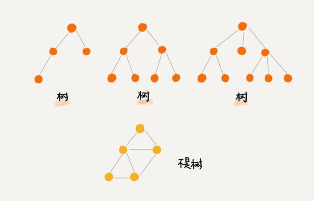
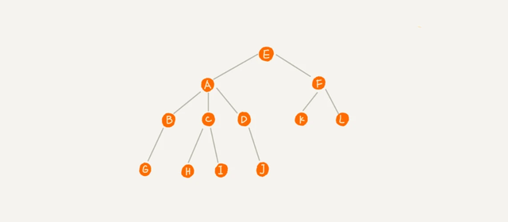

## 参考
```
https://baijiahao.baidu.com/s?id=1716280965468227548&wfr=spider&for=pc
```

## 树（Tree）的定义
```
N个结点构成的有限集合。树中有一个称为”根(Root)”的特殊结点 其余结点可分为若干个互不相交的树，称为原来结点的”子树”
```


```
这里面每个元素我们叫做“节点”，用来连接相邻节点之间的关系，我们叫做“父子关系”。
比如下面这幅图，A 节点就是 B 节点的父节点，B 节点是 A 节点的子节点。

B、C、D 这三个节点的父节点是同一个节点，所以它们之间互称为兄弟节点。

我们把没有父节点的节点叫做根节点，也就是图中的节点 E。

我们把没有子节点的节点叫做叶子节点或者叶节点
```

