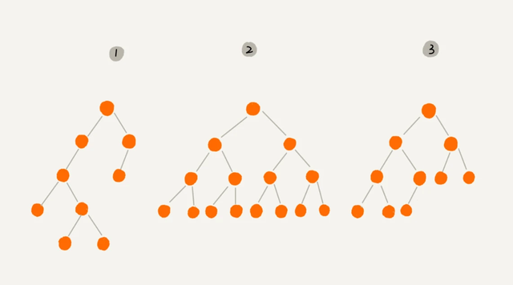
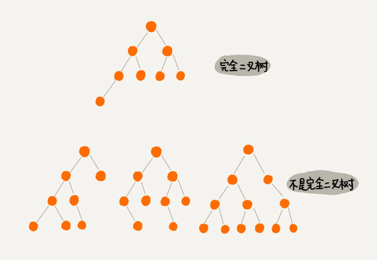
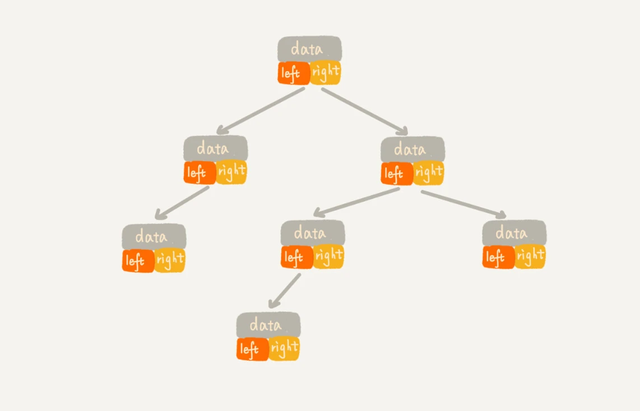
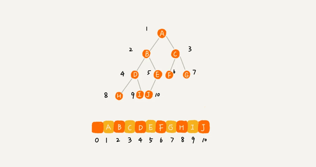
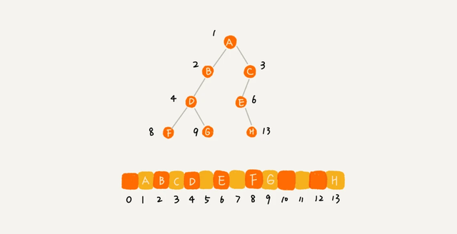
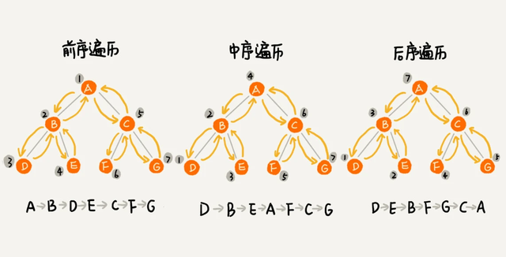

## 二叉树（Binary Tree）
```
每个节点最多有两个“叉”，也就是两个子节点，分别是左子节点和右子节点。
不过，二叉树并不要求每个节点都有两个子节点，有的节点只有左子节点，有的节点只有右子节点。
```



```
这个图里面，有两个比较特殊的二叉树，分别是编号 2 和编号 3 这两个。

编号 2 的二叉树中，叶子节点全都在最底层，除了叶子节点之外，每个节点都有左右两个子节点，这种二叉树就叫做满二叉树。

编号 3 的二叉树中，叶子节点都在最底下两层，最后一层的叶子节点都靠左排列，并且除了最后一层，
其他层的节点个数都要达到最大，这种二叉树叫做完全二叉树。
```
## 扩展：完全二叉树

```
完全二叉树定义，目的就是为了方便进行数组形式的存储。

要理解完全二叉树定义的由来，我们需要先了解， 如何表示（或者存储）一棵二叉树？

想要存储一棵二叉树，我们有两种方法一种是基于指针或者引用的二叉链式存储法，一种是基于数组的顺序存储法。
```

## 完全二叉树
```
完全二叉树定义，目的就是为了方便进行数组形式的存储。

要理解完全二叉树定义的由来，我们需要先了解， 如何表示（或者存储）一棵二叉树？

想要存储一棵二叉树，我们有两种方法一种是基于指针或者引用的二叉链式存储法，一种是基于数组的顺序存储法。
```

## 链式存储法。
```
从图中你应该可以很清楚地看到，每个节点有三个字段，其中一个存储数据，
另外两个是指向左右子节点的指针。我们只要拎住根节点，就可以通过左右子节点的指针，
把整棵树都串起来。这种存储方式我们比较常用。大部分二叉树代码都是通过这种结构来实现的。
```


## 基于数组的顺序存储法
```
我们把根节点存储在下标 i = 1 的位置，那左子节点存储在下标 2 * i = 2 的位置，
右子节点存储在 2 * i + 1 = 3 的位置。以此类推，B 节点的左子节点存储在 2 * i = 2 * 2 = 4 的位置，
右子节点存储在 2 * i + 1 = 2 * 2 + 1 = 5 的位置。
```



## 总结
我来总结一下，如果节点 X 存储在数组中下标为 i 的位置，下标为 2 * i 的位置存储的就是左子节点，
下标为 2 * i + 1 的位置存储的就是右子节点。反过来，下标为 i/2 的位置存储就是它的父节点。
通过这种方式，我们只要知道根节点存储的位置（一般情况下，为了方便计算子节点，根节点会存储在下标为 1 的位置），
这样就可以通过下标计算，把整棵树都串起来

```
不过，我刚刚举的例子是一棵完全二叉树，所以仅仅“浪费”了一个下标为 0 的存储位置。如果是非完全二叉树，
其实会浪费比较多的数组存储空间。你可以看我举的下面这个例子。
```


所以，如果某棵二叉树是一棵完全二叉树，那用数组存储无疑是最节省内存的一种方式。因为数组的存储方式并不需要像链式存储法那样，
要存储额外的左右子节点的指针。这也是为什么完全二叉树会单独拎出来的原因，也是为什么完全二叉树要求最后一层的子节点都靠左的原因。

堆其实就是一种完全二叉树，最常用的存储方式就是数组。

## 二叉树的遍历
经典的方法有三种，前序遍历、中序遍历和后序遍历。其中，前、中、后序，
表示的是节点与它的左右子树节点遍历打印的先后顺序。

前序遍历是指，对于树中的任意节点来说，先打印这个节点，然后再打印它的左子树，最后打印它的右子树。
中序遍历是指，对于树中的任意节点来说，先打印它的左子树，然后再打印它本身，最后打印它的右子树。
后序遍历是指，对于树中的任意节点来说，先打印它的左子树，然后再打印它的右子树，最后打印这个节点本身。
```
从我前面画的前、中、后序遍历的顺序图，可以看出来，每个节点最多会被访问两次，所以遍历操作的时间复杂度，跟节点的个数 n 成正比，也就是说二叉树遍历的时间复杂度是 O(n)。
```



## 小结
```
非线性表数据结构，树。关于树，有几个比较常用的概念你需要掌握，那就是：根节点、叶子节点、父节点、子节点、兄弟节点，还有节点的高度、深度、层数，以及树的高度。

我们平时最常用的树就是二叉树。二叉树的每个节点最多有两个子节点，分别是左子节点和右子节点。二叉树中，有两种比较特殊的树，
分别是满二叉树和完全二叉树。满二叉树又是完全二叉树的一种特殊情况。

二叉树既可以用链式存储，也可以用数组顺序存储。数组顺序存储的方式比较适合完全二叉树，其他类型的二叉树用数组存储会比较浪费存储空间。
除此之外，二叉树里非常重要的操作就是前、中、后序遍历操作，遍历的时间复杂度是 O(n)。
```