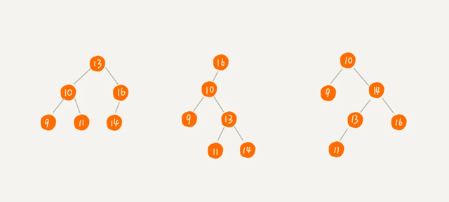
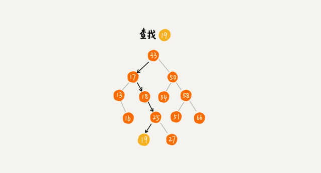
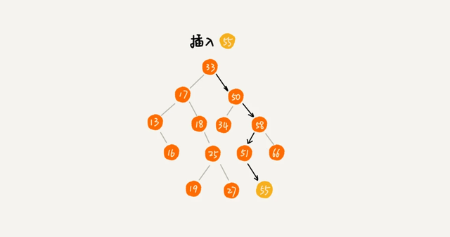
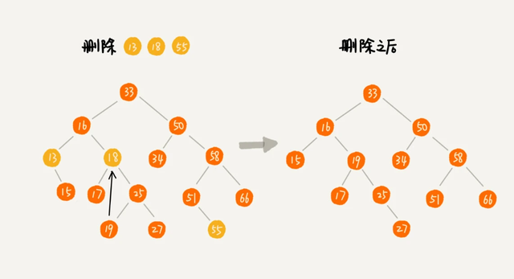
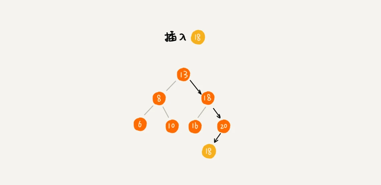
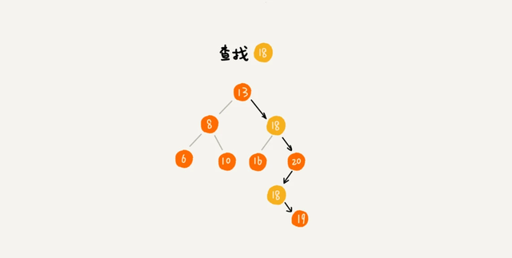
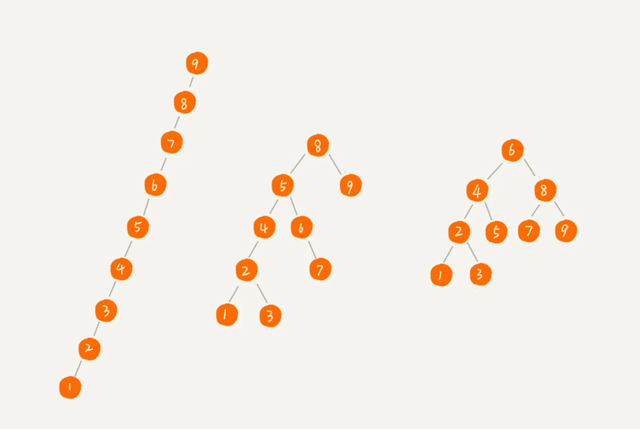

```
二叉查找树是二叉树中最常用的一种类型，也叫二叉搜索树。顾名思义，二叉查找树是为了实现快速查找而生的。不过，它不仅仅支持快速查找一个数据，
还支持快速插入、删除一个数据。
它是怎么做到这些的呢？这些都依赖于二叉查找树的特殊结构。

二叉查找树要求，在树中的任意一个节点，其左子树中的每个节点的值，都要小于这个节点的值，而右子树节点的值都大于这个节点的值。
```



前面我们讲到，二叉查找树支持快速查找、插入、删除操作，现在我们就依次来看下，这三个操作是如何实现的。

## 1. 二叉查找树的查找操作
```
首先，我们看如何在二叉查找树中查找一个节点。我们先取根节点，如果它等于我们要查找的数据，那就返回。
如果要查找的数据比根节点的值小，那就在左子树中递归查找；如果要查找的数据比根节点的值大，那就在右子树中递归查找。
```


## 2. 二叉查找树的插入操作
```
二叉查找树的插入过程有点类似查找操作。新插入的数据一般都是在叶子节点上，所以我们只需要从根节点开始，依次比较要插入的数据和节点的大小关系。
如果要插入的数据比节点的数据大，并且节点的右子树为空，就将新数据直接插到右子节点的位置；如果不为空，就再递归遍历右子树，查找插入位置。
同理，如果要插入的数据比节点数值小，并且节点的左子树为空，就将新数据插入到左子节点的位置；如果不为空，就再递归遍历左子树，查找插入位置。
```


## 3. 二叉查找树的删除操作
```
二叉查找树的查找、插入操作都比较简单易懂，但是它的删除操作就比较复杂了 。针对要删除节点的子节点个数的不同，我们需要分三种情况来处理。

第一种情况是，如果要删除的节点没有子节点，我们只需要直接将父节点中，指向要删除节点的指针置为 null。比如图中的删除节点 55。

第二种情况是，如果要删除的节点只有一个子节点（只有左子节点或者右子节点），我们只需要更新父节点中，指向要删除节点的指针，
让它指向要删除节点的子节点就可以了。比如图中的删除节点 13。

第三种情况是，如果要删除的节点有两个子节点，这就比较复杂了。我们需要找到这个节点的右子树中的最小节点，把它替换到要删除的节点上。
然后再删除掉这个最小节点，因为最小节点肯定没有左子节点（如果有左子结点，那就不是最小节点了），所以，我们可以应用上面两条规则来
删除这个最小节点。比如图中的删除节点 18。
```


## 4. 二叉查找树的其他操作
```
除了插入、删除、查找操作之外，二叉查找树中还可以支持快速地查找最大节点和最小节点、前驱节点和后继节点。二叉查找树除了支持上面几个操作之外，
还有一个重要的特性，就是中序遍历二叉查找树，可以输出有序的数据序列，时间复杂度是 O(n)，非常高效。因此，二叉查找树也叫作二叉排序树
```
## 4.1.支持重复数据的二叉查找树
```
前面讲二叉查找树的时候，我们默认树中节点存储的都是数字。很多时候，在实际的软件开发中，我们在二叉查找树中存储的，是一个包含很多字段的对象。
我们利用对象的某个字段作为键值（key）来构建二叉查找树。我们把对象中的其他字段叫作卫星数据。前面我们讲的二叉查找树的操作，
针对的都是不存在键值相同的情况。那如果存储的两个对象键值相同，这种情况该怎么处理呢？我这里有两种解决方法。

第一种方法比较容易。二叉查找树中每一个节点不仅会存储一个数据，因此我们通过链表和支持动态扩容的数组等数据结构，把值相同的数据都存储在同一个节点上。
```

```
第二种方法比较不好理解，不过更加优雅。

每个节点仍然只存储一个数据。在查找插入位置的过程中，如果碰到一个节点的值，与要插入数据的值相同，
我们就将这个要插入的数据放到这个节点的右子树，也就是说，把这个新插入的数据当作大于这个节点的值来处理。
```


当要查找数据的时候，遇到值相同的节点，我们并不停止查找操作，而是继续在右子树中查找，直到遇到叶子节点，才停止。这样就可以把键值等于要查找值的所有节点都找出来。

对于删除操作，我们也需要先查找到每个要删除的节点，然后再按前面讲的删除操作的方法，依次删除。


## 二叉查找树的时间复杂度分析
现在，我们来分析一下，二叉查找树的插入、删除、查找操作的时间复杂度。实际上，二叉查找树的形态各式各样。比如这个图中，对于同一组数据，我们构造了三种二叉查找树。
它们的查找、插入、删除操作的执行效率都是不一样的。

图中第一种二叉查找树，根节点的左右子树极度不平衡，已经退化成了链表，所以查找的时间复杂度就变成了 O(n)。

我刚刚其实分析了一种最糟糕的情况，我们现在来分析一个最理想的情况，二叉查找树是一棵完全二叉树（或满二叉树）。这个时候，插入、删除、查找的时间复杂度是多少呢？

从我前面的例子、图，以及还有代码来看，不管操作是插入、删除还是查找，时间复杂度其实都跟树的高度成正比，也就是 O(height)

既然这样，现在问题就转变成另外一个了，也就是，如何求一棵包含 n 个节点的完全二叉树的高度？树的高度就等于最大层数减一，为了方便计算，我们转换成层来表示。
从图中可以看出，包含 n 个节点的完全二叉树中，第一层包含 1 个节点，第二层包含 2 个节点，第三层包含 4 个节点，依次类推，下面一层节点个数是上一层的 2 倍，
第 K 层包含的节点个数就是 2^(K-1)。

不过，对于完全二叉树来说，最后一层的节点个数有点儿不遵守上面的规律了。它包含的节点个数在 1 个到 2^(L-1) 个之间（我们假设最大层数是 L）。
如果我们把每一层的节点个数加起来就是总的节点个数 n。也就是说，如果节点的个数是 n，那么 n 满足这样一个关系：
```
n >= 1+2+4+8+...+2^(L-2)+1

n <= 1+2+4+8+...+2^(L-2)+2^(L-1)
```

借助等比数列的求和公式，我们可以计算出，L 的范围是[log2(n+1), log2n +1]。完全二叉树的层数小于等于 log2n +1，也就是说，完全二叉树的高度小于等于 log2n


显然，极度不平衡的二叉查找树，它的查找性能肯定不能满足我们的需求。我们需要构建一种不管怎么删除、插入数据，在任何时候，都能保持任意节点左右子树都比较平衡的二叉查找树（平衡二叉查找树）。
二叉查找树,它支持快速地查找、插入、删除操作。
```
二叉查找树中，每个节点的值都大于左子树节点的值，小于右子树节点的值。不过，这只是针对没有重复数据的情况。
对于存在重复数据的二叉查找树，我介绍了两种构建方法，一种是让每个节点存储多个值相同的数据；另一种是，每个节点中存储一个数据。
针对这种情况，我们只需要稍加改造原来的插入、删除、查找操作即可
```
在二叉查找树中，查找、插入、删除等很多操作的时间复杂度都跟树的高度成正比。两个极端情况的时间复杂度分别是 O(n) 和 O(logn)，分别对应二叉树退化成链表的情况和完全二叉树。


