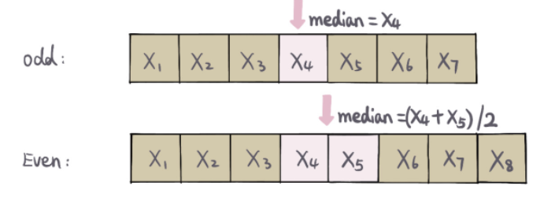

#### 中位数
长度是m+n=13的数组，中位数是第7个，那不就是m+n为奇数时，第(m+n)/2+1个数


参考：
https://leetcode-cn.com/problems/median-of-two-sorted-arrays/solution/er-fen-fa-duo-yu-yan-javajs4-xun-zhao-liang-ge-zhe/
#### 解法1
简单粗暴，先将两个数组合并，两个有序数组的合并也是归并排序中的一部分。然后根据奇数，还是偶数，返回中位数。
时间复杂度：遍历全部数组 (m+n)(m+n)

空间复杂度：开辟了一个数组，保存合并后的两个数组 O(m+n)O(m+n)

#### 解法2
```
思路：数组合并之后在排序的复杂度是O((m+n) log(m+n))不符合题意，题目要求的是O(log (m+n))，我们一看到logn的复杂度就联想到了二分。
二分长度较小的数组，找到这个数组二分的位置，在根据这个二分的位置和两个数组的总长度找到另一个数组二分的位置，比较这两个位置的四个数是
否满足交叉小于等于，不满足继续二分，满足就找到了解

作者：chen-wei-f
链接：https://leetcode-cn.com/problems/median-of-two-sorted-arrays/solution/er-fen-tu-jie-dai-ma-jian-ji-by-chen-wei-c3u4/
来源：力扣（LeetCode）
著作权归作者所有。商业转载请联系作者获得授权，非商业转载请注明出处。
```