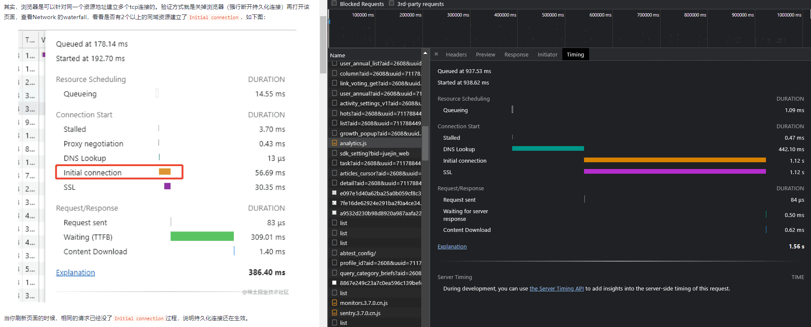

### http2特点
http/2最大的特点是使用多路复用，对同一个域的服务器只建立一次TCP连接，加载多个资源，使用二进制帧传输，同时会对http头部进行压缩。使用http2会比http/1.1更加地高效

### 多路复用
多路复用的意义在于可以用同一个连接传输多个资源，进而使得以前在http 1.1所做一些优化就没有必要了，如：
* 使用雪碧图技术，把多张小图合成一张大图，减少请求数；
* 合并JS和CSS，减少请求数。

http 1.1时代，由于需要建立多个TCP连接，服务器需要更多的线程来处理请求，同样地，浏览器也需要，所以浏览器会限制同一个域的同时请求数，Chrome是限制6个，总连接数是17个。
可以实际对比一下，http 1.1会让资源排队加载

如果使用http2
你会发现这些资源都是同时加载的，后面加载的资源不需要进行排队。也就是说理论上带宽有多大，就能传多快。

## 优化http请求数
为什么资源并发比较多的网站，用户体验很差，如页面初始化请求大量静态资源。
- `我们可以通过将资源分布在不用域名，比如说CDN`，来解决这个问题。

但是其实浏览器对所有域名的总连接数也有限制：
- 除了资源分布在不同域名上之外，`可以将资源合并`。总所周知的雪碧图、webpack资源打包。

- 也可以使用http2
> HTTP2 提供了 Multiplexing 多路传输特性，可以在一个 TCP 连接中同时完成多个 HTTP 请求，目前部分主流网站开始部分支持http2.0。


前端性能之Chrome的Waterfall
- 浅灰：查询中
- 深灰：停滞，代理转发，请求发送
- 橙色：初始连接
- 绿色：等待中
- 蓝色：内容下载

## 一个tcp连接同时可以发送几个http请求？
浏览器最大连接数，即浏览器支持对同一个域名同时建立多少个http连接。
从HTTP1.1考虑的话，它其实等同于浏览器对同一个域名支持同时建立多少个tcp连接数，毕竟HTTP1.1版本一个tcp连接只能同时处理一个http请求。

HTTP1.1及以下的版本，一个tcp连接不能并发处理多个http请求。即，如果一个http请求未结束，该tcp连接无法发起下一个http请求。

为什么我的浏览器可以同时请求了多个相同服务器的资源？

浏览器是可以针对同一个资源地址建立多个tcp连接的。验证方式就是关掉浏览器（强行断开持久化连接）再打开该页面，查看Network 的waterfall，看看是否有2个以上的同域资源建立了Initial connection，如下图：



```
Firefox 2:  2
Firefox 3+: 6
Opera 9.26: 4
Opera 12:   6
Safari 3:   4
Safari 5:   6
IE 7:       2
IE 8:       6
IE 10:      8
Chrome:     6
```

* TCP/2.0 浏览器为每个域名维护1个TCP持久连接,在同一连接上顺序处理多个请求。

* TCP/1.1 浏览器为每一个域名维护了6个TCP连接<br/>

在一个 TCP 连接中可以传输多个 HTTP 请求， 一个域名下系统会同时建立多个 TCP 请求（最多支持6个）, 但是 TCP 对请求的处理是同步的，也就是只能一个一个的处理，在一个 HTTP 请求没有结束前，其他请求都是处于阻塞状态，这大大影响我们的首屏渲染。

但是浏览器不允许多个tcp链接要是有 1000 张图片的话总开 1000个TCP连接，显然性能会差。

## 重点:http1.1和http2对比
###  http1.1和http2.0请求资源对比
HTML 如果包含几十个图片标签，这些图片是以什么方式、什么顺序、建立了多少连接、使用什么协议被下载下来的呢？
* 1.使用http2<br/>
如果图片都是 HTTPS 连接并且在同一个域名下，那么浏览器在 SSL 握手之后会和服务器商量能不能用 HTTP2。<br/>
如果能的话就使用 Multiplexing 功能在这个连接上进行多路传输。<br/>
不过也未必会所有挂在这个域名的资源都会使用一个 TCP 连接去获取，但是可以确定的是 Multiplexing 很可能会被用到。

* 2.如果发现用不了 HTTP2 而去使用HTTP/1.1呢？<br/>
浏览器就会在一个 HOST 上建立多个 TCP 连接，连接数量的最大限制取决于浏览器设置，这些连接会在空闲的时候被浏览器用来发送新的请求，如果所有的连接都正在发送请求呢？那其他的请求就只能等等了。

### HTTP/1.1 存在一个问题,默认不能并发请求发送http
HTTP/1.1中 TCP 连接中 HTTP 请求发送可以一起发送么（比如一起发三个请求，再三个响应一起接收）？

HTTP/1.1 单个 TCP 连接在同一时刻只能处理一个请求，意思是说：两个请求的生命周期不能重叠，任意两个 HTTP 请求从开始到结束的时间在同一个 TCP 连接里不能重叠。

虽然 HTTP/1.1 规范中规定了 Pipelining 来试图解决这个问题，但是这个功能在浏览器中默认是关闭的。
>  一个支持持久连接的客户端可以在一个连接中发送多个请求（不需要等待任意请求的响应）。收到请求的服务器必须按照请求收到的顺序发送响应。

Pipelining 这种设想看起来比较美好，但是在实践中会出现许多问题：

1. 一些代理服务器不能正确的处理 HTTP Pipelining。
2. 正确的流水线实现是复杂的。
3. Head-of-line Blocking 连接头阻塞：在建立起一个 TCP 连接之后，假设客户端在这个连接连续向服务器发送了几个请求。按照标准，服务器应该按照收到请求的顺序返回结果，假设服务器在处理首个请求时花费了大量时间，那么后面所有的请求都需要等着首个请求结束才能响应。

所以现代浏览器默认是不开启 HTTP Pipelining 的。

最后，HTTP2 提供了 Multiplexing 多路传输特性，可以在一个 TCP 连接中同时完成多个 HTTP 请求。

## HTTP2.0对HTTP1.1的优化策略
### 一个域名只能使用一个 TCP 连接
这样就可以保证 TCP 只会连接以及慢启动一次，同时也解决了竞争带宽的问题

### 多路复用
HTTP/2 实现了资源的并行请求，也就是任何时候都可以将请求发送给服务器，而并不需要等待其他请求的完成，然后服务器也可以随时返回处理好的请求资源给浏览器
```
绿色是发起请求到请求返回的等待时间，蓝色是响应的下载时间，可以看到都是在同一个 Connection，并行完成的
在 HTTP2 中由于 Multiplexing 特点的存在，多个 HTTP 请求可以在同一个 TCP 连接中并行进行。
```

HTTP2采用二进制格式传输，取代了HTTP1.x的文本格式，二进制格式解析更高效。

多路复用代替了HTTP1.x的序列和阻塞机制，所有的相同域名请求都通过同一个TCP连接并发完成。在HTTP1.x中，并发多个请求需要多个TCP连接，浏览器为了控制资源会有6-8个TCP连接都限制。
HTTP2中
* 同域名下所有通信都在单个连接上完成，消除了因多个 TCP 连接而带来的延时和内存消耗。
* 单个连接上可以并行交错的请求和响应，之间互不干扰

### 请求优先级
HTTP/2 提供了请求优先级，可以在发送请求时，标上该请求的优先级，这样服务器接收到请求之后，会优先处理优先级高的请求。

### 头部压缩：只发送头部数据的差异数据，而不是全部发送，减少头部的信息量

### 服务端推送
服务端可以在发送页面HTML时主动推送其它资源，而不用等到浏览器解析到相应位置，发起请求再响应。例如服务端可以主动把JS和CSS文件推送给客户端，而不需要客户端解析HTML时再发送这些请求。服务端可以主动推送，客户端也有权利选择是否接收。如果服务端推送的资源已经被浏览器缓存过，浏览器可以通过发送RST_STREAM帧来拒收。主动推送也遵守同源策略，服务器不会随便推送第三方资源给客户端。