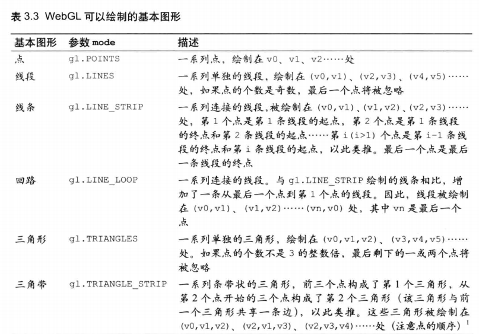
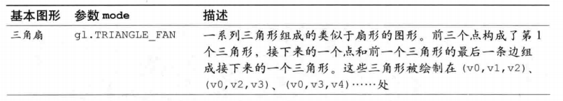

### 扩展：SVG与Canvas区别

[SVG与Canvas区别](../html-css/html5属性)

## html渲染文档有3种方式
### dom
dom是一种中间代理模式，维护文档树、处理事件交互、样式和绘制，对开发者最友好，实现上最容易，方便调试，样式丰富，交互控件多，界面体验好，通过keyframes来实现动画也很便捷。缺点是不管你的实际应用要不要这些服务，它都是标配，没法绕过去，导致开销大，性能差，不适用于元素数量很多的情况。

### canvas(2d)
canvas则是给开发者开放了一种直接访问底层绘图功能的接口，去除了中间代理，好处当然是更快了，坏处是什么都得自己来，交互、刷新、维护数据和渲染，此外canvas在处理大分辨率设备时比较吃力（比如地图这方面不如基于dom的svg, svg是draw，canvas是paint ），处理文本和屏幕适配方面也不太好。

### webgl
webgl实际上用了canvas的一个3d渲染上下文，在绘制平面内容时，和canvas 2d相比，webgl更为直接的利用了gpu硬件，在某些场合，几乎可以摆脱cpu的限制，达到性能极致。

简言之，尽管现代浏览器都尽量为dom（比如涉及video、image元素以及像素变换方面）、canvas 2d和webgl提供硬件加速的支持，但webgl在渲染数量众多的元素或像素时，性能毫无疑问的遥遥领先。

## webgl 与 canvas 的区别
- Canvas只支持一些简单的2D绘制，不支持3D，更重要的是性能有限，WebGL弥补了这两方便的不足。

### html动画
requestAnimationFrame

很多情况下，我们都习惯于使用 setInterval、setTimeout 来实现页面中的动画。也有很多小伙伴发现这种实现会出现丢帧的现象。

1. setInterval、setTimeout 依赖于浏览器的异步循环，因而我们设定的动画执行时间可能并不是真正的动画执行时间，可能这个时候的 js引擎 正在执行其他代码，所以就会出现丢帧的情况。
2. 刷新频率收屏幕分辨率和屏幕尺寸影响。不同设备的屏幕刷新率可能不同。

针对以上两点内容，我们使用 requestAnimationFrame 来优化动画实现。相对于前者，它有两点明显的优势:
1. 由系统来决定回调的执行时机，在执行时浏览器会优化方法的调用。
2. 按帧进行重绘，通过 requestAnimationFrame 调用回调函数引起的页面重绘或回流的时间间 隔和显示器的刷新时间间隔相同。所以 requestAnimationFrame 不需要像 setTimeout 那样传递时间间隔，而是浏览器通过系统获取并使用显示器刷新频率

1.基于 gpu 的 css 动画，它的主要开销有：
* CPU 与 GPU 通信的开销
* composite 的开销

2.基于 cpu 的 css 动画，它的主要开销有：
* layout，重新计算布局的开销
* repaint，重新绘制图层的开销
* composite 的开销

而 canvas 的主要开销主要是在：

3.执行 Javascript 的开销
* Skia 绘制的开销
* composite 的开销

看起来，好像好像确实是 canvas 的开销更多呀。但是由于测试用例中大量的 DOM 元素意味着大量图层需要进行合成工作，这才是拖垮性能的关键。

当然，讨论完性能，更重要的区别在于两者是适应不同场景的。当我们需要对已有的复杂 DOM 元素做动画，例如整个页面的动画效果，我们会考虑把它绘制到 canvas 上再去做动画吗？

那显然不会，成本太高了，这个成本倒不是指渲染的成本，而是我们需要“复刻”这个 DOM 元素的成本；当我们需要完成一些 DOM 无法完成的高表现力的交互时，比如做一个画板，纯粹的 DOM 能做吗？或许 SVG 是一个选择，那如果是更复杂的场景呢？理论上来说 css3 动画能做的canvas 都能做，反之就不是这样。

### animation 与 html5 的 canvas 应用的场景
CSS3 的 animation 与 html5 的 canvas 应用的场景并不相同，如果一些简单的动画在 animation 里会比较适合而且很难有复杂交互， canvas 的话功能会多很多但是需要 Js 脚本配合。

CSS3 的 animation 与 html5 的 canvas 应用的场景并不相同，如果一些简单的动画在 animation 里会比较适合而且很难有复杂交互， canvas 的话功能会多很多但是需要 Js 脚本配合。

性能问题的话，我个人觉得CSS3的动画会比 webGL 消耗小一些，后者需要CPU计算然后再给到GPU，但是可再变动的空间就很小，比如一些随即动作或者跟随效果。

之前有一个项目同时渲染2500个随机元素的场景下( i5 + GTX 960 )，使用 canvas 的 FPS 在 25 帧左右，而使用 CSS 3D Sprite 可以维持在 45 左右的帧数。

当然我觉得如果在复杂动画下 animation 可能一直会操作DOM改变Style，所以并不如 canvas ，后者直接重绘画布内容即可。

### webgl是基于OpenGL和JavaScript技术结合
- 说 WEBGL 之前需要先了解下 OpenGL, 既然涉及到绘图能力，底层方面来说实际上是与显卡的交互，OpenGL是 底层的驱动级的图形接口

webgl 与 canvas 的区别，他两都能做 3D 也都能做 2D，只是谁更适合而已。性能上来说，大部分情况下 webgl 高出不少，毕竟直接走 gpu。canvas 在图像合成上也会走 gpu，其他的 API 还是在 cpu 通过 skia 绘制。虽然 webgl 性能好，但是学习门槛高多了，如果不用现有的库开发，需要不少的数学和图形学知识。

>WebGL是一种JavaScript API，用于在不使用插件的情况下在任何兼容的网页浏览器中呈现交互式2D和3D图形。WebGL完全集成到浏览器的所有网页标准中，可将影像处理和效果的GPU加速使用方式当做网页Canvas的一部分。WebGL元素可以加入其他HTML元素之中并与网页或网页背景的其他部分混合。

## 坐标系统
3d 部分会很复杂,一定要懂得笛卡尔坐标系
```
宽度
高度
长度
```

## webgl绘图入门 着色器
```
webGl 依赖着色器 shader绘图机制，着色器提供绘制二维和三维图形的方法。
```

webgl两种着色器
1.顶点着色器
```
描述顶点特性：描述位置，颜色等的程序
顶点：指的是二维或则三维的一个点，比如二维或则三维图形的端点或交点
```
2.片元着色器
```
进行逐片元处理过程如光照的程序。
片元是术语，可以理解为像素
```

## 绘制和变换图形
### 绘制多个点
绘制多个点的二维图形和绘制多个点的三维图形是相同的。
```
对于多个顶点的图形，比如三角形，需要一次性将图形的顶点全部传入顶点 着色器，然后才能画出来。

webgl 提供了一种机制，缓冲区对象，它可以一次性向着色器传入多个顶点数据。
缓冲区对象 是webgl系统中的一块内存区域，可以一次性向缓冲区对象填充大量的顶点数据，供顶点着色器使用。
```
实例：
MultiPoint.html
```
增加新步骤：设置点的 坐标信息。
```

### 使用缓冲区对象
步骤
```
1.创建缓冲区对象
2.绑定缓冲区对象
3.将数据写入缓冲区对象
4.将缓冲区对象 分配给一个 attribute变量
5.开启 att 变量
```
1.创建缓冲区对象
```js
  // Create a buffer object 创建缓冲区对象
  var vertexBuffer = gl.createBuffer();
```
2.绑定缓冲区对象
将缓冲区对象绑定到webgl系统中已经存在的 目标中，这个目标表示缓冲区对象的用途（在这里就是向顶点着色器提供attribute变量的数据）,这样webgl才能正确处理其中的内容
```js
  // Bind the buffer object to target 将缓冲区对象绑定到目标
  gl.bindBuffer(gl.ARRAY_BUFFER, vertexBuffer);
```
3.将数据写入缓冲区对象
开辟空间并向缓冲区中写入数据
```js
  gl.bufferData(gl.ARRAY_BUFFER, vertices, gl.STATIC_DRAW);

效果是将vertices中的数据写入了绑定到第一个参数 gl.ARRAY_BUFFER 上的缓冲区对象
```
4.将缓冲区对象 分配给一个 attribute变量
不同于gl.vertexAttri 只能向 attribute 变量分配一个值，
gl.vertexAttribPointer 将整个缓冲区对象分配给 attribute变量。 ```js // Assign the buffer object to a_Position variable 将缓冲区对象分配给a_ gl.vertexAttribPointer(a_Position, 2, gl.FLOAT, false, 0, 0);
```

5.开启 att 变量
为了使顶点着色器能够访问缓冲区内的数据，需要使用 gl.enableVertexAttribArray()方法开启 attribute变量。
```js
  // Enable the assignment to a_Position variable 连接a_变量与分配给它的缓冲区对象
  gl.enableVertexAttribArray(a_Position);
```

### 画三角形
```js
var VSHADER_SOURCE =
  'attribute vec4 a_Position;\n' +
  'void main() {\n' +
  '  gl_Position = a_Position;\n' +
  '  gl_PointSize = 10.0;\n' +
  '}\n';

画三角形中 gl_PointSize = 10.0; 将被去掉，只有在画单个点有用

2.gl.drawArrays(gl.POINTS, 0, n);  ----> gl.drawArrays(gl.TRIANGLES, 0, n);

TRIANGLES 表示从缓冲区第一个点开始，使顶点着色器执行3次，用这三个点绘制出一个三角形
```
webgl 只能绘制
```
点
线
三角形
```



## 动画-三角形转动
不断擦除和重绘三角形，并且在每次重绘时轻微改变角度

1. 在t0,t1,t2,t3,等时刻返回调用函数绘制三角形
2. 在每次绘制之前调用gl.clear(),并使三角形旋转角度