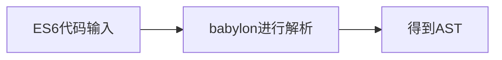
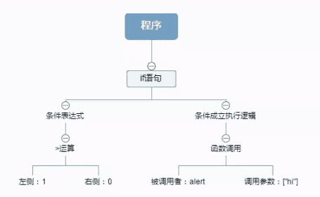

## 例子：`es6-->es5`
[es6-to-es5](https://github.com/huiruo/es6-to-es5)

## Babel是一个 JavaScript 编译器
@babel/core 是 Babel 的核心包，它是 Babel 编译器的主要组件之一。它的主要作用是将新的 JavaScript 语法转译为旧版本的浏览器支持的语法，以确保你的 JavaScript 代码在不同浏览器和环境中运行良好。

@babel/core 的作用包括:
```
parsing(解析)-->transforming（转化）-->printing（生成）
```

* parsing阶段:babel:babylon负责将es6代码进行语法分析和词法分析后转换成抽象语法树

* transforming阶段:babel-traverse对抽象语法树进行变换操作
```
babel的插件机制也是在这一步发挥作用的，plugins在这里进行操作，转化成新的AST，再交给第三步的babel-generator
```
* printing阶段:babel-generator生成对应的代码

* 插件管理：@babel/core 允许你安装、配置和管理各种 Babel 插件，以定制你的转译过程。你可以选择使用现有的官方和社区维护的插件，也可以编写自定义插件来满足项目的具体需求。

### 常用插件
1. @babel/preset-env: 这是一个 Babel 预设，它根据目标环境的浏览器版本，自动确定需要转译的 JavaScript 特性。它包括了一组插件，以根据目标环境自动进行语法转译。
2. @babel/preset-react: 这是用于处理 React 代码的 Babel 预设，它包括了一组插件，使你能够使用 JSX 语法以及其他与 React 相关的特性。
3. @babel/plugin-proposal-class-properties: 这个插件允许你在类中使用类属性，包括静态属性和实例属性。
4. @babel/plugin-proposal-object-rest-spread: 这个插件添加了对对象扩展运算符（...）的支持，使你能够更方便地操作对象。
5. @babel/plugin-transform-arrow-functions: 这个插件用于将箭头函数转译为普通函数表达式，以确保在不支持箭头函数的环境中运行。
6. @babel/plugin-transform-async-to-generator: 这个插件将异步函数（async/await）转译为基于生成器的代码，以使其在不支持异步函数的环境中运行。
7. @babel/plugin-transform-template-literals: 这个插件将模板字符串转译为常规字符串连接，以确保在不支持模板字符串的环境中运行。
8. @babel/plugin-transform-destructuring: 这个插件用于将解构语法（对象解构和数组解构）转译为等效的代码，以确保在不支持解构的环境中运行。
9. @babel/plugin-transform-spread: 这个插件用于将扩展运算符（...）转译为等效的代码，以确保在不支持扩展运算符的环境中运行。
10. @babel/plugin-transform-regenerator: 这个插件用于将生成器函数（function*）转译为基于 Regenerator 运行时的代码，以确保在不支持生成器的环境中运行。


## 步骤总结
Babel 工作过程：解析，转换，生成,将ES6+语法转换成浏览器能识别的 ES5 语法
用简便的回答就是以下这个思路


### 1.第1步:Parser
第1步转换的过程中可以验证语法的正确性，同时由字符串变为对象结构后更有利于精准地分析以及进行代码结构调整。

Parser 解析我们的代码转换为 AST


### 2.第2步:transforming阶段 
plugin用babel-traverse对AST树进行遍历转译-->得到新的AST树

第2步原理是遍历这个对象所描述的抽象语法树，遇到哪里需要做一下改变，就直接在对象上进行操作

Transformer 利用我们配置好的 plugins/presets 把 Parser 生成的 AST 转变为 新的 AST。
```
在.babelrc 里配置的 presets 和 plugins 都是在第 2 步工作的。
```
>注意，第二个阶段 transforming，如果这个阶段不使用任何插件，那么 babel 会原样输出代码。

### 3.Generator 把转换后的 AST 生成新的代码
递归遍历这颗语法树，然后生成相应的代码,代码生成步骤把最终（经过一系列转换之后）的AST转换成字符串形式的代码，同时还会创建源码映射（source maps）;<br/>代码生成其实很简单：深度优先遍历整个 AST，然后构建可以表示转换后代码的字符串

### 举例子
```
if (1 > 0) {
    alert('hi');
}
```

### 经过第1步得到一个如下的对象：
```
{
  "type": "Program",                          // 程序根节点
  "body": [                                   // 一个数组包含所有程序的顶层语句
    {
      "type": "IfStatement",                  // 一个if语句节点
      "test": {                               // if语句的判断条件
        "type": "BinaryExpression",           // 一个双元运算表达式节点
        "operator": ">",                      // 运算表达式的运算符
        "left": {                             // 运算符左侧值
          "type": "Literal",                  // 一个常量表达式
          "value": 1                          // 常量表达式的常量值
        },
        "right": {                            // 运算符右侧值
          "type": "Literal",
          "value": 0
        }
      },
      "consequent": {                         // if语句条件满足时的执行内容
        "type": "BlockStatement",             // 用{}包围的代码块
        "body": [                             // 代码块内的语句数组
          {
            "type": "ExpressionStatement",    // 一个表达式语句节点
            "expression": {
              "type": "CallExpression",       // 一个函数调用表达式节点
              "callee": {                     // 被调用者
                "type": "Identifier",         // 一个标识符表达式节点
                "name": "alert"
              },
              "arguments": [                  // 调用参数
                {
                  "type": "Literal",
                  "value": "hi"
                }
              ]
            }
          }
        ]
      },
      "alternative": null                     // if语句条件未满足时的执行内容
    }
  ]
}
```
用图像更简单地表达上面的结构：



### 例,第2步骤:plugins
插件应用于 babel 的转译过程，尤其是第二个阶段 transforming，如果这个阶段不使用任何插件，那么 babel 会原样输出代码。

transforming阶段使用的插件，因为 transform 插件会自动使用对应的词法插件，所以 parsing 阶段的插件不需要配置。

### presets
如果要自行配置转译过程中使用的各类插件，那太痛苦了，所以 babel 官方帮我们做了一些预设的插件集，

称之为 preset，这样我们只需要使用对应的 preset 就可以了。
es20xx 的 preset 只转译该年份批准的标准，而 env 则代指最新的标准，包括了 latest 和 es20xx 各年份,以 JS 标准为例，babel 提供了如下的一些 preset：
```
* es2015
* es2016
* es2017
* env
```


