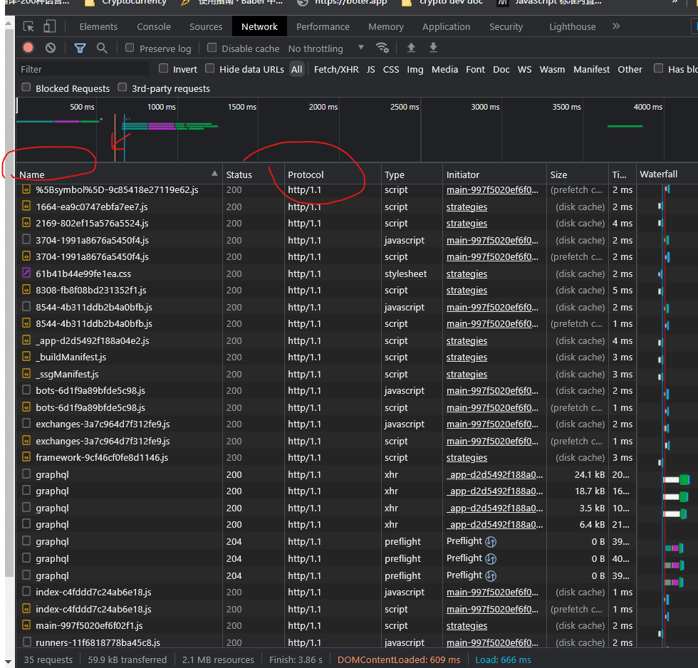
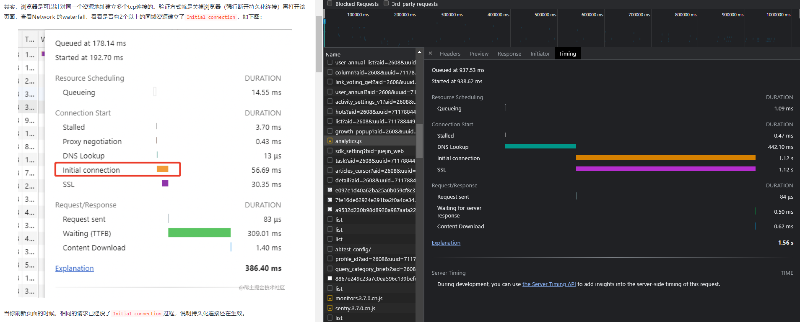

## 优化http请求数
为什么资源并发比较多的网站，用户体验很差，如页面初始化请求大量静态资源。
- `我们可以通过将资源分布在不用域名，比如说CDN`，来解决这个问题。

但是其实浏览器对所有域名的总连接数也有限制：
- 除了资源分布在不同域名上之外，`可以将资源合并`。总所周知的雪碧图、webpack资源打包。

- 也可以使用http2
```
HTTP2 提供了 Multiplexing 多路传输特性，可以在一个 TCP 连接中同时完成多个 HTTP 请求，目前部分主流网站开始部分支持http2.0。
```


前端性能之Chrome的Waterfall
- 浅灰：查询中
- 深灰：停滞，代理转发，请求发送
- 橙色：初始连接
- 绿色：等待中
- 蓝色：内容下载

## 一个tcp连接同时可以发送几个http请求？
浏览器最大连接数，即浏览器支持对同一个域名同时建立多少个http连接。
从HTTP1.1考虑的话，它其实等同于浏览器对同一个域名支持同时建立多少个tcp连接数，毕竟HTTP1.1版本一个tcp连接只能同时处理一个http请求。

HTTP1.1及以下的版本，一个tcp连接不能并发处理多个http请求。即，如果一个http请求未结束，该tcp连接无法发起下一个http请求。

为什么我的浏览器可以同时请求了多个相同服务器的资源？

浏览器是可以针对同一个资源地址建立多个tcp连接的。验证方式就是关掉浏览器（强行断开持久化连接）再打开该页面，查看Network 的waterfall，看看是否有2个以上的同域资源建立了Initial connection，如下图：

```
Firefox 2:  2
Firefox 3+: 6
Opera 9.26: 4
Opera 12:   6
Safari 3:   4
Safari 5:   6
IE 7:       2
IE 8:       6
IE 10:      8
Chrome:     6
```


<br />

## 升级http2
http/2最大的特点是使用多路复用，对同一个域的服务器只建立一次TCP连接，加载多个资源，使用二进制帧传输，同时会对http头部进行压缩。使用http2会比http/1.1更加地高效

多路复用

多路复用的意义在于可以用同一个连接传输多个资源，进而使得以前在http 1.1所做一些优化就没有必要了，如：
a）使用雪碧图技术，把多张小图合成一张大图，减少请求数；
b）合并JS和CSS，减少请求数。

```
http 1.1时代，由于需要建立多个TCP连接，服务器需要更多的线程来处理请求，同样地，浏览器也需要，所以浏览器会限制同一个域的同时请求数，Chrome是限制6个，总连接数是17个。
可以实际对比一下，http 1.1会让资源排队加载

如果使用http2
你会发现这些资源都是同时加载的，后面加载的资源不需要进行排队。也就是说理论上带宽有多大，就能传多快。
```

## 浏览器缓存
一个优秀的缓存策略可以缩短网页请求资源的距离，减少延迟，并且由于缓存文件可以重复利用，还可以减少带宽，降低网络负荷。

对于一个数据请求来说，可以分为发起网络请求、后端处理、浏览器响应三个步骤。

浏览器缓存可以帮助我们在第一和第三步骤中优化性能。比如说直接使用缓存而不发起请求，或者发起了请求但后端存储的数据和前端一致，那么就没有必要再将数据回传回来，这样就减少了响应数据。

## webpack bundle 大小优化
[构建包大小优化](../build-webpack/构建包大小优化)

## 使用requestAnimationFrame 实现动画
requestAnimationFrame使用一个回调函数作为参数，这个回调函数会在浏览器重绘之前调用。

[html-css-requestAnimationFrame](../html-css/requestAnimationFrame/requestAnimationFrame-是宏任务吗)
